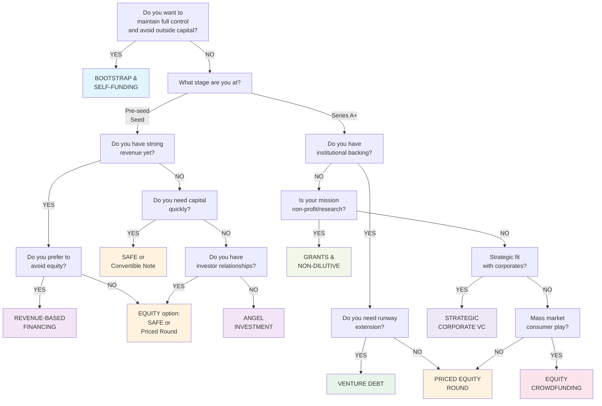
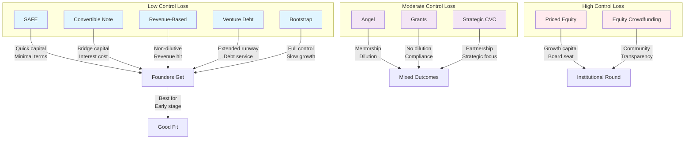
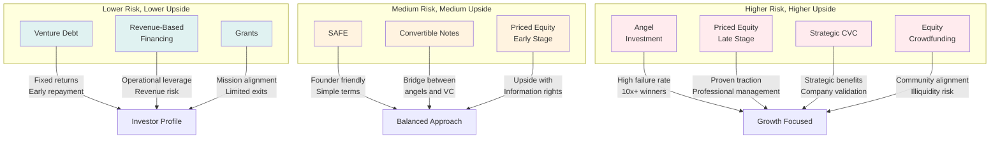

# Investment Styles & Funding Vehicles

A comprehensive guide to understanding and comparing the most common funding mechanisms for MVP startups and emerging companies.

---

## Table of Contents

1. [Introduction](#introduction)
2. [Quick Navigation](#quick-navigation)
3. [Investment Vehicle Overview](#investment-vehicle-overview)
4. [Choosing the Right Vehicle](#choosing-the-right-vehicle)
5. [Common Terms Glossary](#common-terms-glossary)
6. [Founder's Perspective Summary](#founders-perspective-summary)
7. [Investor's Perspective Summary](#investors-perspective-summary)
8. [Key Pain Points by Vehicle](#key-pain-points-by-vehicle)
9. [Templates Available](#templates-available)
10. [Resources and Further Reading](#resources-and-further-reading)

---

## Introduction

This section provides a comprehensive overview of the primary funding mechanisms available to MVP-stage startups and emerging companies. Each funding vehicle has distinct characteristics, risk profiles, time horizons, and suitability for different business models and founder situations.

Whether you're bootstrapping your first product, seeking institutional capital, or exploring alternative financing, understanding these vehicles is critical to:

- **Making informed funding decisions** aligned with your business vision
- **Negotiating better terms** by knowing industry standards
- **Planning your fundraising timeline** with realistic expectations
- **Building sustainable business models** that match your capital structure
- **Avoiding common pitfalls** associated with each funding type

This resource is designed for both first-time founders and experienced entrepreneurs evaluating new funding approaches.

---

## Quick Navigation

### Direct Access to Investment Vehicles

| Vehicle | Description | Ideal For |
|---------|-------------|-----------|
| **[01. SAFE Agreements](./01-SAFE-agreements)** | Simple Agreements for Future Equity | Pre-seed, seed-stage with investor protection needs |
| **[02. Convertible Notes](./02-convertible-notes)** | Debt instruments converting to equity | Bridge financing, fast fundraising |
| **[03. Priced Equity Rounds](./03-priced-equity-rounds)** | Direct equity sales at pre-determined valuation | Series A and beyond, institutional rounds |
| **[04. Revenue-Based Financing](./04-revenue-based-financing)** | Repayment tied to monthly recurring revenue | Bootstrapped SaaS, recurring revenue models |
| **[05. Venture Debt](./05-venture-debt)** | Non-dilutive debt for VC-backed companies | Extending runway, bridge financing |
| **[06. Angel Investment](./06-angel-investment)** | Capital from individual high-net-worth investors | Pre-seed, seed-stage, follow-on investments |
| **[07. Equity Crowdfunding](./07-equity-crowdfunding)** | Public offerings to many small investors | Consumer brands, community-based companies |
| **[08. Bootstrap/Self-Funding](./08-bootstrap-self-funding)** | Funding growth through revenue and personal capital | Lifestyle businesses, bootstrap-first approach |
| **[09. Grants & Non-Dilutive](./09-grants-non-dilutive)** | Government and foundation funding with no equity loss | Innovation hubs, specific sectors, research |
| **[10. Strategic/Corporate VC](./10-strategic-corporate-vc)** | Investment from established companies or corporate entities | Strategic partnerships, enterprise software |

### Template Resources

- **[Status Sheets](./templates/status-sheets)** - Tracking templates for ongoing negotiations and diligence
- **[Comparison Matrices](./templates/comparison-matrices)** - Side-by-side analysis tools

---

## Investment Vehicle Overview

### 1. SAFE Agreements (Simple Agreements for Future Equity)

**What It Is:** A legal instrument created by Y Combinator that prioritizes speed and simplicity. Investors receive the right to equity in a future priced round or acquisition event.

**Key Characteristics:**
- No interest rate or maturity date
- Minimal legal overhead and cost
- Investor receives equity when future event occurs
- Available in multiple variants (MFN, Pro-rata, Discount, or combinations)

**Best For:** Pre-seed and seed-stage companies raising small amounts ($25K - $500K) with investor bases that prioritize speed and simplicity.

**Timeline:** 1-2 weeks to document and close

---

### 2. Convertible Notes

**What It Is:** A hybrid debt instrument that accrues interest and matures on a specific date. At maturity or in a qualified equity round, it converts to equity.

**Key Characteristics:**
- Carries interest rate (typically 3-8% annually)
- Fixed maturity date (typically 24-36 months)
- Conversion discount (typical 20-30%)
- May have valuation cap to protect investor
- Creates more traditional creditor-debtor relationship

**Best For:** Bridge financing, companies expecting a Series A within 18-36 months, situations requiring creditor protections.

**Timeline:** 2-4 weeks to document and close

---

### 3. Priced Equity Rounds

**What It Is:** Direct purchase of equity shares at an agreed-upon price per share and implied company valuation. Most common for Series A rounds and beyond.

**Key Characteristics:**
- Establishes explicit valuation and share price
- Investors become equity holders with full shareholder rights
- Comprehensive legal documentation required
- Board seats or information rights often included
- Higher transaction costs and longer process

**Best For:** Companies with institutional investors, clear growth metrics, Series A+ funding, established business models.

**Timeline:** 4-12 weeks to document, negotiate, and close

---

### 4. Revenue-Based Financing (RBF)

**What It Is:** Flexible non-dilutive financing where companies repay a fixed percentage (typically 3-8%) of monthly revenue until a cap is reached.

**Key Characteristics:**
- No equity dilution
- Repayment scales with business performance
- Faster approval than venture debt
- Works for any revenue-generating model
- Higher effective cost in early growth phase

**Best For:** SaaS companies with $10K+ MRR, subscription businesses, companies wanting to avoid equity dilution.

**Timeline:** 1-3 weeks to approve and fund

---

### 5. Venture Debt

**What It Is:** Traditional debt financing from specialized venture debt lenders, designed for VC-backed companies. Repaid through interest payments and principal.

**Key Characteristics:**
- Interest-bearing debt (10-15% annually)
- Designed for companies with existing equity funding
- Typical loan sizes $250K - $2M
- Warrants often included as equity kicker
- Extends runway between equity rounds

**Best For:** VC-backed companies needing runway extension, those with institutional investors, companies with clear growth trajectory.

**Timeline:** 2-4 weeks for approval and close

---

### 6. Angel Investment

**What It Is:** Capital from individual high-net-worth investors (angels) who invest their own money in early-stage companies.

**Key Characteristics:**
- Flexible terms and structures (SAFE, notes, equity)
- Investor may provide mentorship and networks
- Highly variable investor expectations
- Smaller check sizes than institutional rounds
- Can be informal or structured

**Best For:** Pre-seed and seed-stage companies, founders with strong networks, companies valuing mentorship and introductions.

**Timeline:** Variable, typically 2-8 weeks

---

### 7. Equity Crowdfunding

**What It Is:** Public offerings of equity to many small investors through online platforms, regulated under SEC Reg CF or JOBS Act provisions.

**Key Characteristics:**
- Raise from 100s to 1000s of small investors
- Regulatory compliance required
- Ability to raise up to $5M (Reg CF) or higher (Reg A+)
- Enhanced marketing opportunity
- Ongoing reporting obligations to crowd

**Best For:** Consumer brands, community-based companies, missions-driven businesses, companies with organic reach.

**Timeline:** 8-12 weeks for full campaign and close

---

### 8. Bootstrap/Self-Funding

**What It Is:** Funding company growth exclusively through revenue, personal savings, friends & family, or credit facilities. No external equity or institutional capital.

**Key Characteristics:**
- Founder maintains 100% equity and control
- Slow, capital-efficient growth
- Limited ability to move quickly in competitive markets
- Founder bears all financial risk
- May include vendor financing or credit cards

**Best For:** Lifestyle businesses, bootstrap-first founders, founders in non-competitive markets, profitable-from-day-one models.

**Timeline:** Ongoing, no external close timeline

---

### 9. Grants & Non-Dilutive Funding

**What It Is:** Capital or resources provided by government agencies, foundations, or corporations with no expectation of equity repayment or revenue sharing.

**Key Characteristics:**
- No dilution or repayment required
- Competitive and often lengthy application process
- May require specific location, industry, or founder characteristics
- Can include in-kind resources (office space, cloud credits)
- Reporting and compliance often required

**Best For:** Deep-tech companies, nonprofit missions, companies in targeted geographic regions or industries, companies with grant-eligible founders.

**Timeline:** 2-6 months for application and award notification

---

### 10. Strategic/Corporate VC

**What It Is:** Investment from established corporations or corporate venture capital arms seeking strategic alignment alongside financial returns.

**Key Characteristics:**
- Often larger check sizes than angels
- Expectations of partnership or integration
- May include customer commitment or pilot opportunity
- Reputational benefits (endorsement from established company)
- Potential conflicts with competing investors

**Best For:** B2B companies in strategic niches, companies complementary to corporate ecosystem, companies seeking customer validation, those needing distribution.

**Timeline:** 4-12 weeks for evaluation and close

---

## Choosing the Right Vehicle

The following decision tree helps guide the selection of the appropriate funding vehicle based on your situation:

### Quick Selection Criteria

| Criteria | Best Vehicles |
|----------|---------------|
| **Speed** (Need capital quickly) | SAFE, Convertible Notes, Seed funding |
| **Minimizing Dilution** | Revenue-Based Financing, Grants, Venture Debt |
| **Speed + Less Dilution** | SAFE, Revenue-Based Financing |
| **Simplicity** | SAFE, Angel Investment |
| **Large Capital Needs** | Priced Equity, Equity Crowdfunding |
| **Building Community** | Equity Crowdfunding, Angel Syndicates |
| **Strategic Partnership** | Strategic/Corporate VC |
| **Mission-Driven** | Grants, Non-Dilutive Funding |
| **Maintaining Full Control** | Bootstrap, Self-Funding, Revenue-Based |
| **Default Growth Mode** | Bootstrap, Revenue-Based Financing |

---

## Common Terms Glossary

### Capital Structure Terms

**Dilution:** The reduction in percentage ownership of existing shareholders when new shares are issued. If you own 100% and raise a $1M Series A at a $4M post-money valuation, your ownership dilutes to 80%.

**Liquidation Preference:** The order and amount that investors receive proceeds in a sale or dissolution. "1x non-participating preferred" means investors get their money back first, then participate with common holders.

**Anti-Dilution:** Protection mechanisms that adjust an investor's conversion price if the company raises future rounds at lower valuations. Can be "broad-based" (using full cap table) or "narrow-based" (using dilutive securities only).

**Valuation Cap:** In convertible instruments, the maximum implied company valuation at which conversion occurs. Protects investors from extreme dilution.

**Discount Rate:** In convertible instruments, a percentage reduction (e.g., 20%) applied to the conversion price in a future priced round. Rewards early risk-taking.

### Ownership & Control Terms

**Equity/Stock:** Ownership shares in a company, typically representing voting rights and profit participation.

**Common Stock:** Standard equity issued to founders and employees. Has voting rights but typically last claim on proceeds in a liquidation event.

**Preferred Stock:** Equity issued to investors with special rights (liquidation preference, anti-dilution, protective provisions).

**Warrants:** Options to purchase equity at a pre-determined price in the future. Often included with venture debt or convertible instruments as an "equity kicker."

**Board Seat:** A position on a company's Board of Directors, granting voting authority on major decisions. Institutional investors typically request board seats in Series A+ rounds.

**Voting Rights:** The ability to vote on major decisions (hiring CEO, raising capital, mergers, dissolution).

**Information Rights:** The right to receive quarterly or annual financial reports and updates on company performance.

### Financing Structure Terms

**Conversion:** When a debt instrument or SAFE automatically converts into equity shares, typically triggered by a priced equity round or acquisition.

**Maturity Date:** The date when a debt instrument (convertible note, venture debt) becomes due. If not converted, the company must repay the principal.

**Interest Rate:** The annual percentage cost of borrowing. Convertible notes (3-8%) are cheaper than venture debt (10-15%).

**Principal:** The initial amount borrowed. In a $100K note with 5% interest, the principal is $100K.

**Accrued Interest:** Interest that builds up over time on a debt instrument. On a $100K note at 5% annual, about $416 accrues each month.

**MFN (Most Favored Nation):** In SAFE/convertible note rounds, a clause stating if later investors get better terms, earlier investors automatically receive those same terms.

**Pro-Rata Rights:** The right for existing investors to participate in future rounds to maintain their ownership percentage.

### Company Valuation Terms

**Pre-Money Valuation:** The company's valuation before raising a round. If valued at $4M pre-money and you raise $1M, the post-money is $5M.

**Post-Money Valuation:** The company's valuation after raising a round, including the new investment.

**Valuation (Cap Table):** The total value of the company. For $1M raise at $4M pre-money: post = $5M, new investor owns 20%.

**Fully Diluted:** The company's total outstanding shares including all options, warrants, and convertible instruments that could become equity.

**Runway:** Months the company can operate before running out of cash. If burning $50K/month with $300K in bank, runway is 6 months.

### Revenue & Business Model Terms

**Monthly Recurring Revenue (MRR):** Predictable revenue each month from subscriptions or ongoing contracts. Key metric for SaaS and subscription companies.

**Annual Recurring Revenue (ARR):** MRR multiplied by 12. For revenue-based financing, this is a key qualification criterion.

**Burn Rate:** How quickly the company spends cash. A $50K/month burn rate means the company is spending $50K every month.

**Churn Rate:** The percentage of customers who cancel or stop paying each month. High churn makes revenue-based financing risky.

**Customer Acquisition Cost (CAC):** Average cost to acquire one paying customer. Important for demonstrating unit economics.

**Lifetime Value (LTV):** The total revenue expected from a customer throughout their lifetime. LTV to CAC ratio indicates business efficiency.

---

## Investment Lifecycle Flow

```mermaid
graph LR
    A["Company Formation<br/>MVP Complete"] -->|Pre-Seed| B["SAFE or<br/>Convertible Note<br/>Angel Investors"]

    B -->|$50K - $500K| C["Product-Market Fit<br/>Signals"]

    C -->|Seed Stage| D["Multiple Vehicles<br/>Can Work<br/>Angel Syndicates<br/>Early-Stage VCs<br/>Grants"]

    D -->|$500K - $2M| E["Growth Metrics<br/>Demonstrated"]

    E -->|Series A| F["Priced Equity Round<br/>Institutional VCs<br/>Venture Debt"]

    F -->|$2M - $10M| G["Clear Growth Path<br/>Path to Profitability"]

    G -->|Series B+| H["Priced Equity Rounds<br/>Strategic CVC<br/>Late-Stage VCs"]

    H -->|$10M+| I["Exit Event<br/>IPO or Acquisition<br/>All Instruments<br/>Resolve"]

    style A fill:#fff3e0
    style B fill:#f3e5f5
    style C fill:#fff3e0
    style D fill:#f3e5f5
    style E fill:#fff3e0
    style F fill:#e8f5e9
    style G fill:#fff3e0
    style H fill:#f3e5f5
    style I fill:#c8e6c9
```

---

## Founder's Perspective Summary

### Key Considerations When Choosing a Vehicle

| Vehicle | Control Impact | Dilution | Complexity | Time to Close |
|---------|---|---|---|---|
| **SAFE** | Minimal control loss | Moderate (future) | Low | 1-2 weeks |
| **Convertible Note** | Minimal control loss | Moderate (future) | Low-Medium | 2-4 weeks |
| **Priced Equity** | Potential board seat loss | Immediate, high | High | 4-12 weeks |
| **Revenue-Based** | Minimal control loss | Zero | Medium | 1-3 weeks |
| **Venture Debt** | Minimal control loss | Zero (warrants possible) | Medium | 2-4 weeks |
| **Angel** | Variable | Variable | Low-Medium | 2-8 weeks |
| **Equity Crowdfunding** | Crowd governance | Moderate-High | Very High | 8-12 weeks |
| **Bootstrap** | Full control | Zero | Low | Ongoing |
| **Grants** | Minimal control loss | Zero | Very High | 2-6 months |
| **Strategic CVC** | Potential partnership constraints | Moderate | Medium-High | 4-12 weeks |

### Founder Risk Factors by Vehicle

### Common Founder Mistakes to Avoid

1. **Raising without legal review** - Even "simple" instruments should be reviewed by an attorney
2. **Ignoring dilution in SAFEs/Notes** - These convert at future rounds, diluting you significantly
3. **Raising too much capital** - Excess cash often leads to wasteful spending; raise what you need + 20%
4. **Not understanding terms** - Liquidation preference, anti-dilution, and control provisions matter
5. **Mixing too many instruments** - Complex cap tables with 8+ investor types become a nightmare
6. **Mismatched runway** - Raising 3-year capital but expecting exit in 5 is a mismatch
7. **Accepting first offer** - Most terms are negotiable; shop around especially on conversion discounts
8. **Not building relationships early** - The best investors you source months before needing capital

---

## Investor's Perspective Summary

### Key Considerations When Selecting Investments

| Vehicle | Risk Profile | Liquidity | Upside Potential | Due Diligence |
|---------|---|---|---|---|
| **SAFE** | Low-Medium | None until exit | High | Low |
| **Convertible Note** | Low-Medium | Defined maturity | High | Low |
| **Priced Equity** | Medium | Potential secondary market | High | High |
| **Revenue-Based** | Medium-High | Ongoing cash flow | Limited | Medium |
| **Venture Debt** | Medium | Scheduled repayment | Medium (warrants) | Medium |
| **Angel** | High | None | Very High | Low-Medium |
| **Equity Crowdfunding** | High | Illiquid | High | Medium |
| **Bootstrap Co.** | N/A | N/A | N/A | N/A |
| **Grants** | Low | Minimal | Medium | High |
| **Strategic CVC** | Medium-High | Strategic | Medium-High | Medium-High |

### Investor Risk Factors by Vehicle

### Common Investor Mistakes to Avoid

1. **Chasing hot deals with poor fundamentals** - FOMO investing often leads to losses
2. **Inadequate due diligence** - "Bet on the jockey" still requires verifying the jockey's background
3. **Investing without legal documentation** - Handshake deals create disputes and unenforceable agreements
4. **Overcommitting to single company** - Diversification is critical; no more than 3-5% of portfolio in any deal
5. **Ignoring market size** - Great team in tiny market still limited upside
6. **Not negotiating protective provisions** - Particularly important in early-stage rounds
7. **Neglecting follow-on participation** - Without pro-rata rights, your ownership will be heavily diluted
8. **Misunderstanding burn and runway** - Companies that run out of capital need secondary funding; plan accordingly

---

## Key Pain Points by Vehicle

### Quick Reference Table

| Vehicle | Founder Pain Points | Investor Pain Points | Common Issues |
|---------|---|---|---|
| **SAFE** | Future dilution uncertain | Delayed conversion | When does conversion happen? |
| **Convertible Note** | Interest accrues, maturity pressure | Possible repayment vs. conversion | Maturity cliff risk |
| **Priced Equity** | Immediate dilution, higher cost | Complex cap table | Valuation negotiation |
| **Revenue-Based** | Revenue dependency, payment obligation | Unpredictable repayment timeline | Revenue definition disputes |
| **Venture Debt** | Debt service reduces runway | Dependent on equity round | Repayment if no follow-on round |
| **Angel** | Variable investor expectations | Portfolio construction challenges | Unclear governance rights |
| **Equity Crowdfunding** | Reporting obligations, transparency | Illiquid, many small holders | Secondary liquidity challenges |
| **Bootstrap** | Slow growth, opportunity cost | N/A | Capital constraints in competition |
| **Grants** | Compliance, restricted use, slow | N/A | Competitive application process |
| **Strategic CVC** | Potential conflicts, partnership pressure | Reputational risk, integration challenges | Mission misalignment over time |

---

## Templates Available

This section provides structured templates and tools to support your fundraising and cap table analysis:

### Status Sheets & Tracking Tools

Located in `./templates/status-sheets/`:

- **Fundraising Pipeline Tracker** - Monitor all active funding conversations, stage, and timeline
- **Cap Table Template** - Organize all shareholders, equity percentages, and instruments
- **Term Sheet Comparison** - Side-by-side analysis of multiple term sheets and investor offers
- **Investor Data Sheet** - Standardized investor information and investment criteria
- **Due Diligence Checklist** - Comprehensive list of items to verify before accepting capital

### Comparison Matrices & Decision Tools

Located in `./templates/comparison-matrices/`:

- **10-Vehicle Comparison Matrix** - Side-by-side comparison of all funding vehicles across key criteria
- **Founder vs. Investor Priorities** - Visual alignment of goals and concerns
- **Risk-Reward by Vehicle** - Scatter plot visualization of risk vs. potential return
- **Timeline to Capital** - How long each vehicle typically takes from decision to funds in bank
- **Dilution Impact Calculator** - Model how different rounds affect founder ownership
- **Scenario Planner** - Model different fundraising combinations and outcomes

---

## Resources and Further Reading

### Key Definitions & Regulatory Resources

- **Y Combinator SAFE Documentation** - https://www.ycombinator.com/documents
- **NVCA Model Documents** - https://www.nvca.org/model-documents
- **SEC Regulation Crowdfunding (Reg CF)** - https://www.sec.gov/smallbusiness/exemptions/rule-506-c
- **SEC Regulation A+ (Reg A+)** - https://www.sec.gov/smallbusiness/exemptions/regulation-a

### Industry Guides & Best Practices

- **Foundational Startup Legal Resources** - https://www.bradfordlawfirms.com/startup-legal-resources/
- **Equity Primer for Founders** - https://apple.news/A-equity-comprehensive-primer
- **Revenue-Based Financing Explained** - https://stripe.com/atlas/guides/revenue-based-financing
- **Venture Debt Fundamentals** - https://www.heavybit.com/library/video/venture-debt-fundamentals

### Cap Table & Dilution Tools

- **Carta** - https://carta.com - Cap table management platform
- **Pulley** - https://pulley.com - Equity and cap table software
- **Gilded** - https://www.gilded.finance - Cap table tracking and investor updates

### Investor Networks & Resources

- **AngelList** - https://www.angellist.com - Angel investor platform and data
- **Crunchbase** - https://www.crunchbase.com - Investor and company database
- **Local Angel Groups** - Search "[Your City] angel investor group" for regional networks

### Regulatory & Legal Support

- **Small Business Administration (SBA)** - https://www.sba.gov - Non-dilutive funding and resources
- **Gust** - https://www.gust.com - Grant database and management
- **SCORE** - https://www.score.org - Free mentorship and business planning

### Additional MVP Funding Guides

This resource is part of a comprehensive MVP funding series:

- **[01-Initial Capital Sources](../01-initial_capital_sources)** - Where to look for your first funding
- **[03-Legal & Regulatory](../03-legal_regulatory)** - Compliance requirements for each vehicle
- **[04-Financial Projections & Modeling](../04-financial_projections_modeling)** - Building financial models
- **[05-Pitch Materials & Storytelling](../05-pitch_materials_storytelling)** - Presenting your opportunity
- **[06-Valuation Methodologies](../06-valuation_methodologies)** - Understanding how companies are valued

---

## Quick Reference Checklists

### Before Starting Fundraising

- [ ] Have I defined my funding goal in dollars?
- [ ] Do I know my runway (months of cash remaining)?
- [ ] Have I identified my target investor profile?
- [ ] Have I researched typical terms for my stage?
- [ ] Do I have an updated cap table?
- [ ] Have I set a realistic timeline for closing?
- [ ] Do I understand the dilution impact of different vehicles?
- [ ] Have I consulted with a startup attorney?

### When Evaluating an Offer

- [ ] What is the exact vehicle being offered?
- [ ] What is the effective valuation implied?
- [ ] What is my resulting ownership percentage?
- [ ] What governance rights does the investor receive?
- [ ] What are the liquidation preferences?
- [ ] What are the anti-dilution provisions?
- [ ] What is the timeline to close?
- [ ] Have I compared this to other offers or market data?

### After Accepting Capital

- [ ] Is my cap table updated with exact terms?
- [ ] Do I have all legal documentation signed?
- [ ] Have I registered shares with my state (if needed)?
- [ ] Have I updated my operating agreement?
- [ ] Have I communicated the raise to the team?
- [ ] Do I have an investor communication cadence?
- [ ] Have I created investor information rights documentation?

---

## Getting Help

Each vehicle folder contains:

- **Detailed explanation** - 5-10 minute read to understand the mechanism
- **Founder perspective** - Advantages, disadvantages, and suitability
- **Investor perspective** - What investors prioritize and how they evaluate
- **Sample documents** - Real examples of agreements and terms
- **Negotiation guide** - Tips for improving terms in your favor
- **Timing guide** - Expected timeline from start to capital in bank

---

## Version History & Updates

This guide is actively maintained and updated as fundraising markets evolve.

**Last Updated:** November 2024
**Maintained By:** MVP Funding Research Team

Have feedback, corrections, or suggestions? Please contribute to keep this resource current and accurate.

---

*This guide is for informational purposes and does not constitute legal, financial, or investment advice. Always consult with qualified legal and financial advisors before making funding decisions. Past performance and market conditions do not guarantee future results.*
