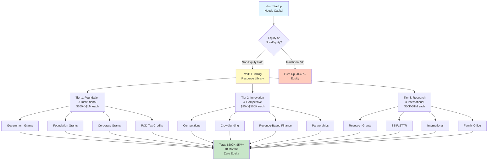
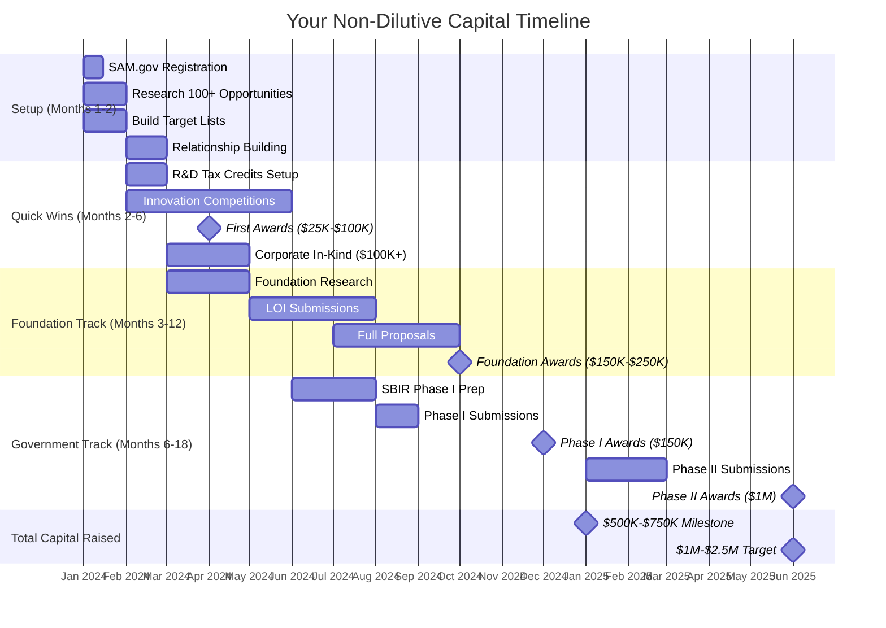
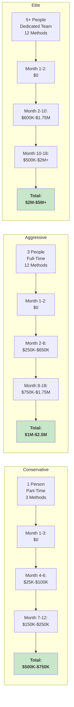
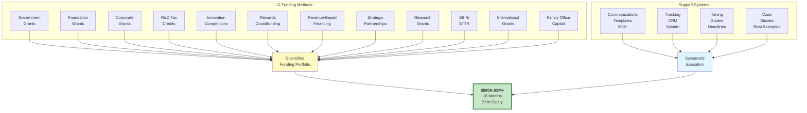
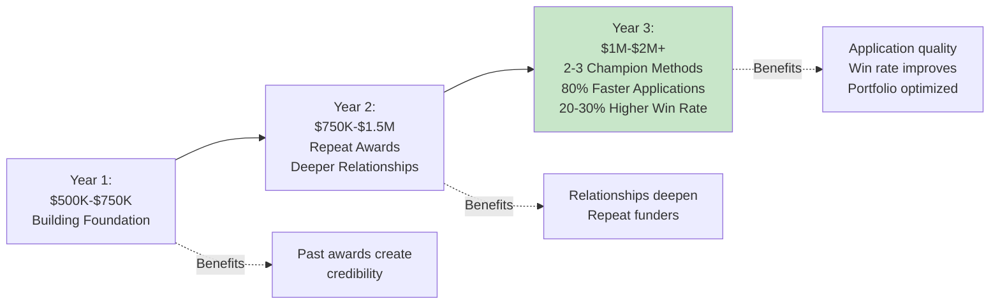
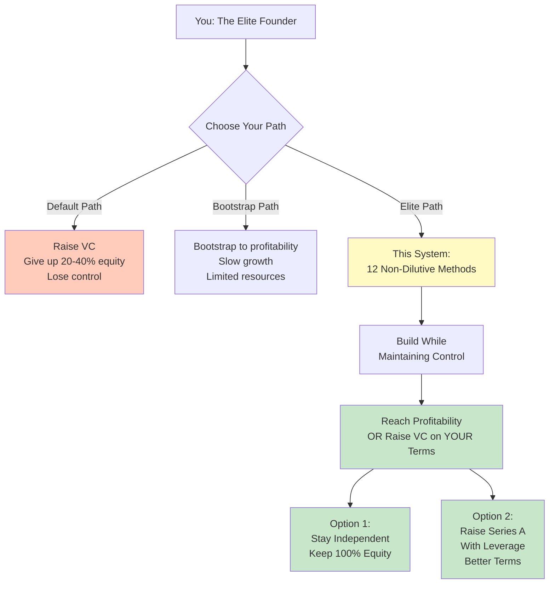

# MVP Funding Complete Resource Library

<div align="center">

**A comprehensive system for raising $500K-$5M+ in non-dilutive capital**
**Zero equity given • 12 funding methods • 600+ communication templates**

[](#)
[](#)
[](#)
[](#)

</div>

---

## 📊 The Complete Funding Ecosystem



---

## 🗺️ Quick Navigation Table

<table>
<tr>
<th width="25%">Section</th>
<th width="50%">What's Inside</th>
<th width="25%">Quick Links</th>
</tr>

<tr>
<td><strong>📚 Funding Research</strong></td>
<td>12 zero-equity funding methods with step-by-step playbooks, templates, and case studies</td>
<td>
<a href="./mvp-funding-research/README.md">Master Playbook</a><br/>
<a href="#tier-1-foundation--institutional">Method Overview</a>
</td>
</tr>

<tr>
<td><strong>💬 Communications</strong></td>
<td>600+ professional templates for investors, partners, media, and stakeholders</td>
<td>
<a href="#communications-library-600-templates">Template Library</a><br/>
<a href="./01-communications/">All Templates</a>
</td>
</tr>

<tr>
<td colspan="3" align="center"><strong>TIER 1: Foundation & Institutional ($100K-$1M per source)</strong></td>
</tr>

<tr>
<td><strong>01. Government Grants</strong></td>
<td>Federal/State/Local grants • $10K-$10M+ • SBIR/STTR programs</td>
<td>
<a href="./mvp-funding-research/01-government-grants/instructions.md">Instructions</a><br/>
<a href="./mvp-funding-research/01-government-grants/case-studies.md">Case Studies</a><br/>
<a href="./mvp-funding-research/01-government-grants/agency-guide.md">Agency Guide</a><br/>
<a href="./mvp-funding-research/01-government-grants/TIMING_GUIDE.md">Timing Guide</a>
</td>
</tr>

<tr>
<td><strong>02. Foundation Grants</strong></td>
<td>140K+ foundations • $90B+ distributed annually • $50K-$500K typical</td>
<td>
<a href="./mvp-funding-research/02-foundation-grants/instructions.md">Instructions</a><br/>
<a href="./mvp-funding-research/02-foundation-grants/foundation-database.md">Database</a><br/>
<a href="./mvp-funding-research/02-foundation-grants/case-studies.md">Case Studies</a><br/>
<a href="./mvp-funding-research/02-foundation-grants/TIMING_GUIDE.md">Timing Guide</a>
</td>
</tr>

<tr>
<td><strong>03. Corporate Grants</strong></td>
<td>Fortune 500 programs • $50K-$250K grants • In-kind support ($100K+)</td>
<td>
<a href="./mvp-funding-research/03-corporate-grants-sponsorships/instructions.md">Instructions</a><br/>
<a href="./mvp-funding-research/03-corporate-grants-sponsorships/program-database.md">Programs</a><br/>
<a href="./mvp-funding-research/03-corporate-grants-sponsorships/case-studies.md">Case Studies</a><br/>
<a href="./mvp-funding-research/03-corporate-grants-sponsorships/TIMING_GUIDE.md">Timing Guide</a>
</td>
</tr>

<tr>
<td><strong>04. R&D Tax Credits</strong></td>
<td>Up to 20% of R&D spend returned • $50K-$200K annually • Passive income</td>
<td>
<a href="./mvp-funding-research/04-rd-tax-credits/instructions.md">Instructions</a><br/>
<a href="./mvp-funding-research/04-rd-tax-credits/calculation-examples.md">Calculations</a><br/>
<a href="./mvp-funding-research/04-rd-tax-credits/state-credits-guide.md">State Guide</a><br/>
<a href="./mvp-funding-research/04-rd-tax-credits/TIMING_GUIDE.md">Timing Guide</a>
</td>
</tr>

<tr>
<td colspan="3" align="center"><strong>TIER 2: Innovation & Competitive ($25K-$500K per source)</strong></td>
</tr>

<tr>
<td><strong>05. Competitions</strong></td>
<td>100+ pitch competitions • $10K-$1M prize pools • Fast wins</td>
<td>
<a href="./mvp-funding-research/05-innovation-competitions/instructions.md">Instructions</a><br/>
<a href="./mvp-funding-research/05-innovation-competitions/competition-database.md">Database</a><br/>
<a href="./mvp-funding-research/05-innovation-competitions/pitch-deck-template.md">Pitch Deck</a><br/>
<a href="./mvp-funding-research/05-innovation-competitions/TIMING_GUIDE.md">Timing Guide</a>
</td>
</tr>

<tr>
<td><strong>06. Crowdfunding</strong></td>
<td>Kickstarter/Indiegogo • $50K-$500K typical • Pre-revenue validation</td>
<td>
<a href="./mvp-funding-research/06-rewards-crowdfunding/instructions.md">Instructions</a><br/>
<a href="./mvp-funding-research/06-rewards-crowdfunding/budget-templates.md">Budget</a><br/>
<a href="./mvp-funding-research/06-rewards-crowdfunding/paid-ads-guide.md">Ads Guide</a><br/>
<a href="./mvp-funding-research/06-rewards-crowdfunding/TIMING_GUIDE.md">Timing Guide</a>
</td>
</tr>

<tr>
<td><strong>07. Revenue-Based Finance</strong></td>
<td>$100K-$500K • 4-8% revenue share • No equity dilution</td>
<td>
<a href="./mvp-funding-research/07-revenue-based-financing/instructions.md">Instructions</a><br/>
<a href="./mvp-funding-research/07-revenue-based-financing/provider-comparison.md">Providers</a><br/>
<a href="./mvp-funding-research/07-revenue-based-financing/risk-analysis.md">Risk Analysis</a><br/>
<a href="./mvp-funding-research/07-revenue-based-financing/TIMING_GUIDE.md">Timing Guide</a>
</td>
</tr>

<tr>
<td><strong>08. Partnerships</strong></td>
<td>Strategic alliances • Co-marketing • Revenue sharing • $20K-$100K+</td>
<td>
<a href="./mvp-funding-research/08-strategic-partnerships/instructions.md">Instructions</a><br/>
<a href="./mvp-funding-research/08-strategic-partnerships/TIMING_GUIDE.md">Timing Guide</a>
</td>
</tr>

<tr>
<td colspan="3" align="center"><strong>TIER 3: Research & International ($50K-$1M per source)</strong></td>
</tr>

<tr>
<td><strong>09. Research Grants</strong></td>
<td>University partnerships • $75K-$250K • Perfect for deep tech/biotech</td>
<td>
<a href="./mvp-funding-research/09-research-institution-grants/instructions.md">Instructions</a><br/>
<a href="./mvp-funding-research/09-research-institution-grants/agency-comparison.md">Agencies</a><br/>
<a href="./mvp-funding-research/09-research-institution-grants/case-studies.md">Case Studies</a><br/>
<a href="./mvp-funding-research/09-research-institution-grants/TIMING_GUIDE.md">Timing Guide</a>
</td>
</tr>

<tr>
<td><strong>10. SBIR/STTR</strong></td>
<td>$3B+ annually • Phase I: $150K • Phase II: $1M • US government</td>
<td>
<a href="./mvp-funding-research/10-sbir-sttr-programs/instructions.md">Instructions</a><br/>
<a href="./mvp-funding-research/10-sbir-sttr-programs/agency-deep-dives.md">Agencies</a><br/>
<a href="./mvp-funding-research/10-sbir-sttr-programs/case-studies.md">Case Studies</a><br/>
<a href="./mvp-funding-research/10-sbir-sttr-programs/TIMING_GUIDE.md">Timing Guide</a>
</td>
</tr>

<tr>
<td><strong>11. International Grants</strong></td>
<td>UK, EU, Canada, Australia • $100K-$500K • Less competitive</td>
<td>
<a href="./mvp-funding-research/11-international-grants/instructions.md">Instructions</a><br/>
<a href="./mvp-funding-research/11-international-grants/regional-compliance.md">Compliance</a><br/>
<a href="./mvp-funding-research/11-international-grants/case-studies.md">Case Studies</a><br/>
<a href="./mvp-funding-research/11-international-grants/TIMING_GUIDE.md">Timing Guide</a>
</td>
</tr>

<tr>
<td><strong>12. Family Office Capital</strong></td>
<td>15,000+ US family offices • $100K-$1M • Flexible terms</td>
<td>
<a href="./mvp-funding-research/12-family-office-nonequity/instructions.md">Instructions</a><br/>
<a href="./mvp-funding-research/12-family-office-nonequity/deal-structures.md">Deal Structures</a><br/>
<a href="./mvp-funding-research/12-family-office-nonequity/case-studies.md">Case Studies</a><br/>
<a href="./mvp-funding-research/12-family-office-nonequity/TIMING_GUIDE.md">Timing Guide</a>
</td>
</tr>

<tr>
<td colspan="3" align="center"><strong>COMMUNICATION TEMPLATES</strong></td>
</tr>

<tr>
<td><strong>Social Media</strong></td>
<td>60+ templates • Twitter, LinkedIn, Facebook, Instagram, TikTok</td>
<td>
<a href="./01-communications/01-social-media-templates.md">Templates</a>
</td>
</tr>

<tr>
<td><strong>Investor Pitches</strong></td>
<td>48 email templates • Cold outreach, warm intros, follow-ups, closing</td>
<td>
<a href="./01-communications/02-investor-pitch-emails.md">Templates</a>
</td>
</tr>

<tr>
<td><strong>Press Releases</strong></td>
<td>36 templates • Funding, product, partnership, crisis, acquisition</td>
<td>
<a href="./01-communications/03-press-releases.md">Templates</a>
</td>
</tr>

<tr>
<td><strong>Partnerships</strong></td>
<td>32 templates across 8 partnership types</td>
<td>
<a href="./01-communications/04-partnership-proposals.md">Templates</a>
</td>
</tr>

<tr>
<td><strong>Grant Communications</strong></td>
<td>35+ templates • Government, foundation, corporate applications</td>
<td>
<a href="./01-communications/12-grant-communications.md">Templates</a>
</td>
</tr>

<tr>
<td><strong>All 20 Categories</strong></td>
<td>Crisis, follow-ups, thank yous, rejections, updates, and more</td>
<td>
<a href="./01-communications/">View All</a>
</td>
</tr>

</table>

---

## 🚀 18-Month Funding Journey



---

## 📈 Expected Outcomes by Scenario



---

## 🎯 Quick Start (First 30 Days)

### Week 1: Foundation Setup
```bash
# Register for required systems
✓ SAM.gov registration (federal grants)
✓ Grants.gov account
✓ Create tracking spreadsheet
✓ Subscribe to discovery platforms (free trials)

Time Investment: 5-8 hours
```

### Week 2: Discovery Phase
```bash
# Research 100 potential funding sources
✓ 10 opportunities per method
✓ Score by fit (1-10)
✓ Identify 5 warm introductions
✓ Build master spreadsheet

Time Investment: 10-15 hours
```

### Week 3: Relationship Building
```bash
# Start conversations
✓ Schedule 5 exploratory calls
✓ Attend 2 webinars/events
✓ Draft messaging templates
✓ Identify 3 "champion" methods

Time Investment: 8-10 hours
```

### Week 4: First Applications
```bash
# Submit first batch
✓ Draft 3 concept papers/LOIs
✓ Internal feedback
✓ Submit applications
✓ Create tracking system

Time Investment: 15-20 hours
```

**Total First 30 Days:** 40-55 hours
**Expected Results:** 5+ applications in pipeline, 3+ relationships started

---

## 💡 The System Architecture



---

## 📚 What's Inside Each Method

### Tier 1: Foundation & Institutional
<table>
<tr>
<th>Method</th>
<th>Target Amount</th>
<th>Timeline</th>
<th>Success Rate</th>
</tr>
<tr>
<td><strong>01. Government Grants</strong></td>
<td>$10K-$10M+</td>
<td>6-12 months</td>
<td>5-10% (elite: 20-30%)</td>
</tr>
<tr>
<td><strong>02. Foundation Grants</strong></td>
<td>$50K-$500K</td>
<td>4-8 months</td>
<td>10-20% (elite: 25-35%)</td>
</tr>
<tr>
<td><strong>03. Corporate Grants</strong></td>
<td>$50K-$250K</td>
<td>3-6 months</td>
<td>30-40% (highly variable)</td>
</tr>
<tr>
<td><strong>04. R&D Tax Credits</strong></td>
<td>$50K-$200K/year</td>
<td>1-3 months</td>
<td>90%+ (if qualified)</td>
</tr>
</table>

### Tier 2: Innovation & Competitive
<table>
<tr>
<th>Method</th>
<th>Target Amount</th>
<th>Timeline</th>
<th>Success Rate</th>
</tr>
<tr>
<td><strong>05. Innovation Competitions</strong></td>
<td>$10K-$1M</td>
<td>1-6 months</td>
<td>5-10% per competition</td>
</tr>
<tr>
<td><strong>06. Rewards Crowdfunding</strong></td>
<td>$50K-$500K</td>
<td>2-4 months</td>
<td>40-60% (with prep)</td>
</tr>
<tr>
<td><strong>07. Revenue-Based Financing</strong></td>
<td>$100K-$500K</td>
<td>1-2 months</td>
<td>50-70% (if revenue)</td>
</tr>
<tr>
<td><strong>08. Strategic Partnerships</strong></td>
<td>$20K-$100K+</td>
<td>3-9 months</td>
<td>20-30%</td>
</tr>
</table>

### Tier 3: Research & International
<table>
<tr>
<th>Method</th>
<th>Target Amount</th>
<th>Timeline</th>
<th>Success Rate</th>
</tr>
<tr>
<td><strong>09. Research Institution Grants</strong></td>
<td>$75K-$250K</td>
<td>6-12 months</td>
<td>15-25%</td>
</tr>
<tr>
<td><strong>10. SBIR/STTR Programs</strong></td>
<td>$150K-$1M</td>
<td>8-14 months</td>
<td>15-20% (Phase I)</td>
</tr>
<tr>
<td><strong>11. International Grants</strong></td>
<td>$100K-$500K</td>
<td>4-10 months</td>
<td>20-30%</td>
</tr>
<tr>
<td><strong>12. Family Office Capital</strong></td>
<td>$100K-$1M</td>
<td>3-9 months</td>
<td>10-20%</td>
</tr>
</table>

---

## Communications Library (600+ Templates)

### Investor & Funding Communications
<table>
<tr>
<th>Template Category</th>
<th>Count</th>
<th>Use Cases</th>
</tr>
<tr>
<td><strong>Social Media</strong></td>
<td>60+</td>
<td>Twitter, LinkedIn, Facebook, Instagram, TikTok</td>
</tr>
<tr>
<td><strong>Investor Pitch Emails</strong></td>
<td>48</td>
<td>Cold outreach, warm intros, follow-ups, closing</td>
</tr>
<tr>
<td><strong>Press Releases</strong></td>
<td>36</td>
<td>Funding, product, partnership, crisis, acquisition</td>
</tr>
<tr>
<td><strong>Partnership Proposals</strong></td>
<td>32</td>
<td>8 partnership types</td>
</tr>
<tr>
<td><strong>Grant Applications</strong></td>
<td>35+</td>
<td>Government, foundation, corporate</td>
</tr>
</table>

### Stakeholder & Relationship Management
<table>
<tr>
<th>Template Category</th>
<th>Count</th>
<th>Use Cases</th>
</tr>
<tr>
<td><strong>Thank You & Appreciation</strong></td>
<td>35+</td>
<td>Investors, partners, customers, mentors</td>
</tr>
<tr>
<td><strong>Rejection & Decline</strong></td>
<td>30</td>
<td>Professional ways to say no</td>
</tr>
<tr>
<td><strong>Follow-Ups</strong></td>
<td>35+</td>
<td>Standalone + multi-touch sequences</td>
</tr>
<tr>
<td><strong>Stakeholder Updates</strong></td>
<td>28</td>
<td>Investor, board, advisor, team, shareholder</td>
</tr>
<tr>
<td><strong>Onboarding</strong></td>
<td>44</td>
<td>6 stakeholder types</td>
</tr>
</table>

### Crisis & Response
<table>
<tr>
<th>Template Category</th>
<th>Count</th>
<th>Use Cases</th>
</tr>
<tr>
<td><strong>Response & Rebuttal</strong></td>
<td>40+</td>
<td>Diplomatic, assertive, legal versions</td>
</tr>
<tr>
<td><strong>Crisis Communications</strong></td>
<td>25+</td>
<td>Data breach, outage, PR crisis, recalls</td>
</tr>
<tr>
<td><strong>Media Inquiries</strong></td>
<td>46</td>
<td>Pre-approved messaging + talking points</td>
</tr>
</table>

---

## 🎯 Key Principles

<table>
<tr>
<td width="50%" valign="top">

### ✅ Fundraising Best Practices

- Start 12-18 months before you need capital
- Build relationships before applying
- Customize every application ruthlessly
- Think portfolio (10-15 sources, not 1)
- Track everything in CRM
- Fail forward (every rejection = data)

</td>
<td width="50%" valign="top">

### ❌ Fundraising Mistakes to Avoid

- Cold applications (<5% success)
- Ignoring eligibility requirements
- Boilerplate proposals
- Last-minute submissions
- Poor financial transparency
- Weak impact measurement

</td>
</tr>
<tr>
<td width="50%" valign="top">

### ✅ Communications Best Practices

- Use templates for consistency
- Customize variables for each recipient
- Respond quickly (speed = credibility)
- Be transparent and honest
- Prepare crisis templates in advance
- Track metrics (opens, responses, conversions)

</td>
<td width="50%" valign="top">

### ❌ Communications Mistakes to Avoid

- Inconsistent messaging
- Generic, non-personalized emails
- Slow response times
- No crisis plan
- Irregular stakeholder updates
- Forgetting to follow up

</td>
</tr>
</table>

---

## 🛠️ Essential Tools

### For Fundraising Research
| Tool | Cost | Purpose |
|------|------|---------|
| **Candid** | $199/mo | Foundation research (140K+ foundations) |
| **Instrumentl** | $149/mo | AI grant discovery + tracking |
| **Grants.gov** | Free | Federal grants database |
| **SBIR.gov** | Free | SBIR/STTR database |
| **SAM.gov** | Free | Federal registration (required) |

### For Communications Management
| Tool | Cost | Purpose |
|------|------|---------|
| **Gmail/Outlook** | Free-$20/mo | Email with template system |
| **Airtable** | Free-$24/mo | CRM for tracking |
| **Calendly** | Free-$12/mo | Investor meeting scheduling |
| **Buffer/Hootsuite** | $15-$99/mo | Social media calendar |

### For Project Management
| Tool | Cost | Purpose |
|------|------|---------|
| **Google Sheets** | Free | Application tracking |
| **Notion** | Free-$10/mo | Document collaboration |
| **Zapier** | Free-$30/mo | Workflow automation |

---

## 📊 Success Metrics & KPIs

### Quarterly Check-In

<table>
<tr>
<th>Leading Indicators</th>
<th>Target</th>
</tr>
<tr>
<td>Applications submitted per person</td>
<td>4-6 per quarter</td>
</tr>
<tr>
<td>New relationships started</td>
<td>5-10 per quarter</td>
</tr>
<tr>
<td>Response rate from outreach</td>
<td>20-30%</td>
</tr>
<tr>
<td>Feedback incorporated</td>
<td>80%+</td>
</tr>
</table>

<table>
<tr>
<th>Lagging Indicators</th>
<th>Target</th>
</tr>
<tr>
<td>Awards received</td>
<td>1-2 per person per year</td>
</tr>
<tr>
<td>Capital raised</td>
<td>$X per quarter</td>
</tr>
<tr>
<td>Win rate by method</td>
<td>10-30% depending on method</td>
</tr>
<tr>
<td>Average award size</td>
<td>Track by method</td>
</tr>
</table>

---

## 🔄 The Compounding Effect



**After 12-18 months of systematic execution:**

**Fundraising Benefits:**
- Past awards create credibility for new applications
- Relationships deepen (repeat funders)
- 2-3 "champion" methods identified
- Application quality 80% faster
- Win rate improves 20-30%

**Communications Benefits:**
- Template library reduces time by 70%
- Consistent brand voice across all channels
- Crisis response <2 hours vs. days
- Stakeholder confidence and trust
- Professional reputation compounds

---

## 📈 The Big Picture



**You're building two critical systems:**

### 1. Non-Dilutive Capital Engine
- 12 methods running in parallel
- Portfolio approach to de-risk
- Systematic quarterly cycles
- **$500K-$5M in 18 months possible**

### 2. Professional Communication Infrastructure
- Consistent, professional brand
- Fast response times
- Stakeholder confidence
- Crisis-ready protocols

**Combined:** These systems give you funding without equity dilution, professional credibility, and complete control over your company's future.

---

## 🎓 Learning Resources

### Books
- "The Grantseeker's Toolkit" - Cheryl Carter New
- "Winning Grants Step by Step" - Mim Carlson
- "Traction" - Gabriel Weinberg
- "The Art of Startup Fundraising" - Alejandro Cremades

### Online Learning
- **Candid Learning Center**: https://learning.candid.org (grant writing)
- **Y Combinator Startup School**: https://www.startupschool.org (free)
- **Foundation Center**: Nonprofit training

### Communities
- Grant Professionals Association
- Startup accelerators (network with peers)
- Foundation-hosted convenings
- Local chamber of commerce

---

## 📁 Complete Directory Structure

```
MVP_FUNDING/
├── README.md (this file)
│
├── mvp-funding-research/           # 12 Funding Methods
│   ├── README.md                   # Master Playbook
│   │
│   ├── 01-government-grants/
│   │   ├── instructions.md         # 12-step process
│   │   ├── TIMING_GUIDE.md         # Deadlines & cycles
│   │   ├── agency-guide.md         # Federal agencies
│   │   ├── case-studies.md         # Real examples
│   │   ├── budget-templates.md     # Financial templates
│   │   └── grant-examples.md       # Sample applications
│   │
│   ├── 02-foundation-grants/
│   │   ├── instructions.md
│   │   ├── TIMING_GUIDE.md
│   │   ├── foundation-database.md  # 50+ foundations
│   │   ├── case-studies.md
│   │   ├── budget-templates.md
│   │   └── due-diligence-checklist.md
│   │
│   ├── 03-corporate-grants-sponsorships/
│   │   ├── instructions.md
│   │   ├── TIMING_GUIDE.md
│   │   ├── program-database.md     # Corporate programs
│   │   ├── case-studies.md
│   │   ├── negotiation-guide.md
│   │   └── tracking-worksheets.md
│   │
│   ├── 04-rd-tax-credits/
│   │   ├── instructions.md
│   │   ├── TIMING_GUIDE.md
│   │   ├── calculation-examples.md
│   │   ├── state-credits-guide.md
│   │   ├── case-studies.md
│   │   └── documentation-templates.md
│   │
│   ├── 05-innovation-competitions/
│   │   ├── instructions.md
│   │   ├── TIMING_GUIDE.md
│   │   ├── competition-database.md # 100+ competitions
│   │   ├── pitch-deck-template.md
│   │   ├── qa-preparation.md
│   │   ├── video-production-guide.md
│   │   └── case-studies.md
│   │
│   ├── 06-rewards-crowdfunding/
│   │   ├── instructions.md
│   │   ├── TIMING_GUIDE.md
│   │   ├── budget-templates.md
│   │   ├── paid-ads-guide.md
│   │   ├── crisis-management.md
│   │   ├── legal-compliance.md
│   │   └── case-studies.md
│   │
│   ├── 07-revenue-based-financing/
│   │   ├── instructions.md
│   │   ├── TIMING_GUIDE.md
│   │   ├── provider-comparison.md
│   │   ├── risk-analysis.md
│   │   ├── tax-legal-guide.md
│   │   └── case-studies.md
│   │
│   ├── 08-strategic-partnerships/
│   │   ├── instructions.md
│   │   └── TIMING_GUIDE.md
│   │
│   ├── 09-research-institution-grants/
│   │   ├── instructions.md
│   │   ├── TIMING_GUIDE.md
│   │   ├── agency-comparison.md
│   │   ├── negotiation-tactics.md
│   │   ├── failure-analysis.md
│   │   └── case-studies.md
│   │
│   ├── 10-sbir-sttr-programs/
│   │   ├── instructions.md
│   │   ├── TIMING_GUIDE.md
│   │   ├── agency-deep-dives.md
│   │   ├── compliance-guide.md
│   │   ├── rejection-recovery.md
│   │   ├── sttr-partnership-guide.md
│   │   └── case-studies.md
│   │
│   ├── 11-international-grants/
│   │   ├── instructions.md
│   │   ├── TIMING_GUIDE.md
│   │   ├── application-templates.md
│   │   ├── budget-templates.md
│   │   ├── interview-guide.md
│   │   ├── regional-compliance.md
│   │   └── case-studies.md
│   │
│   └── 12-family-office-nonequity/
│       ├── instructions.md
│       ├── TIMING_GUIDE.md
│       ├── deal-structures.md
│       ├── pitch-deck-guide.md
│       ├── relationship-management.md
│       ├── term-sheet-templates.md
│       └── case-studies.md
│
└── 01-communications/              # 600+ Templates
    ├── 01-social-media-templates.md
    ├── 02-investor-pitch-emails.md
    ├── 03-press-releases.md
    ├── 04-partnership-proposals.md
    ├── 05-responses-rebuttals.md
    ├── 06-customer-communications.md
    ├── 07-crisis-communications.md
    ├── 08-cover-letters.md
    ├── 09-follow-up-templates.md
    ├── 10-community-engagement.md
    ├── 11-media-responses.md
    ├── 12-grant-communications.md
    ├── 13-thank-you-templates.md
    ├── 14-rejection-templates.md
    ├── 15-announcement-templates.md
    ├── 16-negotiation-templates.md
    ├── 17-testimonial-requests.md
    ├── 18-onboarding-templates.md
    ├── 19-stakeholder-updates.md
    └── 20-event-invitations.md
```

---

## 🔄 Next Steps

### Right Now (Next 2 Hours)
1. ✓ Read this README completely
2. ✓ Read [`/mvp-funding-research/README.md`](./mvp-funding-research/README.md) for full funding playbook
3. ✓ Choose 2-3 funding methods to start with
4. ✓ Review communication templates in [`/01-communications/`](./01-communications/)
5. ✓ Set up tracking spreadsheet

### This Week (10 Hours)
1. Deep dive into first funding method folder
2. Research 50+ opportunities for that method
3. Customize 5-10 communication templates
4. Schedule 3-5 exploratory calls
5. Begin first application draft

### This Month (40 Hours)
1. Submit 3-5 applications across 2-3 methods
2. Build relationships with 10+ funders
3. Set up communication template system
4. Send first investor/stakeholder update
5. Create quarterly planning calendar

---

## 🎯 Your Mission

Most founders take the default path:
**Raise VC → Give up 20-40% equity → Lose control**

Elite founders build optionality:
**Raise non-dilutive capital → Build sustainable business → Raise VC only when terms are perfect (or don't raise at all)**

This repository gives you the playbook, templates, and systems to be an elite founder.

**The capital exists. The systems work. The templates are ready.**

Your job: **Execute.**

---

## 📊 Repository Statistics

<div align="center">

| Metric | Value |
|--------|-------|
| **Total Size** | 6.4MB |
| **Total Files** | 95+ markdown files |
| **Funding Methods** | 12 comprehensive playbooks |
| **Communication Templates** | 600+ ready-to-use templates |
| **Case Studies** | 50+ real-world examples |
| **Timing Guides** | 12 deadline calendars |
| **Databases** | Foundations, competitions, agencies |
| **Last Updated** | November 2024 |

</div>

---

<div align="center">

**Let's build something great. 🚀**

**Created:** November 2024
**Maintained by:** Dadlorian
**License:** MIT

[⬆ Back to Top](#mvp-funding-complete-resource-library)

</div>
