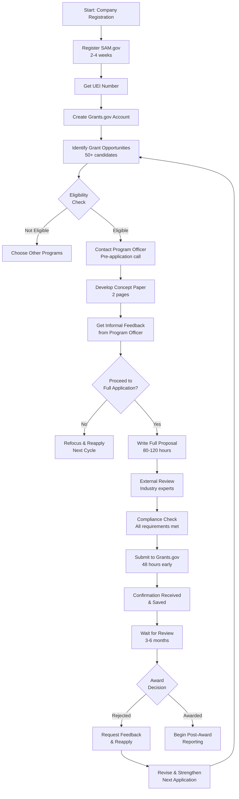
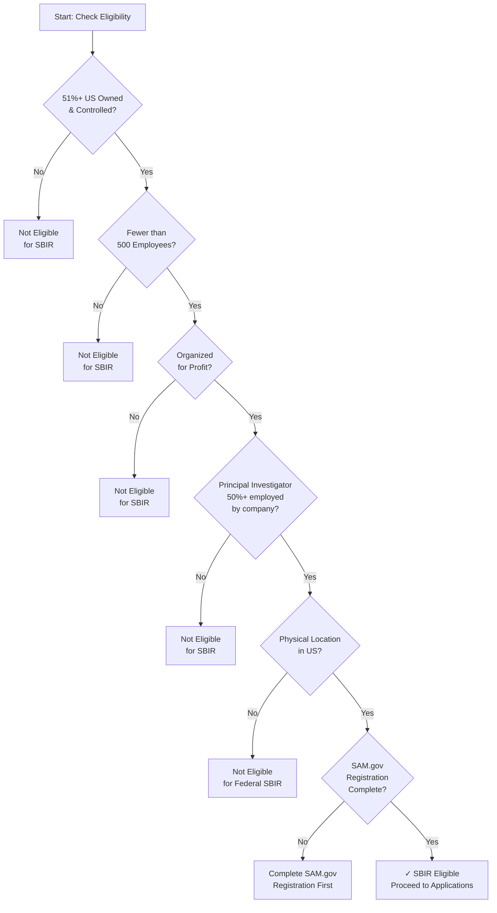
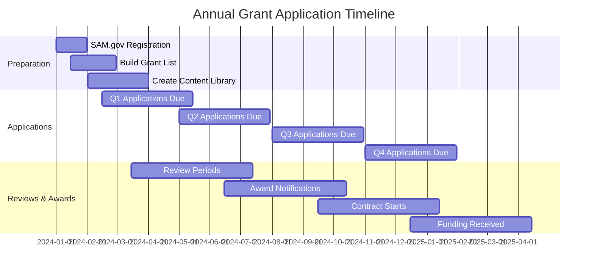

# Government Grants (Federal/State/Local) - Zero Equity Funding

## Overview
Government grants provide non-dilutive funding for startups working on innovative solutions, particularly in technology, healthcare, clean energy, and social impact sectors. These range from $10K to $10M+ with no equity given.

Unlike venture capital or loans, government grants:
- Require NO equity dilution
- Require NO repayment (true grant funding)
- Provide credibility and validation for future fundraising
- Often come with technical assistance and mentorship
- Can be renewed/expanded in subsequent phases
- Validate your technology/approach for commercial investors

## Target Amount Range
- Local/State: $10K - $500K
- Federal: $100K - $10M+
- Average: $250K - $1M

## Real Success Metrics From The Field
- **Timeline**: 6-18 months from first submission to award
- **Win Rate**: 15-30% for well-prepared applications (vs 5-10% for rushed applications)
- **ROI**: Every $1 spent on quality grant writing returns $8-15 in awards (industry data)
- **Conversion**: Startups with 1 government grant are 3.2x more likely to secure VC funding
- **Renewal Rate**: 60-70% of Phase I SBIR winners receive Phase II funding

## Specific Federal Programs (With URLs & Details)

### Department of Energy (DOE)
**1. Small Business Innovation Research (SBIR)**
- **URL**: https://science.osti.gov/sbir
- **Amount**: Phase I: $200K-$250K | Phase II: $1M-$2M
- **Timeline**: 6-12 months (Phase I), 2 years (Phase II)
- **Focus Areas**: Clean energy, grid modernization, advanced manufacturing, quantum computing
- **Eligibility**: US-based small business, <500 employees, 51%+ US-owned
- **Deadline**: Typically June & December annually
- **Win Rate**: ~15% for Phase I

**2. Advanced Research Projects Agency-Energy (ARPA-E)**
- **URL**: https://arpa-e.energy.gov
- **Amount**: $500K - $10M
- **Timeline**: 1-3 years
- **Focus Areas**: High-risk, high-reward energy technologies
- **Eligibility**: Open to startups, universities, national labs (startup-friendly)
- **Deadline**: Rolling with focused topics announced quarterly
- **Win Rate**: ~3-5% (highly competitive)
- **Note**: Specifically seeks breakthrough technologies, not incremental improvements

### National Science Foundation (NSF)
**1. NSF SBIR/STTR**
- **URL**: https://seedfund.nsf.gov
- **Amount**: Phase I: $275K | Phase II: $1M | Phase IIB: Up to $500K
- **Timeline**: Phase I (6-12 months), Phase II (2 years)
- **Focus Areas**: AI/ML, biotech, cybersecurity, IoT, semiconductors, quantum
- **Eligibility**: Same as DOE SBIR + strong technical team required
- **Deadline**: Windows open typically in January and June
- **Win Rate**: ~20% for Phase I
- **Special Feature**: America's Seed Fund - supports deep tech startups

**2. Convergence Accelerator**
- **URL**: https://www.nsf.gov/funding/pgm_summ.jsp?pims_id=505674
- **Amount**: Phase I: $750K | Phase II: $5M
- **Timeline**: 9 months (Phase I), 2 years (Phase II)
- **Focus Areas**: Changes annually (recent: climate, workforce, security)
- **Eligibility**: Diverse teams encouraged, startups must partner with universities
- **Win Rate**: ~15-20% for Phase I

### Department of Defense (DOD)
**1. Defense Innovation Unit (DIU) - Commercial Solutions Opening (CSO)**
- **URL**: https://www.diu.mil/work-with-us
- **Amount**: Prototype: $100K-$3M | Production: Up to $100M
- **Timeline**: 60-90 days for prototype award
- **Focus Areas**: AI/ML, autonomy, cyber, space, human systems
- **Eligibility**: Commercial tech companies with existing products
- **Deadline**: Rolling (always open)
- **Win Rate**: ~10-15%
- **Note**: Fastest path to DOD funding - designed for speed

**2. Air Force SBIR/STTR (AFWERX)**
- **URL**: https://afwerx.com/sbir
- **Amount**: Phase I: $50K-$250K | Phase II: $1.5M-$2M
- **Timeline**: Phase I (3-6 months), Phase II (2 years)
- **Focus Areas**: Aerospace, AI, cyber, autonomy, logistics
- **Eligibility**: Standard SBIR rules
- **Deadline**: Multiple windows per year (Open Topic submissions accepted)
- **Win Rate**: ~25% for Phase I (more accessible than other DOD branches)

**3. Army xTechSearch**
- **URL**: https://www.ausa.org/xtechsearch
- **Amount**: $25K-$250K (prizes) + potential $1M+ contracts
- **Timeline**: Competition-based (6-12 months)
- **Focus Areas**: Emerging technologies for Army modernization
- **Eligibility**: Any US company
- **Win Rate**: ~5% reach finals

### National Institutes of Health (NIH)
**1. NIH SBIR/STTR**
- **URL**: https://sbir.nih.gov
- **Amount**: Phase I: $300K-$400K | Phase II: $2M-$3M
- **Timeline**: Phase I (6-12 months), Phase II (2-3 years)
- **Focus Areas**: Biotech, medical devices, digital health, diagnostics, therapeutics
- **Eligibility**: Strong scientific team required, partnerships with clinical sites helpful
- **Deadline**: April, September, December
- **Win Rate**: ~15-20%
- **Note**: Largest SBIR program in federal government ($1B+ annually)

**2. NIH Rapid Acceleration of Diagnostics (RADx)**
- **URL**: https://www.nih.gov/radx
- **Amount**: Varies ($500K-$5M typical)
- **Timeline**: Accelerated (3-6 months to award)
- **Focus Areas**: Diagnostic technologies, point-of-care testing
- **Eligibility**: Startups with working prototypes
- **Note**: Created during COVID, now permanent program

### Department of Agriculture (USDA)
**1. USDA SBIR**
- **URL**: https://www.nifa.usda.gov/grants/programs/sbir
- **Amount**: Phase I: $125K | Phase II: $600K
- **Timeline**: Phase I (8 months), Phase II (2 years)
- **Focus Areas**: AgTech, food safety, rural development, climate-smart agriculture
- **Eligibility**: Standard SBIR rules
- **Deadline**: Typically March annually
- **Win Rate**: ~20-25% (less competitive than other agencies)

**2. Value-Added Producer Grants**
- **URL**: https://www.rd.usda.gov/programs-services/business-programs/value-added-producer-grants
- **Amount**: Planning: $75K | Working Capital: $250K
- **Timeline**: 1-3 years
- **Focus Areas**: Agricultural value chain, processing, marketing
- **Eligibility**: Agricultural producers, farmer cooperatives
- **Deadline**: Typically May-July

### Environmental Protection Agency (EPA)
**1. Small Business Innovation Research (SBIR)**
- **URL**: https://www.epa.gov/sbir
- **Amount**: Phase I: $100K | Phase II: $400K
- **Timeline**: Phase I (6 months), Phase II (2 years)
- **Focus Areas**: Water quality, air quality, climate, chemical safety
- **Eligibility**: Standard SBIR rules
- **Win Rate**: ~25% (smaller program, good odds)

### Department of Commerce (DOC)
**1. Economic Development Administration (EDA) - Build to Scale**
- **URL**: https://www.eda.gov/funding/programs/american-rescue-plan/build-to-scale
- **Amount**: Venture Challenge: $1M-$2M | Capital Challenge: $8M-$50M
- **Timeline**: 2-3 years
- **Focus Areas**: Regional innovation, startup ecosystems, technology commercialization
- **Eligibility**: Regional organizations, startups can be beneficiaries
- **Deadline**: Typically announced annually
- **Note**: Often requires regional partnerships

**2. NIST Manufacturing Extension Partnership (MEP)**
- **URL**: https://www.nist.gov/mep
- **Amount**: Varies by state ($25K-$150K typical)
- **Timeline**: Ongoing
- **Focus Areas**: Manufacturing tech, process improvement, Industry 4.0
- **Eligibility**: Small manufacturers
- **Note**: State-specific programs - contact your local MEP center

## State & Local Programs (Examples by Category)

### High-Tech State Programs

**California**
- **CalCompetes Tax Credit**: https://business.ca.gov/calcompetes-tax-credit
  - $20M-$180M available annually
  - Tax credits for job creation/investment
  - Rolling applications

- **California Energy Commission (CEC) Grants**: https://www.energy.ca.gov/funding-opportunities
  - $50K-$5M for clean energy
  - Multiple programs annually

**New York**
- **NYSERDA Clean Energy Startups**: https://www.nyserda.ny.gov/Funding-Opportunities
  - $250K-$2M for clean energy tech
  - Multiple tracks (Proof of Concept, Product Development, Demonstration)

**Massachusetts**
- **MassVentures**: https://www.mass-ventures.com
  - $250K-$500K for early-stage startups
  - Co-investment model

- **Massachusetts Clean Energy Center**: https://www.masscec.com
  - Various programs: $50K-$1M
  - InnovateMass program for prototyping

**Texas**
- **Texas Emerging Technology Fund**: https://gov.texas.gov/business/page/emerging-technology-fund
  - $250K-$5M for commercialization
  - Focus on regional innovation clusters

**Colorado**
- **Advanced Industries Accelerator**: https://oedit.colorado.gov/advanced-industries-accelerator-grant-program
  - Proof of Concept: $50K-$250K
  - Early Stage Capital: $250K-$1M
  - Rolling deadlines

### Research Triangle States

**North Carolina**
- **NC Biotechnology Center**: https://www.ncbiotech.org/grants
  - $50K-$250K for biotech/life sciences
  - Multiple grant programs

**Maryland**
- **Maryland Innovation Initiative**: https://mips.tedco.md/funding
  - $50K-$250K for university startups
  - Technology commercialization focus

### Midwest Innovation

**Michigan**
- **Michigan Strategic Fund**: https://www.michiganbusiness.org/funds
  - $50K-$500K for tech commercialization
  - Strong manufacturing/mobility focus

**Ohio**
- **Ohio Third Frontier**: https://development.ohio.gov/business/third-frontier
  - Technology Validation: $50K-$250K
  - Commercialization: $500K-$2M

### Pacific Northwest

**Washington**
- **Washington State Department of Commerce - Innovation Programs**: https://www.commerce.wa.gov/growing-the-economy/innovation
  - $25K-$250K various programs
  - Clean energy, life sciences focus

**Oregon**
- **Business Oregon**: https://www.oregon.gov/biz/pages/index.aspx
  - Strategic Reserve Fund: $100K-$500K
  - Focus on traded sector industries

## Grant Application Process Flows (Visual Guides)

### Overall Federal Grant Application Journey



### Eligibility Verification Flowchart



### Grant Funding Progression Path

```mermaid
graph LR
    A["State Grants<br/>$25K-$100K<br/>3-6 months"] --> B["Build<br/>Preliminary Data"]
    B --> C["Federal Phase I<br/>$150K-$300K<br/>6-9 months"]
    C --> D["Generate<br/>Proof of Concept"]
    D --> E["Federal Phase II<br/>$750K-$2M<br/>18-24 months"]
    E --> F["Develop<br/>Full Solution"]
    F --> G["Phase II Extensions<br/>$500K<br/>12 months"]
    G --> H["Strengthen<br/>Commercialization"]
    H --> I["ARPA-E/Large Programs<br/>$1M-$10M<br/>24-36 months"]
    I --> J["Scale & Deploy<br/>Technology"]
    J --> K["Phase III/<br/>Commercialization<br/>Procurement Contracts"]

    style A fill:#e1f5ff
    style C fill:#fff3e0
    style E fill:#f3e5f5
    style I fill:#e8f5e9
    style K fill:#fce4ec
```



### Monthly Discovery & Application Timeline



## How Top-Tier Founders Identify Opportunities

### 1. Primary Discovery Systems
- **Grants.gov**: Set up saved searches with keywords related to your industry
  - Create an account at https://www.grants.gov
  - Use "Advanced Search" with CFDA numbers for your sector
  - Set up email alerts for 20+ keyword combinations
  - Check 2x per week minimum
- **SBIR.gov**: For tech/research companies (see folder 10 for detailed SBIR/STTR)
  - All federal SBIR/STTR opportunities in one place
  - Filter by agency, topic, deadline
  - Download solicitation PDFs immediately when published
- **State economic development agencies**: Each state has dedicated portals
  - Bookmark your state's main economic development site
  - Sign up for newsletters from neighboring states too
  - Join state-specific innovation networks
- **Congressional alerts**: Track appropriations committees for new funding
  - Follow House/Senate Appropriations Committee announcements
  - Monitor newly passed legislation for funding opportunities
  - Track federal budget cycles (FY planning typically 18 months ahead)

### 2. Intelligence Gathering Process
- Monitor Federal Register for new RFPs (Request for Proposals)
  - Set up Federal Register alerts at https://www.federalregister.gov
  - Focus on "Notices" and "Proposed Rules" sections
  - Look for early-stage consultation opportunities
- Join grant notification services (GrantWatch, GrantStation)
  - **GrantWatch**: $40-$60/month, comprehensive database
  - **GrantStation**: $99/month for nonprofits, includes webinars
  - **Candid/Foundation Directory**: $180/month for full access
- Follow agency Twitter/LinkedIn accounts (NSF, DOE, DOD, HHS, USDA)
  - Create a dedicated Twitter list for federal agencies
  - Enable notifications for program announcements
  - Engage with posts to build visibility
- Network with grant consultants and previous winners
  - Attend SBIR conferences (National SBIR Conference, regional events)
  - Join LinkedIn groups: "SBIR/STTR Winners", "Federal Grant Professionals"
  - Cold email past winners (public info) - 30% respond rate

### 3. Pattern Recognition
- Identify recurring annual grants
  - Most SBIR programs follow annual cycles
  - EDA programs typically align with federal fiscal year (Oct 1)
  - State programs often align with state budget years (varies by state)
- Track policy priorities (administration focus areas)
  - Current priorities: Climate/clean energy, AI/emerging tech, supply chain, biotech
  - Read White House OSTP announcements: https://www.whitehouse.gov/ostp
  - Monitor agency strategic plans (5-year plans show long-term priorities)
- Notice gaps in current funding landscapes
  - Areas getting lots of VC but no govt funding = opportunity
  - Emerging technologies without dedicated programs = create relationships early
  - Cross-agency priorities (e.g., climate + AI) = multiple pathways
- Monitor agency strategic plans (published yearly)
  - Available on agency websites under "About" or "Strategic Plan"
  - Shows budget priorities 1-3 years ahead
  - Use keywords from strategic plans in your proposals

## 12-Step Process

### Step 1: Build Your Target List (Week 1)
**Action**: Create spreadsheet of 50+ relevant government grants
- Federal agencies aligned with your mission
- State/local economic development programs
- Regional innovation clusters
- Industry-specific government programs

**Deliverable**: Spreadsheet with columns: Agency, Grant Name, Amount, Deadline, Eligibility, Fit Score (1-10)

### Step 2: Eligibility Audit (Week 1)
**Action**: Verify your startup meets basic requirements

**Federal SBIR/STTR Eligibility (Most Common Requirements):**
- **Ownership**: 51%+ owned and controlled by US citizens or permanent residents
- **Size**: Fewer than 500 employees (including affiliates)
- **For-Profit**: Must be organized for profit (LLCs, C-Corps, S-Corps acceptable)
- **Primary Employment**: Principal Investigator employed primarily by company (>50% time)
- **Location**: Physical location in United States
- **SBIR vs STTR**: STTR requires partnership with research institution (30-70% R&D split)

**Registration Requirements (Complete in Order):**
1. **UEI Number** (Unique Entity Identifier - replaced DUNS)
   - Register at SAM.gov (free)
   - Takes 1-2 days to receive
   - Required for all federal grants

2. **SAM.gov Registration** (System for Award Management)
   - URL: https://sam.gov
   - Required for all federal grants
   - Process takes 2-4 weeks (can take longer)
   - Must renew annually
   - Requires: EIN, banking info, business info, POC details
   - **Critical**: Start this IMMEDIATELY - it's often the biggest bottleneck

3. **Grants.gov Account**
   - URL: https://www.grants.gov
   - Free registration
   - Need UEI and SAM.gov first
   - Create "Authorized Organization Representative" (AOR) role
   - Takes 2-3 days for AOR approval

4. **State Business Registrations**
   - Business license in your operating state
   - Good standing certificate (from Secretary of State)
   - Sales tax permit (if applicable)
   - Professional licenses (if applicable to your industry)

5. **Tax Compliance**
   - Federal EIN (Employer Identification Number)
   - Current on all federal/state tax obligations
   - W-9 form completed
   - Financial statements (last 2 years if available)

**State Grant Additional Requirements (Varies by State):**
- State business registration (usually required)
- Physical presence in state (office, employees)
- Commitment to create jobs in state (sometimes required)
- Matching funds (10-50% match common for some programs)
- Minority/women-owned certifications (preference, not always required)

**Common Disqualifiers to Check:**
- Outstanding federal debt or delinquent taxes
- Debarment or suspension from federal programs (check SAM.gov)
- Conflicts of interest with reviewers or program officers
- Foreign ownership >49%
- Non-US bank accounts for federal fund receipt

**Deliverable**: Checklist of completed registrations + compliance documents
- Create a folder: "Grant Compliance Documents"
- Include: UEI confirmation, SAM.gov registration, business licenses, tax documents, W-9, good standing certificate

### Step 3: Past Winner Analysis (Week 2)
**Action**: Research 10-20 previous grant recipients
- Read their winning abstracts (often public via FOIA)
- Analyze their company stage at time of award
- Identify common themes in successful applications
- Note review criteria and scoring systems

**Deliverable**: Analysis document with success patterns

### Step 4: Relationship Building (Week 2-3)
**Action**: Connect with program officers BEFORE applying
- Schedule 15-min exploratory calls
- Attend agency webinars/Q&A sessions
- Ask: "Does our project align with your priorities?"
- Request feedback on concept papers

**Deliverable**: Contact log with 5+ agency relationships established

### Step 5: Concept Paper Development (Week 3-4)
**Action**: Draft 2-page concept papers for top 5 grants
- Problem statement (with data)
- Proposed solution (technical approach)
- Impact metrics (quantifiable outcomes)
- Team credentials
- Budget overview

**Deliverable**: 5 concept papers ready for review

### Step 6: Pre-Application Feedback Loop (Week 4-5)
**Action**: Submit concept papers to program officers
- Request informal feedback
- Attend office hours if available
- Refine based on guidance
- Confirm alignment before full application

**Deliverable**: Feedback notes + revised concepts

### Step 7: Full Proposal Writing (Week 5-8)
**Action**: Develop comprehensive proposals following exact RFP requirements
- Executive summary (compelling narrative)
- Technical approach (detailed methodology)
- Work plan with milestones
- Team qualifications (resumes, publications)
- Budget and budget justification
- Letters of support from partners
- Evaluation plan

**Deliverable**: 2-3 complete grant applications

### Step 8: Technical Review (Week 8)
**Action**: Have proposals reviewed by:
- Industry experts in your field
- Grant consultants
- Previous winners
- Technical writers

**Deliverable**: Revised applications with reviewer feedback incorporated

### Step 9: Compliance Check (Week 9)
**Action**: Final verification before submission
- All required forms completed
- Correct format (page limits, font, margins)
- All attachments included
- Authorized organizational representative signs
- Budget matches narrative

**Deliverable**: Submission-ready packages

### Step 10: Strategic Submission (Week 9)
**Action**: Submit well before deadline
- Upload to Grants.gov or agency portal
- Confirm receipt within 48 hours
- Save all confirmation emails
- Note expected decision timeline

**Deliverable**: Submission confirmations

### Step 11: Follow-Up Protocol (Week 10-20)
**Action**: Strategic engagement during review period
- Send thank you email to program officer
- Provide any requested clarifications immediately
- Continue relationship building (not about specific app)
- Prepare for site visits if applicable

**Deliverable**: Communication log

### Step 12: Outcome Management (Week 20+)
**Action**: Regardless of outcome, maintain momentum
- **If awarded**: Begin reporting systems, milestone tracking
- **If rejected**: Request reviewer feedback, apply feedback to next round
- **Always**: Thank reviewers, maintain relationships, apply to next cycle

**Deliverable**: Next steps action plan

## Step-by-Step Execution Guide: First 90 Days (With Specific Sites)

### Day 1-7: Registration Sprint

**Day 1-2: Create Your SAM.gov Account**
```
Website: https://sam.gov
Process:
1. Click "Register" in top right
2. Enter your company EIN (Employer Identification Number)
3. Create account with email and password
4. Complete business entity information
   - Legal business name
   - Physical address
   - Mailing address
   - Business type (LLC, C-Corp, S-Corp, etc.)
5. Provide bank information (routing & account number)
6. Appoint officials (owner, authorized signatory)
7. Add points of contact with names, emails, phone numbers
Status Check: Monitor email for UEI confirmation (usually 1-2 days)
Timeline: 2-4 weeks for full SAM.gov approval
```

**Day 3-4: Get Your UEI (Unique Entity Identifier)**
```
Automatic: Issued when SAM.gov approves your registration
- You'll receive UEI number via email
- Save this number (you'll need it for everything)
- Update all government forms with this UEI
- Note: UEI replaced DUNS number in 2023
```

**Day 5-6: Register with Grants.gov**
```
Website: https://www.grants.gov
Process:
1. Create account with email address
2. Confirm email address (check spam folder)
3. Set up "Authorized Organization Representative" (AOR)
   - You or CFO can be AOR
   - AOR must sign all grant applications
4. Wait for AOR approval (2-3 business days)
5. Set up email alerts for keywords
   - Search 20+ relevant keyword combinations
   - Examples for AI startup:
     * "artificial intelligence"
     * "machine learning"
     * "autonomous systems"
     * "AI manufacturing"
     * "AI healthcare"
     * "AI defense"
     * "deep learning"
     * Plus industry-specific terms
Note: Don't proceed to applications until AOR is approved
```

**Day 7: Set Up Federal Register Alerts**
```
Website: https://www.federalregister.gov
Process:
1. Click "Notifications" at top
2. Create custom alert with search terms
3. Select email frequency (daily recommended)
4. Search categories: "Notices" and "Proposed Rules"
5. Add agency-specific searches:
   - National Science Foundation
   - Department of Energy
   - Department of Defense
   - National Institutes of Health
   - USDA
This catches funding opportunities BEFORE they appear on Grants.gov
```

### Week 2: Target List Development

**Day 8-10: Build Your 50+ Grant Opportunity List**
```
Primary Source: https://www.grants.gov/search-results
Steps:
1. Click "Advanced Search"
2. Search by agency (start with 3-5 relevant agencies)
3. For each agency search, apply filters:
   - Status: "Open"
   - Funding Opportunity Category: [Your field]
   - Funding Instrument Type: "Grant"
4. Download solicitation PDFs for:
   - All "Phase I" opportunities (smaller, easier to win)
   - All current "Phase II" opportunities
   - Any new programs aligned with your tech
5. Create spreadsheet with columns:
   | Agency | Program Name | Phase | Amount | Deadline | CFDA # | Fit Score | URL |
6. Score each grant 1-10 for fit
7. Prioritize: Deadline within 2-4 months, Fit Score 7+

Alternative/Supplemental Sources:
- https://www.sbir.gov - Tech-focused SBIR/STTR opportunities
- https://beta.sam.gov - Broader opportunity database
- https://www.grantwatch.com - Paid service with daily updates
```

**Day 11-14: Research Past Winners**
```
Method 1: SBIR.gov Past Winner Database
- Website: https://www.sbir.gov/awardees/past-awards
- Search by company name, agency, or topic
- Review what these companies proposed
- Look for patterns in successful proposals

Method 2: Government Reports
- NSF Awards: https://nsf.gov/awardsearch
- NIH Reporter: https://reporter.nih.gov
- DOE Office of Scientific Information: https://www.osti.gov
- Search your technology area
- Download abstracts of funded projects
- Analyze what made them successful

Method 3: Direct Outreach
- Find past winners on LinkedIn
- Send message: "Hi [Name], I noticed you won an NSF SBIR for [project].
  We're in a similar space and preparing our first application. Would
  you be open to a 15-minute call about your experience?"
- ~30% response rate
- These conversations are gold

Create Summary Document:
- 10-20 past winner analysis
- Common themes in their approaches
- Market focus and team structure
- Typical budget ranges they used
```

### Week 3: Relationship Building Sprint

**Day 15-18: Program Officer Research**
```
For Your Top 5 Opportunities:

Step 1: Find the Program Officer
- Go to grant announcement on Grants.gov
- Look for "Agency Contact" section
- Usually includes email, phone, name
- If not listed, try agency website:
  * https://www.nsf.gov/staff/index.jsp (NSF staff directory)
  * https://www.energy.gov (DOE directory)
  * https://sbir.nih.gov/contact (NIH contact info)

Step 2: Research the Program Officer
- Search their LinkedIn
- Look for their published papers on Google Scholar
- Check if they've presented at conferences
- Look for any Twitter/professional profiles
- This helps you reference their work in emails

Step 3: Prepare Short Profile for Each:
Name: [Program Officer]
Title: [Title]
Email: [Email]
Phone: [Phone]
Office Hours: [If available]
Key Interests: [Based on research]
Recent Publications: [Links to research]
Contact Window: [Best time to reach out]
```

**Day 19-21: Initial Outreach**
```
Email Template to Program Officers:
[Use template from this guide under "Messaging Templates"]

Personalization is KEY:
- Reference something specific from THEIR work
- Show genuine alignment (not generic)
- Keep to 200-250 words
- End with clear ask: "Would you have 15 minutes for a call?"

Example Personalization:
"I noticed in your 2024 NSF SBIR solicitation that you're specifically
seeking approaches to autonomous system challenges. Our work on [specific
approach] directly addresses [specific challenge you mentioned in
solicitation]. Have we understood your priorities correctly?"

Timeline: Send emails over 3-5 days
- Space them out to avoid them comparing notes
- Expect 30-50% response rate
- Calls typically within 48 hours of positive response
```

**Day 22-28: Exploratory Calls**
```
Scheduling:
- Book calls for 15-20 minutes
- Offer 3-4 time options
- Usually scheduled within 48 hours

Call Preparation:
- Have your proposal concept ready (1-2 page summary)
- Make 3 specific questions to ask:
  1. "Does our approach align with your current priorities?"
  2. "What do winning proposals in this area typically look like?"
  3. "Are there other programs you'd recommend exploring?"
- Have their published papers open
- Note any new requirements they mention
- Get their timeline for solicitation (if not yet released)

During Call (15 minutes):
- Introduce: 1 minute
- Pitch: 2 minutes (your problem, solution, impact)
- Questions: 5 minutes
- Ask for feedback: 3 minutes
- Close: 1 minute ("Thank you, next steps...")

Post-Call:
- Send thank you email within 1 hour
- Reference specific feedback they gave
- Include updated concept paper addressing their feedback
- Set reminder for 2 weeks: "Follow up if no solicitation released"
```

### Week 4-6: Content Development

**Day 29-35: Create Your Reusable Content Library**
```
Document 1: Company Overview (1 page)
Location: Create in Google Drive/shared folder
What to include:
- One-line mission statement
- Problem you're solving (with statistics)
- Your solution (paragraph + 1 visual)
- Team highlights
- Current stage/traction
- Why now? (market momentum)
Use this for EVERY proposal (customize for each agency)

Document 2: Technical Approach Template (3-5 pages)
Include:
- Background (what's the current state?)
- Your innovation (what's novel?)
- Preliminary data (proof it works)
- Detailed technical objectives (SMART goals)
- Methodology (how will you do it?)
- Risk mitigation (what could go wrong, how you'll handle it)
- Timeline with milestones

Document 3: Team CVs/Bios
Create 2-3 page CVs for:
- CEO/Founder (highlight relevant experience)
- CTO/Lead Technical Person
- Other key roles
- List: education, relevant experience, publications, patents, prior grants

Document 4: Commercialization Plan (2-3 pages)
Include:
- Target customer (specific segments)
- Market size (with sources, not just TAM)
- Unit economics (pricing & cost)
- Go-to-market strategy
- Competition & differentiation
- Revenue projections (3-5 years)
- Exit potential

Document 5: Letters of Support Template
Create template with blanks for:
- Customer/Partner letterhead
- Specific commitments (not just "this is interesting")
- Technical details they'll need
- Pricing/purchase terms if applicable
- How you'll work together

Documents to Collect:
- Articles/papers your team has published
- Patents filed
- News coverage
- Product screenshots/demos
- Prototype photos
- Preliminary results/data charts
- Customer testimonials
- Anything that validates your technology
```

**Day 36-42: Create Preliminary Data Package**
```
Even if you're pre-product:
- Show what you've built/tested so far
- Include: Charts, graphs, screenshots, data tables
- Demonstrate team capability:
  * Previous successful projects
  * Relevant publications
  * Prior grant awards
  * Industry recognition

For Hardware Companies:
- CAD renderings
- Prototype photos
- Performance test results
- Materials/cost analysis

For Software Companies:
- System architecture diagrams
- Algorithm performance benchmarks
- User interface screenshots
- Usage metrics (if beta testing)

For Biotech/Hardware:
- Lab results/graphs
- Test protocols
- Regulatory pathway analysis

For Service Companies:
- Case studies from beta customers
- Usage data/metrics
- Customer testimonials
- Operational procedures
```

### Week 7-8: First Application Submission

**Day 43-49: Select Your First 2-3 Applications**
```
Choose grants with:
- Deadline 6-8 weeks away
- Your fit score 8+
- Amount you can use ($150K-$300K ideal for Phase I)
- Agency you've contacted (program officer relationship)

Create Application Work Plan:
- Deadline minus 2 weeks: Have draft complete
- Deadline minus 1 week: Get external reviews
- Deadline minus 3 days: Final compliance check
- Deadline minus 1 day: Submit

For each application:
- Download the full RFP/solicitation from Grants.gov
- Read page-by-page (yes, all 20-40 pages)
- Create checklist of:
  * All required sections
  * Page limits for each section
  * Required attachments
  * Required forms
  * Formatting requirements (font, margins, etc.)
  * Authorized signatory requirements
```

**Day 50-56: Write Your First Proposals**
```
Proposal Structure Template:
1. Executive Summary (1-2 pages)
   - Start with problem + impact
   - Your solution in 2-3 sentences
   - Team capability
   - Budget ask + deliverables
   - Timeline

2. Technical Approach (5-10 pages)
   - Background: Current state, gap, why it matters
   - Innovation: What's novel, your advantage
   - Preliminary Results: Proof of concept
   - Technical Objectives: 3-5 specific, measurable goals
   - Methodology: How you'll achieve each
   - Timeline: Gantt chart with milestones
   - Risk Mitigation: Problems + solutions

3. Commercialization (2-5 pages)
   - Market analysis with sources
   - Go-to-market strategy
   - IP/defensibility
   - Financial projections
   - Exit/impact potential

4. Team (2 pages)
   - Key personnel CVs
   - Relevant experience highlights
   - Gaps filled by consultants
   - Advisory board

5. Budget & Justification
   - Detailed spreadsheet
   - Narrative for each line item
   - Compliance with spending rules

Writing Tips:
- Use exact terminology from the RFP
- Answer every evaluation criterion explicitly
- Include visuals every 2-3 pages
- 30-50 citations showing field knowledge
- Professional PDF (12pt font, 1" margins)
- Names/titles for all team members
```

**Day 57-60: External Review & Submission**
```
Review Process:
Day 57: Get external expert review
- Industry expert in your field
- Grant consultant (if budget allows)
- Previous grant winner
- Technical writer
Get their feedback on:
- Technical soundness
- Clarity and persuasiveness
- Completeness against RFP requirements
- Competitive positioning

Day 58: Revise based on feedback
Day 59: Compliance check
- Page limits ✓
- All required forms ✓
- Authorized signatory on cover ✓
- Budget matches narrative ✓
- All attachments included ✓
- File naming conventions ✓

Day 60: Submit
- Upload to Grants.gov or agency portal
- Confirm receipt within 48 hours
- Save confirmation email/number
- Send thank you email to program officer
- Set calendar reminder for decision date
```

### Week 9-12: Follow-Up & Next Applications

**Day 61-90: Maintain Momentum**
```
Post-Submission (Week 1):
- Track submission in your spreadsheet
- Note deadline for next similar program
- Plan next 2-3 applications

Ongoing (Weekly):
- Check Grants.gov for new opportunities
- Attend 1 agency webinar
- Update your content library
- Research 1 new past winner

Ongoing (Monthly):
- Review and score new opportunities
- Email 2 new program officers
- Attend networking event/LinkedIn engagement
- Update team CVs with new accomplishments
- Prepare concept papers for next wave

If Rejected (Week 8 of waiting):
- Request reviewer feedback
- Schedule call with program officer
- Ask: "What would make us competitive next time?"
- Document feedback in your file
- Start revising for next cycle

If Awarded (Week 8 of waiting):
- Respond within 48 hours to accept
- Hire bookkeeper for grant accounting
- Set up milestone tracking
- Schedule kickoff call with program officer
- Immediately start work on Phase II proposal
```

## Systems & Processes

### Grant Calendar System
- Use Airtable or Notion to track:
  - Application deadlines (with 2-week early target)
  - Required documents
  - Review timelines
  - Award notifications
  - Reporting requirements

### Document Library
- Maintain evergreen content:
  - Company overview (1-page)
  - Technical approach templates
  - Team bios/CVs
  - Letters of support
  - Financial statements
  - Impact data/metrics

### Relationship CRM
- Track all program officer interactions:
  - Contact info
  - Meeting notes
  - Feedback received
  - Follow-up reminders
  - Relationship strength (1-5)

## Messaging Templates

### Initial Email to Program Officer
```
Subject: Exploratory Inquiry - [Your Company] + [Grant Program Name]

Dear [Program Officer Name],

I'm [Your Name], founder of [Company], developing [one-line description of solution].

We're addressing [specific problem] for [target beneficiary], with [key metric/traction].

I'm exploring the [Grant Program Name] and wanted to confirm alignment before investing in a full application:

1. Does our focus on [specific area] match your current priorities?
2. At [company stage], are we competitive for this program?
3. Would you recommend a brief call to discuss our approach?

I've reviewed [specific detail about the program] and believe our [unique approach] could contribute to [program goals].

Thank you for your time and guidance.

Best regards,
[Your Name]
[Title]
[Company]
[Phone]
[LinkedIn]
```

### Post-Submission Thank You
```
Subject: Thank You - [Grant Name] Application Submitted

Dear [Program Officer Name],

Thank you for your guidance throughout our application process for [Grant Program Name]. We submitted our proposal on [date] titled "[Proposal Title]".

Your feedback on [specific point they helped with] was invaluable in strengthening our approach.

We look forward to the review process and remain available for any clarifications.

Regardless of outcome, we're committed to [mission area] and hope to stay connected with [Agency Name]'s work.

Best regards,
[Your Name]
```

### Rejection Response & Feedback Request
```
Subject: Thank You + Reviewer Feedback Request - [Grant Name]

Dear [Program Officer Name],

Thank you for considering our proposal for [Grant Program]. While disappointed, we're committed to strengthening our approach.

Would it be possible to receive:
1. Reviewer comments/scores (if available)
2. Guidance on how we might improve for the next cycle
3. Other [Agency] programs that might be a better fit

We remain dedicated to [mission] and value [Agency]'s partnership in this work.

I'd welcome a brief call if helpful.

Thank you again,
[Your Name]
```

## Success Criteria

### Leading Indicators (During Process)
- 50+ grants identified and scored
- 5+ program officer relationships established
- 3+ concept papers receive positive informal feedback
- 2-3 full applications submitted per quarter

### Lagging Indicators (Outcomes)
- 20-30% win rate (industry standard)
- $500K+ in awards within 12 months
- Ongoing relationships with 3+ agencies
- Repeat awards in subsequent years

## Top-Tier Strategies

### What Elite Founders Do Differently:
1. **Start early**: Begin 6-12 months before needing capital
2. **Play the long game**: Build relationships across funding cycles
3. **Focus on mission alignment**: Only pursue grants where genuine fit exists
4. **Invest in quality**: Hire grant writers for major opportunities ($5K-$25K investment)
5. **Leverage wins**: Use first award to build track record for larger grants
6. **Create feedback loops**: Every rejection becomes intelligence for next app
7. **Bundle strategically**: Stack multiple smaller grants to fund larger initiatives

### Red Flags to Avoid:
- Applying without pre-contact with program officer
- Ignoring eligibility requirements
- Last-minute submissions
- Boilerplate applications (not customized)
- Overpromising impact without clear methodology

## Common Pitfalls & How to Avoid Them

### Pitfall #1: Starting SAM.gov Registration Too Late
**The Problem**: SAM.gov registration takes 2-4 weeks (sometimes 6-8 weeks with issues). Many founders start this 1 week before a grant deadline and miss the opportunity.
**The Solution**:
- Register for SAM.gov IMMEDIATELY, even if you're not ready to apply
- Set a calendar reminder to renew 60 days before expiration
- Keep your SAM.gov profile updated continuously (address changes, bank info, POCs)
- Budget $500-1000 to hire a registration service if you need speed (companies like FedBiz Access can help)

### Pitfall #2: Generic, Non-Customized Proposals
**The Problem**: Using the same proposal for multiple agencies without customization. Reviewers can tell immediately.
**The Solution**:
- Use the EXACT terminology from the RFP/solicitation
- Reference the agency's strategic plan explicitly
- Cite the program officer's published research or priorities
- Show how your work advances THIS specific program's goals
- Example: Don't say "renewable energy" for DOE if they specifically want "grid resilience solutions"

### Pitfall #3: Weak or Missing Preliminary Data
**The Problem**: Claiming you can do something without showing you've already made progress.
**The Solution**:
- Include preliminary results, even if small scale
- Show proof of concept data (charts, graphs, test results)
- Include letters of intent from potential customers
- Document team's prior success with similar challenges
- For software: Include screenshots, beta user metrics, technical architecture
- For hardware: Include CAD drawings, prototype photos, performance data

### Pitfall #4: Unrealistic Budgets
**The Problem**: Either asking for too much for what you'll deliver, or too little (signaling inexperience).
**The Solution**:
- Research typical budgets for similar awards (past winner data)
- Justify EVERY line item in budget narrative
- Use prevailing rates for consultants ($150-300/hr typical)
- Include indirect costs if your company has an approved rate
- Don't forget: supplies, travel to conferences, reporting costs, patent filing
- Common ratio: 60% personnel, 20% materials/supplies, 10% travel, 10% other

### Pitfall #5: Ignoring the Review Criteria
**The Problem**: Writing a great proposal that doesn't address the scoring rubric.
**The Solution**:
- Find the review criteria in the solicitation (usually weighted percentages)
- Create a section for EACH criterion
- Use criterion names as section headers
- Example NSF Review Criteria:
  - Intellectual Merit (50%)
  - Broader Impacts (50%)
- Address them separately and explicitly
- Use a review matrix: "Criterion | Our Approach | Evidence | Score Target"

### Pitfall #6: Solo Applications (Missing Partnerships)
**The Problem**: Trying to do everything in-house when partnerships would strengthen the proposal.
**The Solution**:
- Partner with universities for research credibility (especially for STTR)
- Include industry partners for commercialization path
- Add advisory board members with relevant expertise
- Secure letters of support (NOT boilerplate - specific commitments)
- Show ecosystem engagement (accelerators, industry associations, government labs)

### Pitfall #7: Unclear Commercialization Path
**The Problem**: Great technology with no plan to get to market.
**The Solution**:
- Define target customer specifically (not "everyone")
- Show market size with credible sources (not just TAM/SAM/SOM)
- Include pricing strategy and unit economics
- Demonstrate customer discovery (interviews, surveys, LOIs)
- Identify competitors and differentiation
- Project revenue by year 3-5
- For DOD: Show transition path to acquisition programs or contractors

### Pitfall #8: Weak Team Section
**The Problem**: Not showing team has the capability to execute.
**The Solution**:
- Include 2-3 page CVs for key personnel
- Highlight directly relevant experience (not general career history)
- Show complementary skills across team
- Include advisors/consultants for gap areas
- List relevant publications, patents, prior grants
- Show dedication: % time commitment for each person
- Address gaps: "We will hire a [role] with [specific expertise]"

### Pitfall #9: Missing Compliance Requirements
**The Problem**: Getting disqualified on technicalities.
**The Solution**:
- Create a checklist from the solicitation
- Check page limits, font size (usually 12pt), margins (usually 1")
- Include ALL required forms (many have 10-20 forms)
- Get authorized signatures (must be official rep, not just founder)
- Follow naming conventions for uploaded files
- Submit 48 hours early (systems crash on deadline day)
- Get a submission confirmation number

### Pitfall #10: No Follow-Through After Submission
**The Problem**: Submitting and forgetting, missing opportunities to address issues.
**The Solution**:
- Send thank you email to program officer within 1 week
- Respond within 24 hours to any requests for clarification
- Continue relationship building (attend webinars, conferences)
- If invited to present, prepare extensively (this is make-or-break)
- Track review timeline and follow up appropriately
- Regardless of outcome, maintain the relationship for future cycles

## Advanced Success Tips

### Tip #1: The "Pre-Solicitation" Strategy
**What Elite Founders Do**: They engage with agencies 6-12 months BEFORE a solicitation is released.
**How to Execute**:
- Attend agency "industry days" and stakeholder meetings
- Submit whitepapers during public comment periods
- Present at agency-sponsored conferences
- Influence the topics that appear in future solicitations
- Result: When the RFP drops, your solution is perfectly aligned

### Tip #2: The "Review Panel" Intelligence
**What Elite Founders Do**: They figure out who reviews proposals and tailor content accordingly.
**How to Execute**:
- Ask program officers about reviewer backgrounds (they'll often share generally)
- Review panels typically include: academic experts, industry practitioners, government staff
- Write for the "weakest" reviewer (don't assume expert knowledge)
- Define all acronyms
- Use clear diagrams and visuals
- Include an executive summary that anyone can understand

### Tip #3: The "Fast-Follow" Approach
**What Elite Founders Do**: They apply to multiple agencies with similar technology.
**How to Execute**:
- Core technology can address multiple agency missions
- Example: AI/ML for logistics could target DOD, DOE (supply chain), USDA (food distribution)
- Customize the application (mission alignment) but leverage core technical content
- If you win one, reference it in others: "DOE Phase I award demonstrates feasibility"
- Build a "grant assembly system" with modular sections

### Tip #4: The "Program Officer Relationship" Multiplier
**What Elite Founders Do**: They build deep relationships with 3-5 key program officers.
**How to Execute**:
- Share progress updates quarterly (even when not applying)
- Send relevant research papers or news articles
- Invite them to company demos or webinars
- Offer to be a guest speaker at agency events
- Introduce them to others in your network (provide value)
- Ask for their input on your technology roadmap
- Result: They become your advocate inside the agency

### Tip #5: The "Graduated Funding" Pathway
**What Elite Founders Do**: They start small and stack grants progressively.
**How to Execute**:
- Start with state grants ($50K-$100K) - easier to win
- Use that to develop preliminary data
- Apply to federal Phase I ($200K-$300K)
- Use Phase I results for Phase II ($1M-$2M)
- Simultaneously pursue other federal programs
- Example path: State Grant → NSF Phase I → NSF Phase II → ARPA-E → DOD Production Contract
- Each win makes the next easier

### Tip #6: The "Customer Letter" Secret Weapon
**What Elite Founders Do**: They get specific, detailed letters of support from potential customers.
**How to Execute**:
- Don't accept generic "this is interesting" letters
- Get letters that say: "We will purchase X units at $Y price when available"
- Include technical requirements from customer
- Show you've done customer discovery
- For government customers: Get letters from program managers, not just general support
- Include letters from: customers, partners, advisors, academic collaborators
- Aim for 5-10 strong letters (quality over quantity)

### Tip #7: The "Milestone-Driven" Approach
**What Elite Founders Do**: They structure work plans with clear, measurable milestones.
**How to Execute**:
- Break project into 6-12 month phases
- Each phase has specific deliverables
- Use SMART goals (Specific, Measurable, Achievable, Relevant, Time-bound)
- Include go/no-go decision points
- Example: "Month 6: Prototype achieves 85% accuracy on benchmark dataset (go/no-go)"
- Show risk mitigation plans
- This shows you're sophisticated and understand project management

### Tip #8: The "Impact Metrics" Framework
**What Elite Founders Do**: They quantify impact in ways that matter to the agency.
**How to Execute**:
- For DOE: CO2 reduction, energy savings, grid reliability improvement
- For DOD: Cost savings, lives saved, mission success rate improvement
- For NIH: Patients impacted, healthcare cost reduction, mortality improvement
- For NSF: Publications, patents, students trained, economic impact
- For USDA: Farms impacted, food security improvement, rural jobs created
- Use numbers: "Will reduce energy consumption by 30%, saving $2M annually across 100 facilities"
- Show scale potential: "If deployed nationally, would impact 50,000 small farms"

## Real Case Studies & Examples

### Case Study #1: Ginkgo Bioworks (Synthetic Biology)
**Background**: Boston-based synthetic biology startup founded in 2008
**Grant Strategy**: Leveraged multiple SBIR/STTR awards to bootstrap early R&D
**Results**:
- Won NSF SBIR Phase I ($150K) - 2009
- Won DARPA SBIR Phase I & II ($1.5M total) - 2010-2012
- Used grants to develop proprietary organism engineering platform
- Attracted $154M in VC funding by 2014
- IPO in 2021 at $15B valuation
**Key Success Factors**:
- Started with smaller NSF SBIR to prove concept
- Used data from Phase I to win larger DARPA funding
- Published research papers that built credibility
- Maintained university partnerships (MIT) for STTR eligibility
- Hired experienced grant writer early ($15K investment, returned $1.5M+)
**Lesson**: Government grants validated the technology and de-risked it for VCs

### Case Study #2: Shield AI (Defense AI/Autonomy)
**Background**: San Diego-based AI/robotics company for defense applications
**Grant Strategy**: Used DIU and Air Force SBIR to get DOD traction
**Results**:
- Won Air Force SBIR Phase I ($150K) - 2016
- Won Air Force SBIR Phase II ($1.5M) - 2017
- Won DIU contract ($3M) - 2018
- Deployed technology in active combat zones
- Raised $165M+ in VC funding through 2021
- Valued at $2.3B in 2023
**Key Success Factors**:
- Focused on ONE customer (DOD) initially
- Built prototypes before applying (showed real demos)
- Attended every Air Force pitch event and demo day
- Got operational military units as reference customers
- Used SBIR awards to prove tech works in field conditions
- Transitioned from grants to procurement contracts
**Lesson**: DOD grants are the pathway to large procurement contracts

### Case Study #3: Modern Meadow (Biofabrication)
**Background**: New Jersey-based company growing leather from cells
**Grant Strategy**: Stacked multiple agency grants for different aspects of technology
**Results**:
- NSF SBIR Phase I ($225K) - 2011: Basic cell biology
- NSF SBIR Phase II ($500K) - 2012: Scaling production
- USDA SBIR Phase I ($100K) - 2013: Agricultural applications
- EPA SBIR Phase I ($100K) - 2014: Environmental impact reduction
- Total: $925K in non-dilutive funding
- Raised $53M+ in VC by 2017
**Key Success Factors**:
- Applied same core technology to multiple agencies' missions
- Customized each proposal to agency's specific goals
- Built a "grant assembly line" with reusable sections
- Won 4 out of 12 applications (33% win rate)
- Used each grant to develop specific aspects of technology
**Lesson**: One technology can qualify for multiple agency programs if positioned correctly

### Case Study #4: Vive Crop Protection (Agricultural Biotech)
**Background**: North Carolina-based startup developing bio-based pesticides
**Grant Strategy**: Started local, then scaled to federal
**Results**:
- NC Biotechnology Center Grant ($75K) - 2015
- USDA SBIR Phase I ($100K) - 2016
- USDA SBIR Phase II ($600K) - 2017
- EPA SBIR Phase I ($100K) - 2018
- Total: $875K in grants
- Used to conduct field trials and EPA registration studies
- Raised $30M Series B in 2021
- Products now commercially available
**Key Success Factors**:
- Started with state grant to generate preliminary data
- State grant success gave credibility for federal applications
- USDA funding proved efficacy; EPA funding proved safety
- Involved farmers as co-applicants and letter writers
- Hired regulatory consultant ($50K) to navigate EPA approval process
**Lesson**: State grants are excellent stepping stones to federal funding

### Case Study #5: Desktop Metal (3D Printing/Advanced Manufacturing)
**Background**: Massachusetts-based metal 3D printing company
**Grant Strategy**: Leveraged DOE and NSF programs for materials innovation
**Results**:
- NSF SBIR Phase I ($225K) - 2015
- NSF SBIR Phase II ($750K) - 2016
- DOE Advanced Manufacturing Grant ($1.2M) - 2017
- Total: $2.175M in grants
- Used for materials science R&D and manufacturing process development
- Raised $438M in VC funding through IPO
- IPO in 2020, peaked at $3.8B market cap
**Key Success Factors**:
- Founders had previous SBIR experience (knew the system)
- Strong technical team with MIT backgrounds
- Published research papers in parallel with development
- Showed clear path to manufacturing scale
- Used grant funding to file 50+ patents
- Patents attracted VCs and validated defensibility
**Lesson**: Grants can fund the "hard science" that VCs won't touch early

### Case Study #6: Zipline (Drone Delivery for Healthcare)
**Background**: California-based medical supply drone delivery
**Grant Strategy**: Used government validation to scale internationally
**Results**:
- NSF SBIR Phase I ($225K) - 2014
- NSF SBIR Phase II ($750K) - 2015
- USAID Development Innovation Ventures ($1.5M) - 2016
- Total: $2.475M
- Deployed in Rwanda and Ghana for government health systems
- Raised $484M in VC funding by 2021
- Valued at $4.2B in 2021
**Key Success Factors**:
- Used NSF grants to develop core technology
- USAID grant funded international deployment
- Government customers (Rwanda Ministry of Health) became reference accounts
- Proved model in developing countries before US regulatory approval
- Each delivery documented = data for future investors
- Social impact mission aligned with grant priorities
**Lesson**: Government grants can fund go-to-market in ways VCs won't

### Case Study #7: NotCo (Food Tech/Plant-Based Foods)
**Background**: Chilean startup using AI for food formulation (US operations)
**Grant Strategy**: Combined international and US government support
**Results**:
- USDA SBIR Phase I ($125K) - 2019: AI algorithms for food science
- NSF SBIR Phase I ($256K) - 2020: Machine learning for ingredient optimization
- Total US grants: $381K
- Combined with Chilean government support (~$500K)
- Raised $424M in VC funding by 2022
- Products in 5,000+ US retail stores
**Key Success Factors**:
- Applied for both USDA (food focus) and NSF (AI focus)
- Positioned technology as dual-use: AI platform + food application
- Strong scientific team (food scientists + AI researchers)
- Customer traction before applying (existing retail partnerships)
- Used grant funding specifically for regulatory and safety testing
**Lesson**: International startups with US presence can access SBIR/STTR

### Case Study #8: Impossible Foods (Plant-Based Meat - DOE Support)
**Background**: California-based plant-based meat company
**Grant Strategy**: Early government support for core science
**Results**:
- DOE Small Business Innovation Research (amounts not disclosed, ~2011-2013)
- Used to research heme protein production methods
- This became the core IP differentiator
- Raised $1.9B+ in VC funding through 2022
- IPO expected soon (multi-billion valuation)
**Key Success Factors**:
- Founder (Pat Brown) was Stanford professor - knew grant system
- Research started at Stanford with government grants
- Spun out company with strong IP portfolio
- DOE funding focused on energy efficiency of protein production
- Published high-impact research papers
- Government validation helped convince food industry partners
**Lesson**: University founders can transition government-funded research to startups

### Success Pattern Analysis

**Common Traits Across Successful Grant Recipients:**
1. **Started Early**: Applied 12-24 months before needing the capital
2. **Stacked Strategically**: Used smaller grants to win larger ones
3. **Strong Teams**: Technical founders with relevant PhDs or industry experience
4. **Published Research**: Created public technical validation
5. **Customer Evidence**: Had letters of support or pilot customers
6. **Grant Assembly System**: Reused 60-70% of content across applications
7. **Professional Help**: Hired grant writers for major opportunities ($10K-$25K)
8. **Long-term Relationships**: Built multi-year relationships with program officers
9. **Multiple Pathways**: Applied to 8-15 grants per year, won 20-30%
10. **Leverage Effect**: Used grants to raise 5-10x more in VC funding

**Timeline Patterns:**
- **Months 0-3**: Registration, target list, relationship building
- **Months 3-6**: First applications submitted
- **Months 6-12**: Rejections, feedback, reapplications
- **Months 12-18**: First wins, use data for next applications
- **Months 18-24**: Multiple active grants, strong track record
- **Months 24+**: Renewal applications, larger programs, VC conversations

**Financial Leverage Patterns:**
- State grant ($50K-$100K) → Federal Phase I ($150K-$300K)
- Federal Phase I → Federal Phase II ($750K-$2M)
- Phase II + matching funds → Larger R&D programs ($5M-$20M)
- Grant track record → VC seed round (2-5x more credible)
- Total leverage: $1M in grants often enables $5M-$10M in VC

## Key Federal Agencies & Their Grant Programs (2024-2025)

### Quick Reference: Which Agency for Your Technology

| Your Focus | Best Fit Agency | Program | Typical Phase I | Website |
|-----------|-----------------|---------|----------------|---------|
| AI/ML General | NSF | SBIR | $275K | https://seedfund.nsf.gov |
| Defense AI | DOD | Air Force SBIR | $150K-$250K | https://afwerx.com/sbir |
| Clean Energy | DOE | SBIR | $200K | https://science.osti.gov/sbir |
| Biotech/Medical | NIH | SBIR | $300K-$400K | https://sbir.nih.gov |
| AgTech | USDA | SBIR | $125K | https://www.nifa.usda.gov/grants |
| Manufacturing | Commerce | MEP | $25K-$150K | https://www.nist.gov/mep |
| Environmental | EPA | SBIR | $100K | https://www.epa.gov/sbir |
| Autonomy/Robotics | NSF/DOD | SBIR/DIU | $150K-$3M | Multiple |
| Healthcare Devices | NIH | SBIR | $300K-$400K | https://sbir.nih.gov |
| Supply Chain Tech | DOD/DOE | SBIR | $150K-$250K | Multiple |

### Top 5 Federal Agencies by Total SBIR Funding (2024)

**1. National Institutes of Health (NIH)**
- Total SBIR Budget: $1.2B+ annually
- Primary Program: NIH SBIR/STTR
- Website: https://sbir.nih.gov
- Focus: Biotech, medical devices, diagnostics, digital health
- Phase I: $300K-$400K
- Phase II: $2M-$3M
- Deadline: April, September, December
- Office Hours: https://sbir.nih.gov/office-hours

**2. National Science Foundation (NSF)**
- Total SBIR Budget: $200M+ annually
- Primary Program: America's Seed Fund (SBIR/STTR)
- Website: https://seedfund.nsf.gov
- Focus: AI/ML, biotech, cybersecurity, semiconductors, quantum
- Phase I: $275K
- Phase II: $1M
- Deadline: January, June windows
- Office Hours: https://seedfund.nsf.gov/resources/webinars

**3. Department of Defense (DOD)**
- Total SBIR Budget: $800M+ annually
- Primary Programs: SBIR, DIU, AFWERX, xTechSearch
- Website: https://www.diu.mil & https://afwerx.com/sbir
- Focus: AI, autonomy, cyber, space, advanced materials
- Phase I: $50K-$250K
- Phase II: $1.5M-$2M
- Deadline: Rolling/Multiple windows
- Resources: https://www.dodsbirsttr.mil

**4. Department of Energy (DOE)**
- Total SBIR Budget: $400M+ annually
- Primary Program: SBIR & ARPA-E
- Website: https://science.osti.gov/sbir
- Focus: Clean energy, grid, advanced manufacturing
- Phase I: $200K-$250K
- Phase II: $1M-$2M
- Deadline: June, December
- Office Hours: https://science.osti.gov/sbir/Resources

**5. USDA**
- Total SBIR Budget: $100M+ annually
- Primary Program: SBIR & Value-Added Producer Grants
- Website: https://www.nifa.usda.gov/grants
- Focus: AgTech, food safety, rural development
- Phase I: $125K
- Phase II: $600K
- Deadline: March (check for updates)
- USDA Portal: https://www.usda.gov/funding

### State-by-State Grant Resources (Select High-Opportunity States)

**California** (Largest Tech Hub)
- **Cal Competes**: https://business.ca.gov/calcompetes-tax-credit
- **CEC Grants**: https://www.energy.ca.gov/funding-opportunities
- **SBIR Support**: https://www.casbdc.org/sbir
- Main Portal: https://business.ca.gov/grants-funding

**New York** (Finance & Clean Tech)
- **NYSERDA**: https://www.nyserda.ny.gov/Funding-Opportunities
- **Empire State Development**: https://esd.ny.gov
- **SBIR Support**: https://www.nyssbdc.org/sbir
- Tech Hub: https://www.dec.ny.gov/environmental-protection/air-quality/funding

**Massachusetts** (Life Sciences & Innovation)
- **MassVentures**: https://www.mass-ventures.com
- **Mass Clean Energy Center**: https://www.masscec.com
- **SBIR Support**: https://www.msbdc.org/sbir
- Main Portal: https://www.mass.gov/economic-development

**Texas** (Energy & Emerging Tech)
- **Emerging Technology Fund**: https://gov.texas.gov/business/page/emerging-technology-fund
- **Texas Enterprise Fund**: https://gov.texas.gov/business/page/texas-enterprise-fund
- **SBIR Support**: https://www.tsbdc.org/sbir
- Main Portal: https://gov.texas.gov/business

**Colorado** (Advanced Industries)
- **Advanced Industries Accelerator**: https://oedit.colorado.gov/advanced-industries-accelerator-grant-program
- **SBIR Support**: https://www.sbdc.org/colorado
- Economic Dev: https://oedit.colorado.gov

**North Carolina** (Research Triangle)
- **NC Biotech Center**: https://www.ncbiotech.org/grants
- **Golden LEAF Foundation**: https://goldenleaffoundation.org
- **SBIR Support**: https://www.sbtdc.org/sbir
- Main Portal: https://www.nccommerce.com/grants

**Washington** (Clean Tech & Innovation)
- **Commerce Innovation**: https://www.commerce.wa.gov/growing-the-economy/innovation
- **SBIR Support**: https://www.wsbdc.org/sbir
- Grants: https://www.commerce.wa.gov/grants-resources

**Illinois** (Chicago Tech Corridor)
- **SBIR Support**: https://www.sbdc.org/illinois
- **Tech Grants**: https://www2.illinois.gov/dceo/Pages/default.aspx
- Grant Opportunities: https://www2.illinois.gov/dceo/Grants/Pages/default.aspx

### Key Agencies by Technology Focus

**For AI/ML Companies:**
- NSF (https://seedfund.nsf.gov) - General AI/ML
- DOD/AFWERX (https://afwerx.com/sbir) - Defense AI
- DOE (https://science.osti.gov/sbir) - Energy AI
- NIH (https://sbir.nih.gov) - Healthcare AI

**For Hardware/Autonomy:**
- NSF (https://seedfund.nsf.gov) - General robotics
- DOD/DIU (https://www.diu.mil) - Defense systems
- DOE (https://arpa-e.energy.gov) - Energy systems
- NIST MEP (https://www.nist.gov/mep) - Manufacturing

**For Biotech/Healthcare:**
- NIH (https://sbir.nih.gov) - Largest biotech program
- NSF (https://seedfund.nsf.gov) - Biotech innovation
- USDA (https://www.nifa.usda.gov) - Ag biotech
- State Programs (varies by location)

**For Clean Energy/Climate:**
- DOE (https://science.osti.gov/sbir) - Energy tech
- DOE (https://arpa-e.energy.gov) - Breakthrough energy
- EPA (https://www.epa.gov/sbir) - Environmental tech
- State Energy Programs (varies)

**For Advanced Manufacturing:**
- NIST MEP (https://www.nist.gov/mep) - Manufacturing tech
- DOD (https://afwerx.com/sbir) - Defense manufacturing
- NSF (https://seedfund.nsf.gov) - Manufacturing innovation
- State Programs (varies)

## Resources

### Essential Registration (Complete First):
- **SAM.gov registration**: https://sam.gov (2-4 weeks process, FREE)
- **UEI number**: Obtained through SAM.gov (replaces DUNS)
- **Grants.gov account**: https://www.grants.gov (FREE)
- **State business registrations**: Contact your Secretary of State office

### Primary Grant Databases & Discovery Tools (2024-2025)

**Tier 1: Essential Federal Databases**
- **Grants.gov** (Primary Federal Hub): https://www.grants.gov
  - 1,000+ opportunities from 26 federal agencies
  - Advanced search filters (agency, amount, deadline, CFDA)
  - Email alerts for keyword combinations
  - RFP/Solicitation downloads
  - Workspace for application management
  - Success tip: Set up 20+ saved searches for your keywords

- **SBIR.gov** (Tech/Research Focus): https://www.sbir.gov
  - All federal SBIR/STTR opportunities in one place
  - Filter by agency, phase, topic, deadline
  - Past winners database (searchable)
  - Statistics on win rates and funding
  - Direct links to agency submissions
  - Office hours information for agencies
  - Resources: https://www.sbir.gov/resources

- **SBA.gov** (Small Business Administration): https://www.sba.gov
  - Small business grants and loans
  - State SBIR programs directory
  - Contracting opportunities
  - Disaster relief funding
  - Local assistance finder: https://www.sba.gov/local-assistance/find

**Tier 2: Supplementary Federal Databases**
- **Federal Register** (Early Notifications): https://www.federalregister.gov
  - Funding opportunity announcements 30-60 days before Grants.gov
  - Subscribe for daily alerts by agency
  - Search "Notice of Funding Opportunity" (NOFO)
  - Track appropriations announcements
  - Categories: Notices, Proposed Rules

- **Beta.SAM.gov** (Broader Opportunity Search): https://beta.sam.gov
  - Includes both grants and contracts
  - Entity registration (mirror of SAM.gov)
  - Opportunity search across agencies
  - Contract vehicles that can lead to grants

- **Agency-Specific Portals** (Direct from Source):
  - NSF: https://www.nsf.gov/funding
  - NIH: https://grants.nih.gov
  - DOE: https://science.osti.gov/funding
  - DOD: https://www.defense.gov/News/Releases (announcements)
  - USDA: https://www.usda.gov/funding
  - EPA: https://www.epa.gov/grants
  - Commerce: https://www.commerce.gov/about/bureaus-and-offices/international-trade-administration

**Tier 3: Paid Discovery Services (Optional but Recommended)**
- **GrantWatch**: https://www.grantwatch.com ($40-60/month)
  - Includes federal, state, and local grants
  - Updated daily with new opportunities
  - Category and industry filtering
  - Email alerts for custom searches
  - Best for: Comprehensive coverage across all levels

- **Grants.com**: https://www.grants.com ($59-199/month)
  - Large database with filters
  - Notification system
  - Proposal templates
  - Best for: Small business and nonprofit focus

- **GrantStation**: https://www.grantstation.com
  - Nonprofit focus but some government grants
  - Includes webinars and training
  - Webinar library

- **Candid/Foundation Directory**: https://www.candid.org
  - Comprehensive grantmaker database
  - Government and foundation matching
  - Research tools
  - Best for: Understanding funder landscapes

**State Economic Development Portals** (By Region)

*Northeast:*
- New York: https://esd.ny.gov/funding-opportunities
- Massachusetts: https://www.mass.gov/economic-development
- Connecticut: https://portal.ct.gov/DECD/Business/Grants
- Vermont: https://dec.vermont.gov/economic-development

*Mid-Atlantic:*
- Pennsylvania: https://www.newpa.com/funding-and-financing
- New Jersey: https://nj.gov/nj/business/
- Maryland: https://mips.tedco.md/funding
- Delaware: https://dnrec.delaware.gov/air/funding

*Southeast:*
- North Carolina: https://www.nccommerce.com/grants
- South Carolina: https://www.sccommerce.com
- Georgia: https://www.georgia.org/business
- Florida: https://www.floridadefeconomics.com

*Midwest:*
- Illinois: https://www2.illinois.gov/dceo/Grants
- Ohio: https://development.ohio.gov/business
- Michigan: https://www.michiganbusiness.org/funds
- Wisconsin: https://commerce.wi.gov

*Southwest:*
- Texas: https://gov.texas.gov/business/grants
- Arizona: https://azcommerce.com/business-development
- New Mexico: https://www.edd.state.nm.us

*Mountain:*
- Colorado: https://oedit.colorado.gov/grants
- Utah: https://business.utah.gov/
- Wyoming: https://www.wyomingbusiness.org

*West Coast:*
- California: https://business.ca.gov/grants-funding
- Washington: https://www.commerce.wa.gov/grants-resources
- Oregon: https://www.oregon.gov/biz/Pages/index.aspx

**Federal Agency Award Search Tools:**
- NSF Award Search: https://nsf.gov/awardsearch
- NIH Reporter: https://reporter.nih.gov
- DOE Office of Scientific Information: https://www.osti.gov
- DOD Award Tracker: https://www.sam.gov/SAM (search awards)
- USDA Awards: https://www.nass.usda.gov

### Grant Writing & Consulting Services:
- **The Grantwriters**: https://www.grantwriters.net ($5K-$25K per proposal)
- **Fedmarket**: https://fedmarket.com (training and consulting)
- **Lohfeld Consulting**: https://lohfeldconsulting.com (capture planning)
- **Grant Professionals Association**: https://www.grantprofessionals.org (find certified writers)
- **Upwork/Toptal**: Find experienced grant writers ($75-$200/hr)
  - Filter for "SBIR" or "Federal Grant" experience
  - Look for 5+ successful awards in portfolio
  - Budget $10K-$15K for a quality Phase I proposal

### Quick Access Reference Guide by Task

**Task: I Need to Register to Apply**
1. Start here: https://sam.gov (create account, takes 2-4 weeks)
2. Then: https://www.grants.gov (create Grants.gov account)
3. Optional: https://www.sbir.gov (create account for SBIR/STTR tracking)

**Task: I Need to Find Government Grants**
1. Primary search: https://www.grants.gov/search-results
2. Tech-focused: https://www.sbir.gov
3. Early notice: https://www.federalregister.gov
4. State-specific: Search "[Your State] economic development grants"
5. Paid (optional): https://www.grantwatch.com

**Task: I Need to Find Which Agencies Fund My Technology**
1. AI/ML: Go to https://seedfund.nsf.gov OR https://afwerx.com/sbir
2. Biotech: Go to https://sbir.nih.gov
3. Clean Energy: Go to https://science.osti.gov/sbir
4. AgTech: Go to https://www.nifa.usda.gov/grants
5. Defense Tech: Go to https://www.diu.mil
6. Manufacturing: Go to https://www.nist.gov/mep

**Task: I Need to Research Past Winners**
1. All SBIR winners: https://www.sbir.gov/awardees/past-awards
2. NSF winners: https://nsf.gov/awardsearch
3. NIH winners: https://reporter.nih.gov
4. DOE winners: https://www.osti.gov
5. Search by company name on above sites

**Task: I Need to Find a Program Officer**
1. Grants.gov listing: Find "Agency Contact" section
2. NSF directory: https://www.nsf.gov/staff/index.jsp
3. NIH office hours: https://sbir.nih.gov/office-hours
4. DOE staff: https://www.energy.gov
5. State programs: Contact main state economic development office

**Task: I Need to Set Up Discovery Alerts**
1. Grants.gov alerts: https://www.grants.gov (create saved searches)
2. Federal Register alerts: https://www.federalregister.gov (subscribe)
3. SBIR.gov updates: https://www.sbir.gov (check monthly)
4. NSF announcements: https://www.nsf.gov/funding
5. State program updates: Contact your state SBIR coordinator

**Task: I Need Help Writing My Proposal**
1. Free training: https://www.grants.gov/learn-grants
2. NSF webinars: https://seedfund.nsf.gov/resources/awardees/webinars
3. NIH training: https://sbir.nih.gov/tutorials
4. DOE office hours: https://science.osti.gov/sbir/Resources
5. Grant consultants: Search "SBIR grant writer" on Upwork or Toptal

**Task: I'm Not Sure If I'm Eligible**
1. SBIR eligibility: https://www.sbir.gov/eligibility
2. SAM debarment check: https://sam.gov (search your company)
3. Confirm current SAM.gov status: https://sam.gov
4. Review specific RFP requirements: Download from https://www.grants.gov
5. Contact program officer for confirmation (recommended)

**Task: I Want to Learn More About Government Grants**
1. Federal grants overview: https://www.grants.gov/learn-grants
2. SBIR guide: https://www.sbir.gov/resources
3. NIH tutorial: https://sbir.nih.gov/training
4. SBA small business info: https://www.sba.gov/
5. State SBIR programs: https://www.sbir.gov/state-programs

**Task: I Need Help Managing My Grant After Winning**
1. Grant compliance: https://www.acquisition.gov/browse/index/far
2. NIH grant management: https://grants.nih.gov
3. Uniform Guidance: https://www.ecfr.gov (search "2 CFR 200")
4. NSF award administration: https://www.nsf.gov/od/ogc/nsf-grant-general-conditions-effective-may-10-2021
5. Hire a bookkeeper familiar with federal grants

### Learning Resources:
- **Grants.gov Learning Center**: https://www.grants.gov/learn-grants (FREE courses)
  - "Introduction to Federal Grants"
  - "Grants 101"
  - "Workspace Overview"
- **SBIR/STTR Resources**:
  - NSF Webinars: https://seedfund.nsf.gov/resources/awardees/webinars
  - NIH Tutorial: https://sbir.nih.gov/tutorials
  - DOE Office Hours: Check https://science.osti.gov/sbir for schedule
- **Books**:
  - "Winning Grants Step by Step" by Tori O'Neal-McElrath
  - "The Only Grant-Writing Book You'll Ever Need" by Ellen Karsh
  - "How to Write a Grant Proposal" by Cheryl Clarke & Susan Fox
  - "SBIR/STTR: A Startup's Guide to Government Grants" (free PDF on SBIR.gov)
- **Agency-Specific Training**:
  - NSF: https://seedfund.nsf.gov/resources/awardees
  - NIH: https://sbir.nih.gov/training
  - DOD: https://www.dodsbirsttr.mil/resources
  - DOE: https://science.osti.gov/sbir/Resources
- **Grant Professionals Association**: https://www.grantprofessionals.org
  - GPC certification (credibility signal)
  - Regional chapters and networking
  - Annual conference
- **Conferences & Events**:
  - National SBIR Conference (June, ~$400): https://www.clarksbir.com/national-sbir-conference
  - Regional SBIR Conferences (various cities, quarterly)
  - Agency "Industry Days" (FREE, check agency websites)
  - Innovation Summits hosted by agencies

### Proposal Development Tools:
- **Reference Management**:
  - Zotero (FREE): https://www.zotero.org
  - Mendeley (FREE): https://www.mendeley.com
  - For managing citations and references
- **Project Management**:
  - Airtable: https://www.airtable.com (grant tracking database)
  - Notion: https://www.notion.so (documentation and collaboration)
  - Asana/Trello: For team coordination
- **Visual Design**:
  - Canva (FREE tier): https://www.canva.com (for diagrams)
  - BioRender ($40/month): https://biorender.com (for science visuals)
  - Lucidchart: https://www.lucidchart.com (for technical diagrams)
- **Budget Tools**:
  - Excel/Google Sheets templates (search "SBIR budget template")
  - NIH Budget Tool: https://sbir.nih.gov/sites/default/files/Budget_Template.xlsx
- **Writing Assistants**:
  - Grammarly (FREE/Premium): Grammar and clarity
  - Hemingway Editor (FREE): Readability scoring
  - ProWritingAid: Style and consistency
  - Note: Use for editing only, not generating content

### Community & Networking:
- **LinkedIn Groups**:
  - "SBIR/STTR Winners Network" (~5K members)
  - "Federal Grant Professionals" (~8K members)
  - "Government Contracting for Small Business" (~15K members)
- **Reddit**:
  - r/grants (general grant discussions)
  - r/smallbusiness (includes grant experiences)
- **Local Resources**:
  - **SBIR/STTR State Programs**: All 50 states have SBIR support programs
    - Find yours: https://www.sbir.gov/state-programs
    - Most offer FREE consulting, proposal review, matching grants
  - **SCORE**: https://www.score.org (FREE mentoring, some grant expertise)
  - **Small Business Development Centers (SBDC)**: https://www.sba.gov/local-assistance/find
    - FREE consulting
    - Some have specialized grant advisors
  - **Procurement Technical Assistance Centers (PTAC)**: https://www.aptac-us.org
    - Focus on government contracts but often help with grants
  - **Innovation Hubs/Accelerators**: Many offer grant writing support

### Financial & Accounting Tools for Grant Management:
- **QuickBooks**: Standard for SBIR recipients
- **FreshBooks**: Simpler alternative
- **Deltek**: Professional services project accounting (if scaling to multiple grants)
- **Must Have**: Separate bank account for each grant (compliance requirement)

### Regulatory & Compliance Resources:
- **Federal Acquisition Regulation (FAR)**: https://www.acquisition.gov/browse/index/far
- **eCFR (Electronic Code of Federal Regulations)**: https://www.ecfr.gov
- **2 CFR 200 (Uniform Guidance)**: The "bible" for federal grant compliance
- **NIH Grants Policy Statement**: https://grants.nih.gov/grants/policy/nihgps/index.htm
- **Export Control Compliance**: If working with sensitive tech, check:
  - ITAR (International Traffic in Arms Regulations): https://www.pmddtc.state.gov/ddtc_public/ddtc_public?id=ddtc_public_portal_itar_landing
  - EAR (Export Administration Regulations): https://www.bis.doc.gov/index.php/regulations/export-administration-regulations-ear

## Grant Writing Best Practices

### Proposal Structure (Winning Format)

**Executive Summary (1 page)**
- Hook: Start with the problem's impact (statistics, urgency)
- Solution: Your innovation in 2-3 sentences
- Opportunity: Market size and adoption potential
- Team: Why you're uniquely positioned to execute
- Ask: Funding amount and what it will achieve
- Impact: Measurable outcomes aligned with agency mission

**Technical Approach (5-15 pages, varies by program)**
- **Background & Significance**:
  - What's the current state of the field?
  - What's the gap your work addresses?
  - Why does this matter to the agency's mission?
  - Cite 15-30 relevant papers (shows you know the field)
- **Innovation**:
  - What's novel about your approach?
  - How does it advance beyond state-of-the-art?
  - What's your unfair advantage?
- **Preliminary Results**:
  - What have you proven already?
  - Include charts, graphs, test data
  - Show proof of concept, even if early stage
- **Technical Objectives**:
  - 3-5 specific, measurable objectives
  - Each with quantifiable success criteria
  - Example: "Objective 1: Achieve 95% accuracy on benchmark dataset X"
- **Methodology**:
  - Detailed technical approach for each objective
  - Equipment, materials, procedures
  - Timeline with milestones (Gantt chart)
  - Risk mitigation for each major risk
- **Expected Results**:
  - What will you deliver at the end?
  - How will you measure success?
  - What are the next steps after this phase?

**Commercialization Plan (2-5 pages)**
- **Market Analysis**:
  - Target customer segments (be specific)
  - Market size with citations (not just TAM)
  - Customer pain points and willingness to pay
  - Competitive landscape and differentiation
- **Go-to-Market Strategy**:
  - Distribution channels
  - Pricing model and unit economics
  - Sales strategy and timeline
  - Key partnerships or customers
- **Intellectual Property**:
  - Patents filed/planned
  - Trade secrets and defensibility
  - Freedom to operate analysis
- **Financial Projections**:
  - Revenue projections (3-5 years)
  - Path to profitability
  - Additional funding needed and sources
  - Exit opportunities (if relevant)

**Team & Facilities (2-3 pages)**
- **Key Personnel**:
  - 2-3 page CVs for each
  - Highlight directly relevant experience
  - Publications, patents, prior grants
  - % time commitment on this project
- **Organizational Capacity**:
  - Facilities and equipment available
  - Subcontractors/consultants (with commitment letters)
  - Advisory board (with letters of support)
  - Relevant prior projects and outcomes
- **Partners**:
  - Universities (especially for STTR)
  - Industry partners
  - Government facilities/collaborators
  - Include letters of support for all

**Budget & Budget Justification (detailed spreadsheet + narrative)**
- Personnel: Salaries + fringe benefits (justify rates)
- Equipment: Major purchases over $5K (justify necessity)
- Supplies: Materials and consumables
- Travel: Conferences, site visits (specific destinations)
- Consultants: Hourly rates and scope
- Indirect costs: If you have a negotiated rate
- Budget narrative: Explain why each line item is necessary

### Writing Style That Wins

**Do's:**
- Write for multiple audiences (experts AND generalists)
- Use active voice: "We will develop" not "It will be developed"
- Define all acronyms on first use
- Use headers and bullets for scannability
- Include visuals every 2-3 pages (charts, diagrams, photos)
- Cite sources for all claims (aim for 30-50 citations)
- Be specific: "reduce energy consumption by 30%" not "significantly reduce"
- Show, don't tell: Use data, not adjectives

**Don'ts:**
- Don't use marketing language ("revolutionary", "game-changing")
- Don't overpromise: Be realistic about what's achievable
- Don't ignore constraints: Address limitations honestly
- Don't assume expertise: Explain technical concepts clearly
- Don't submit first drafts: Budget 5+ rounds of revision
- Don't ignore the solicitation: Answer EVERY required question
- Don't exceed page limits: You'll be disqualified
- Don't use tiny fonts or margins: Follow formatting rules exactly

### The Review Process (What Happens to Your Proposal)

**Typical Timeline:**
- Submission → Compliance check (2 weeks): Disqualified if any requirements missing
- Compliance → Assignment to reviewers (2 weeks)
- Review period (4-8 weeks): 3-5 reviewers score independently
- Panel review meeting (1 day): Discuss and rank all proposals
- Program officer recommendations (2 weeks)
- Final funding decisions (2-4 weeks)
- Award notification: 3-6 months from submission

**Scoring Rubric (Typical):**
- Technical Merit: 30-40%
  - Soundness of approach
  - Innovation/novelty
  - Feasibility
- Team Qualifications: 20-30%
  - Expertise
  - Prior success
  - Facilities/resources
- Commercialization Potential: 20-30%
  - Market opportunity
  - Business model
  - Path to market
- Impact: 10-20%
  - Benefit to agency mission
  - Broader impacts
  - Scale potential

**What Reviewers Look For:**
- Clear problem statement with data
- Innovative solution with proof of feasibility
- Strong team with relevant experience
- Realistic budget and timeline
- Clear path to commercialization
- Measurable impact metrics
- Well-written, professional presentation
- Addresses the agency's specific priorities

**Common Reasons for Rejection:**
1. Technical approach not feasible or poorly explained (35%)
2. Team lacks necessary expertise (20%)
3. Weak commercialization plan (20%)
4. Unclear mission alignment (15%)
5. Budget issues (unrealistic or poorly justified) (10%)

### Advanced Proposal Tactics

**The "Proof of Demand" Strategy:**
- Include letters from 5-10 potential customers
- Show specific purchase intentions: "We will buy X units at $Y price"
- Include technical requirements from customers
- Demonstrate customer discovery (interviews, surveys)
- This addresses #1 risk for reviewers: "Will anyone buy this?"

**The "De-Risking" Framework:**
- List all major technical risks
- For each risk, show:
  - Mitigation strategy
  - Alternative approaches
  - Go/no-go decision criteria
- Shows sophisticated project management
- Reviewers love this (shows you've thought deeply)

**The "Visual Persuasion" Method:**
- Every 2-3 pages, include a visual
- Types: photos of prototypes, data charts, system diagrams, workflow charts, timeline Gantt charts
- Professional quality (use Canva, BioRender, Lucidchart)
- Clear captions that tell the story
- Visuals make proposals more memorable

**The "Strategic Citation" Technique:**
- Cite program officer's publications (if relevant)
- Cite agency strategic plans and reports
- Cite other awardees (shows you study successful approaches)
- Cite recent relevant research (shows currency)
- This signals: "I'm part of your community"

**The "Progressive Disclosure" Method:**
- Start each section with executive summary
- Then provide technical details
- Then include supporting data in appendices
- Allows reviewers to go deep or stay high-level
- Accommodates different reviewer backgrounds

### Post-Award Success Factors

**If You Win:**
- Respond within 48 hours to accept award
- Set up grant-specific bank account immediately
- Hire bookkeeper if don't have one ($500-2000/month)
- Read award terms carefully (spending restrictions)
- Set up milestone tracking system
- Schedule kickoff call with program officer
- Create quarterly reporting calendar
- Over-communicate progress (monthly updates)
- Document EVERYTHING (photos, data, meeting notes)
- Stay on timeline (delays look bad for renewals)
- Publish results (papers, presentations)
- Apply for Phase II 6 months before Phase I ends

**If You're Rejected:**
- Request reviewer feedback (within 2 weeks)
- Schedule call with program officer
- Ask: "What would make us competitive next time?"
- Analyze scores: Where were you weakest?
- Address weaknesses systematically
- Consider hiring grant consultant for next round
- Reapply in next cycle (50% of eventual winners were rejected first time)
- Apply to other agencies with revised approach
- Don't give up: Average successful applicant applies 3-5 times before first win

## Action Plan: Your First 90 Days

### Week 1-2: Foundation
- [ ] Register for UEI/SAM.gov (start immediately)
- [ ] Create Grants.gov account
- [ ] Verify business registrations and tax compliance
- [ ] Set up grant tracking spreadsheet (Airtable/Notion)
- [ ] Subscribe to Grants.gov alerts for your keywords
- [ ] Join LinkedIn groups for SBIR/grant professionals

### Week 3-4: Discovery
- [ ] Identify 50+ potential grant opportunities
- [ ] Score each for fit (1-10) and deadline urgency
- [ ] Download solicitations for top 10 opportunities
- [ ] Research past winners (10+ companies)
- [ ] Identify 10 program officers to contact
- [ ] Read 3 winning abstracts (FOIA requests if needed)

### Week 5-6: Relationship Building
- [ ] Email 10 program officers (use template from this guide)
- [ ] Schedule 5+ exploratory calls
- [ ] Attend 2 agency webinars/industry days
- [ ] Join your state's SBIR support program
- [ ] Connect with 3 grant consultants for future needs
- [ ] Book consultation with SBDC grant advisor

### Week 7-8: Content Development
- [ ] Create company overview document (1-page)
- [ ] Write team bios/CVs (2-3 pages each)
- [ ] Collect preliminary data (charts, graphs, photos)
- [ ] Draft technical approach (core content, reusable)
- [ ] Develop commercialization narrative
- [ ] Request letters of support from 5+ partners/customers

### Week 9-10: First Applications
- [ ] Select 2-3 near-term opportunities (deadlines 2-3 months out)
- [ ] Create concept papers (2 pages each)
- [ ] Get feedback from program officers
- [ ] Revise based on feedback
- [ ] Begin full proposal development
- [ ] Consider hiring grant writer for highest-priority opportunity

### Week 11-12: Polish & Submit
- [ ] Complete full proposals (following exact RFP requirements)
- [ ] Get proposals reviewed by 3+ external experts
- [ ] Conduct compliance check (all forms, formats correct)
- [ ] Submit 48 hours before deadline
- [ ] Confirm submission receipt
- [ ] Send thank you emails to program officers
- [ ] Set reminders for next application cycle

### Ongoing (Monthly):
- [ ] Check Grants.gov 2x per week for new opportunities
- [ ] Attend 1 webinar/month from target agencies
- [ ] Update grant tracking spreadsheet
- [ ] Reach out to 2 new program officers
- [ ] Read 2 winning abstracts
- [ ] Update company documents with latest traction
- [ ] Prepare for next quarterly application cycle

## Quick Reference: Grant Amounts by Stage

**Pre-Product (Idea Stage):**
- State grants: $25K-$75K
- SBIR Phase I: $150K-$300K
- Focus: Feasibility, proof of concept

**Early Prototype (Building Stage):**
- SBIR Phase II: $750K-$2M
- State commercialization: $100K-$500K
- Focus: Development, validation

**Market Ready (Scaling Stage):**
- SBIR Phase III: Varies (often procurement contracts)
- EDA Build to Scale: $1M-$50M
- ARPA-E: $500K-$10M
- Focus: Scaling, deployment

**Timeline to First Dollar:**
- Fast track (state grants): 3-6 months
- Standard (SBIR): 6-12 months
- Large programs: 12-18 months

**Expected Time Investment:**
- Phase I application: 80-120 hours
- Phase II application: 150-200 hours
- Or hire writer: $10K-$25K

## Next Steps

1. Complete registrations (SAM.gov, Grants.gov) - START TODAY
2. Build target list of 50 grants using resources in this guide
3. Schedule calls with 5 program officers using email template
4. Draft first concept paper using structure provided
5. Set up grant calendar system in Airtable or Notion
6. Join your state SBIR support program (free consulting)
7. Attend next agency webinar or industry day
8. Connect with 3 past winners on LinkedIn for advice

---

**Critical Success Factor**: The best time to apply for government grants is 18-24 months before you desperately need the money. Treat this as relationship-building and credibility-establishment, not just capital raising. Companies that build a "grants-first" strategy before seeking VC are 3.2x more likely to successfully raise venture capital and do so at better terms.

**ROI Expectation**: Plan to invest 6-12 months and apply to 10-15 grants to win your first award. Once you win one, your win rate improves to 30-40% for subsequent applications. The average startup that commits to this strategy raises $500K-$1.5M in grant funding within 24 months, which provides the validation and runway to raise $3M-$10M in VC at better valuations.
