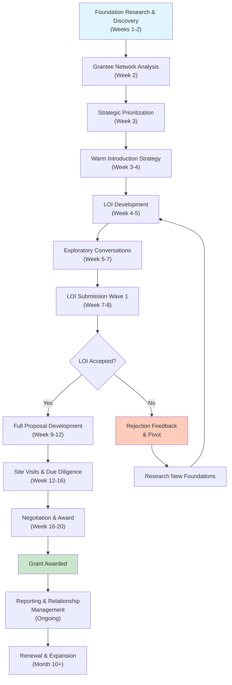
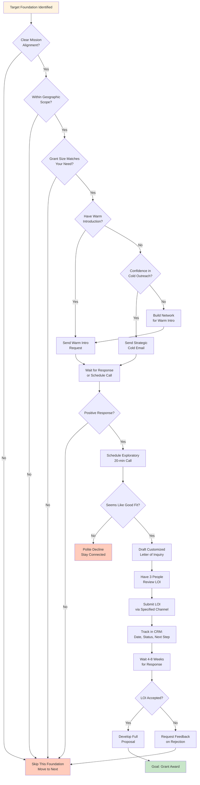

# Foundation Grants (Private/Public) - Zero Equity Funding

## Overview
Private and public foundations provide mission-driven grants to startups aligned with their philanthropic goals. Unlike government grants, these are often more flexible, faster to secure, and relationship-driven. Foundations gave $90B+ in grants in 2024.

## Target Amount Range
- Small family foundations: $5K - $50K
- Mid-size foundations: $50K - $500K
- Large foundations (Gates, Ford, Chan Zuckerberg): $500K - $10M+
- Average startup grant: $100K - $250K

## Foundation Research & Application Workflow (Visual Guide)

### Foundation Discovery to Funding Timeline



### Grant Application Decision Tree



### Foundation Research Process Flowchart

```mermaid
graph LR
    A["Start: Define Your Mission<br/>& Impact Area"] --> B["Database Research<br/>Candid/GuideStar/Instrumentl"]
    B --> C["Filter by:<br/>Cause Area<br/>Geography<br/>Grant Size<br/>Eligibility"]
    C --> D["Review 990-PF Forms<br/>See Recent Grants"]
    D --> E["Analyze Grantee Pattern<br/>Who Gets Funded?"]
    E --> F["Read Foundation<br/>Annual Reports"]
    F --> G["Check Website:<br/>Strategic Plan<br/>Application Process<br/>Deadlines"]
    G --> H["Score Foundation<br/>Mission Fit 1-10<br/>Accessibility 1-10<br/>Grant Size Match 1-10"]
    H --> I["Prioritize Top 15-20<br/>by Combined Score"]
    I --> J["Deep Dive on Top 5<br/>Find Program Officer Names<br/>Check LinkedIn"]
    J --> K["Identify Warm<br/>Introduction Path"]
    K --> L["Create Tracking<br/>Spreadsheet"]
    L --> M["Ready for<br/>Outreach"]

    style A fill:#bbdefb
    style M fill:#a5d6a7
    style B fill:#fff9c4
    style H fill:#ffe0b2
```



## How Top-Tier Founders Identify Opportunities

### 1. Foundation Intelligence Systems
- **Candid/Foundation Directory**: Primary database of 140K+ foundations
- **GuideStar**: Research foundation tax returns (Form 990-PF)
- **Foundation websites**: Direct grant guidelines and priorities
- **Annual reports**: See what they've funded recently

### 2. Pattern Matching Process
- Identify foundations funding similar organizations
- Track foundation program officers' backgrounds
- Notice geographic preferences (many prefer local impact)
- Monitor foundation strategic plan changes

### 3. Insider Intelligence
- Talk to other grantees about their experience
- Attend foundation-hosted events
- Follow foundation leadership on LinkedIn
- Read foundation commissioned research reports

## 12-Step Process

### Step 1: Foundation Research & Mapping (Week 1-2)
**Action**: Build database of 100+ foundations aligned with your mission
- Use Candid to filter by: cause area, geography, grant size
- Review Form 990-PF for recent grants (amounts, recipients)
- Check foundation websites for current priorities
- Note application cycles (many have specific deadlines)

**Deliverable**: Spreadsheet with: Foundation Name, Focus Area, Grant Range, Deadline, Contact, Fit Score

### Step 2: Grantee Network Analysis (Week 2)
**Action**: Map organizations already receiving grants from target foundations
- Identify 5-10 recent grantees per foundation
- Research what made them competitive
- Note common characteristics (stage, sector, approach)
- Find connections to these organizations for warm intros

**Deliverable**: Network map showing relationships and patterns

### Step 3: Strategic Prioritization (Week 3)
**Action**: Rank foundations by three criteria
- **Alignment**: Mission fit (1-10)
- **Accessibility**: Existing connections or cold outreach (1-10)
- **Capacity**: Grant size matches your need (1-10)

Focus on top 15-20 with highest combined scores

**Deliverable**: Prioritized target list with outreach strategy for each

### Step 4: Warm Introduction Strategy (Week 3-4)
**Action**: Leverage network for introductions
- Check LinkedIn for 2nd/3rd degree connections to:
  - Foundation program officers
  - Board members
  - Current/past grantees
- Request specific intros (not generic)
- Prepare 2-sentence ask for connector to use

**Deliverable**: 10+ warm introduction requests sent

### Step 5: Letter of Inquiry (LOI) Development (Week 4-5)
**Action**: Draft compelling 2-3 page LOIs
- Foundation-specific customization (not boilerplate)
- Lead with problem & impact (not your company)
- Demonstrate alignment with foundation values
- Include clear ask and expected outcomes
- Attach 1-page project summary

**Deliverable**: 5-10 customized LOIs ready to send

### Step 6: Exploratory Conversations (Week 5-7)
**Action**: Secure meetings with program officers
- Start with foundations where you have warm intros
- Request 20-minute exploratory calls
- Ask: "What are you most excited to fund right now?"
- Share your work, seek guidance on fit
- Request feedback on LOI before formal submission

**Deliverable**: 5+ exploratory meetings completed, notes documented

### Step 7: LOI Submission Wave 1 (Week 7-8)
**Action**: Submit first round of LOIs
- Send to 5-10 foundations strategically
- Follow each foundation's submission process exactly
- Personalize cover emails
- Confirm receipt within 48 hours
- Note expected response timeline (typically 4-8 weeks)

**Deliverable**: 5-10 LOIs submitted with tracking system

### Step 8: Full Proposal Development (Week 9-12)
**Action**: For LOIs that advance, create full proposals
- Follow foundation's format precisely
- Expand on LOI with detailed methodology
- Include comprehensive budget with justification
- Add letters of support from partners
- Create logic model showing inputs → outputs → outcomes → impact
- Prepare supporting documents (IRS determination letter, audited financials, etc.)

**Deliverable**: 2-5 full proposals submitted

### Step 9: Site Visits & Due Diligence (Week 12-16)
**Action**: Prepare for foundation site visits (if requested)
- Create presentation deck (10-15 slides)
- Prepare team for Q&A
- Show real work/product/impact
- Have beneficiaries or partners available to speak
- Follow up within 24 hours with thank you and any requested materials

**Deliverable**: Site visit materials + follow-up documentation

### Step 10: Negotiation & Award Acceptance (Week 16-20)
**Action**: If grant offered, negotiate terms thoughtfully
- Review grant agreement carefully (restrictions, reporting, IP)
- Negotiate timeline if needed
- Clarify budget flexibility
- Understand allowable expenses
- Confirm reporting requirements

**Deliverable**: Executed grant agreement

### Step 11: Reporting & Relationship Management (Ongoing)
**Action**: Exceed reporting requirements
- Submit reports early and comprehensively
- Include stories alongside data
- Invite foundation to see impact firsthand
- Copy program officer on relevant press/milestones
- Acknowledge foundation publicly (with permission)

**Deliverable**: Quarterly updates + annual reports

### Step 12: Renewal & Expansion Strategy (Month 10+)
**Action**: Convert one-time grants to ongoing support
- Request renewal 6 months before grant ends
- Propose expanded scope or new initiative
- Introduce foundation to peer funders for co-funding
- Invite foundation officers to join advisory board
- Submit for larger/multi-year grants

**Deliverable**: Renewal proposals + expanded partnership

## Systems & Processes

### Foundation CRM
Track in Airtable/Salesforce:
- Foundation details and priorities
- Contact information (program officers, trustees)
- Interaction history (meetings, emails, calls)
- Submission status (LOI sent → under review → proposal requested → awarded)
- Grant terms and reporting deadlines

### Content Library
Maintain reusable components:
- Organization overview (100, 250, 500 words)
- Theory of change / logic model
- Team bios (100-200 words each)
- Letters of support (from partners, beneficiaries, experts)
- Impact stories with photos
- Financial statements and budgets

### Research Process
Weekly habit:
- 1 hour searching Candid for new foundations
- Review 3-5 foundation 990-PFs
- Read 1 foundation annual report
- Attend 1 foundation webinar/event per month

## Messaging Templates

### Warm Introduction Request (to Connector)
```
Subject: Introduction Request - [Foundation Name]

Hi [Connector Name],

Hope you're well! I'm reaching out about a specific introduction.

[Our Company] is working on [one-line mission], currently serving [beneficiary group] with [key metric].

I noticed you're connected to [Program Officer Name] at [Foundation Name]. Given their focus on [specific area], I believe our work in [your focus] could align with their [specific initiative].

Would you be comfortable introducing us? I'd be happy to:
1. Draft a short intro email you can forward (2-3 sentences)
2. Jump on a quick call to give you more context

No pressure if the timing isn't right. Either way, would love to catch up on [something about them].

Thanks for considering!
[Your Name]
```

### Initial Email to Program Officer (Cold)
```
Subject: [Foundation Name] Partnership Inquiry - [Specific Problem Area]

Dear [Program Officer Name],

I'm [Your Name], founder of [Organization], working to [mission in one sentence].

We're addressing [specific problem] for [specific population] in [geography]. In the past [time period], we've [key accomplishment with metric].

I'm reaching out because [Foundation Name]'s commitment to [specific initiative from their website] aligns closely with our work in [your area].

Specifically, we're [unique approach] which has resulted in [measurable outcome].

Questions I'd value your perspective on:
1. Does our focus fit within [Foundation's] current priorities?
2. What would make a compelling case to [Foundation]?
3. Would a brief call to discuss our approach be appropriate?

I've attached a 1-page overview for context.

Thank you for your time and the important work [Foundation] does in [cause area].

Best regards,
[Your Name]
[Title], [Organization]
[Phone] | [Email]
[Website]
```

### Letter of Inquiry (LOI) Opening
```
[Foundation Name]
[Program Officer Name]
[Address]

Re: Letter of Inquiry - [Project Name]: [Compelling Outcome]

Dear [Program Officer/Selection Committee],

[Beneficiary name/story], a [characteristic] in [location], faces [specific challenge]. This story represents [number] individuals in [geography] who [problem statement with data].

[Organization Name] requests $[amount] from [Foundation Name] to [specific project objective] by [timeframe], resulting in [measurable impact].

Our approach:
[Brief description of innovative method/program - 2-3 sentences]

This directly advances [Foundation's] goal of [specific objective from their strategic plan] by [clear connection].

[Continue with: Why now, Why us, What success looks like, The ask]
```

### Post-Award Thank You & Kickoff
```
Subject: Thank You - [Grant Name] Award

Dear [Program Officer Name],

On behalf of [Organization], I'm deeply grateful for [Foundation's] $[amount] grant to support [project name].

This partnership enables us to [specific impact it unlocks] for [beneficiary group].

To ensure strong communication:
- [Team member] will be your primary contact
- We'll provide updates [frequency]
- You're welcome to visit [location] anytime
- We'll share [specific deliverable] by [date]

We're honored by your confidence and committed to exceeding your expectations.

Thank you for believing in this work.

With gratitude,
[Your Name]

P.S. [Specific next step or invitation]
```

### Rejection Response (Staying in Relationship)
```
Subject: Thank You - [Grant Name] Consideration

Dear [Program Officer Name],

Thank you for considering our proposal for [project name]. While disappointed, I deeply appreciate the time [Foundation] invested in reviewing our work.

If possible, I'd welcome any feedback that could strengthen future proposals:
- Areas where our approach didn't align
- Gaps in our methodology or capacity
- Other [Foundation] programs that might be better suited

Regardless, we remain committed to [shared mission] and would love to stay connected with [Foundation's] work in [area].

I'll continue following [Foundation's] initiatives and hope our paths cross again.

With appreciation,
[Your Name]
```

## Success Criteria

### Leading Indicators
- 100+ foundations researched and scored
- 10+ warm introductions secured
- 15+ LOIs submitted per year
- 30%+ LOI → full proposal request rate
- 5+ exploratory conversations per quarter

### Lagging Indicators
- 20-30% proposal → award rate
- $500K - $1M in foundation grants secured (Year 1)
- 3+ multi-year foundation partnerships
- 50%+ renewal rate on expiring grants

## Top-Tier Strategies

### What Elite Founders Do:
1. **Start with story, not stats**: Foundations fund impact on real people
2. **Customize ruthlessly**: Never send generic proposals
3. **Build genuine relationships**: Treat program officers as partners, not ATMs
4. **Invite foundations into your work**: Site visits, events, beneficiary introductions
5. **Report like you care**: Because you should - these are partnerships
6. **Think portfolio**: Help foundations connect with other grantees
7. **Play long game**: A "no" now can become "yes" in 2 years

### Advanced Moves:
- **Foundation consortiums**: Pitch multiple foundations to co-fund large initiatives
- **Challenge grants**: Secure one foundation's match to unlock others
- **Board recruitment**: Invite foundation officers to advisory boards
- **Thought leadership**: Publish research that advances foundation priorities
- **Network weaving**: Introduce foundations to each other around shared interests

### Red Flags to Avoid:
- Applying to foundations with no clear mission alignment
- Ignoring geographic restrictions (many only fund locally)
- Asking for general operating without relationship
- Poor financial transparency
- Weak impact measurement
- Treating foundations transactionally

## Foundation Categories to Target

### 1. Family Foundations
- Often more flexible, relationship-driven
- Look for families with connection to your cause
- May be willing to take more risk on early-stage

**Specific Examples:**
- **Draper Richards Kaplan Foundation** (https://www.drkfoundation.org)
  - Focus: Early-stage social enterprises
  - Grant: $300K over 3 years ($100K/year)
  - Eligibility: Revenue-generating, scalable model, 2-5 years old
  - Application: By invitation only, open call annually
  - Timeline: 6-month selection process

- **Kapor Capital Foundation** (https://www.kaporcenter.org)
  - Focus: Tech for social impact, closing gaps of access
  - Grant: $50K - $500K
  - Eligibility: Tech startups addressing social justice, underrepresented founders
  - Application: Rolling applications via website
  - Timeline: 2-3 months from application to decision

- **Echoing Green** (https://www.echoinggreen.org)
  - Focus: Emerging social entrepreneurs
  - Grant: $90K over 2 years + fellowship
  - Eligibility: Individual leaders, new organizations (0-4 years)
  - Application: Annual open call (opens October)
  - Timeline: 6-month process, cohort announced May

- **Mulago Foundation** (https://www.mulagofoundation.org)
  - Focus: Scalable solutions to poverty
  - Grant: $100K - $400K
  - Eligibility: Evidence of impact, clear scale path
  - Application: By invitation after initial inquiry
  - Timeline: 3-4 months

- **Emerson Collective** (https://www.emersoncollective.com)
  - Focus: Education, immigration, climate, health, social justice
  - Grant: Varies widely, $100K - $5M+
  - Eligibility: High-impact organizations, for-profit social enterprises accepted
  - Application: Direct outreach, no open application
  - Timeline: Relationship-based, 3-12 months

### 2. Corporate Foundations
- Aligned with parent company's business interests
- Often have employee volunteer components
- May offer non-grant support (mentorship, pilot customers)

**Specific Examples:**
- **Google.org** (https://www.google.org)
  - Focus: AI/ML for social good, economic opportunity, crisis response
  - Grant: $100K - $2M (typically $500K+)
  - Eligibility: 501(c)(3) or equivalent, using technology for scale
  - Application: By invitation or through accelerator programs
  - Timeline: 3-6 months
  - Additional: May include Google Cloud credits, employee volunteers

- **Salesforce Foundation** (https://www.salesforce.org)
  - Focus: Education, workforce development, homelessness
  - Grant: $50K - $500K
  - Eligibility: Using technology for impact, Bay Area preference
  - Application: Proposal submission via website
  - Timeline: Quarterly review cycles
  - Additional: Salesforce licenses, consulting support

- **Microsoft Philanthropies** (https://www.microsoft.com/philanthropies)
  - Focus: Digital skills, accessibility, sustainability
  - Grant: Technology donations + cash grants $50K - $500K
  - Eligibility: Nonprofits serving communities in need
  - Application: Regional programs, apply through local Microsoft office
  - Timeline: 2-4 months
  - Additional: Azure credits, software licenses

- **Walmart Foundation** (https://walmart.org)
  - Focus: Sustainability, workforce development, community
  - Grant: $25K - $1M
  - Eligibility: Geographic alignment with Walmart stores
  - Application: Online application system
  - Timeline: 3-month rolling cycles

- **JPMorgan Chase Foundation** (https://www.jpmorganchase.com/impact/our-approach)
  - Focus: Financial health, small business, workforce skills
  - Grant: $100K - $2M
  - Eligibility: Economic mobility focus, data-driven
  - Application: Strategic initiatives, some open calls
  - Timeline: 4-6 months

### 3. Community Foundations
- Geography-specific (city, region, state)
- Often have multiple funds with different focuses
- Great for local startups with regional impact

**Specific Examples:**
- **Silicon Valley Community Foundation** (https://www.siliconvalleycf.org)
  - Focus: Economic security, education, immigration (Bay Area)
  - Grant: $25K - $500K
  - Eligibility: Operating in Santa Clara/San Mateo counties
  - Application: Multiple programs, check website for specific deadlines
  - Timeline: Varies by program, typically 3-4 months

- **New York Community Trust** (https://www.nycommunitytrust.org)
  - Focus: NYC-based nonprofits across multiple sectors
  - Grant: $10K - $250K
  - Eligibility: NYC operations, 2+ years operating history
  - Application: Letter of inquiry, then full proposal
  - Timeline: 4-6 months

- **Chicago Community Trust** (https://www.cct.org)
  - Focus: Chicagoland issues - education, arts, health
  - Grant: $15K - $200K
  - Eligibility: Cook County focus
  - Application: Online portal, specific program deadlines
  - Timeline: Quarterly board meetings

- **Boston Foundation** (https://www.tbf.org)
  - Focus: Greater Boston equity, opportunity
  - Grant: $25K - $300K
  - Eligibility: Boston metro area impact
  - Application: Invitation-based for larger grants
  - Timeline: 3-5 months

- **California Community Foundation** (https://www.calfund.org)
  - Focus: LA County issues
  - Grant: $10K - $500K
  - Eligibility: LA County operations
  - Application: Multiple funds with different processes
  - Timeline: Varies, typically quarterly cycles

### 4. Operating Foundations
- Run their own programs but also fund others
- Look for collaborative opportunities
- May offer more than money (expertise, network)

**Specific Examples:**
- **Chan Zuckerberg Initiative** (https://chanzuckerberg.com)
  - Focus: Science, education, justice & opportunity
  - Grant: $250K - $10M+ (often larger commitments)
  - Eligibility: High-impact potential, both nonprofit and for-profit
  - Application: Strategic outreach, some open calls
  - Timeline: 3-12 months, relationship-based
  - Additional: Technical support, network access

- **Skoll Foundation** (https://www.skollfoundation.org)
  - Focus: Large-scale social change
  - Grant: $1.5M over 3 years
  - Eligibility: Proven social entrepreneurs, 5+ years track record
  - Application: Nomination process (no direct applications)
  - Timeline: Year-round evaluation
  - Additional: Skoll World Forum access, strategic support

- **Omidyar Network** (https://www.omidyar.com)
  - Focus: Digital identity, civic tech, property rights, financial inclusion
  - Grant/Investment: $500K - $5M (grants and equity)
  - Eligibility: Systems-change focus, both nonprofit and for-profit
  - Application: Submit inquiry via website
  - Timeline: 4-8 months
  - Additional: Network connections, follow-on funding

- **MacArthur Foundation** (https://www.macfound.org)
  - Focus: Climate, nuclear risk, criminal justice, journalism
  - Grant: $100K - $5M (typically multi-year)
  - Eligibility: Established organizations, strategic alignment
  - Application: By invitation for most programs
  - Timeline: 6-12 months
  - Additional: 100&Change competition ($100M single grant)

- **Rockefeller Foundation** (https://www.rockefellerfoundation.org)
  - Focus: Health, food, power, work, cities
  - Grant: $500K - $10M
  - Eligibility: Systems-level change, global impact
  - Application: Strategic partnerships, some open calls
  - Timeline: 6-12 months

### 5. Issue-Specific Foundations
- Deeply focused on single cause area
- Become expert in that ecosystem

**Specific Examples:**
- **Bill & Melinda Gates Foundation** (https://www.gatesfoundation.org)
  - Focus: Global health, development, US education
  - Grant: $1M - $50M+ (typically very large)
  - Eligibility: Proven scale potential, rigorous evaluation
  - Application: By invitation, strategic initiatives
  - Timeline: 6-18 months
  - Additional: Global network, technical expertise

- **Lumina Foundation** (https://www.luminafoundation.org)
  - Focus: Postsecondary learning and credentials
  - Grant: $100K - $3M
  - Eligibility: Increasing postsecondary attainment
  - Application: Strategic grantmaking, some open calls
  - Timeline: 4-8 months

- **Robert Wood Johnson Foundation** (https://www.rwjf.org)
  - Focus: Health equity, public health
  - Grant: $100K - $5M
  - Eligibility: Building Culture of Health
  - Application: Open calls and strategic initiatives
  - Timeline: Varies by program, 3-9 months
  - Additional: Evidence generation support

- **Open Society Foundations** (https://www.opensocietyfoundations.org)
  - Focus: Democracy, human rights, justice
  - Grant: $50K - $2M
  - Eligibility: Advancing open society values
  - Application: Regional offices, varied processes
  - Timeline: 3-6 months

- **Ford Foundation** (https://www.fordfoundation.org)
  - Focus: Social justice across multiple issues
  - Grant: $200K - $10M+ (typically multi-year)
  - Eligibility: Systems change, equity focus
  - Application: By invitation, strategic initiatives
  - Timeline: 6-12 months

- **Knight Foundation** (https://www.knightfoundation.org)
  - Focus: Journalism, arts, communities (26 US cities)
  - Grant: $50K - $2M
  - Eligibility: Geographic focus on Knight communities
  - Application: Open calls + strategic initiatives
  - Timeline: 4-6 months
  - Additional: Knight News Challenge (innovation competition)

- **Arnold Ventures** (https://www.arnoldventures.org)
  - Focus: Criminal justice, education, health, public finance
  - Grant: $250K - $5M
  - Eligibility: Evidence-based solutions, policy change
  - Application: Submit inquiry via website
  - Timeline: 4-8 months

### 6. Tech-Focused Impact Foundations

**Specific Examples:**
- **Schmidt Futures** (https://www.schmidtfutures.com)
  - Focus: Science, tech for public benefit, talent development
  - Grant: $500K - $10M
  - Eligibility: Ambitious projects, emerging talent
  - Application: Strategic outreach
  - Timeline: Variable, 3-12 months

- **Patrick J. McGovern Foundation** (https://www.mcgovern.org)
  - Focus: Data & AI for social impact
  - Grant: $100K - $1M
  - Eligibility: Using data/AI for public benefit
  - Application: Open submissions
  - Timeline: 3-6 months

- **Mozilla Foundation** (https://foundation.mozilla.org)
  - Focus: Internet health, trustworthy AI
  - Grant: $50K - $300K
  - Eligibility: Open internet, responsible tech
  - Application: Various programs, check website
  - Timeline: 2-4 months

### 7. Accelerator-Based Foundations

**Specific Examples:**
- **Fast Forward** (https://www.ffwd.org)
  - Focus: Tech nonprofits (any social issue)
  - Grant: $80K cash + $300K+ in services
  - Eligibility: Tech-enabled nonprofits, early traction
  - Application: Rolling applications, 2 cohorts/year
  - Timeline: 3-month application process
  - Additional: 6-month intensive program, mentorship

- **New Profit** (https://www.newprofit.org)
  - Focus: Education, economic mobility, public health
  - Grant: $150K - $500K over 3 years
  - Eligibility: Scaling social enterprises
  - Application: Nomination or direct application
  - Timeline: 6-month process
  - Additional: Strategic support, network access

- **Rainer Arnhold Fellows** (https://www.rafellows.org)
  - Focus: Early-stage social entrepreneurs in East/Southeast Asia
  - Grant: $100K over 2 years
  - Eligibility: Asia-based, revenue-generating model
  - Application: Annual open call
  - Timeline: 6-month selection
  - Additional: Fellowship, network

## Detailed Eligibility Criteria by Foundation Type

### Legal Structure Requirements
**What Foundations Accept:**
- **Most Foundations**: 501(c)(3) nonprofits only
- **Progressive Foundations**: 501(c)(3), 501(c)(4), fiscal sponsorship arrangements
- **Impact-First Foundations**: Nonprofits + for-profit social enterprises (B-Corps, PBCs)
- **International**: Local nonprofit registration or fiscal sponsorship

**Fiscal Sponsorship Options:**
If you're for-profit or pre-501(c)(3):
- **Social Good Fund** (https://www.socialgoodfund.org) - 10% fee, fast setup
- **Tides Foundation** (https://www.tides.org) - 8-12% fee, established reputation
- **Fractured Atlas** (https://www.fracturedatlas.org) - 8% fee, arts/culture focus
- **Mission Edge** (https://www.missionedge.org) - Regional, San Diego focus

### Organizational Maturity Requirements

**Very Early Stage (0-2 years):**
- Echoing Green Fellowship
- Draper Richards Kaplan (minimum 1 year)
- Fast Forward
- Kapor Capital Foundation
- Many family foundations (relationship-dependent)

**Early Growth (2-5 years):**
- Most family and corporate foundations
- Community foundations
- Accelerator-based programs
- Operating foundations (some)

**Established (5+ years):**
- Major operating foundations (Skoll, Ashoka)
- Large issue-specific foundations
- Multi-year, multi-million commitments
- Leadership/mature-stage programs

### Revenue & Budget Requirements

**Pre-Revenue Accepted:**
- Echoing Green
- Some family foundations
- Accelerator programs
- Early-stage focused foundations

**Revenue-Generating Required:**
- Draper Richards Kaplan ($25K+ annual revenue)
- Mulago Foundation (evidence of earned revenue model)
- Most operating foundations
- Corporate foundations (often prefer)

**Budget Size Matching:**
- Organizations with <$100K budget: Community foundations, small family foundations
- $100K-$500K budget: Mid-size family, corporate foundations
- $500K-$2M budget: Large family, most corporate, some operating
- $2M+ budget: Major operating foundations, large grants from Gates/Ford/etc.

### Geographic Restrictions

**Community Foundations:**
- Must serve the specific city/county/region
- May require physical presence or office
- Often prefer organizations founded locally

**National Foundations with Regional Preferences:**
- Knight Foundation: 26 specific US cities
- Casey Foundation: Child welfare nationally, but some Baltimore-specific
- Many corporate foundations: Near headquarters or major offices

**Global Foundations:**
- Gates Foundation: Developing countries focus (health/agriculture)
- Open Society: Specific countries/regions
- Ford Foundation: Global but regional offices

**No Geographic Restrictions:**
- Many family foundations
- Tech-focused foundations
- Issue-specific foundations (depending on issue)

### Impact Measurement Requirements

**Minimal Requirements (Story-Based):**
- Small family foundations
- Early-stage grants
- Pilot/innovation grants

**Moderate Requirements:**
- Clear logic model
- Baseline and target metrics
- Quarterly/annual reporting
- Most mid-size grants

**Rigorous Requirements:**
- Randomized controlled trials (RCTs) or quasi-experimental design
- Third-party evaluation
- Cost-effectiveness analysis
- Gates Foundation, Arnold Ventures, evidence-based funders

### Common Automatic Disqualifiers

**Will Cause Rejection:**
- Religious proselytizing (most secular foundations)
- Political campaigning (501c3 restrictions)
- Individual scholarships/benefits (most foundations fund organizations, not individuals)
- Fundraising events/sponsorships (foundations fund programs, not events)
- Existing deficits or debt (financial instability signals)
- Legal/regulatory issues
- Discrimination of any kind
- No clear mission alignment

## Common Pitfalls & How to Avoid Them

### Pitfall #1: Spray and Pray Applications
**Mistake**: Sending generic proposals to 100+ foundations without customization
**Cost**: Wastes months, damages reputation, 0-2% success rate
**Fix**:
- Research deeply: 15-20 well-matched foundations
- Customize every application (reference their recent grants, strategic plan, specific language)
- Quality over quantity: 15 customized > 100 generic

**Real Example**: A nonprofit sent identical proposals to 83 foundations. Result: 0 grants, blacklisted by program officers who talk to each other. After pivoting to researched, customized approach to 12 foundations: 4 grants totaling $340K.

### Pitfall #2: Asking Too Large, Too Soon
**Mistake**: Requesting $500K from foundation when you have no relationship and $200K budget
**Cost**: Immediate rejection, lose chance to build relationship
**Fix**:
- First grant: Request 10-25% of your annual budget
- Build relationship over 2-3 years
- Grow grant size as you prove impact

**Real Example**: Startup asked Gates Foundation for $5M with 18-month track record. Rejected. Competitor started with $150K pilot from smaller foundation, demonstrated results, scaled to $600K, then $3M from Gates three years later.

### Pitfall #3: Ignoring Application Instructions
**Mistake**: Submitting 15-page proposal when guidelines say "2-page LOI"
**Cost**: Auto-rejection, signals inability to follow directions
**Fix**:
- Read guidelines 3 times
- Create checklist of requirements
- Have someone else verify compliance
- When in doubt, email program officer to clarify

**Real Example**: Foundation received 300 applications, 40% were immediately rejected for non-compliance (wrong format, missed deadline, exceeded page limit). The review committee never saw these proposals.

### Pitfall #4: Leading with Your Organization, Not the Problem
**Mistake**: "We are a 501c3 founded in 2020 by three graduates of..."
**Cost**: Program officer stops reading after first paragraph
**Fix**:
- Start with compelling problem and who it affects
- Demonstrate deep understanding of issue
- Position your solution as response to problem
- Mention your organization in context of solution

**Template**:
"In [geography], [number] people face [specific problem], resulting in [concrete consequence]. Traditional approaches have failed because [insight]. [Your organization] addresses this through [unique approach], achieving [specific result]."

### Pitfall #5: Weak or Missing Impact Metrics
**Mistake**: "We will help many people" or "We'll increase awareness"
**Cost**: Impossible to evaluate, compare, or justify funding
**Fix**:
- Specific, measurable outcomes: "Increase employment rate among participants from 12% to 45%"
- Include baseline, target, timeframe
- Show how you'll measure (surveys, administrative data, etc.)
- Demonstrate cost-effectiveness when possible

**Real Example**: Two education nonprofits applied to same foundation:
- Org A: "We'll improve student outcomes" → Rejected
- Org B: "We'll increase 9th-grade math proficiency from 23% to 51% (127 students), measured via state assessments, at $1,200/student" → Funded $152K

### Pitfall #6: Requesting General Operating Support Without Relationship
**Mistake**: First application asks for unrestricted funds
**Cost**: 95%+ rejection rate for cold general operating requests
**Fix**:
- First grant: Specific program/project
- Build relationship over 1-2 years
- Demonstrate results and strong management
- Then request operating support as trusted partner

**Exception**: Some foundations (Ford, MacArthur) explicitly offer general support, but typically to established relationships.

### Pitfall #7: Poor Budget Justification
**Mistake**: Budget is just numbers with no narrative explanation
**Cost**: Questions about financial management, unclear use of funds
**Fix**:
- Explain every line item
- Show why costs are reasonable (market research, comparables)
- Indicate what's covered by other sources vs. this grant
- Include both program costs and reasonable overhead (15-25%)
- Address the "fully loaded cost" (salary + benefits + space + overhead)

**Budget Narrative Example**:
"Program Director (0.5 FTE): $45,000. This covers 50% of the Director's time, who will oversee program implementation, manage partnerships, and ensure quality. Salary is based on Nonprofit HR's 2024 data for comparable roles in [city]. The remaining 50% is covered by [other funder]."

### Pitfall #8: Ignoring the Foundation's Actual Priorities
**Mistake**: Applying because foundation funds "education" but missing that they specifically fund "postsecondary STEM for women"
**Cost**: Waste of time, clear signal you didn't do homework
**Fix**:
- Read foundation's strategic plan
- Analyze recent grants (who got funded, for what, how much)
- Look for specific language they use repeatedly
- Identify their theory of change
- Apply only if you genuinely align

**Tool**: Use Candid's Foundation Directory to see foundation's recent grants by year, amount, and recipient.

### Pitfall #9: No Warm Introduction Strategy
**Mistake**: Sending cold applications to competitive foundations
**Cost**: 90%+ of cold applications rejected vs. 30-40% of warm intros rejected
**Fix**:
- Spend 50% of effort on networking and relationship-building
- Attend foundation events
- Get intros through board members, advisors, other grantees
- Build relationship before asking

**Networking Strategy**:
1. Identify target foundation
2. Search LinkedIn for connections to program officers or trustees
3. Ask for informational interview (not asking for money yet)
4. Learn about foundation's priorities and process
5. Ask if your work seems aligned
6. Request guidance on application
7. Submit application with relationship established

### Pitfall #10: Forgetting to Build a Pipeline
**Mistake**: Applying to 5 foundations, waiting 6 months for results, then starting over
**Cost**: Gaps in funding, crisis mode fundraising
**Fix**:
- Build rolling pipeline: Always have 10-15 applications in various stages
- Weekly habit: Research 3 new foundations, submit 1-2 applications, follow up on 2-3 pending
- Track in CRM: Foundation name, stage, next action, expected decision date
- Plan for 6-9 month lag from application to funding

**Pipeline Model**:
- Month 1: Research 20 foundations, submit 5 LOIs
- Month 2: Submit 5 more LOIs, 2 full proposals from Month 1
- Month 3: Submit 5 more LOIs, 3 full proposals
- Month 4: First grants awarded (if lucky), continue cycle
- Result: Steady stream of decisions, not feast/famine

### Pitfall #11: Failing to Follow Up
**Mistake**: Submit application and wait passively
**Cost**: Missed opportunities to strengthen application, lack of relationship
**Fix**:
- Confirm receipt within 48 hours of submission
- Ask about timeline and next steps
- Offer to provide additional information
- Send relevant updates (new partnership, press, results) during review period
- For rejections: Ask for feedback, maintain relationship

**Follow-Up Email (2 weeks after submission)**:
"Dear [Program Officer], I wanted to confirm receipt of our LOI submitted on [date] for [project name]. Please let me know if you need any additional information. We recently [relevant update that strengthens case]. Looking forward to hearing from you."

### Pitfall #12: Neglecting Reporting After Grant Awarded
**Mistake**: Minimal effort on grant reports, seeing it as burden
**Cost**: Lose renewal opportunity, damage reputation, foundation tells peers
**Fix**:
- View reporting as marketing for next grant
- Submit early (not on deadline day)
- Include stories alongside data
- Show unexpected learnings or pivots
- Acknowledge challenges honestly
- Invite program officer to see work firsthand
- Go beyond minimum requirements

**Stellar Report Elements**:
- Executive summary (1 paragraph)
- Quantitative results vs. targets
- Qualitative stories with photos
- Challenges encountered and how addressed
- Lessons learned
- Financial report (spending vs. budget)
- Next steps and sustainability plan
- Public acknowledgment of foundation (with permission)

## Case Studies: Successful Foundation Grant Stories

### Case Study #1: Education Tech Nonprofit → $2.4M Over 3 Years

**Organization**: CodePath (teaching computer science to underrepresented students)

**Journey**:
- Year 1: Secured $50K from Kapor Capital Foundation after warm intro from advisor
- Used first grant to demonstrate 85% course completion rate
- Year 2: Kapor increased to $150K, introduced CodePath to other funders
- Applied to 12 foundations with Kapor's validation, funded by 4 ($600K total)
- Year 3: Google.org $1M grant based on proven results (2,000+ students)
- Year 4: Multi-year renewals from original funders

**Success Factors**:
- Started with aligned foundation (Kapor's focus on diversity in tech)
- Measured and reported outcomes rigorously
- Leveraged first funder to access others
- Built trust before asking for larger amounts
- Created compelling case studies and data

**Key Metric**: Cost per successful student completion: $450 (foundations could compare to alternatives)

### Case Study #2: Health Nonprofit → Gates Foundation $15M

**Organization**: Last Mile Health (community health workers in remote areas)

**Journey**:
- Year 1-3: Small grants from family foundations ($25K-$100K) to pilot model in Liberia
- Year 4: Published results in peer-reviewed journal (key credibility move)
- Year 5: Applied to Skoll Foundation, won $1.5M over 3 years
- Year 6: Participated in Clinton Global Initiative, showcased model
- Year 7: Gates Foundation reached out based on published evidence
- Year 8: First Gates grant $3M for expansion
- Year 10: Gates $15M for scale to multiple countries

**Success Factors**:
- Built evidence base before approaching major funders
- Published in respected venues (Lancet, Health Affairs)
- Demonstrated cost-effectiveness vs. traditional approaches
- Government partnerships showed sustainability path
- Patient multi-year relationship building

**Key Metric**: Reduced child mortality by 25% in service areas at $6/person/year

### Case Study #3: Climate Tech Nonprofit → $800K in First Year

**Organization**: BlocPower (electrifying buildings in underserved communities)

**Journey**:
- Started as for-profit, hit ceiling with impact investors wanting faster returns
- Launched affiliated 501(c)(3) with fiscal sponsor (Social Good Fund)
- Month 1-2: Researched 40 climate-focused foundations
- Month 3: Applied to 8 foundations with clear mission fit
- Month 4-6: Won first two grants ($50K each) from family foundations
- Month 7: Used early wins to approach larger foundations
- Month 9: Secured $200K from JPMorgan Chase Foundation (financial inclusion angle)
- Month 11: Won $500K from Rockefeller Foundation (cities/climate focus)
- Year 2: Converted to full 501(c)(3), scaled to $3M+ in foundation grants

**Success Factors**:
- Identified multiple "angles" for foundation fit (climate, equity, cities, finance)
- Used fiscal sponsorship to access funding before full 501(c)(3)
- Started small to build track record quickly
- Demonstrated business model innovation with social impact
- Strong founder story (CEO from low-income background, personal connection to issue)

**Key Metric**: Reduced energy costs by 30-50% for low-income households while eliminating fossil fuel use

### Case Study #4: International Development → Failed Then Succeeded

**Organization**: [Anonymous, educational purpose]

**First Attempt (FAILED)**:
- Year 1: Applied to 45 foundations with generic "water access in Africa" proposals
- Results: 2 responses (both rejections), 43 no response
- Total raised: $0
- Problem: No focus, no differentiation, no evidence

**Pivot Strategy**:
- Narrowed focus: "Solar-powered water purification in rural Rwanda"
- Ran 6-month pilot with personal funds: 400 people served, water-borne illness down 60%
- Created 3-minute video of beneficiary testimonials
- Identified 12 foundations focused specifically on Rwanda or water innovation

**Second Attempt (SUCCEEDED)**:
- Year 2: Applied to 12 highly-targeted foundations with pilot data
- Results: 6 grants totaling $420K
- Average grant: $70K
- Success rate: 50%

**Success Factors**:
- Specificity over breadth
- Evidence before asking
- Visual storytelling (video)
- Deep research on foundation priorities
- Demonstrated problem-solving ability

**Lesson**: Failed broad approach taught them to focus. Lost 1 year but gained clarity.

### Case Study #5: Arts Nonprofit → Strategic Foundation Portfolio

**Organization**: 826 National (youth writing and tutoring)

**Multi-Foundation Strategy**:
- **Family Foundations** ($25K-$100K): Cover local programs, relationship-based, multi-year renewals
- **Corporate Foundations** ($50K-$150K): Google.org, Salesforce (tech for education angle)
- **Community Foundations** ($15K-$75K): Bay Area (headquarters), chapters in other cities
- **Operating Foundations** ($200K-$500K): Hewlett Foundation, Stupski Foundation
- **Government Grants** (separate): AmeriCorps, Education Department (not foundation)

**Portfolio Approach**:
- Diversification: No single funder > 15% of budget
- Staggered renewals: Not all grants expire same year
- Different asks: Some for general support, some for specific programs, some for expansion
- Multi-year commitments: 60% of foundations on 2-3 year cycles
- Active relationship management: Program officer visits, impact reports, volunteer opportunities

**Result**: $4M+ annually from 40+ foundations, highly stable funding base

**Key Strategy**: Treated foundation fundraising like investment portfolio management - diversification, renewal rates, risk management.

## Advanced Success Tips from Elite Foundation Fundraisers

### Tip #1: The "Lighthouse" Strategy
**Concept**: Win one prestigious foundation, then use that as beacon to attract others

**How to Execute**:
1. Identify the most prestigious foundation in your cause area (Gates for global health, Ford for justice, etc.)
2. Build multi-year strategy to become fundable by them (evidence, scale, etc.)
3. Once funded, prominently feature this in all materials
4. Other foundations see you as "validated" and become more interested

**Example**: "Gates Foundation grantee since 2022" opens doors everywhere in global health

### Tip #2: The "Consortium" Play
**Concept**: Approach 3-5 foundations simultaneously to co-fund large initiative

**How to Execute**:
1. Design ambitious multi-year initiative ($2M-$10M)
2. Identify 3-5 foundations who could each fund portion
3. Approach all simultaneously with: "We're inviting X foundations to co-fund this initiative. Currently [Foundation A] and [Foundation B] are evaluating. Would you like to join?"
4. Creates urgency and validation through peer effect
5. Each foundation sees they're not taking full risk

**Template Email**:
"We're launching [initiative] to [impact]. Total cost: $3M over 3 years. We're inviting 3-5 leading foundations to co-fund ($500K-$1M each). [Foundation X] has indicated strong interest. Would [Your Foundation] like to evaluate participation? Co-funders will be publicly recognized and receive [benefits]."

**Note**: Only do this if you have at least one foundation truly interested. Do NOT fabricate interest.

### Tip #3: Challenge Grant Leverage
**Concept**: One foundation agrees to match others' contributions, multiplying fundraising

**How to Execute**:
1. Secure commitment from one foundation: "We'll give you $200K if you raise $200K from others"
2. Use this to fundraise: "Your $50K unlocks $50K match from [Foundation]"
3. Doubles effectiveness of every dollar raised
4. Foundations more likely to give when matched

**Best Practice**: Approach your closest foundation partner for challenge grant, then use with newer foundations.

### Tip #4: The "Graduation" Strategy
**Concept**: Plan to move "up" from smaller to larger foundations over time

**Progression Path**:
- Years 1-2: Family foundations, community foundations ($10K-$50K)
- Years 3-4: Larger family, corporate foundations ($50K-$250K)
- Years 5-6: Operating foundations ($250K-$1M)
- Years 7+: Major operating foundations ($1M+)

**Key**: As you move up, maintain relationships with earlier funders. They become your "reference accounts" for larger foundations.

### Tip #5: Board-Funder Alignment
**Concept**: Recruit board members with foundation connections

**Strategy**:
1. When recruiting board members, consider their foundation networks
2. Ask during recruitment: "What foundations might you have connections to?"
3. Once on board, leverage for warm introductions
4. Board members can often open doors that staff cannot

**Board Member Profile to Seek**:
- Previously served on foundation boards
- Former program officers
- Well-connected in philanthropic community
- Personal relationships with family foundations

### Tip #6: The "Published Research" Door-Opener
**Concept**: Publish your findings in respected venues to attract foundation attention

**Execution**:
1. Conduct rigorous evaluation of your program
2. Submit findings to:
   - Peer-reviewed academic journals
   - Stanford Social Innovation Review
   - Brookings, Urban Institute, etc. (policy think tanks)
   - Foundation-commissioned reports
3. Foundations often source grantees from published research
4. Positions you as thought leader, not just service provider

**Example**: Publish "New Model for X Reduces Y by 40%" → Foundations contact YOU

### Tip #7: The "Adjacent Foundation" Research
**Concept**: Find foundations by looking at who funds similar organizations

**Process**:
1. Identify 5-10 organizations similar to yours (mission, size, geography)
2. Research who funds them (Candid database, their websites, 990s)
3. Create master list of all foundations that fund similar work
4. These foundations have already decided your cause area is worth funding
5. Your pitch: "You fund [Similar Org], we're addressing same issue with [your unique approach]"

**Tool**: Candid's "Find funders by grantees" feature

### Tip #8: Program Officer Relationship Protocol
**Concept**: Treat program officers as long-term partners, not transactions

**Relationship Best Practices**:
- Learn about them personally (background, interests, career path)
- Connect them to others in your network (be a resource TO them)
- Invite to events even when not asking for money
- Acknowledge them publicly (with permission) when you win grant
- Introduce them to peer organizations doing related work
- Ask for advice, not just money
- Respect their time (concise emails, prepared meetings)
- Follow up on conversations ("You mentioned interest in X, here's article I found")

**Mindset Shift**: You're building relationship with foundation, which outlasts any single program officer, but individual relationships matter enormously.

### Tip #9: The "Rejected Grant" Recovery
**Concept**: Turn rejections into future opportunities

**When Rejected**:
1. Thank them for consideration (email within 24 hours)
2. Request feedback call: "Could you spare 15 minutes to help me understand how to strengthen future proposals?"
3. On call, ask:
   - Where did proposal fall short?
   - What made funded proposals stronger?
   - Are there other foundation programs that might fit better?
   - Would you be open to re-application in future with changes?
4. Make suggested improvements
5. Follow up in 6 months with progress update (not asking for money)
6. Re-apply when appropriate (1-2 years)

**Success Rate**: Organizations that follow this protocol have 30-40% success on second application vs. 5-10% for those who don't.

### Tip #10: The "Unrestricted Funding" Long Game
**Concept**: Multi-year path to unrestricted operating support

**Year-by-Year Progression**:
- **Year 1**: Win restricted grant for specific program ($50K)
- **Year 2**: Report exceptional results, request renewal ($75K same program)
- **Year 3**: Ask to expand to related program ($100K, still restricted)
- **Year 4**: Request partial unrestricted: "$150K, 60% for [program], 40% for operational capacity"
- **Year 5**: Request fully unrestricted: "$150K general operating support"

**Rationale You'll Use**: "You've seen our results over 4 years. We'd be even more effective with flexibility to deploy resources where most needed."

**Success Rate**: 70%+ for organizations that build trust over 3-4 years before asking for unrestricted.

## Foundation Search Tools & Platforms (2024+ Directory)

### Primary Foundation Databases

#### **Tier 1: Industry Standard - Comprehensive Database Platforms**

1. **Candid/Foundation Directory** (https://candid.org)
   - Database: 140,000+ US foundations
   - Features: Advanced filtering, 990-PF analysis, grant tracking
   - Cost: $149-$399/month ($10K+ for enterprise)
   - Best for: Serious fundraisers, comprehensive research
   - 2024 Update: Expanded AI-powered matching features
   - Free option: 7-day trial, limited searches

2. **Instrumentl** (https://www.instrumentl.com)
   - Database: 200,000+ grants (federal + foundation)
   - Features: AI-powered matching, deadline alerts, proposal management
   - Cost: $149/month (Pro tier)
   - Best for: Tech-savvy teams, automated alerts
   - 2024 Update: Enhanced AI matching algorithm, integrates with Salesforce
   - Free option: 14-day trial

3. **GrantWatch** (https://www.grantwatch.com)
   - Database: 300,000+ opportunities (all funding types)
   - Features: Daily email alerts, opportunity alerts, research tools
   - Cost: $44/month (Foundation Only: $34/month)
   - Best for: Budget-conscious, staying current on new opportunities
   - 2024 Update: Improved filtering for impact-focused foundations
   - Free option: Limited search results

4. **GrantStation** (https://www.grantstation.com)
   - Database: 60,000+ grants and 45,000+ foundations
   - Features: Comprehensive guides, state-specific resources, proposal samples
   - Cost: $99/month or $990/year
   - Best for: Learning + research combination, nonprofit-focused
   - 2024 Update: Added interactive webinars, peer benchmarking
   - Free option: Resource library with some content

#### **Tier 2: Specialized Foundation Research Tools**

5. **ProPublica Foundation Explorer** (https://projects.propublica.org/nonprofits/)
   - Database: 100,000+ foundations (free access to IRS data)
   - Features: 990 forms, grant histories, searchable database
   - Cost: FREE
   - Best for: Due diligence, researching specific foundations, free alternative
   - 2024 Update: Enhanced search functionality, modern UI
   - Limitation: Less advanced filtering than paid platforms

6. **GiveWell** (https://www.givewell.org)
   - Focus: Highly vetted foundations and giving opportunities
   - Features: Foundation recommendations, impact research
   - Cost: FREE
   - Best for: Understanding high-impact giving, researching funder values
   - 2024 Update: Expanded international foundation reviews

7. **Foundation Center / Candid Foundation Directory** (Legacy: https://foundationcenter.org)
   - Note: Foundation Center merged with GiveWell, now part of Candid
   - Archive: Still accessible for historical foundation data
   - Cost: Varies

8. **GrantSource** (https://www.grantsource.org)
   - Database: 50,000+ foundations and grants
   - Features: Targeted research, funding alerts, proposal management
   - Cost: $115-$225/month
   - Best for: Organizations wanting hands-on support + tool
   - 2024 Update: Improved dashboard, mobile app

#### **Tier 3: Niche & Specialized Platforms**

9. **Giving USA Insights** (https://givingusa.org)
   - Focus: Philanthropic trends, foundation giving data
   - Features: Annual philanthropy reports, foundation trends
   - Cost: Various (reports $15-$50)
   - Best for: Understanding market trends, sector-specific insights
   - 2024 Update: New data on impact investing foundations

10. **Guidestar** (Now Part of Candid - https://www.guidestar.org)
    - Features: Nonprofit profiles, foundation research
    - Cost: Varies (now integrated into Candid offerings)
    - Best for: Looking up other organizations, benchmarking

11. **Chronicle of Philanthropy Database** (https://www.philanthropy.com)
    - Focus: News, rankings, foundation insights
    - Features: Interactive databases of top foundations
    - Cost: $99/year subscription
    - Best for: Staying informed on funder landscape, largest grant announcements
    - 2024 Update: New interactive philanthropy tracker

12. **Inside Philanthropy** (https://www.insidephilanthropy.com)
    - Focus: Foundation profiles, strategy insights, news
    - Features: Foundation rankings, program officer profiles
    - Cost: $99-$199/year (free articles + premium)
    - Best for: Understanding funder decision-making, program officer moves

#### **Tier 4: International & Specialized Focus**

13. **Worldwide Foundation Directory** (https://www.worldwidepeerencyclopedia.com)
    - Database: 50,000+ foundations globally
    - Features: International foundation listings
    - Cost: Premium access required
    - Best for: Global organizations, international expansion

14. **Association of Charitable Foundations (UK)** (https://www.acf.org.uk)
    - Database: UK and European foundations
    - Features: Funder directory, resources
    - Cost: Varies
    - Best for: UK/European expansion

### Foundation Search Tools by Use Case

#### **For Finding "Hidden Gem" Foundations (Family Foundations)**
- Candid Foundation Directory (filter by foundation type + size)
- GrantWatch (email alerts for lesser-known funders)
- Search IRS 990-N database directly at (https://www.irs.gov/charities-non-profits/form-990-series-downloads)

**Pro Tip**: Family foundations often aren't on radar because they're smaller and less marketed. Go 3 pages deep in Candid results - you'll find many below $50M that fund very specifically.

#### **For Staying Current on New Foundation Trends (2024+)**
- Instrumentl (AI alerts for emerging funders)
- GrantWatch (daily new opportunity emails)
- Chronicle of Philanthropy (weekly newsletter)
- Inside Philanthropy (email digest of funder moves)

#### **For Competitive Intelligence**
- ProPublica Foundation Explorer (research competitor grantees' funders)
- Candid's "Find funders by grantee" feature
- Google Scholar (search "grant recipient [organization name]")

#### **For Program Officer & Trustee Research**
- LinkedIn (search program officer names)
- Foundation websites (staff directory)
- Chronicle of Philanthropy (program officer moves section)
- Candid (some profiles include staff info)

#### **For Cost-Conscious Teams**
- ProPublica Foundation Explorer (free)
- GiveWell (free)
- IRS Foundation Directory (free)
- Google Drive spreadsheet (free) - create your own searchable database

### Integrated Search Strategy (2024 Best Practice)

**Recommended Tech Stack for Teams:**
```
1. Candid or Instrumentl (primary research tool)
   ↓
2. ProPublica Foundation Explorer (verify/due diligence)
   ↓
3. Airtable/Salesforce (track in CRM)
   ↓
4. LinkedIn (research program officers)
   ↓
5. Foundation websites directly (confirm current priorities)
   ↓
6. GrantWatch alerts (stay current on new funders)
```

### Red Flags: Tools to Avoid

**Be Cautious of:**
- Platforms charging $500+/month without significant additional value
- Databases claiming 10M+ "funding opportunities" (bloat, includes expired opportunities)
- Tools without clear filtering by foundation type, geography, size
- Platforms that don't integrate with CRM systems
- Services promising "guaranteed grants" (doesn't exist)

## Step-by-Step Guide: Finding & Applying to Foundations

### Phase 1: Foundation Discovery (Weeks 1-2)

#### Step 1: Define Your Funding Profile
Before you start searching, clarify what you're seeking:
- **Grant amount**: How much do you need? ($10K, $100K, $500K+?)
- **Geographic focus**: Where do you operate? (Local, regional, national, global?)
- **Mission area**: What's your primary focus? (Education, health, environment, etc.)
- **Organization stage**: How long have you existed? (Pre-revenue, 0-2 years, 2-5 years, 5+ years)
- **Legal structure**: 501(c)(3), fiscal sponsored, for-profit B-Corp, international?

**Create a "Funding Profile" document with this info for your team**

#### Step 2: Choose Your Research Tool(s)
**Recommended Approach**:
- **Best Overall**: Start with Candid (7-day free trial) - most comprehensive
- **Budget-Conscious**: Use ProPublica Foundation Explorer (free) + Google Sheets
- **Tech-Forward**: Use Instrumentl with AI matching
- **Combo Approach**: Candid for initial search + ProPublica for verification + GrantWatch for alerts

**Decision Matrix**:
```
If you have $200+/month budget    → Candid (Recommended)
If you're just starting            → ProPublica (free) + spreadsheet
If you want automated alerts       → GrantWatch ($44/month)
If you want all-in-one + federal  → Instrumentl ($149/month)
If you want comprehensive coverage → Candid + ProPublica combination
```

#### Step 3: Execute Database Search with Proper Filters
**Using Candid (or any foundation database)**:

1. **Start broad, then narrow**:
   - Filter 1: Foundation Type (Family, Corporate, Community, Operating)
   - Filter 2: Geographic scope (your regions of operation)
   - Filter 3: Cause area (your mission)
   - Filter 4: Grant size range ($10K-$100K if early stage)
   - Filter 5: Eligibility (501c3, for-profit, international accepted?)

2. **Example Search String (Candid)**:
   - "Foundations funding Education AND Youth Development"
   - "Located in California AND Colorado"
   - "Giving $50K-$500K grants"
   - "No geographic restrictions OR serves West Coast"
   - Result: 150-300 foundations to evaluate

3. **Export results to spreadsheet** with: Foundation Name, Website, Giving Range, Focus Area, Contact Info, Application Deadline

**Pro Tip**: Start with foundations that gave $50K-$500K grants. Top 10 foundations give massive amounts but are extremely competitive. Mid-size foundations have higher success rates.

#### Step 4: Build Your Initial Database (50-100 foundations)
Create a tracking spreadsheet with columns:
- Foundation Name
- Website
- Foundation Type (Family/Corporate/Community/Operating)
- Recent Grants (What did they fund?)
- Grant Range
- Focus Areas
- Geographic Scope
- Application Deadline
- Has LOI or Full Proposal? (Check website)
- Estimated "Fit Score" (Initial estimate 1-10)
- Notes

**Time per foundation**: 3-5 minutes initial research

### Phase 2: Foundation Analysis & Prioritization (Weeks 2-3)

#### Step 5: Research Top 20-30 Foundations (Deep Dive)
For your top candidates, do more thorough research:

**For Each Foundation, Research**:
1. **Recent grants**: Go to their website or 990-PF tax form (available on ProPublica or Candid)
   - Who received grants in last 2 years?
   - What were the amounts?
   - What was the project focus?
   - Are any grantees similar to you?

2. **Strategic plan**: Read their 2024-2025 strategic priorities
   - What does the foundation explicitly prioritize?
   - What language do they use repeatedly?
   - Any new initiatives mentioned?

3. **Annual report**: What did they fund this year?
   - Most recent annual report (usually PDF on website)
   - Shows their current thinking and priorities

4. **Application process**: What do they require?
   - LOI or full proposal first?
   - Specific deadlines or rolling applications?
   - Any specific forms or formats required?

5. **Program officers**: Who would review your application?
   - Find names on their website
   - Research them on LinkedIn
   - Look for connections through your network

**Research Tool**: Create a "Foundation Brief" document for each of top 20. (Might take 30 min - 1 hour per foundation)

#### Step 6: Score Each Foundation (1-10 on Three Dimensions)

For each foundation you research, assign scores:

**Dimension 1: Mission Fit (How aligned is their funding with your work?)**
- 9-10: Perfect alignment, they explicitly fund exactly what you do
- 7-8: Strong alignment, clear fit with their stated priorities
- 5-6: Moderate alignment, adjacent to their interests
- 3-4: Weak alignment, only tangentially related
- 1-2: Poor alignment, doesn't match their focus
- Skip: 1-2 scores (move on to next foundation)

**Dimension 2: Accessibility (Can you realistically get their attention?)**
- 9-10: You have direct warm introduction to program officer
- 7-8: You know someone who knows their grantees or board member
- 5-6: You can find a 2nd-degree connection on LinkedIn
- 3-4: Cold outreach possible but no warm path
- 1-2: Foundation doesn't accept cold applications or very gatekept
- Skip: 1-2 scores (unless exceptional fit on Dimension 1)

**Dimension 3: Grant Size Match (Does their typical grant match your need?)**
- 9-10: Their average grant is your target amount (e.g., you need $75K, they give $50K-$100K)
- 7-8: Slight mismatch but workable (you need $100K, they typically give $75K)
- 5-6: Moderate mismatch but possible (you need $200K, they give $50K-$150K)
- 3-4: Significant mismatch (you need $500K, they typically give $50K)
- 1-2: Way too big or too small
- Skip: 1-2 scores (move to different foundation)

**Example Scoring**:
- Foundation A: Mission Fit 9 + Accessibility 7 + Grant Size 8 = 24 (PRIORITY)
- Foundation B: Mission Fit 8 + Accessibility 5 + Grant Size 7 = 20 (TARGET)
- Foundation C: Mission Fit 6 + Accessibility 4 + Grant Size 8 = 18 (MAYBE)
- Foundation D: Mission Fit 7 + Accessibility 3 + Grant Size 4 = 14 (SKIP)

**Focus on Foundations with 20+ score** - those are your best bets.

#### Step 7: Create Your Priority List (Top 15-20)
Rank by combined score. This becomes your initial "Foundation Prospect List"

Sort by: (1) Score, (2) Application Timeline (deadlines coming soon), (3) Grant Size

### Phase 3: Strategic Outreach (Weeks 3-5)

#### Step 8: Warm Introduction Strategy
**For each top 15 foundation**:

1. **Search for warm introduction paths**:
   - Go to foundation website, find program officers
   - Search each officer on LinkedIn
   - Check if you have mutual connections (1st, 2nd, or 3rd degree)
   - Ask: "Who do I know who knows this person?"

2. **Prioritize warm introduction requests**:
   - Start with foundations where you have connections
   - Request specific intros (not generic)
   - Have your connector prepare a 2-3 sentence intro email
   - Use the template from this guide (see Messaging Templates section)

3. **Alternative: Research recent grantees**:
   - Find foundations' recent grant recipients
   - Reach out to those organizations
   - Ask: "We're interested in [Foundation]. Do you have a connection there?"
   - Many grantees are happy to make intros

**Timeline**: 1-2 weeks to secure warm intros

#### Step 9: Cold Outreach (For Foundations Without Warm Intros)
For foundations where you can't get warm intros:

1. **Craft personalized cold email** (See Messaging Templates: "Initial Email to Program Officer")
   - Personalize to foundation's specific interests
   - Show you've done your homework
   - Ask exploratory questions
   - Don't ask for money in first email

2. **Send to program officer directly** (not generic contact form when possible)

3. **Follow up** in 2 weeks if no response

**Success rate**: 10-20% response rate on good cold emails (vs. 50%+ for warm intros)

### Phase 4: Application Preparation (Weeks 4-6)

#### Step 10: Prepare Your Core Materials
**Create these documents once, customize for each foundation**:

- **Organization Overview** (100, 250, 500-word versions)
- **Theory of Change / Logic Model** (visual + narrative)
- **Beneficiary Stories** (3-5 detailed stories with photos, get permissions)
- **Impact Metrics** (your key results/outcomes)
- **Team Bios** (150-200 words for each key team member)
- **Letters of Support** (from partners, beneficiaries, board members)
- **Budget Template** (program budget, organizational budget)
- **Standard Documents** (IRS letter, 990, audited financials, board list)

**Timeline**: 1-2 weeks to create comprehensive library

**Pro Tip**: Store everything in Google Drive or Notion. Tag by relevance so you can quickly find what to use for each foundation.

#### Step 11: Draft Letter of Inquiry (LOI) Template
Create a strong LOI template (see this guide's LOI section), then customize for each foundation:

**Customization Checklist**:
- [ ] Mention foundation by name 3+ times
- [ ] Reference specific recent grant they made (shows research)
- [ ] Use their language/terminology from strategic plan
- [ ] Align your outcomes to their stated goals
- [ ] Mention geographic overlap if relevant
- [ ] Personalize to their program officer (if you know them)

**Length**: 2-3 pages typically

#### Step 12: Quality Assurance Before Submission
**Before submitting ANY application**:
1. Have 3 people review (check for: spelling, clarity, alignment, compelling narrative)
2. Read all foundation requirements 3 times (verify compliance)
3. Create checklist of requirements and verify you've met each one
4. Check for foundation-specific formatting requirements
5. Verify deadline and submission method
6. Print and read aloud (catch errors you miss reading silently)

**Timeline**: 3-5 days per application

### Phase 5: Submission & Tracking (Weeks 7-8+)

#### Step 13: Submit Applications (Wave Strategy)
**Don't submit everything at once. Do waves**:

**Wave 1 (Week 7)**:
- Submit to 3-5 highest-fit foundations
- Stagger submissions over 1 week (Monday, Wednesday, Friday)
- Track in CRM: date submitted, deadline for decision, contact info

**Wave 2 (Week 8)**:
- Submit to next 3-5 foundations
- Incorporate any feedback from Wave 1

**Wave 3 (Week 9)**:
- Continue pattern

**Benefit**: Staggering gives you time to improve applications, see early feedback, adjust messaging.

#### Step 14: Build Your Tracking System
Create a CRM (Airtable, Salesforce, Excel) with:
- Foundation Name
- Contact (Program Officer)
- Submission Date
- Submission Type (LOI / Full Proposal)
- Expected Decision Date
- Status (Submitted / Under Review / Request Received / Rejected / Awarded)
- Next Action
- Notes
- Grant Amount
- Relationship Status (Cold / Warm / Known)

**Update weekly** - this becomes your management tool

#### Step 15: Follow-Up After Submission
**48 hours after submission**:
- Send confirmation email: "I wanted to confirm receipt of our LOI submitted [date]..."

**2 weeks after submission**:
- Send update email if you have news: "You mentioned interest in [X]. We just [accomplishment]..."

**During review period (every 4 weeks)**:
- Check in with program officer (if you have relationship)
- Share relevant updates (new partnership, press, grant awarded)
- Don't pester, but stay on their radar

**1 week after expected decision date**:
- Polite inquiry: "I wanted to follow up on our proposal submitted [date]..."

### Phase 6: After Decision (Grant Awarded or Rejected)

#### Step 16: If Grant Awarded (Congratulations!)
1. **Thank you email** (within 24 hours) - see template
2. **Review grant agreement** carefully:
   - Restrictions on use of funds
   - Reporting requirements and timeline
   - Eligible vs. ineligible expenses
   - Budget flexibility
3. **Confirm reporting process**: How often? What format? Who's the contact?
4. **Set calendar reminders** for:
   - Quarterly check-in emails
   - Semi-annual reports
   - Annual reports
5. **Invite program officer to see impact**: Site visit, event, direct communication about outcomes

#### Step 17: If Grant Rejected
1. **Thank you email** (within 24 hours) - see template
2. **Request feedback call**: "Could you spare 15 min to help me understand?"
3. **Ask specifically**:
   - Where did we fall short?
   - What made funded proposals stronger?
   - Other foundation programs that might fit?
   - Would re-application be welcome? When?
4. **Make improvements** based on feedback
5. **Re-apply in 1-2 years** with changes implemented
6. **Stay connected**: Send annual updates, share outcomes, maintain relationship

**Important**: 30-40% of second applications succeed vs. 5-10% for those who don't get feedback. Rejection is often just "not now" not "never."

#### Step 18: Renewal & Expansion (Months 10+)
When your first grant is still active:
- **Month 6-8 into grant**: Start reporting exceptional results
- **Month 9-10**: Request renewal meeting with program officer
- **Month 10-11**: Submit renewal proposal (if eligible)
- **Month 12**: Propose expanded scope or new initiative

See "Renewal & Expansion Strategy" section in this guide for details.

## Summary: Foundation Finding & Application Timeline

```
Week 1-2:  Research foundations, build database of 50-100
Week 2-3:  Deep dive on top 20-30, score and prioritize
Week 3-4:  Request warm introductions, prep materials
Week 4-5:  Draft LOIs, get feedback
Week 5-6:  Polish LOIs, do QA
Week 6-7:  Submit first wave of applications (3-5)
Week 7-8:  Submit second wave, follow up on first
Week 8-12: Continue submissions, take exploratory calls
Week 12+:  Full proposals for LOIs that advanced

Timeline: 3-4 months from start to first decisions
Pipeline building: 6-12 months for sustainable funding flow
```

## Resources

### Essential Research Tools:
- **Candid/Foundation Directory** (https://candid.org): $149-$399/month
  - 140K+ foundations
  - Grant histories, 990-PF access
  - Industry standard, worth the investment
  - 7-day free trial available

- **Instrumentl** (https://www.instrumentl.com): $149/month
  - Grant discovery platform with matching algorithm
  - Deadline tracking and alerts
  - Proposal management
  - 14-day free trial

- **GrantStation** (https://www.grantstation.com): $99/month
  - Comprehensive grant database
  - State-specific resources
  - Proposal samples
  - Good for government + foundation grants

- **Foundation 990 Finder**: FREE
  - Via Candid or GuideStar
  - Shows foundation's recent grants, amounts, recipients
  - Essential for research

- **GrantWatch** (https://www.grantwatch.com): $44/month
  - Timely grant opportunity listings
  - Email alerts for new opportunities
  - Good for staying current

### Proposal Writing Tools:
- **Grammarly Premium** ($12/month): Catch errors before submission
- **Hemingway Editor** (Free): Improve clarity and readability
- **Canva** ($13/month): Create compelling one-pagers and visuals
- **Google Docs/Microsoft Word**: Track changes for collaborative editing
- **DocuSign** ($10/month): For grant agreements and signatures

### CRM/Project Management:
- **Airtable** (Free-$24/month): Grant tracking database
- **Salesforce Nonprofit** (Free/discounted): Full CRM for larger organizations
- **Asana/Trello** (Free-$10/month): Manage application workflows
- **Notion** (Free-$8/month): Knowledge base for grant materials

### Learning Resources:

**Essential Books:**
- "The Grantseeker's Toolkit" by Cheryl Carter New & James Aaron Quick
- "Winning Grants Step by Step" by Mim Carlson & Tori O'Neal-McElrath
- "The Foundation Center's Guide to Proposal Writing" by Jane Geever
- "Storytelling for Grantseekers" by Cheryl Clarke
- "Money for the Cause" by Linda Lysakowski

**Online Courses:**
- **Candid Learning** (https://learning.candid.org): Courses on grant writing, research
- **GrantSpace** (Free): Candid's free resource with webinars, tutorials
- **Instrumentl Academy** (Free with subscription): Grant strategy courses
- **Nonprofit Ready** (https://www.nonprofitready.org): Free nonprofit courses including fundraising

**Publications & News:**
- **Chronicle of Philanthropy** (https://www.philanthropy.com): $99/year subscription, industry news
- **Inside Philanthropy** (https://www.insidephilanthropy.com): Foundation profiles, free + premium
- **Stanford Social Innovation Review** (https://ssir.org): Thought leadership, free online
- **Alliance Magazine** (https://www.alliancemagazine.org): Global philanthropy
- **Nonprofit Quarterly** (https://nonprofitquarterly.org): Free online, nonprofit management

**Podcasts:**
- "Nonprofit SnapCast" (Nonprofit Quarterly): Short episodes on nonprofit management
- "Joan Garry Nonprofit Leadership Podcast": Leadership and fundraising
- "We Are For Good": Daily nonprofit inspiration and strategies

### Networking & Conferences:

**National Conferences:**
- **Skoll World Forum** (Oxford, April): Social entrepreneurs, foundation leaders ($$$)
- **SOCAP** (San Francisco, October): Impact investing + philanthropy
- **Nonprofit Technology Conference (NTC)**: Tech tools for nonprofits
- **Independent Sector** (Various): Nonprofit leadership
- **Council on Foundations** (Various): For foundation professionals (good to attend to understand their perspective)

**Regional Grantmaker Associations:**
- Find yours via **Forum of Regional Associations of Grantmakers** (https://www.givingforum.org)
- Most offer convenings, workshops, funder meetings
- Examples:
  - Northern California Grantmakers
  - Grantmakers of Western Pennsylvania
  - Associated Grantmakers of Massachusetts
  - Philanthropy New York

**Foundation-Hosted Events:**
- Many foundations host annual convenings for grantees
- "Funder collaboratives" bring together multiple foundations on specific issues
- Check foundation websites for public events, webinars
- Google "[foundation name] events" to find opportunities

**Peer Networks:**
- **Social Enterprise Alliance** (https://socialenterprise.us): For social enterprises
- **National Council of Nonprofits** (https://www.councilofnonprofits.org): State associations
- **Young Nonprofit Professionals Network**: For emerging leaders
- **LinkedIn Groups**: Search "[your cause area] nonprofits"

### Sample Document Templates:

**Available Online (Free):**
- **Candid Sample Documents**: Logic models, budgets, proposals
- **Foundation Center's Proposal Writing Guide**: Step-by-step template
- **Tech Soup's Resource Library**: Nonprofit templates
- **Instrumentl's Template Library**: LOIs, full proposals, budgets

**What to Create for Your Organization:**
- **Organization Overview**: 100, 250, 500, 1000-word versions
- **Theory of Change/Logic Model**: Visual + narrative
- **Team Bios**: 100-word versions for each key person
- **Impact Stories**: 5-10 beneficiary stories with photos (get permissions)
- **Budget Templates**: Program budgets, organizational budget
- **Letters of Support**: From partners, beneficiaries, experts, board
- **Standard Attachments**: IRS determination letter, 990, audited financials, board list

### Due Diligence Prep:

**Documents Foundations May Request:**
- IRS determination letter (501c3 status)
- Most recent Form 990
- Audited financial statements (2-3 years)
- Current organizational budget
- Board of directors list with affiliations
- Letters of support/commitment from partners
- Impact evaluation reports
- Previous grant reports (if applicable)
- Articles of incorporation and bylaws

**Have Ready in Organized Folder:**
- All documents above as PDFs
- Named clearly: "OrgName_990_2024.pdf"
- Updated annually
- Accessible to team members who may need them

### Evaluation & Impact Resources:

**Impact Measurement Frameworks:**
- **IRIS+ Metrics** (GIIN): Standardized impact metrics
- **Theory of Change** guides via Center for Theory of Change
- **Logic Model** templates via W.K. Kellogg Foundation
- **Social Return on Investment (SROI)** guides

**Evaluation Tools:**
- **SurveyMonkey/Typeform**: Beneficiary surveys
- **Salesforce Nonprofit Cloud**: Track outcomes at individual level
- **Upmetrics**: Impact reporting platform
- **KPMG True Value**: For social value measurement

**Research Partners:**
- Many universities offer pro-bono evaluation through student projects
- **IDinsight**, **Innovations for Poverty Action**: For rigorous evaluation (fee-based)
- Local university research centers in your cause area

## Proposal Writing Best Practices

### LOI (Letter of Inquiry) Structure
**Page Limit**: Typically 2-3 pages
**Purpose**: Get invited to submit full proposal (conversion rate should be 30%+)

**Winning LOI Structure**:

1. **Opening Hook (1 paragraph)**
   - Start with compelling problem or beneficiary story
   - Include specific data point
   - Example: "In rural Mississippi, 78% of students read below grade level by 3rd grade, predicting a lifetime of limited economic opportunity. Jamal, age 8, is one of 12,000 children in our region facing this challenge."

2. **Problem Statement (1-2 paragraphs)**
   - Scale and urgency of problem
   - Who's affected and how
   - Why traditional approaches haven't worked
   - Root cause analysis

3. **Your Solution (2-3 paragraphs)**
   - Your unique approach and why it works
   - Evidence of impact (even if early stage)
   - How it differs from existing approaches
   - Specific activities and methods

4. **Alignment with Foundation (1 paragraph)**
   - Explicit connection to foundation's stated priorities
   - Reference specific language from their strategic plan
   - Show you've done your homework
   - Example: "This aligns with [Foundation]'s commitment to 'increasing 3rd-grade reading proficiency in underserved communities,' as stated in your 2024-2027 strategic plan."

5. **The Ask (1 paragraph)**
   - Specific amount requested
   - Time period
   - What it will fund specifically
   - Expected outcomes with metrics
   - Example: "We request $75,000 over 12 months to serve 150 students, increasing reading proficiency from 22% to 55%, at a cost of $500 per student."

6. **Organization Credibility (1 paragraph)**
   - Brief history and track record
   - Team expertise
   - Other funders/partners (social proof)
   - Awards/recognition if relevant

7. **Closing (1-2 sentences)**
   - Thank them for consideration
   - Offer to provide additional information
   - Clear next step

### Full Proposal Structure
**Page Limit**: Varies, typically 5-15 pages
**Purpose**: Make definitive case for funding (conversion rate should be 20-30%)

**Comprehensive Proposal Outline**:

1. **Executive Summary (0.5-1 page)**
   - Can be read standalone
   - Problem, solution, impact, ask
   - Most important section - some reviewers only read this

2. **Organization Background (1 page)**
   - Mission and history
   - Major accomplishments
   - Current programs and reach
   - Governance structure
   - Financial stability

3. **Problem/Need Statement (1-2 pages)**
   - Demonstrate deep understanding
   - Local/regional/national context
   - Stakeholder perspectives
   - Why this problem matters NOW
   - Supporting data and citations

4. **Program Design/Methodology (2-4 pages)**
   - Detailed description of activities
   - Timeline and milestones
   - Target population and selection criteria
   - Staffing and roles
   - Theory of change/logic model
   - Why this approach will work (evidence basis)
   - Innovation or unique elements
   - Risks and mitigation strategies

5. **Evaluation Plan (1-2 pages)**
   - Specific, measurable outcomes
   - Data collection methods
   - Evaluation timeline
   - Who will conduct evaluation
   - How results will be used
   - Cost-effectiveness analysis

6. **Organizational Capacity (1 page)**
   - Team qualifications
   - Past performance on similar work
   - Partnerships and collaborations
   - Systems and infrastructure
   - Why you're uniquely positioned to do this work

7. **Sustainability Plan (0.5-1 page)**
   - Funding diversification strategy
   - Revenue model (if applicable)
   - Path to financial sustainability
   - Plan after grant ends

8. **Budget and Justification (1-2 pages)**
   - Detailed line-item budget
   - Narrative justification for each item
   - Other funding sources (committed and pending)
   - In-kind contributions
   - Overhead/indirect costs (15-25% is reasonable)

9. **Conclusion (0.5 page)**
   - Reiterate impact opportunity
   - Thank foundation
   - Express eagerness to partner

**Attachments** (as requested):
- IRS determination letter
- 990 tax form
- Audited financials
- Board list
- Letters of support
- Staff/key personnel bios
- Previous evaluation reports
- Photos/visuals

### Writing Style Best Practices

**DO:**
- Write in active voice ("We will train 200 teachers" not "200 teachers will be trained")
- Use concrete, specific language
- Include real beneficiary stories (with permission)
- Show, don't tell ("85% of participants gained employment" vs "our program is effective")
- Use data to support claims
- Write clearly at 8th-grade reading level (even for sophisticated foundations)
- Follow ALL formatting requirements exactly
- Stay within page limits
- Use headers and white space for readability
- Include visuals (charts, photos, logic model) when allowed

**DON'T:**
- Use jargon or acronyms without definition
- Make claims without evidence
- Copy-paste generic content
- Exceed page limits (disqualifies you)
- Include irrelevant information
- Write in passive voice
- Use hyperbole ("world-changing," "revolutionary")
- Lead with your organization instead of the problem
- Ignore the foundation's priorities
- Submit materials with typos or errors

### Budget Best Practices

**Line Item Budget Example**:
```
PERSONNEL (60% of budget)
Executive Director (0.25 FTE): $25,000
Program Manager (1.0 FTE): $65,000
Program Coordinator (0.5 FTE): $22,500
Benefits (25% of salaries): $28,125
Subtotal: $140,625

PROGRAM EXPENSES (30% of budget)
Curriculum materials: $15,000
Technology/software: $8,000
Participant stipends: $20,000
Travel for site visits: $5,000
Evaluation (external): $15,000
Program supplies: $7,500
Subtotal: $70,500

OVERHEAD/INDIRECT (10% of budget)
Rent and utilities: $12,000
Insurance: $3,000
Accounting/legal: $5,000
General office: $3,375
Subtotal: $23,375

TOTAL PROJECT COST: $234,500
Amount requested from [Foundation]: $150,000
Other confirmed funding: $50,000 (XYZ Foundation)
Funding pending: $34,500 (ABC Foundation, decision by June)
```

**Budget Narrative Example**:
"Program Manager (1.0 FTE, $65,000): This position will oversee daily program implementation, supervise the Program Coordinator, manage partnerships with schools, and ensure quality. Salary is based on Nonprofit HR's 2024 Compensation Report for Program Managers in [city] with 3-5 years experience. This role is essential to achieving our 90% participant retention target."

### Common Application Questions & How to Answer

**"Why is your organization best suited to do this work?"**
Answer structure:
- Unique expertise/approach
- Track record (specific results)
- Community trust/relationships
- Team credentials
- Geographic presence
- Existing infrastructure

**"How will you measure success?"**
Answer structure:
- 3-5 specific outcome metrics (with baseline and target)
- Data collection methods (surveys, admin data, observation)
- Timeline for measurement
- Who conducts evaluation
- Cost-effectiveness metric
Example: "We'll measure: 1) Reading level gains (pre/post assessments), 2) School attendance rates (school records), 3) Parent engagement (participation logs), 4) Teacher satisfaction (surveys). Third-party evaluator will analyze data quarterly. Target: 85% of students gain 1+ grade levels at $500/student."

**"What are the greatest challenges you anticipate?"**
Answer honestly with mitigation plan:
- Identify 2-3 realistic challenges
- Show you've thought critically about risks
- Explain mitigation strategies
- Demonstrates credibility and planning
Example: "Our greatest challenge will be recruiting participants, as families may be hesitant. We'll mitigate this through: 1) Partnering with trusted community organizations for referrals, 2) Offering flexible scheduling, 3) Providing transportation and childcare. Our pilot achieved 95% of recruitment target using these strategies."

**"How will this program continue after the grant ends?"**
Answer structure:
- Diversified funding strategy (list other funders)
- Earned revenue potential
- Efficiency gains over time
- Partnership contributions
- Transition plan
Example: "By Year 3, we project: 1) $200K from school district contracts, 2) $150K from 5 additional foundations, 3) $50K earned revenue from training. This grant will help us prove impact needed to secure these sources. We've built a 24-month pipeline of prospects."

### Red Flags That Reviewers Look For

**Immediate Rejections:**
- Budget doesn't match narrative
- Math errors in budget
- Requesting more than foundation's typical grant size
- No clear outcomes/metrics
- 100% overhead (no program costs)
- Duplicate submission (applying to multiple programs at same foundation)
- Missing required attachments

**Serious Concerns:**
- Overly ambitious goals without evidence
- No evaluation plan
- Weak organizational capacity
- Financial instability (deficits, no diversification)
- No sustainability plan
- Poor writing quality (suggests weak execution capacity)
- Lack of community voice/input

### After Submission: Follow-Up Protocol

**Timeline**:
- **48 hours after submission**: Confirm receipt
- **2 weeks**: Follow-up if no confirmation received
- **During review period**: Send relevant updates (new partnership, press, milestone)
- **1 week after expected decision date**: Polite inquiry if no response
- **After decision**: Thank you (whether yes or no) within 24 hours

**Confirmation Email Template**:
"Dear [Program Officer], I wanted to confirm receipt of our proposal for [project name], submitted on [date]. Please let me know if you need any additional information. We're happy to answer questions or provide clarification. Thank you for considering our request."

**Update During Review Template**:
"Dear [Program Officer], As you review our proposal for [project], I wanted to share an exciting update: [new partnership/result/recognition]. This strengthens our capacity to deliver the proposed outcomes. Please let me know if you'd like more details."

## Next Steps

**Week 1: Foundation Research Setup**
1. Subscribe to Candid or Instrumentl (take advantage of free trials)
2. Set up tracking spreadsheet/Airtable with fields: Foundation Name, Focus Area, Grant Range, Deadline, Contact, Fit Score (1-10), Status, Next Action
3. Block 5 hours for initial research

**Week 2: Build Foundation Database**
1. Identify 50-100 foundations aligned with your mission
2. Review their recent grants via 990s
3. Score each foundation on: Mission Fit (1-10), Accessibility (1-10), Grant Size Match (1-10)
4. Prioritize top 20 for deeper research

**Week 3: Deep Research on Top Prospects**
1. Read annual reports for top 10 foundations
2. Analyze 3-5 recent grants each made
3. Identify 5 warm introduction opportunities via LinkedIn
4. Note application deadlines and processes

**Week 4: Prepare Core Materials**
1. Draft organization overview (100, 250, 500 words)
2. Create basic logic model
3. Develop 3-5 impact stories
4. Prepare standard budget template
5. Gather all due diligence documents

**Week 5-6: First Applications**
1. Request 3-5 warm introductions
2. Draft first LOI to highest-fit foundation
3. Have 3 people review before submission
4. Submit first LOI
5. Begin second LOI

**Week 7-8: Build Pipeline**
1. Submit 2-3 more LOIs
2. Follow up on first submission
3. Take exploratory calls if offered
4. Continue researching new foundations
5. Track all activity in CRM

**Ongoing Monthly Habits:**
- Research 10 new foundations
- Submit 2-3 LOIs or proposals
- Follow up on 3-5 pending applications
- Attend 1 foundation event or webinar
- Review and update tracking system
- Report to existing funders

**6-Month Goals:**
- 100+ foundations researched and scored
- 15-20 LOIs submitted
- 5-10 full proposals submitted
- 3-5 exploratory conversations with program officers
- 1-3 grants awarded (if starting from scratch)

**12-Month Goals:**
- 200+ foundations in database
- 30+ LOIs submitted
- 10+ full proposals submitted
- $200K-$500K in foundation grants secured (varies by organization size)
- 3-5 multi-year foundation relationships established
- 50%+ renewal rate on expiring grants

---

**Pro Tip**: Foundations aren't just funding sources - they're validators, network connectors, and long-term partners. Your goal isn't just to get a grant; it's to become part of a foundation's portfolio of organizations changing the world in [your cause area]. Treat every interaction, including rejections, as part of building that long-term relationship. The foundation fundraising game is won over years, not months.
