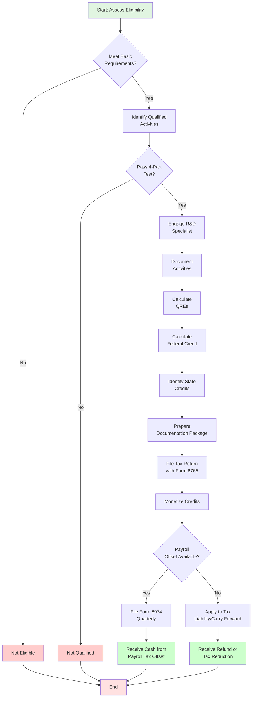
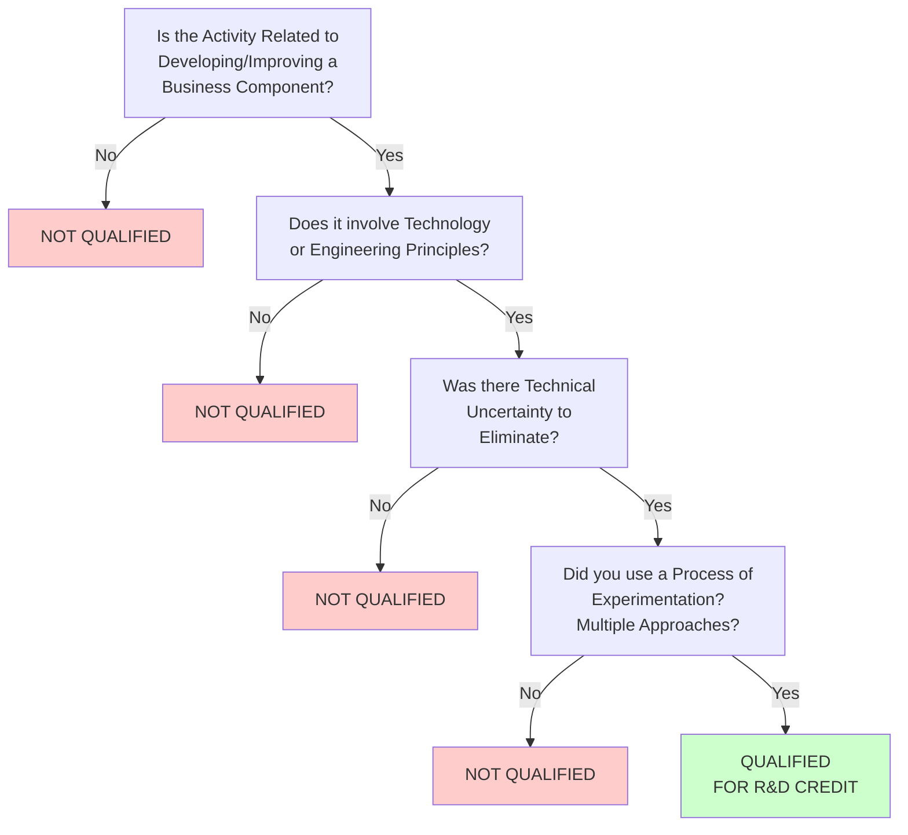

# R&D Tax Credits - Zero Equity Funding

## Overview
R&D (Research & Development) Tax Credits are government incentives that provide cash back for innovation activities. This is often the most overlooked "free money" for startups - you can receive 6-14% of qualified R&D expenses back as cash or tax credits. For a startup spending $1M on R&D, that's $60K-$140K back annually.

## Target Amount Range
- Small startups ($500K R&D spend): $30K - $70K annually
- Growing startups ($2M R&D spend): $120K - $280K annually
- Scale-ups ($10M+ R&D spend): $600K - $1.4M annually
- Can claim retroactively for up to 3 years (sometimes 4)

## Unique Advantage
Unlike grants, you're claiming credits for work you're ALREADY doing. No application process, no competition - just documentation and calculation.

## How Top-Tier Founders Identify Opportunities

### 1. Understanding What Qualifies
R&D Tax Credits apply to activities involving:
- **Technological in nature**: Developing new/improved products, processes, software
- **Uncertainty**: Attempting to eliminate technical uncertainty
- **Process of experimentation**: Testing hypotheses, running experiments
- **Qualified purpose**: Improving function, performance, reliability, or quality

### 2. Common Startup Activities That Qualify
- Software development (new features, not routine maintenance)
- Product prototyping and testing
- Algorithm development
- Data science and ML model development
- Engineering design iterations
- Technical architecture decisions
- Beta testing and QA
- Integration and interoperability work

### 3. What DOESN'T Qualify
- Market research or consumer surveys
- Routine data collection
- Management activities
- Sales and marketing
- Legal and IP work
- Business operations

## Visual Process Flows

### R&D Tax Credit Qualification & Documentation Process



### R&D Credit Calculation & Documentation Workflow

```mermaid
graph LR
    subgraph "Phase 1: Preparation"
        A1["Week 1-2<br/>Engage Specialist"] --> A2["Week 2-3<br/>Gather Documents"]
        A2 --> A3["Week 3-4<br/>Review Activities"]
    end

    subgraph "Phase 2: Documentation"
        B1["Document All<br/>Qualified Activities"] --> B2["Identify Qualified<br/>Personnel"]
        B2 --> B3["Analyze Time<br/>Allocation"]
        B3 --> B4["Calculate QREs"]
    end

    subgraph "Phase 3: Calculation"
        C1["Select Calculation<br/>Method"] --> C2["Calculate Federal<br/>Credit"]
        C2 --> C3["Calculate State<br/>Credits"]
        C3 --> C4["Determine Monetization<br/>Strategy"]
    end

    subgraph "Phase 4: Filing"
        D1["Assemble Complete<br/>Documentation Package"] --> D2["Prepare Form 6765"]
        D2 --> D3["Prepare State<br/>Returns"]
        D3 --> D4["File with CPA<br/>Coordination"]
    end

    subgraph "Phase 5: Realization"
        E1["Election: Payroll<br/>Offset or Standard"] --> E2["Receive Cash/Credits"]
        E2 --> E3["Establish Ongoing<br/>Compliance System"]
    end

    A3 --> B1
    B4 --> C1
    C4 --> D1
    D4 --> E1

    style A1 fill:#e3f2fd
    style B1 fill:#f3e5f5
    style C1 fill:#fff3e0
    style D1 fill:#fce4ec
    style E1 fill:#e0f2f1
```



### R&D Activity Qualification Decision Tree



## 12-Step Process

### Step 1: Eligibility Assessment (Week 1)
**Action**: Determine if you qualify for R&D Tax Credits
- Are you a US company paying US payroll?
- Do you develop products, software, or processes?
- Do engineers/developers comprise significant portion of team?
- Are you incorporated (LLC, C-corp, S-corp)?
- Do you have W-2 employees (not just contractors)?

If yes to most → you likely qualify

**Deliverable**: Eligibility checklist completed

### Step 2: Specialist Selection (Week 1-2)
**Action**: Engage R&D tax credit specialist firm
- **Contingency-based**: Pay only if you get credits (20-30% of credit amount)
- **Fixed-fee**: Flat fee for service ($5K-$25K depending on complexity)
- **Hybrid**: Small upfront + % of credits

Top firms:
- Acena Consulting
- Moss Adams
- BDO
- Eide Bailly
- MainStreet (specifically for startups)
- alliantgroup

**Deliverable**: Engagement letter signed with R&D tax specialist

### Step 3: Historical Review (Week 2-3)
**Action**: Review past 3 years of expenses (if applicable)
- Gather financial statements
- Review payroll records
- Identify R&D projects from past years
- Calculate potential retroactive credits
- Amend prior year tax returns if significant credits found

**Deliverable**: Historical credit estimate

### Step 4: Qualified Activities Documentation (Week 3-4)
**Action**: Document all R&D activities comprehensively
- Create project list (all development initiatives)
- For each project, document:
  - Technical objectives
  - Uncertainties addressed
  - Experiments/iterations conducted
  - Outcomes and learnings
- Use existing materials: Jira, GitHub commits, design docs, sprint notes

**Deliverable**: R&D project catalog with technical narratives

### Step 5: Qualified Personnel Identification (Week 4)
**Action**: Identify employees who performed R&D activities
- Engineers (software, hardware, systems)
- Data scientists and ML engineers
- Product managers (technical aspects only)
- QA engineers (not routine testing, but innovative testing)
- Technical leads and architects
- Scientists and researchers

**Deliverable**: List of qualified personnel with roles and % time on R&D

### Step 6: Time Tracking Analysis (Week 4-5)
**Action**: Calculate time spent on qualified activities
- **If you have time tracking**: Use actual data
- **If you don't**: Reasonable estimation methods
  - Review project timelines
  - Analyze GitHub commits, Jira tickets
  - Interview engineers about time allocation
  - Use industry benchmarks (e.g., 70% of developer time typically qualifies)

**Deliverable**: Time allocation report by employee and project

### Step 7: Qualified Expense Calculation (Week 5-6)
**Action**: Calculate total qualified research expenses (QREs)
- **Wages**: W-2 wages for qualified personnel performing R&D
- **Supplies**: Materials consumed in R&D (cloud costs, hardware, etc.)
- **Contract research**: 65% of amounts paid to contractors for R&D
- **Excluded**: Overhead, rent, general admin, sales/marketing

Formula:
```
QREs = (Qualified Wages) + (Supply Costs) + (65% × Contract Research)
```

**Deliverable**: Detailed QRE calculation spreadsheet

### Step 8: Credit Calculation (Week 6)
**Action**: Calculate federal and state R&D tax credits

**Federal Credit** (choose one method):
- **Regular Credit**: 20% of current year QREs above a base amount
- **Alternative Simplified Credit (ASC)**: 14% of current year QREs above 50% of 3-year average
  - Most startups use ASC (simpler, usually more favorable)

**State Credits**: Varies by state
- California: ~15% (separate calculation)
- New York: ~10%
- Texas: ~5%
- Many states offer credits - check your state

**For startups with no tax liability:**
- Payroll tax offset: Use up to $500K/year of federal credit against payroll taxes
- Carry forward: Unused credits carry forward 20 years

**Deliverable**: Federal and state credit calculations

### Detailed Step-by-Step R&D Credit Calculation Guide

#### Step 1: Calculate Total Qualified Research Expenses (QREs)

**Gather Financial Data:**
```
QREs = Qualified Wages + Supply Costs + (65% × Contract Research)
```

**A. Qualified Wages Calculation**
1. List all W-2 employees who performed R&D activities
2. For each employee, gather:
   - Annual W-2 wages (from payroll records)
   - Percentage of time spent on qualified research (default assumptions below if no tracking)
3. Calculate qualified wages by employee:
   ```
   Qualified Wages = Annual W-2 Wages × (% Time on Qualified R&D)
   ```
4. Sum all employee qualified wages

**Default Time Allocation Percentages (if not tracked):**
- **Software Engineers (new development)**: 65-85%
- **Hardware Engineers**: 70-80%
- **QA/Test Engineers (new features)**: 60-75%
- **Data Scientists/ML Engineers**: 75-90%
- **Engineering Managers**: 20-40%
- **Product Managers (technical)**: 10-30%
- **Designers (UX for new features)**: 40-60%

**Example Wage Calculation:**
```
Employee A (Senior Engineer): $150,000 × 75% = $112,500
Employee B (Junior Engineer): $90,000 × 70% = $63,000
Employee C (QA Engineer): $85,000 × 65% = $55,250
Employee D (Product Manager): $120,000 × 25% = $30,000
Total Qualified Wages = $260,750
```

**B. Supply Costs Calculation**
1. Identify supply costs used exclusively for R&D:
   - Cloud computing (AWS, Azure, GCP for dev/test environments)
   - Software licenses (development tools, testing platforms)
   - Hardware components (if for prototyping/testing)
   - Lab materials and supplies
   - Testing software and services
2. Exclude supplies used in production or administration
3. Sum all R&D supply costs

**Example Supply Cost Calculation:**
```
AWS Development Environment: $15,000
GitHub Enterprise (12 engineers): $3,000
JetBrains IDE Licenses (10 dev): $2,500
Test Automation Platform: $5,000
Hardware for Prototyping: $8,000
Total Supply Costs = $33,500
```

**C. Contract Research Calculation (65% Rule)**
1. Identify all contractors/vendors hired for R&D work
2. For each contract, gather:
   - Total contract amount/costs
   - Amount attributable to R&D activities
   - Type of work (R&D vs. non-R&D)
3. Calculate 65% of R&D contract amounts
4. Sum the 65% amounts

**Important**: Must have written contract specifying R&D activities

**Example Contract Calculation:**
```
Contract Developer (8 weeks): $40,000 total
  - R&D work portion: 100% → $40,000 × 65% = $26,000

Contract QA Firm: $30,000 total
  - R&D testing portion: 60% → $18,000 × 65% = $11,700

Total Contract R&D (65%): $37,700
```

**D. Total QRE Calculation**
```
Total QREs = Qualified Wages + Supply Costs + Contract R&D (65%)
Total QREs = $260,750 + $33,500 + $37,700 = $331,950
```

#### Step 2: Choose Calculation Method (Regular vs. ASC)

**Method 1: Alternative Simplified Credit (ASC) - RECOMMENDED**

**Formula:**
```
ASC Credit = (Current Year QREs - (50% × Average QREs Past 3 Years)) × 14%
```

**Calculation Example (using QRE of $331,950):**
1. Current Year QREs: $331,950
2. 3-Year Average QREs:
   - Prior Year 1: $250,000
   - Prior Year 2: $200,000
   - Prior Year 3: $150,000
   - Average = ($250,000 + $200,000 + $150,000) ÷ 3 = $200,000
3. 50% of Average: $200,000 × 50% = $100,000
4. Excess QREs: $331,950 - $100,000 = $231,950
5. Federal Credit: $231,950 × 14% = $32,473

**Why Most Startups Use ASC:**
- Simpler calculation (no complex base period computation)
- Usually more favorable for growing companies
- Easier to defend in audits
- Works better if year-over-year R&D spending increases

**Method 2: Regular Credit (for reference)**

**Formula:**
```
Regular Credit = (Current Year QREs - Base Amount) × 20%
```
*Base amount calculation is complex; requires 3-year average computation*

---

#### Step 3: Calculate State Credits

**California Example (15% Credit):**
```
CA QREs: $331,950 (same as federal)
CA State Credit = $331,950 × 15% = $49,793
```

**New York Example (10% or 5%):**
```
NY QREs: $331,950
NY State Credit = $331,950 × 10% = $33,195
(Higher rate if in NYC or QETC status)
```

**Multi-State Allocation Example:**
```
Company with engineers in CA and NY:
- CA R&D work: $200,000 QREs
- NY R&D work: $131,950 QREs

CA Credit: $200,000 × 15% = $30,000
NY Credit: $131,950 × 10% = $13,195
```

#### Step 4: Calculate Total Federal & State Credits

**Summary Example:**
```
Federal R&D Credit (ASC): $32,473
California State Credit: $49,793
New York State Credit: $13,195
─────────────────────────────
TOTAL CREDITS: $95,461
```

**As Percentage of R&D Spend:**
```
$95,461 ÷ $331,950 = 28.7% return on R&D spend
(This is very good - typical range 15-25%)
```

#### Step 5: Determine Credit Monetization Strategy

**Option A: Payroll Tax Offset (Pre-Revenue/Small Companies)**

**Eligibility:**
- Revenue < $5M
- ≤ 5 years since first revenues
- Have payroll taxes to offset

**Calculation:**
```
Quarterly Payroll Tax Offset = Annual Federal Credit ÷ 4
$32,473 ÷ 4 = $8,118 per quarter

Reduces employer Social Security tax portion each quarter
```

**Example Cash Flow:**
- Q1: Reduce payroll taxes by $8,118
- Q2: Reduce payroll taxes by $8,118
- Q3: Reduce payroll taxes by $8,118
- Q4: Reduce payroll taxes by $8,118
- Total annual cash benefit: $32,473

**Option B: Tax Liability Reduction (Profitable Companies)**

```
Income Tax Before Credit: $150,000
Less: R&D Federal Credit: ($32,473)
Income Tax After Credit: $117,527
Annual Tax Savings: $32,473
```

**Option C: Carry Forward (For Future Years)**

```
If no tax liability in current year:
Carry forward credits to future years (20-year carry forward)
Use as: Tax liability arises, or payroll offset if eligible
```

#### Step 6: Create Summary Calculation Table

**Template for Documentation:**

| Item | Amount |
|------|--------|
| **Qualified Wages** | |
| Senior Engineers (5 × $150K × 75%) | $562,500 |
| Junior Engineers (5 × $90K × 70%) | $315,000 |
| QA Engineers (3 × $85K × 65%) | $165,750 |
| Engineering Manager (1 × $120K × 30%) | $36,000 |
| **Subtotal Qualified Wages** | **$1,079,250** |
| | |
| **Supply Costs** | |
| Cloud Infrastructure (dev/test) | $45,000 |
| Software Licenses | $12,000 |
| Hardware for Prototyping | $8,000 |
| **Subtotal Supply Costs** | **$65,000** |
| | |
| **Contract R&D (65% Rule)** | |
| Contract Developer ($100K × 65%) | $65,000 |
| Contract QA ($50K × 65%) | $32,500 |
| **Subtotal Contract R&D** | **$97,500** |
| | |
| **TOTAL QUALIFIED RESEARCH EXPENSES** | **$1,241,750** |
| | |
| **Federal Credit Calculation (ASC)** | |
| Current Year QREs | $1,241,750 |
| Less: 50% of 3-Year Average | ($600,000) |
| Excess QREs | $641,750 |
| Credit Rate (ASC) | 14% |
| **Federal Credit** | **$89,845** |
| | |
| **State Credits** | |
| California (15%) | $186,263 |
| New York (10%) | $124,175 |
| **Total State Credits** | **$310,438** |
| | |
| **TOTAL CREDITS (Federal + State)** | **$400,283** |

### Step 9: Documentation Package Assembly (Week 7)
**Action**: Compile comprehensive documentation for IRS audit defense
- Project descriptions (technical detail)
- Organizational charts
- Resumes of key technical personnel
- Financial analysis and calculations
- Time tracking methodologies
- Screenshots of tools (GitHub, Jira, etc.)
- Technical diagrams and specifications
- Meeting notes from technical discussions

**IRS Form 6765** (Credit for Increasing Research Activities) requires:
- Method chosen (ASC vs Regular)
- QRE calculations
- Supporting schedules

**Deliverable**: Complete documentation package + Form 6765

### Step 10: Tax Return Filing/Amendment (Week 8-9)
**Action**: File or amend tax returns to claim credits
- **Current year**: Include Form 6765 with tax return
- **Prior years**: File amended returns (Form 1120X for C-corp, etc.)
- **Payroll tax offset**: If applicable, file Form 8974

Work with your CPA and R&D specialist to ensure:
- Proper forms completed
- Credits calculated correctly
- Documentation attached as required
- State returns also amended if applicable

**Deliverable**: Filed/amended tax returns claiming R&D credits

### Step 11: Credit Monetization (Post-Filing)
**Action**: Determine how to use credits
- **Against income tax**: If you have tax liability
- **Payroll tax offset**: Up to $500K/year (for qualified small businesses)
- **Carry forward**: Save for future tax years
- **State credits**: Some states offer refundable credits (cash back)

**For payroll tax offset:**
- Must be "qualified small business" (< $5M revenue, ≤ 5 years since first revenues)
- Claim up to $500K annually against employer portion of Social Security tax
- File Form 8974 quarterly

**Deliverable**: Credit utilization plan + quarterly filing schedule (if payroll offset)

### Step 12: Ongoing Compliance & Future Years (Ongoing)
**Action**: Establish systems for future years
- **Quarterly documentation**: Document R&D activities each quarter (don't wait until year-end)
- **Time tracking**: Implement lightweight time tracking for engineers
- **Project tracking**: Maintain R&D project log
- **Monthly review**: Review expenses to identify qualified costs
- **Annual filing**: Make R&D credit calculation part of annual tax process

**Deliverable**: R&D credit compliance calendar and documentation system

## Systems & Processes

### R&D Documentation System
Implement quarterly process:
- **End of each quarter**:
  - List all projects worked on
  - Document technical uncertainties addressed
  - Note experiments/iterations
  - Estimate time spent by person
  - Save relevant artifacts (design docs, technical specs, test results)

### Expense Tracking
Tag expenses in accounting system:
- Wages: Track by department/role
- Cloud costs: Separate dev/staging from production
- Contractor invoices: Note if for R&D work
- Software licenses: Identify development tools
- Hardware: Prototyping materials

### Communication with CPA
- Inform CPA you're claiming R&D credits
- Provide specialist's calculations
- Discuss payroll tax offset election
- Coordinate state filing

## Messaging Templates

### Initial Email to R&D Tax Specialist
```
Subject: R&D Tax Credit Consultation - [Company Name]

Dear [Specialist Name],

I'm [Your Name], founder of [Company]. We're a [stage] startup developing [product/solution].

We'd like to explore R&D tax credits. Our profile:
- Incorporated: [Year]
- Entity type: [C-corp/S-corp/LLC]
- Employees: [Number] (including [X] engineers/developers)
- Annual R&D spend: ~$[Amount]
- Primary activities: [Software development / hardware development / etc.]

Questions:
1. Based on our profile, what's a rough estimate of potential credits?
2. Do you offer retroactive review (past 3 years)?
3. What's your fee structure?
4. What's the typical timeline?

Available for a call this week to discuss.

Best regards,
[Your Name]
[Title]
[Company] | [Phone]
```

### Documentation Request to Engineering Team
```
Subject: R&D Tax Credit Documentation - Need Your Input

Team,

Great news - we're claiming R&D tax credits, which will bring back ~$[X]K based on our development work.

I need your help documenting Q[X] [Year] projects:

For each project you worked on, please provide (30 mins max):
1. Project name & objective
2. Technical challenges/uncertainties you addressed
3. Approaches you tried (experiments, iterations)
4. Approximate % of your time spent on this

Example:
- Project: New ML recommendation engine
- Challenge: Improving accuracy while reducing latency
- Approaches: Tested 3 algorithms (CNN, LSTM, Transformer), experimented with batch sizes, tried model pruning
- Time: ~40% of my Q2 time

Template doc here: [Link]
Due: [Date - give 1 week]

This documentation helps us claim credits for the innovative work you do every day.

Thanks!
[Your Name]
```

## Success Criteria

### Leading Indicators
- R&D specialist engaged within 30 days
- Historical review completed (past 3 years)
- Documentation system implemented
- Quarterly R&D activity tracking in place

### Lagging Indicators
- Credits claimed equal to 6-14% of qualified R&D spend
- Retroactive credits received (if applicable)
- Credits successfully monetized via payroll offset or tax reduction
- Audit defense documentation complete
- Process integrated into annual tax workflow

## Top-Tier Strategies

### What Elite Founders Do:
1. **Start early**: Document from Day 1, not retroactively
2. **Integrate into workflow**: Make R&D documentation part of sprint retrospectives
3. **Maximize qualified expenses**: Ensure proper categorization of costs
4. **Use payroll offset**: For pre-revenue startups, this is cash back
5. **Stack with grants**: R&D credits + SBIR grants = double dipping (allowed!)
6. **Train team**: Educate engineers on what qualifies so they document properly
7. **Review quarterly**: Don't wait until year-end to compile documentation

### Advanced Tactics:
- **State shopping**: If multi-state, allocate expenses to most favorable state
- **Acquisition planning**: R&D credits transfer in M&A (valuablebuy-side)
- **IP development**: Credits apply to internal IP development
- **Failed experiments count**: You get credit even if R&D didn't succeed
- **Open source contributions**: May qualify if tied to your product development

### Common Mistakes to Avoid:
- Waiting until tax season to start documentation
- Not claiming because "we're not doing research" (software dev often qualifies!)
- Relying on contractors without proper documentation (only 65% of contract costs qualify)
- Forgetting to elect payroll tax offset (deadline: tax return filing)
- Poor time tracking (overestimation can trigger audits)
- Not reviewing state credits (some states very generous)
- Mixing qualified and non-qualified activities without clear separation

## Comprehensive Case Studies

### Case Study 1: SaaS Startup - $185K Credit Claimed

**Company Profile:**
- **Name**: TechFlow (pseudonym)
- **Industry**: B2B SaaS platform for data analytics
- **Stage**: Seed stage, 2 years old
- **Team**: 12 employees (7 engineers, 2 designers, 3 business)
- **Annual Revenue**: $800K
- **R&D Spend**: $1.2M (primarily salaries)

**R&D Activities:**
1. Built new machine learning recommendation engine
2. Developed real-time data processing pipeline
3. Created custom API integration framework
4. Implemented advanced security protocols
5. Built mobile app from scratch

**Qualified Expenses Breakdown:**
- Engineer salaries (7 × $120K avg, 80% time on R&D): $672K
- Cloud infrastructure (AWS for dev/staging): $45K
- Contract developers (65% of $80K): $52K
- Software tools (IDEs, testing platforms): $18K
- **Total QREs**: $787K

**Credits Calculated:**
- Federal credit (14% ASC method): $110K
- California state credit (15%): $118K
- **Total Credits**: $228K

**Credits Monetized:**
- Payroll tax offset: $110K over 2 years (federal)
- CA credit carried forward: $118K (used against future tax liability)

**Timeline:**
- Week 1-2: Engaged MainStreet (contingency fee)
- Week 3-4: Engineers documented projects (2 hours each)
- Week 5-6: MainStreet calculated credits
- Week 7: Filed with tax return
- Month 3: First payroll offset applied

**Results:**
- **Cash received**: $55K in first year (payroll offset)
- **Total benefit**: $228K over 3 years
- **ROI**: Paid MainStreet $35K (15% of credits), netted $193K
- **Time invested**: ~20 hours total across team

**Key Success Factors:**
- Strong documentation culture (used Jira extensively)
- Clear project separation (R&D vs. maintenance)
- Engineers participated in documentation
- Retroactive claim for Year 1 (additional $95K)

**Lessons Learned:**
- Started process too late (could have documented from Day 1)
- Should have trained engineers on what qualifies upfront
- Underestimated cloud costs that qualified (initially)

---

### Case Study 2: Hardware Startup - $420K Credit + $150K Cash Refund

**Company Profile:**
- **Name**: RoboTech (pseudonym)
- **Industry**: Robotics and IoT devices
- **Stage**: Series A, 4 years old
- **Team**: 35 employees (20 engineers, 5 operations, 10 business)
- **Location**: New York (QETC qualified)
- **Annual Revenue**: $3.5M
- **R&D Spend**: $2.8M

**R&D Activities:**
1. Designed custom circuit boards (5 iterations)
2. Developed embedded software for IoT devices
3. Created computer vision algorithms
4. Built cloud-based device management platform
5. Tested materials for device enclosures
6. Developed battery optimization algorithms

**Qualified Expenses Breakdown:**
- Engineer/scientist salaries (20 × $140K, 85% R&D): $2.38M
- Prototype materials and components: $180K
- Contract engineering firms (65% of $250K): $162K
- Lab equipment depreciation: $95K
- Testing and certification costs: $68K
- **Total QREs**: $2.885M

**Credits Calculated:**
- Federal credit (14% ASC): $404K
- NY state credit (10%, enhanced): $289K
- **Total Credits**: $693K

**Credits Monetized:**
- Payroll tax offset: $420K over 3 years (federal)
- NY QETC refundable credit: $250K cash (capped)
- NY credit carried forward: $39K
- **Total Cash Value**: $670K + $39K future

**Special Strategy - NY QETC Status:**
- Qualified as "Qualified Emerging Technology Company"
- Requirements met: <100 employees, tech focus, <$10M revenue
- Enabled $250K annual cash refund (received $150K in Year 1)

**Timeline:**
- Month 1: Engaged Acena Consulting (fixed fee $22K)
- Month 2: Historical review (claimed 2 prior years retroactively)
- Month 3-4: Documentation and calculation
- Month 5: Filed amended returns and current year
- Month 7: Received first NY refund check ($150K)
- Ongoing: Quarterly payroll offset claims

**Results:**
- **Year 1 cash**: $150K (NY refund) + $105K (payroll offset) = $255K
- **3-year total**: $670K realized + $39K future value
- **Cost**: $22K Acena fee + $15K additional CPA time
- **Net benefit**: $633K
- **Effective rate**: 22% of R&D spend returned

**Key Success Factors:**
- Comprehensive prototype documentation with photos
- Detailed engineering notebooks and test logs
- Clear separation of R&D vs. manufacturing setup
- Pursued NY QETC status proactively
- Claimed retroactively for 2 prior years

**Lessons Learned:**
- Should have pursued QETC status earlier (would have gotten more refunds)
- Prototype material costs were higher than expected (positive surprise)
- Contract engineering documentation crucial (needed detailed SOWs)

---

### Case Study 3: Fintech Startup - $95K Credit (Entirely Payroll Offset)

**Company Profile:**
- **Name**: PaymentPro (pseudonym)
- **Industry**: Payment processing and financial technology
- **Stage**: Pre-revenue, 18 months old
- **Team**: 8 employees (5 engineers, 3 business)
- **Location**: Texas (no state income tax)
- **Annual Revenue**: $0 (pre-launch)
- **R&D Spend**: $720K

**R&D Activities:**
1. Built secure payment processing system
2. Developed fraud detection algorithms
3. Created API for merchant integration
4. Implemented compliance and encryption protocols
5. Built real-time transaction monitoring
6. Developed mobile SDK

**Qualified Expenses Breakdown:**
- Engineer salaries (5 × $130K, 90% R&D): $585K
- AWS infrastructure (dev/test environments): $42K
- Security tools and penetration testing: $28K
- Contract security consultants (65% of $45K): $29K
- **Total QREs**: $684K

**Credits Calculated:**
- Federal credit (14% ASC): $95.8K
- State credit: $0 (Texas has no income tax)
- **Total Credits**: $95.8K

**Credits Monetized:**
- **Payroll tax offset only** (no income tax liability)
- Qualified Small Business: Yes (<$5M revenue, <5 years)
- Applied $95.8K against employer portion of Social Security tax
- Strategy: Quarterly Form 8974 filing

**Quarterly Payroll Offset Schedule:**
- Q1: $23,950 offset
- Q2: $23,950 offset
- Q3: $23,950 offset
- Q4: $23,950 offset
- Total: $95,800 over 12 months

**Timeline:**
- Week 1: Engaged MainStreet (contingency 20%)
- Week 2-3: Documentation (lightweight - small team)
- Week 4: Credit calculation
- Week 5: Filed Form 8974 with Q1 payroll tax return
- Ongoing: Quarterly Form 8974 filing

**Results:**
- **Cash benefit**: $95.8K (reduces actual payroll tax owed)
- **Cost**: $19.2K to MainStreet (20% contingency)
- **Net benefit**: $76.6K cash flow improvement
- **Impact**: Extended runway by 3 months

**Key Success Factors:**
- Discovered R&D credits before burning all cash
- Simple company structure (all engineers, clear R&D focus)
- Excellent Git documentation (every commit tagged)
- Quarterly documentation system implemented
- Payroll tax offset = real cash savings monthly

**Unique Advantage - Pre-Revenue:**
- No income tax liability, so payroll offset was only option
- Without R&D credits, couldn't use any tax benefits
- Payroll tax offset made credits immediately valuable
- Effectively 14% discount on engineering costs

**Lessons Learned:**
- Payroll tax offset is actual cash savings, not just credit
- Need to plan quarterly filings (can't do all at once)
- Cap of $500K/year wasn't an issue at this stage
- Founder didn't know this existed until investor mentioned it

---

### Case Study 4: Life Sciences Startup - $340K Credit (Multi-State)

**Company Profile:**
- **Name**: BioInnovate (pseudonym)
- **Industry**: Biotech - diagnostic testing
- **Stage**: Seed stage, 3 years old
- **Team**: 18 employees (12 scientists/engineers, 6 business)
- **Locations**: Cambridge, MA (HQ) + San Diego, CA (lab)
- **Annual Revenue**: $1.8M
- **R&D Spend**: $2.1M

**R&D Activities:**
1. Developed novel diagnostic assay
2. Created automated testing protocol
3. Built lab information management system (software)
4. Optimized reagent formulations (chemistry)
5. Designed custom lab equipment
6. Conducted clinical validation studies

**Qualified Expenses Breakdown:**
- Scientist/engineer salaries: $1.52M (75% R&D time across team)
- Lab supplies and reagents: $285K
- Clinical trial costs: $145K
- Software development (LIMS): $98K
- Equipment costs: $52K
- **Total QREs**: $2.1M

**Multi-State Allocation:**
- Massachusetts (65% of R&D): $1.365M QREs
- California (35% of R&D): $735K QREs

**Credits Calculated:**
- Federal credit (14% ASC on $2.1M): $294K
- Massachusetts credit (15% on $1.365M): $205K (life sciences bonus)
- California credit (15% on $735K): $110K
- **Total Credits**: $609K

**Credits Monetized:**
- Federal payroll offset: $294K over 3 years
- MA refundable credit: 90% × $205K = $185K cash refund
- CA credit: Carried forward $110K (no immediate use)
- **Immediate cash value**: $479K

**Special Strategy - Life Sciences Bonus:**
- Massachusetts offers 15% credit (10% base + 5% life sciences)
- 90% refundable for life sciences companies
- Required: Biotechnology company certification
- Application: Submitted to MA Life Sciences Center

**Timeline:**
- Month 1: Engaged Moss Adams (fixed fee $18K)
- Month 2: Multi-state allocation strategy
- Month 3: Applied for MA life sciences certification
- Month 4-5: Documentation and calculation
- Month 6: Filed federal and both state returns
- Month 8: Received MA refund check ($185K)
- Ongoing: Federal payroll offset quarterly

**Results:**
- **Year 1 cash**: $185K (MA refund) + $98K (federal offset) = $283K
- **3-year projection**: $479K cash + $110K future value
- **Cost**: $18K Moss Adams + $8K additional legal/accounting
- **Net benefit**: $453K realized
- **Effective rate**: 22% of R&D spend

**Key Success Factors:**
- Strategic multi-state allocation maximized refundable credits
- Life sciences certification application
- Lab notebooks with detailed protocols
- Clinical trial documentation (IRB approvals, protocols)
- Separated software development (also qualified)

**Complex Issues Navigated:**
- Multi-state allocation methodology
- Clinical trial costs (partially qualified)
- Distinguishing R&D from quality control
- Equipment depreciation calculations
- Supply cost documentation

**Lessons Learned:**
- Life sciences companies often have higher qualification rates
- MA refundable credit is incredibly valuable
- Multi-state presence requires careful allocation
- Clinical validation R&D has different documentation needs

---

### Case Study 5: E-commerce Platform - Missed Opportunity, Then Caught Up

**Company Profile:**
- **Name**: ShopTech (pseudonym)
- **Industry**: E-commerce platform
- **Stage**: Series B, 5 years old
- **Team**: 45 employees (25 engineers)
- **Location**: San Francisco, CA
- **R&D Spend**: $3.5M annually (average over 5 years)

**The Mistake:**
- Didn't claim R&D credits for first 4 years
- Founder thought "we're not doing research"
- Assumed only life sciences/hardware qualified
- **Missed credits**: ~$2.1M over 4 years

**The Discovery:**
- Year 5: New CFO joined, asked about R&D credits
- Engaged BDO for retroactive review
- Discovered qualification for all 4 prior years

**Qualified Activities (Retroactive Documentation):**
1. Built recommendation engine with ML
2. Developed inventory optimization algorithms
3. Created fraud detection system
4. Built payment processing integration
5. Developed mobile apps (iOS and Android)
6. Implemented search engine optimization
7. Built warehouse management system

**Retroactive Claim (Years 2-4):**
- Year 2 QREs: $1.8M → $252K credits (federal + state)
- Year 3 QREs: $2.6M → $364K credits
- Year 4 QREs: $3.1M → $434K credits
- **Total retroactive**: $1.05M in credits

**Year 5 (Current Year):**
- QREs: $3.5M → $490K credits

**Documentation Challenge:**
- Had to recreate 3 years of documentation
- Used: Git commit history, Jira tickets, sprint notes, Confluence docs
- Interviewed engineers about past projects
- Reviewed product roadmaps and technical specs

**Credits Claimed:**
- **Total credits**: $1.54M (4 years)
- Could not offset payroll (company too large/old)
- Applied against income tax liability
- **Tax savings**: $1.54M over 4 years

**Timeline:**
- Month 1-2: Historical analysis by BDO
- Month 3-4: Documentation reconstruction (intensive)
- Month 5-6: Calculation and form preparation
- Month 7: Filed 3 amended returns + current year
- Month 10: IRS processed first amended return
- Year 2: All refunds processed

**Results:**
- **Refunds received**: $670K (from prior overpaid taxes)
- **Current year tax reduction**: $490K
- **Future carry-forward**: $380K
- **Cost**: $220K to BDO (contingency on retroactive, fixed on current)
- **Net benefit**: $1.32M

**Key Lessons:**
- DON'T WAIT - Start claiming from Year 1
- Software development absolutely qualifies
- Retroactive claims are possible but harder
- Git history is valuable documentation
- Cost of retroactive documentation is high

**What They Do Now:**
- Quarterly R&D documentation sessions
- Engineers document as part of sprint retrospectives
- Dedicated person manages R&D credit compliance
- Annual claim process routine
- **Ongoing benefit**: ~$500K/year in tax savings

**Advice to Others:**
- "Don't make our mistake - start from Day 1"
- "If we had MainStreet from the beginning, would have saved $200K in fees"
- "Retroactive is painful - do it right the first time"

---

## Common Pitfalls & How to Avoid Them (Detailed)

### Pitfall 1: "We're Not Doing Research" Syndrome

**The Problem:**
Founders assume "research" means lab coats and PhDs. They don't realize software development, engineering design, and technical problem-solving qualify.

**Real Example:**
A mobile gaming company with 15 developers didn't claim R&D credits for 3 years. They thought "making games isn't research." In reality:
- Game engine optimization (qualified)
- Physics simulation algorithms (qualified)
- AI for non-player characters (qualified)
- Graphics rendering improvements (qualified)
- Total missed credits: $380K

**How to Avoid:**
- If you have engineers solving technical problems, you probably qualify
- Focus on "experimentation" not "research"
- Ask: "Did we try multiple approaches to solve technical uncertainty?"
- Consult a specialist - initial consultation usually free

**Red Flag Questions:**
- Are we developing new/improved products or software?
- Do our engineers experiment with different technical approaches?
- Do we face technical uncertainty in our development?

If yes to any → likely qualify for R&D credits

---

### Pitfall 2: Mixing Personal Beliefs with IRS Requirements

**The Problem:**
Companies self-disqualify activities because they seem "too routine" or "not innovative enough," when IRS standards are different from personal judgment.

**Real Example:**
A fintech company excluded their API development team from R&D credits. They thought "APIs are standard - not innovative." But:
- They were solving technical uncertainty (performance at scale)
- Tried multiple architectures (experimentation)
- Improved reliability (qualified purpose)
- Should have been included → $85K in missed credits

**IRS Standard:**
The innovation must be "new to you" - not new to the world. If YOUR company faces technical uncertainty, it qualifies.

**How to Avoid:**
- Don't self-edit - document everything
- Let the specialist determine what qualifies
- Use the 4-part test objectively
- When in doubt, document it

**Key Insight:**
Your "routine" work might involve technical uncertainty and experimentation that you've internalized. Fresh eyes (specialists) often find qualifying activities you missed.

---

### Pitfall 3: Poor Contractor Documentation

**The Problem:**
Companies pay contractors for R&D work but can't claim it because of inadequate documentation.

**Real Example:**
A hardware startup paid $400K to a contract engineering firm for prototype development. Their contract said "engineering services" (generic). When claiming R&D credits:
- IRS requires 65% rule for contractors (only $260K would qualify)
- But contract didn't specify R&D activities
- No detailed SOW breaking down R&D vs. non-R&D work
- Specialist conservative estimate: Only $120K qualified
- **Lost benefit**: ($260K - $120K) × 14% = $19.6K in credits

**How to Avoid:**
✓ **In Contracts:**
- Explicitly state "research and development services"
- List specific R&D activities in SOW
- Separate R&D work from other services (deployment, training, etc.)
- Include milestone descriptions with technical details

✓ **Documentation:**
- Get detailed invoices (not just "hours worked")
- Request progress reports documenting experimentation
- Keep correspondence about technical challenges
- Obtain work product (code, designs, test results)

**Template Contract Language:**
```
Contractor shall perform research and development activities including:
- Development of [specific technical component]
- Experimentation with [technical approaches]
- Testing and iteration to eliminate technical uncertainty regarding [specific challenge]
- Documentation of experiments and results

These activities constitute qualified research expenses under IRC Section 41.
```

---

### Pitfall 4: Overestimating Time Allocation

**The Problem:**
Companies claim 100% of all engineer time as R&D, triggering IRS scrutiny or audit red flags.

**Real Example:**
A SaaS company claimed 95% of all developer time as R&D. IRS audited and found:
- 30% of time was routine maintenance and bug fixes
- 15% was meetings, admin, and non-R&D activities
- 10% was production support
- Actual R&D time: ~45-50%
- IRS reduced credit from $210K to $105K
- Plus penalties and interest: Additional $18K
- **Total cost of overestimation**: $123K in reduced credits + penalties

**How to Avoid:**
✓ **Realistic Categories:**
- R&D: New features, technical problem-solving, experimentation
- Maintenance: Bug fixes in existing code (minor)
- Support: Production issues, customer support
- Admin: Meetings, planning, HR activities

✓ **Reasonable Percentages:**
- Senior engineers: 50-70% R&D (more meetings, mentoring)
- Mid-level engineers: 70-85% R&D
- Junior engineers: 60-75% R&D (learning curve)
- Engineering managers: 30-50% R&D (more admin)

✓ **Documentation:**
- Use time tracking if possible (Harvest, Toggl, Clockify)
- Analyze Jira/GitHub activity (issues vs. new features)
- Conduct quarterly interviews with engineers
- Be conservative, not aggressive

**Key Insight:**
Specialists often push for higher percentages (they earn more). Push back and be realistic. Better to claim $180K defensibly than $220K that triggers audit.

---

### Pitfall 5: Forgetting Payroll Tax Offset Election

**The Problem:**
Pre-revenue startups don't know about payroll tax offset and miss the election deadline, losing the ability to monetize credits.

**Real Example:**
A startup qualified for $125K in federal R&D credits. They had zero income tax liability (pre-revenue). Their CPA:
- Filed tax return with Form 6765
- Claimed the $125K credit
- BUT forgot Form 8974 (payroll tax offset election)
- Result: Credits carried forward indefinitely
- Problem: Startup wanted cash now, not future credits
- **Opportunity cost**: $125K in cash flow not realized

**How to Avoid:**
✓ **For Qualified Small Businesses:**
- Revenue < $5M
- ≤ 5 years since first revenues or gross receipts
- Can offset up to $500K/year against payroll taxes

✓ **Required Forms:**
- Form 6765: Claim the R&D credit
- Form 8974: Elect payroll tax offset
- File Form 8974 quarterly with Form 941

✓ **Timing:**
- Make election on timely filed tax return (including extensions)
- Start claiming offset in quarter after filing
- Must file Form 8974 each quarter

✓ **CPA Coordination:**
- Explicitly tell CPA you want payroll offset
- Provide IRS Notice 2017-23 to CPA
- Have specialist coordinate with CPA
- Double-check tax return before filing

**Recovery Option:**
If you forgot, you can file amended return to make the election, but this delays benefit. Better to get it right the first time.

---

### Pitfall 6: Not Claiming State Credits

**The Problem:**
Companies claim federal credits but ignore generous state credits, especially refundable ones.

**Real Example:**
A NY-based startup claimed $150K in federal credits but didn't file for NY state credit. They qualified for:
- NY R&D credit: $95K
- QETC status: Refundable
- **Missed cash refund**: $95K in Year 1

When they discovered this 2 years later:
- Filed amended NY returns
- Received $95K + $102K (for Year 2)
- But paid additional specialist fees for retroactive work
- And delayed benefit by 2 years (cash flow impact)

**How to Avoid:**
✓ **Research Your State:**
- Check if your state offers R&D credits
- Understand refundability (cash value)
- Learn about special programs (QETC, etc.)
- Calculate state credit rate

✓ **High-Value States:**
- **Refundable credits** (cash even with no tax): NY (QETC), MA (life sciences)
- **Transferable credits** (can sell): PA
- **High rates**: RI (22.5%), CA (15%), MA (15% life sciences)

✓ **Multi-State Strategy:**
- If you have employees in multiple states
- Allocate R&D activities to most favorable state
- Requires documentation of where work performed
- Can claim credits in multiple states simultaneously

✓ **File State Forms:**
- Most states have separate forms
- State specialist or CPA handles this
- Must file with state tax return
- Don't skip this step!

---

### Pitfall 7: No Documentation System = Scrambling at Year-End

**The Problem:**
Companies try to document an entire year of R&D in December, leading to incomplete or weak documentation.

**Real Example:**
A 20-person startup waited until tax season to document R&D. They:
- Spent 60 hours in March trying to remember projects
- Engineers couldn't recall technical details from January
- No notes on experiments or iterations tried
- Specialist could only defensibly claim 60% of potential credits
- **Lost credits**: ~$95K due to weak documentation
- Plus massive time waste during busy tax season

**How to Avoid:**
✓ **Quarterly Documentation Process:**

**End of Each Quarter (2-hour meeting):**
1. List all projects worked on this quarter
2. For each project, document:
   - Technical objective
   - Uncertainty addressed
   - Approaches tried
   - Outcomes
3. Estimate time spent by person
4. Save artifacts (docs, specs, test results)

**Tools to Use:**
- **Project management**: Jira, Asana, Linear
  - Tag R&D projects
  - Document technical discussions in tickets
  - Track experiments in separate issues

- **Documentation**: Confluence, Notion, GitHub wiki
  - Maintain project log
  - Document architecture decisions (ADRs)
  - Keep technical design docs

- **Time tracking**: Harvest, Toggl, Clockify (if feasible)
  - Track by project, not just client/task
  - Tag R&D projects

- **Git**: Meaningful commit messages
  - Describe technical approach
  - Reference issues/tickets
  - Note experiments in commit messages

✓ **Annual Process:**
1. Q1-Q4: Quarterly documentation (2 hours each)
2. December: Review year, estimate QREs
3. January: Specialist calculates credits
4. February: File with tax return
5. Total time: ~10 hours vs. 60 hours scrambling

**ROI of Quarterly Process:**
- Better documentation = higher defensible credits
- Less time overall (8 hours vs. 60 hours)
- Reduce audit risk
- Peace of mind

---

### Pitfall 8: Not Reviewing After Significant Changes

**The Problem:**
Companies calculate R&D credits once and don't update when business changes significantly.

**Scenarios:**
1. **Acquisition**: Acquired company had R&D credits carried forward (asset in diligence)
2. **New state expansion**: Hired engineers in high-credit state (CA, NY, MA)
3. **Entity restructure**: Changed from LLC to C-corp (affects credit monetization)
4. **New product line**: Launched R&D-intensive new product (more qualified activities)
5. **Payroll growth**: Crossed threshold for larger credits

**Real Example:**
A company calculated $80K in R&D credits in Year 1. In Year 2:
- Hired 5 new engineers in California (previously all in Texas)
- Didn't update allocation strategy
- Missed out on CA state credits
- Should have claimed additional $115K in CA credits
- **Lost benefit**: $115K

**How to Avoid:**
✓ **Annual Review Triggers:**
- Added employees in new states
- Significant increase in R&D spend
- New product lines or technology
- Entity restructuring
- Approaching revenue thresholds ($5M for payroll offset)
- Acquisition or merger

✓ **Update Process:**
1. Alert your R&D specialist about changes
2. Re-evaluate state credit opportunities
3. Update allocation methodologies
4. Adjust documentation processes
5. Review monetization strategy

---

### Pitfall 9: Audit Fear Preventing Claims

**The Problem:**
Companies are afraid to claim R&D credits because "it will trigger an audit."

**Reality Check:**
- R&D credit audit rate: ~1-2% (low)
- General IRS audit rate: ~0.5%
- Having a credit slightly increases audit risk, but it's still very low
- With proper documentation, audits are not scary

**Real Example:**
A company eligible for $200K in R&D credits decided not to claim them due to "audit fear." Over 5 years:
- Missed $1M in cumulative credits
- Competitors claimed credits with no issues
- By year 5, realized the mistake
- **Opportunity cost**: $1M + time value of money

**How to Avoid:**
✓ **Understand Audit Reality:**
- Audits are rare, even with R&D credits
- Proper documentation makes audits straightforward
- Specialists provide audit defense support
- Cost of defense (if needed) << value of credits

✓ **Audit Defense Preparation:**
- Maintain comprehensive documentation package
- Use reputable specialist with audit defense experience
- Keep detailed contemporaneous records
- Follow conservative calculation methods
- Be prepared to substantiate, not afraid to claim

✓ **Insurance Option:**
- Some specialists offer audit defense insurance
- Covers cost of defending credit if audited
- Peace of mind for risk-averse founders
- Usually small additional fee

**Key Insight:**
Fear of audit shouldn't prevent claiming legitimate credits. That's like not taking a legal tax deduction because you're afraid of scrutiny. With proper documentation, you're fine.

---

### Pitfall 10: Using Wrong Specialist Type

**The Problem:**
Not all R&D credit "specialists" are equal. Using wrong type leads to suboptimal results.

**Specialist Types:**

1. **General CPA Firms:**
   - Pros: Already know your business, integrated tax service
   - Cons: May lack deep R&D credit expertise, conservative estimates
   - Best for: Companies with very simple R&D activities
   - Cost: Included in tax prep or small add-on

2. **Tech-Enabled Platforms (MainStreet, etc.):**
   - Pros: Automated, affordable, fast, startup-friendly
   - Cons: Less personal service, may miss nuances
   - Best for: Tech startups, <$5M R&D spend, straightforward activities
   - Cost: 15-25% contingency or $500-2000/month

3. **Specialized R&D Credit Firms (Acena, alliantgroup):**
   - Pros: Deep expertise, aggressive but defensible, audit support
   - Cons: Higher fees, may require minimum credit size
   - Best for: >$100K credits, complex activities, multi-state
   - Cost: 20-30% contingency or $10K-$50K fixed

4. **Big 4 Accounting Firms:**
   - Pros: Comprehensive service, excellent documentation, audit defense
   - Cons: Expensive, overkill for small companies
   - Best for: Large companies, complex structures, international considerations
   - Cost: Premium hourly or fixed fees

**Matching Guide:**
- Pre-revenue, $500K-$3M R&D: **Tech platform** (MainStreet)
- $3M-$10M R&D, moderate complexity: **Specialized firm** (Acena)
- $10M+ R&D, multi-state, complex: **Big firm** (BDO, Moss Adams)
- Hardware/life sciences: **Industry specialist**

**Real Example:**
A hardware company ($2M R&D) used a general CPA:
- CPA calculated $120K in credits
- Switched to hardware specialist next year
- Specialist found $280K in credits (same spend)
- CPA missed: Prototype material costs, equipment depreciation, clinical testing
- **Difference**: $160K in credits

**How to Avoid:**
- Interview multiple specialists
- Ask about industry experience
- Request case studies similar to your situation
- Check references from similar companies
- Don't always go with cheapest option

## Audit Defense & IRS Compliance

### Understanding R&D Credit Audits

**Audit Triggers:**
- Very large credit amounts (>$1M)
- Significant increase from prior years (3x+ jump)
- High percentage claims (>80% of all expenses)
- Inconsistency with industry norms
- Random selection (rare but happens)

**Audit Timeline:**
- IRS typically has 3 years to audit from filing date
- Extended to 6 years if credit > 25% of gross receipts
- Statute of limitations can be extended by consent

### What IRS Auditors Look For

**Documentation Requirements:**
1. **Technical Narratives**
   - Detailed project descriptions
   - Technical objectives clearly stated
   - Uncertainties identified and explained
   - Experimentation process documented
   - Results and learnings captured

2. **Financial Documentation**
   - Payroll records by employee
   - Time allocation support
   - Supply and contractor costs
   - General ledger extracts
   - Chart of accounts

3. **Organizational Support**
   - Company org chart
   - Job descriptions
   - Employee resumes (technical staff)
   - Project timelines
   - Meeting notes and technical discussions

4. **Process Documentation**
   - How activities qualify under 4-part test
   - Time tracking methodology
   - Allocation methods
   - Consistent application of policies

### Red Flags That Trigger Scrutiny

**High-Risk Claims:**
- Claiming 100% of engineering time as R&D
- No distinction between R&D and production
- All software development claimed without analysis
- Excessive contractor costs without proper documentation
- Round numbers (suggest estimation, not actual)
- No contemporaneous documentation

**Conservative Approach:**
- 60-85% engineer time allocation is defensible
- Clear separation of R&D vs. maintenance
- Detailed project-by-project analysis
- Actual data over estimation when possible
- Contemporaneous documentation (created during, not after)

### Building an Audit-Proof Documentation Package

**Essential Components:**

1. **Executive Summary (5-10 pages)**
   - Company overview and business model
   - Products/services developed
   - Summary of R&D activities
   - Overview of calculation methodology
   - Total credits claimed (federal and state)

2. **Technical Project Descriptions (2-3 pages each)**
   For each major project:
   - **Business objective**: Why this project matters
   - **Technical objective**: What you're trying to achieve technically
   - **Technical uncertainty**: What was unknown at the start
   - **Process of experimentation**: Approaches tried, tests conducted
   - **Results**: What you learned, what worked/didn't work
   - **Timeline**: When work occurred
   - **Personnel**: Who worked on it and their roles

3. **Qualified Personnel Analysis**
   - List of all personnel considered
   - Job descriptions or role summaries
   - Qualification rationale (how they meet criteria)
   - Time allocation methodology
   - Percentage of time on qualified research

4. **Financial Analysis**
   - QRE calculation by category (wages, supplies, contractors)
   - Payroll summaries by employee
   - Supply costs with supporting invoices
   - Contractor costs with contracts and SOWs
   - Exclusions and adjustments explained

5. **Appendices**
   - Organizational charts
   - Relevant resumes
   - Technical diagrams and specifications
   - Sample code or engineering drawings
   - Screenshots from project management tools
   - ADRs (Architecture Decision Records)
   - Test results and benchmarks

### Sample Response to IRS Information Request

If you receive IRS Form 4564 (Information Document Request):

**Immediate Actions (Day 1):**
1. Contact your R&D specialist immediately
2. Contact your tax attorney if credits are large
3. Review request carefully for scope
4. Note response deadline (typically 30 days)
5. Request extension if needed (usually granted)

**Response Strategy:**
- Provide exactly what's requested (not less, not more)
- Organize documents professionally
- Include clear index and summaries
- Highlight key support for credit
- Be prepared for follow-up questions

**Template Response Letter:**
```
[Date]
[IRS Agent Name and Address]

Re: Information Document Request - [Company Name], EIN [XX-XXXXXXX]
Tax Year(s): [Years under examination]

Dear [Agent Name]:

This letter responds to your Information Document Request dated [Date] regarding
research and development tax credits claimed by [Company Name].

We have organized our response as follows:

1. Technical Documentation (Tab 1)
   - Project descriptions for [X] qualified research projects
   - Technical narratives addressing the four-part test
   - Documentation of uncertainties and experimentation

2. Financial Documentation (Tab 2)
   - Payroll records and time allocation analysis
   - Supply costs with supporting invoices
   - Contractor agreements and SOWs

3. Organizational Documentation (Tab 3)
   - Organizational charts
   - Job descriptions
   - Resumes of key technical personnel

4. Supporting Documentation (Tab 4)
   - Project management tool screenshots
   - Technical specifications and design documents
   - Meeting notes and technical discussions

We believe this documentation fully supports our qualified research credit claim
of $[Amount]. We are available to discuss any questions you may have.

Respectfully submitted,
[Your Name]
[Title]
[Contact Information]
```

### Common Audit Outcomes

**Scenarios:**

1. **Full Acceptance (Best Case - ~40% of audits)**
   - IRS accepts claim as filed
   - No adjustments
   - Audit closes

2. **Partial Adjustment (Most Common - ~50% of audits)**
   - IRS proposes reductions in certain areas
   - Examples: Reduce time allocation from 85% to 70%
   - Reduce supply costs due to insufficient documentation
   - Disallow certain projects
   - Negotiate and settle

3. **Full Disallowance (Rare - ~10% of audits)**
   - IRS disallows entire credit
   - Usually due to poor documentation or bad faith claim
   - Appeal or Tax Court may be necessary

**Settlement Negotiation:**
- R&D credit audits are highly negotiable
- Technical arguments can prevail
- Bring specialist to meetings
- Focus on strongest projects first
- Willing to concede weak areas to protect strong ones

### Appealing an Adverse Decision

**Appeal Process:**

1. **IRS Appeals Office (Administrative Appeal)**
   - File protest letter within 30 days
   - Present case to Appeals Officer
   - More informal, settlement-oriented
   - Success rate: ~30-40% of achieving favorable adjustment

2. **Tax Court**
   - File petition within 90 days of final determination
   - Formal legal proceeding
   - Can be expensive ($50K-$500K+ in legal fees)
   - Should only pursue if confident in position and credit is large

3. **Alternative: Offer in Compromise**
   - Settle for less than full disallowance
   - Common in R&D credit disputes
   - Preserves some benefit while avoiding lengthy litigation

### Statute of Limitations Strategy

**Planning for Audits:**
- Keep documentation for minimum 7 years (federal + state)
- Best practice: Keep indefinitely for large credits
- Credits carry forward 20 years (documentation needed for future use)
- State audits can occur independently of federal

**Voluntary Disclosure:**
If you discover errors in prior year claims:
- Amend returns to correct
- Shows good faith
- Reduces penalties if later audited
- Consult specialist and tax attorney first

## Frequently Asked Questions (FAQ)

### Eligibility Questions

**Q: Do we qualify if we're a pre-revenue startup?**
A: Yes! Pre-revenue companies often have the highest R&D intensity. As long as you have W-2 employees performing qualified research, you qualify. You can monetize credits via payroll tax offset.

**Q: We're a consulting firm. Do we qualify?**
A: Potentially yes. If you develop internal tools, IP, or methodologies that meet the 4-part test, those activities qualify. Work for clients generally doesn't qualify (they can claim it), unless you retain IP rights.

**Q: Do mobile app development activities qualify?**
A: Yes, if you're developing new functionality, solving technical challenges, and experimenting with approaches. Simply maintaining existing code doesn't qualify, but new feature development typically does.

**Q: We use mostly off-the-shelf tools and frameworks. Does that disqualify us?**
A: No! Using existing tools doesn't disqualify you. What matters is whether YOU face technical uncertainty in how to use them, integrate them, or build on top of them.

**Q: Our "research" was unsuccessful - does it still qualify?**
A: Yes! Failed experiments absolutely qualify. R&D credits reward the process of experimentation, not just successful outcomes. Document what you tried and what you learned.

### Financial & Calculation Questions

**Q: What's the typical credit amount as % of R&D spend?**
A: Federal: 6-14% (most startups use ASC method = 14%)
State: 0-22.5% (varies by state)
Combined: Typically 15-25% of qualified R&D expenses

**Q: How do we calculate "R&D spend"?**
A: Only count Qualified Research Expenses (QREs):
- W-2 wages for engineers doing R&D
- Supply costs (cloud, hardware consumed in R&D)
- 65% of contractor costs for R&D
- DON'T count: rent, overhead, admin, marketing, sales

**Q: Can we claim credits if we're not profitable?**
A: Yes! If you're a Qualified Small Business (<$5M revenue, ≤5 years old), you can offset payroll taxes up to $500K/year. This is real cash savings.

**Q: Do credits reduce our R&D deductions?**
A: Starting in 2022, yes. Credits claimed reduce your R&D expense deduction dollar-for-dollar. But credits are usually more valuable than deductions (14% credit > ~21% deduction value).

**Q: Can we claim if we outsource development to offshore teams?**
A: Only partially. Work must be performed in the US (including territories) to qualify. US-based employees managing offshore teams may qualify for their time spent on R&D supervision.

### Process & Timeline Questions

**Q: How long does the process take?**
A: Typical timeline:
- Weeks 1-2: Engage specialist
- Weeks 3-6: Documentation and calculation
- Week 7: File with tax return
- Months later: Receive refund or start payroll offset
Total: 2-3 months from start to filing

**Q: When do we actually receive the money?**
A: **Payroll offset**: Quarterly, starts after tax return filed
**Tax refund**: 3-9 months after amended return filed
**Credit against liability**: Immediate (reduces tax owed)

**Q: Can we claim retroactively?**
A: Yes! You can amend returns for the past 3 tax years (sometimes 4). This can result in significant refunds, especially if you've overpaid taxes.

**Q: Do we need to claim every year?**
A: No requirement to claim every year, but you should! Unclaimed credits can't be carried back, only forward. Document annually even if you don't claim.

### Documentation Questions

**Q: What if we don't have time tracking data?**
A: You can use reasonable estimation methods:
- Analyze project timelines and team assignments
- Review Git commits and Jira tickets
- Interview engineers about time allocation
- Use industry benchmarks (specialists have data)
- Document your methodology

**Q: How detailed do project descriptions need to be?**
A: Aim for 2-3 pages per major project, covering:
- Technical objective (what you're trying to achieve)
- Technical uncertainty (what was unknown)
- Experimentation (approaches tried)
- Results (what you learned)
Include enough detail that an IRS agent can understand the technical challenges.

**Q: Can we use Git commits as documentation?**
A: Yes! Git history is excellent supporting documentation. Look for:
- Commit messages describing technical approaches
- Branches showing different experiments
- Code review comments on technical decisions
- Frequency of commits (shows iterative development)

**Q: What if we didn't document contemporaneously?**
A: You can still claim, but it's harder. Use:
- Historical records (Git, Jira, emails)
- Interviews with team members
- Product roadmaps and technical specs
- Release notes and sprint reviews
Better late than never, but contemporaneous is stronger.

### State Credit Questions

**Q: Can we claim both federal and state credits?**
A: Yes! They're calculated separately and stacked. Many companies get federal + state credits totaling 20-25% of R&D spend.

**Q: Which states have the best credits?**
A: **Refundable credits** (best for startups):
- New York (QETC): Up to $250K cash per year
- Massachusetts (life sciences): 90% refundable

**Highest rates**:
- Rhode Island: 22.5%
- California: 15%
- Massachusetts (life sciences): 15%

**Q: We have employees in multiple states. How does allocation work?**
A: You allocate based on where R&D is performed:
- Track which employees work in which states
- Allocate their time to those states
- Claim credits in each state
- Requires documentation of location

**Q: What's NY QETC status and how do we get it?**
A: Qualified Emerging Technology Company status in New York:
- Requirements: <100 employees, <$10M revenue, tech focus
- Benefits: 10% R&D credit (vs. 5%), up to $250K refundable
- Application: Check box on NY tax return, may need supporting docs
- Very valuable for qualifying startups!

### Specialist & Cost Questions

**Q: How much do specialists cost?**
A: Pricing models:
- **Contingency**: 15-30% of credits (pay only if successful)
- **Fixed fee**: $5K-$50K depending on complexity
- **Hourly**: $200-$400/hr (rare for R&D credits)
- **Subscription**: $500-$2000/month (tech platforms)

**Q: Contingency vs. fixed fee - which is better?**
A: **Contingency pros**: No upfront cost, aligned incentives, no risk
**Contingency cons**: Higher total cost if credit is large

**Fixed fee pros**: Lower total cost for large credits, predictable
**Fixed fee cons**: Pay regardless of credit amount, upfront cost

Rule of thumb: Contingency for first-time/uncertain, fixed fee if you know credit will be large

**Q: Can our regular CPA handle R&D credits?**
A: Depends. General CPAs can do simple cases, but:
- Often miss qualifying activities
- May be overly conservative
- Lack deep R&D credit expertise
- May not provide audit defense

For credits >$50K, use a specialist. Your CPA can coordinate.

**Q: What if specialist's calculation seems aggressive?**
A: Push back! You're responsible for the claim, not them.
- Ask for support for high percentages
- Request conservative options
- Understand their methodology
- Remember: You sign the tax return
Better to claim $150K defensibly than $200K aggressively.

### Audit & Risk Questions

**Q: Will claiming R&D credits trigger an audit?**
A: Slightly increases audit risk, but it's still very low:
- R&D credit audit rate: ~1-2%
- General audit rate: ~0.5%
- With proper documentation, audits are manageable
- Benefits >>> minimal audit risk

**Q: What happens in an audit?**
A: Typical process:
1. IRS sends Information Document Request
2. You provide documentation package
3. IRS reviews and may ask follow-up questions
4. IRS proposes adjustments or accepts claim
5. Negotiate if there are proposed changes
6. Settle or appeal

With good documentation and specialist support, most audits settle favorably.

**Q: Who handles audit defense?**
A: Your R&D specialist should provide audit defense:
- Most reputable specialists include this in their fee
- They'll attend meetings with IRS
- Prepare responses and documentation
- Negotiate on your behalf
- Ask about audit defense before engaging

**Q: Can we lose the credit in an audit?**
A: Possible but rare with proper documentation:
- Partial reductions are more common than full disallowance
- Most audits result in 70-90% of credit being sustained
- Full disallowance usually only if fraudulent or no documentation
- Penalties are rare unless willful disregard

### Specific Scenarios

**Q: We acquired another company. Do their R&D credits transfer?**
A: Yes, with limitations:
- Credits carry over in stock acquisition
- Credits may be limited in asset acquisition
- Unused credits are valuable (include in diligence)
- May be subject to annual limitation rules (Section 382)
- Consult M&A tax specialist

**Q: We're planning to raise venture capital. How do credits affect this?**
A: Positively!
- R&D credits extend runway (show in use of proceeds)
- Demonstrate financial sophistication
- Federal credits can offset AMT (important for some investors)
- Some VCs specifically ask about R&D credit strategy

**Q: Can we claim credits for AI/ML development?**
A: Yes! AI/ML development often qualifies:
- Model architecture experimentation
- Hyperparameter tuning
- Feature engineering
- Algorithm optimization
- Data pipeline development
Document the technical uncertainty and experimentation.

**Q: We're a SaaS company. What percentage of our costs typically qualify?**
A: Varies widely, but rough guidelines:
- Engineering salaries: 50-80% (new features, not maintenance)
- Cloud costs: 20-40% (dev/staging, not production)
- QA/testing: 30-60% (innovative testing, not routine)
- Product management: 10-30% (technical aspects only)

Your specialist will analyze your specific situation.

**Q: We pivoted our business model. Does that affect our credits?**
A: The pivot itself doesn't matter, but:
- Old product development still qualifies (credit prior years)
- New product development qualifies (credit going forward)
- Abandoned projects absolutely qualify (experimentation counts!)
- Document both initiatives separately

### Advanced Strategy Questions

**Q: Can we "stack" R&D credits with other funding (grants, etc.)?**
A: Yes! R&D credits stack with:
- SBIR/STTR grants (federal small business grants)
- State innovation grants
- University partnerships
- Most other funding sources
Exception: Credits may need to be reduced for certain government-funded research.

**Q: Should we switch from regular credit to ASC method?**
A: Most startups benefit from ASC (Alternative Simplified Credit):
- 14% of QREs above 50% of 3-year average
- Simpler calculation
- No complex base period computation
- Often more favorable for growing companies
Your specialist will compare both methods and use the better one.

**Q: Can founders doing technical work claim R&D credits?**
A: Yes, if they're W-2 employees:
- Must receive W-2 wages (not just equity)
- Must perform qualified research activities
- Time allocation applies (can't claim 100%)
- CTO/technical founders often qualify for 30-50% of time

**Q: What if we're developing open source software?**
A: Can qualify if:
- Developing for your own product/business use
- Solving technical uncertainty for your business
- Not purely altruistic contribution
- Retain some benefit/control
Example: Developing open source tool that you use internally = qualifies

## Comprehensive Checklists

### Qualifying Activities Checklist

#### Software Development Activities
- [ ] New feature development (not routine maintenance)
- [ ] Algorithm optimization and implementation
- [ ] Database design and optimization
- [ ] API development and integration
- [ ] Security implementation (authentication, encryption)
- [ ] Performance optimization and load testing
- [ ] Mobile app development
- [ ] Cloud architecture design and implementation
- [ ] Data pipeline development
- [ ] Machine learning model development
- [ ] Framework customization and extension
- [ ] Testing of new functionality (exploratory testing)
- [ ] Refactoring code that solves technical uncertainty
- [ ] Design pattern implementation for specific challenges

#### Hardware & IoT Development
- [ ] Circuit board design and iteration
- [ ] Embedded software development
- [ ] Firmware optimization
- [ ] Device integration and compatibility testing
- [ ] Hardware prototyping and testing
- [ ] PCB layout and design
- [ ] Power management optimization
- [ ] Battery life optimization
- [ ] Wireless connectivity implementation

#### Data Science & Machine Learning
- [ ] Model architecture experimentation
- [ ] Feature engineering and selection
- [ ] Hyperparameter tuning
- [ ] Data preprocessing pipeline development
- [ ] Model validation and testing
- [ ] Algorithm comparison and evaluation
- [ ] Deep learning model development
- [ ] NLP model development
- [ ] Recommendation engine development

#### Product & Platform Development
- [ ] E-commerce platform features
- [ ] Payment processing integration
- [ ] Real-time data processing systems
- [ ] Analytics and reporting features
- [ ] User authentication systems
- [ ] Multi-tenant architecture development
- [ ] API design and implementation
- [ ] DevOps and infrastructure automation

#### Quality Assurance & Testing (Qualified)
- [ ] Automated testing framework development
- [ ] Test case development for new features
- [ ] Performance and load testing
- [ ] Security testing and penetration testing
- [ ] Browser/device compatibility testing
- [ ] Integration testing for complex systems
- [ ] Beta testing with documented issues/fixes
- [ ] Test automation tool development

#### **NOT Qualified - Exclude These:**
- [ ] Routine maintenance and bug fixes
- [ ] Standard documentation
- [ ] Training and onboarding
- [ ] Copying or adapting existing code
- [ ] Using off-the-shelf solutions as-is
- [ ] Sales and marketing activities
- [ ] General business operations
- [ ] Duplicate work (same as other company)
- [ ] Quality control in production

---

### Personnel Qualification Checklist

**For each employee, confirm:**

#### Engineering & Technical Staff (Likely Qualified)
- [ ] Software engineers/developers
- [ ] Hardware engineers
- [ ] Systems engineers
- [ ] QA/Test engineers
- [ ] Data engineers
- [ ] Machine learning engineers
- [ ] Data scientists
- [ ] Technical architects
- [ ] Embedded systems engineers
- [ ] DevOps engineers
- [ ] Security engineers

#### Semi-Qualified Roles (Partial Time)
- [ ] Product managers (technical aspects only)
- [ ] Technical leads
- [ ] Engineering managers (when coding)
- [ ] CTOs doing technical work
- [ ] Founders doing technical development

#### Support Staff (Usually Not Qualified)
- [ ] Business analysts
- [ ] Project managers (non-technical)
- [ ] Scrum masters
- [ ] HR and admin staff
- [ ] Sales and marketing staff
- [ ] Operations staff

**Qualification Checklist for Each Person:**
- [ ] Position involves technical work
- [ ] Directly performs or supervises R&D activities
- [ ] Has technical background/expertise
- [ ] Time allocation to R&D can be documented
- [ ] W-2 employee (not contractor, unless 65% rule applies)

---

### Documentation Requirements Checklist

#### Technical Documentation
- [ ] Project descriptions (2-3 pages each for major projects)
- [ ] Technical objectives clearly stated
- [ ] Technical uncertainties identified and explained
- [ ] Experimentation process documented
  - [ ] Different approaches tried
  - [ ] Why each approach was tested
  - [ ] Results and learnings from each
- [ ] Design documents and specifications
- [ ] Architecture decision records (ADRs)
- [ ] Technical diagrams and flowcharts
- [ ] Code samples or github/gitlab links
- [ ] Test results and benchmarking data
- [ ] Meeting notes on technical discussions
- [ ] Sprint retrospectives documenting challenges solved

#### Financial Documentation
- [ ] Complete payroll records with W-2 wages
- [ ] Time allocation by employee and project
- [ ] Timesheets or time tracking data
- [ ] Cloud infrastructure costs (AWS bills, Azure, GCP)
- [ ] Software license costs for development tools
- [ ] Hardware and prototype costs
- [ ] Contractor invoices
- [ ] Contracts with R&D specifications for contractors
- [ ] Cost allocation spreadsheet (QRE calculation)
- [ ] General ledger extracts
- [ ] Chart of accounts

#### Organizational Documentation
- [ ] Company organizational chart
- [ ] Job descriptions for technical staff
- [ ] Employee resumes (focus on technical background)
- [ ] Project team assignments
- [ ] Roles and responsibilities matrix
- [ ] Employee start dates

#### Project Management Documentation
- [ ] Jira/Asana/Linear project tickets
- [ ] Sprint plans and retrospectives
- [ ] Confluence/wiki technical documentation
- [ ] GitHub commit logs with meaningful messages
- [ ] Pull requests and code review comments
- [ ] Product roadmaps
- [ ] Release notes
- [ ] Customer issue tracking (for bug fixes vs. new features)

#### Supporting Materials
- [ ] Screenshots from project management tools
- [ ] Build logs and deployment records
- [ ] Database diagrams
- [ ] API documentation
- [ ] Configuration files
- [ ] Database schemas
- [ ] Test automation reports
- [ ] Performance benchmarks

#### Optional but Valuable
- [ ] Blog posts or internal articles on technical challenges
- [ ] Tech talks or presentations given internally
- [ ] Patent applications or disclosures
- [ ] Research papers or whitepapers
- [ ] Prototype demonstrations or videos
- [ ] User feedback documentation
- [ ] Competitive analysis (technical comparison)

---

### Calculation & Filing Checklist

#### Pre-Calculation Steps
- [ ] Gather last 3 years of financial records
- [ ] Collect payroll records and W-2 information
- [ ] Identify all R&D projects and activities
- [ ] Locate time tracking or estimation data
- [ ] Compile supply and software license costs
- [ ] Gather contractor invoices and contracts
- [ ] Determine entity type (C-corp, S-corp, LLC, etc.)
- [ ] Check revenue for Qualified Small Business status
- [ ] Identify all states where R&D conducted

#### Calculation Steps
- [ ] Calculate total qualified wages
- [ ] Identify and sum supply costs
- [ ] Apply 65% rule to contractor costs
- [ ] Sum total QREs
- [ ] Choose calculation method (ASC vs. Regular)
- [ ] Calculate federal credit
- [ ] Research state credits available
- [ ] Calculate state credits
- [ ] Compare ASC vs. Regular credit methods
- [ ] Determine if payroll tax offset available
- [ ] Calculate total credits (federal + state)
- [ ] Create detailed calculation spreadsheet
- [ ] Have specialist review calculations

#### Filing Preparation
- [ ] Form 6765 (federal form) prepared
- [ ] State tax forms completed (varies by state)
- [ ] Form 8974 (payroll tax offset) if applicable
- [ ] Complete documentation package assembled
- [ ] Organized into logical tabs/sections
- [ ] Cover letter prepared
- [ ] Index created for documentation
- [ ] Supporting calculations reviewed
- [ ] CPA and specialist reviewed package
- [ ] Signatures and dates prepared

#### Filing Steps
- [ ] Determine if current year or amended return
- [ ] File amendment Form 1040-X (individuals) or 1120-X (corporations)
- [ ] Include all supporting documentation
- [ ] Keep copies of everything filed
- [ ] Document what was sent to IRS
- [ ] Follow up on status in 3-4 months

#### Post-Filing Steps
- [ ] If payroll offset: File Form 8974 quarterly
- [ ] Track refund status if amended return
- [ ] Document when credit received/used
- [ ] Set calendar for future year planning
- [ ] Archive documentation securely
- [ ] Plan for next year's documentation process

---

### Quarterly Compliance Checklist

**End of Each Quarter:**

- [ ] List all projects worked on this quarter
- [ ] Document technical objectives for each project
- [ ] Identify technical uncertainties addressed
- [ ] Record experiments or different approaches tried
- [ ] Note outcomes and learnings
- [ ] Estimate time spent by employee on each project
- [ ] Gather and save relevant artifacts:
  - [ ] Design documents
  - [ ] Test results
  - [ ] Technical specifications
  - [ ] Screenshots/logs
- [ ] Tag R&D expenses in accounting system
- [ ] Update project timeline spreadsheet
- [ ] Archive documentation in organized folder
- [ ] Email engineering team for updates if needed
- [ ] Review against prior quarters for consistency

**Annual Process:**
- [ ] Q4: Compile year's documentation
- [ ] Q4: Gather all financial records
- [ ] January: Send to R&D specialist for calculation
- [ ] January: Prepare payroll and supply cost summary
- [ ] February: Review calculations and documentation
- [ ] February/March: File tax returns with R&D forms
- [ ] March-May: File quarterly Form 8974s if payroll offset
- [ ] Establish system improvements based on prior year

---

## Detailed Eligibility Criteria

### Four-Part Test (All Must Be Met)
The IRS requires that qualified research activities meet ALL four criteria:

#### 1. Permitted Purpose
The activity must be intended to develop or improve a business component (product, process, software, technique, formula, or invention) in terms of:
- **Function**: What the product does
- **Performance**: How well it performs
- **Reliability**: How dependably it works
- **Quality**: Overall excellence

**Examples that qualify:**
- Developing a faster search algorithm (performance)
- Creating a more secure authentication system (reliability)
- Building a new mobile app feature (function)
- Improving data processing accuracy (quality)

**Examples that DON'T qualify:**
- Style, appearance, or cosmetic changes
- Marketing surveys about customer preferences
- Routine quality control testing
- Minor bug fixes in existing code

#### 2. Technological in Nature
The activity must fundamentally rely on principles of physical or biological sciences, engineering, or computer science.

**Examples that qualify:**
- Machine learning model development
- Database optimization using computer science principles
- API design based on software engineering principles
- Algorithm development for data processing
- System architecture design
- Cloud infrastructure scaling solutions

**Examples that DON'T qualify:**
- Social science research
- Market research
- Business process improvements without technical component
- Routine administrative database management

#### 3. Elimination of Uncertainty
You must attempt to eliminate technical uncertainty about:
- Development or improvement capability
- Appropriate design of the business component
- Method of achieving the desired result

**Examples of technical uncertainty:**
- "Can we reduce API response time to under 100ms while maintaining accuracy?"
- "What's the optimal neural network architecture for our use case?"
- "How do we scale our database to handle 10x traffic?"
- "Which encryption method balances security and performance for our needs?"

**NOT technical uncertainty:**
- "Will customers like this feature?" (market uncertainty)
- "Can we afford this technology?" (business uncertainty)
- "Should we use vendor A or B?" (unless comparing technical approaches)

#### 4. Process of Experimentation
You must evaluate multiple alternatives through:
- Systematic trial and error
- Modeling and simulation
- Systematic testing and analysis

**Examples that demonstrate experimentation:**
- Testing 3 different caching strategies and measuring performance
- A/B testing different algorithm implementations for accuracy
- Prototyping multiple UI architectures before selecting one
- Running load tests on various database configurations
- Iterating through machine learning hyperparameters

**Documentation that proves experimentation:**
- Git commit history showing iterations
- Jira tickets documenting different approaches tried
- Test results and benchmarking data
- Architecture decision records (ADRs)
- Sprint retrospective notes

### Entity Type Requirements

**Qualified Entities:**
- C-Corporations ✓
- S-Corporations ✓
- Partnerships ✓
- LLCs (taxed as any of the above) ✓
- Sole Proprietorships ✓

**Special Rules:**
- **Qualified Small Business**: <$5M gross receipts, ≤5 years since first revenues
  - Can offset payroll taxes (up to $500K/year)
  - Still claiming regular R&D credit, just monetizing differently

### Employee vs. Contractor Rules

**W-2 Employees:**
- 100% of qualified wages count
- Must be performing or directly supervising R&D
- Part-time pro-rated based on hours

**1099 Contractors:**
- Only 65% of contract costs count
- Must have written contract specifying R&D work
- Contractor cannot claim same expenses
- Best practice: Separate R&D work in contracts

**Example:**
- W-2 Engineer salary: $120K → $120K qualifies (if 100% R&D time)
- 1099 Developer: $100K contract → $65K qualifies (65% rule)

## State-by-State Overview (Top States)

### Most Generous States:

#### 1. **California** - ~15% State Credit
- **Credit Rate**: 15% of qualified research expenses (or 24% of basic research)
- **Calculation**: Similar to federal ASC method
- **Refundable**: No, but can carry forward indefinitely
- **Annual Cap**: $4M per taxpayer
- **Requirements**: Research must be conducted in California
- **Application**: Automatic with state tax return
- **URL**: https://www.ftb.ca.gov/forms/2021/2021-3523.pdf
- **Pro Tip**: California has generous definitions; often higher than federal

#### 2. **New York** - Multiple Credit Options
- **Regular Credit**: 5% of qualified expenses
- **Enhanced Credit**: 10% for startups
- **Refundable**: Yes, for qualified emerging technology companies (QETC)
- **QETC Requirements**: <100 employees, <$10M revenue, technology business
- **Annual Cap**: $250K refundable credit per year
- **URL**: https://www.tax.ny.gov/research/credits/research_development.htm
- **Pro Tip**: QETC status allows cash refund - very valuable for startups

#### 3. **Massachusetts** - 10% Refundable Credit
- **Credit Rate**: 10% of qualifying expenses
- **Refundable**: Yes, 90% refundable for life sciences companies
- **Life Sciences Bonus**: Additional 5% credit (15% total)
- **Requirements**: Research conducted in Massachusetts
- **URL**: https://www.mass.gov/guides/massachusetts-research-credit
- **Pro Tip**: Best for biotech/life sciences startups

#### 4. **Rhode Island** - 22.5% Credit (Highest in Nation)
- **Credit Rate**: 22.5% of qualified expenses
- **Calculation**: Based on federal credit with state multiplier
- **Refundable**: No, but 10-year carry forward
- **Requirements**: Research in Rhode Island
- **Best For**: Significant R&D presence in Rhode Island
- **URL**: http://www.tax.ri.gov/taxcredits/
- **Pro Tip**: Highest rate but must conduct research in-state

#### 5. **Connecticut** - 6-20% Tiered Credit
- **Base Credit**: 6% of qualified expenses
- **Enhanced Credit**: Up to 20% for significant increases in R&D
- **Calculation**: Tiered based on year-over-year growth
- **Carry Forward**: 15 years
- **URL**: https://portal.ct.gov/DRS/Businesses/Business-Tax-Credits
- **Pro Tip**: Best for companies increasing R&D spend each year

#### 6. **Maryland** - 8-10% Credit
- **Basic Credit**: 3% of qualified expenses
- **Growth Credit**: 10% of expenses exceeding base amount
- **Refundable**: No, but 20-year carry forward
- **Small Business Bonus**: Additional benefits for <50 employees
- **URL**: https://marylandtaxes.gov/business/income/credits/
- **Pro Tip**: Strong biotech sector support

#### 7. **Illinois** - 6.5% Credit
- **Credit Rate**: 6.5% of qualified expenses
- **Refundable**: No, but can carry forward 5 years
- **Requirements**: Research conducted in Illinois
- **URL**: https://www2.illinois.gov/rev/research/taxinformation/
- **Pro Tip**: Solid option for Chicago tech companies

#### 8. **Washington** - B&O Tax Credit
- **Type**: Business & Occupation tax credit (not income tax)
- **Credit Rate**: Varies by R&D spending tier
- **Annual Cap**: $4M for commercial R&D, $8M for aerospace
- **Unique**: State has no income tax, so this offsets gross receipts tax
- **URL**: https://dor.wa.gov/taxes-rates/tax-incentives/aerospace-rd-bo-tax-credit
- **Pro Tip**: Valuable even without state income tax

#### 9. **Pennsylvania** - 10% Credit
- **Credit Rate**: 10% of qualified expenses
- **Refundable**: No, but can be sold/transferred
- **Unique Feature**: Credits can be sold to other PA taxpayers
- **URL**: https://dced.pa.gov/programs/research-development-tax-credit/
- **Pro Tip**: Monetize even without tax liability by selling credits

#### 10. **Georgia** - Variable Credit
- **Credit Rate**: Based on increase in R&D spending
- **Calculation**: Tiered system
- **Requirements**: Research in Georgia
- **URL**: https://dor.georgia.gov/credits-and-exemptions
- **Pro Tip**: Growing tech hub with supportive programs

### States with No Income Tax (No State Credit):
- **Texas**: No income tax, but federal credit applies
- **Florida**: No income tax, but federal credit applies
- **Washington**: B&O credit available (see above)
- **Nevada**: No income tax, federal credit only
- **Tennessee**: No income tax on wages, federal credit only
- **Wyoming**: No income tax, federal credit only
- **South Dakota**: No income tax, federal credit only

**Note**: Even without state credits, federal R&D credits are still valuable!

### Multi-State Allocation Strategy
If you have employees in multiple states:
1. **Document where R&D is performed** (by location, by project)
2. **Allocate expenses** to most favorable states
3. **Maximize refundable credits** first (NY, MA)
4. **Consider credit transfer programs** (PA)
5. **Use separate legal entities** in different states if strategic

**Example:**
- Company has engineers in CA, NY, and TX
- Allocate R&D projects to CA and NY for state credits
- Document with project assignments by location
- Potential to claim both federal and 2 state credits

## Resources & Consulting Providers

### R&D Tax Credit Consulting Firms & Platforms

#### Tech-Enabled Platforms (Best for Startups)

**1. MainStreet**
- **Website**: https://mainstreet.com
- **Phone**: (877) 202-2221
- **Best For**: Tech startups, SaaS, early-stage companies
- **R&D Spend Range**: $200K-$5M annually
- **Pricing Model**:
  - Contingency-based (15-25% of credits claimed)
  - No upfront cost - pay only if you get credits
- **Typical Timeline**: 6-8 weeks from engagement to filing
- **Services Offered**:
  - Automated documentation collection
  - Quarterly tracking system
  - Mobile app for documentation
  - Integration with project management tools (Jira, Linear)
  - Form 6765 filing preparation
  - Payroll tax offset guidance
- **Specialties**:
  - Software development
  - Mobile apps
  - SaaS platforms
  - Fintech
- **Key Advantage**: Most affordable for startups, fully remote, fast turnaround
- **Audit Support**: Included in contingency fee
- **Minimum Credit**: $20K (typically)

**2. TechBridge (by William Blair)**
- **Website**: https://www.techbridgeconsulting.com
- **Best For**: Early-stage tech companies
- **Pricing**: Fixed fee or contingency
- **Specialties**: Software, hardware, AI/ML
- **Services**: Documentation, calculation, filing coordination

**3. ClimateAI Credits Platform**
- **Website**: https://www.climateai.com/r-d-credits
- **Best For**: Climate tech, deep tech startups
- **Services**: R&D credit calculations with sustainability focus

---

#### Mid-Size Specialist Firms (Best for $500K+ Credits)

**4. Acena Consulting**
- **Website**: https://acenaconsulting.com
- **Phone**: (202) 457-1000
- **Location**: Washington, DC; With offices nationwide
- **Best For**: Companies with $500K-$5M annual R&D spend
- **R&D Spend Range**: Wide range, especially strong at $1M-$10M
- **Pricing Model**:
  - Fixed fee: Starting at $8K-$30K depending on complexity
  - Contingency: 20-30% of credits claimed
  - Hybrid: Small upfront retainer + contingency
- **Services Offered**:
  - Comprehensive R&D documentation
  - Multi-state credit optimization
  - Audit defense representation
  - Historical retroactive claims (up to 3 years)
  - Payroll tax offset structuring
  - Transfer pricing analysis
- **Specialties**:
  - Software development
  - Manufacturing
  - Engineering and design
  - Aerospace and defense
  - Medical devices
  - Chemicals and materials
- **Key Advantages**:
  - High success rate with IRS audits
  - Strong documentation standards
  - Good for complex organizations
- **Staff**: CPAs, MBAs, tax professionals
- **Typical Timeline**: 8-12 weeks from engagement
- **Minimum Credit**: $50K (typical minimum)

**5. Eide Bailly**
- **Website**: https://eidebailly.com/tax-services
- **Phone**: (800) 447-9900
- **Locations**: Nationwide (regional strength in West and Midwest)
- **Best For**: Mid-market companies, regional businesses
- **R&D Spend Range**: $500K-$10M annually
- **Pricing Model**:
  - Fixed fee: $5K-$25K
  - Contingency: 15-25% of credits
- **Services Offered**:
  - State credit expertise (strongest area)
  - Federal credit optimization
  - Retroactive claim analysis
  - Quarterly compliance setup
- **Specialties**:
  - State tax incentives
  - Software and technology
  - Manufacturing
  - Renewable energy (bonus credits)
- **Key Advantages**: Exceptional state credit expertise, competitive pricing
- **Typical Timeline**: 6-10 weeks

---

#### Enterprise & Large Cap Firms (Best for $1M+ Credits)

**6. alliantgroup**
- **Website**: https://alliantgroup.com
- **Phone**: (713) 355-0044
- **HQ**: Houston, TX with global offices
- **Best For**: Large companies, multi-state operations, complex structures
- **R&D Spend Range**: $5M+ annually (can handle smaller)
- **Pricing Model**:
  - Contingency-based: 20-30% of credits claimed
  - Fixed fee: $50K-$500K+ for enterprise
- **Services Offered**:
  - Aggressive but defensible calculations
  - Multi-state optimization strategies
  - International R&D credit planning (GILTI, etc.)
  - Acquisition and M&A R&D credit integration
  - Transfer pricing with R&D allocation
  - Ongoing compliance programs
  - Custom software for large organizations
  - Patent development tracking
  - Audit defense and litigation support
- **Specialties**:
  - Tech and software (strongest)
  - Aerospace and defense
  - Automotive
  - Medical devices
  - Pharmaceuticals
  - Manufacturing
- **Key Advantages**:
  - Largest R&D credit firm in US
  - Proven audit defense record
  - Sophisticated methodologies
  - Can handle largest credits
- **Typical Credit Range**: $100K-$2M+
- **Minimum Credit**: $100K (typical)

**7. Moss Adams**
- **Website**: https://mossadams.com/services/tax/credits-incentives
- **Phone**: (800) 999-4557
- **HQ**: Seattle, WA with national presence
- **Best For**: Companies with complex tax situations, multiple entities
- **R&D Spend Range**: $1M+ annually
- **Pricing Model**:
  - Hourly: $250-$400/hr for partners/managers
  - Fixed fee: $15K-$75K depending on scope
  - Contingency: Available for select engagements
- **Services Offered**:
  - Comprehensive R&D credit planning
  - Transfer pricing analysis
  - State incentive coordination
  - Multi-year compliance programs
  - Audit representation
  - International considerations
  - Integration with tax planning
- **Specialties**:
  - Tech and software
  - Life sciences and biotech
  - Energy and utilities
  - Financial services
  - Aerospace
- **Key Advantages**: Integration with full-service accounting, strong technical expertise
- **Staff**: Partner-level tax experts, CPAs, specialized consultants
- **Typical Timeline**: 8-16 weeks

**8. BDO (Deutsch, Schorr & Schorr)**
- **Website**: https://www.bdo.com/services/tax/federal-tax-services/federal-tax-credits-incentives
- **Phone**: (212) 885-8000
- **HQ**: New York, NY with global offices
- **Best For**: Large enterprises, Fortune 500 companies, international operations
- **R&D Spend Range**: $10M+ annually
- **Pricing Model**: Premium pricing, typically fixed fees $100K+
- **Services Offered**:
  - Global R&D credit optimization
  - Multi-national planning
  - Transfer pricing with R&D allocation
  - Acquisition integration
  - Compliance programs
  - Dispute resolution
  - Advanced methodologies
- **Key Advantages**:
  - Big 4 resources and credibility
  - Sophisticated analytics
  - Strong IRS relationships
  - Can handle largest and most complex situations
- **Typical Credit Range**: $500K-$5M+

**9. KPMG**
- **Website**: https://home.kpmg/us/en/home/services/tax/r-d-tax-credits.html
- **Phone**: (800) 555-9648
- **Best For**: Global companies, complex structures
- **Services**: Similar to BDO, premium pricing
- **Strength**: International R&D, transfer pricing, advanced planning

---

#### Regional & Specialty Firms

**10. Cherry Bekaert**
- **Website**: https://www.cbh.com/tax-services/credits-incentives/
- **Locations**: Strong in Southeast and Southwest
- **Best For**: Life sciences, SaaS, fintech startups
- **Pricing**: Competitive fixed fees, often lower than big firms
- **Services**: R&D credits, other state incentives

**11. Grant Thornton**
- **Website**: https://www.grantthornton.com
- **Services**: Full-service R&D credit offerings
- **Best For**: Mid-market to large companies

---

### Online R&D Credit Platforms

**1. R&D Fast Track**
- **Website**: https://www.rdfasttrack.com
- **Type**: Online portal for R&D credit documentation
- **Cost**: Varies, typically $1K-$5K setup
- **Features**: Self-service documentation and calculation
- **Best For**: DIY companies or supplement to specialist

**2. TaxTaker**
- **Website**: https://taxtaker.com
- **Services**: R&D credit software with calculation engine
- **Cost**: License fee + implementation
- **Best For**: Companies with in-house tax expertise

**3. Clarus R+D**
- **Website**: https://clarusrd.com
- **Services**: R&D credit management platform
- **Features**: Multi-year tracking, audit defense documentation
- **Cost**: SaaS model, varies by company size

**4. Finagraph**
- **Website**: https://finagraph.com
- **Integration**: Works with QuickBooks and Xero
- **Features**: R&D credit tracking and reporting
- **Cost**: Monthly subscription

### Federal IRS Resources & Forms

#### Official IRS Documents

**1. Form 6765 - Credit for Increasing Research Activities**
- **Full Name**: Form 6765 (Credit for Increasing Research Activities)
- **Link**: https://www.irs.gov/forms-pubs/about-form-6765
- **Instruction Link**: https://www.irs.gov/pub/irs-pdf/i6765.pdf
- **What It Is**: The primary form for claiming federal R&D credits
- **Who Files It**: Any company claiming federal R&D credits
- **Components**:
  - Part I: Computation of Credit (ASC method)
  - Part II: Computation of Credit (Regular method)
  - Part III: Computation of Total Credit
  - Part IV: Depreciation and Credits (Form 4255 if applicable)
- **Filing Deadline**: Due with your tax return (including extensions)
- **Where to Attach**: Attach to your business tax return (Form 1120, 1120-S, 1040, etc.)

**2. Form 8974 - Qualified Small Business Payroll Tax Credit for R&D**
- **Link**: https://www.irs.gov/forms-pubs/about-form-8974
- **Instruction Link**: https://www.irs.gov/pub/irs-pdf/i8974.pdf
- **What It Is**: Election to use R&D credits against payroll taxes instead of income taxes
- **When to Use**: For Qualified Small Businesses (QSB) wanting payroll tax offset
- **Eligibility**:
  - Gross receipts < $5M
  - Less than 5 years since first revenue
  - Planning to claim payroll offset
- **Filing**: Quarterly with Form 941 (Quarterly Payroll Tax Return)
- **Timeline**: First offset applies quarter after initial Form 8974 filing
- **Maximum**: $500K annual offset (all quarters combined)

**3. IRS Publication 535 - Business Expenses**
- **Link**: https://www.irs.gov/publications/p535
- **Sections Relevant to R&D**: Chapter 8 (Deductions for Business Expenses)
- **Content**: Explains what research and experimental expenditures qualify
- **Key Points**:
  - Definition of research expenditures
  - Direct costs eligible for credit
  - Contractor cost limitations
  - Time limitation for wages

**4. IRS Publication 909 - Alternative Simplified Credit (ASC) Guide**
- **Link**: https://www.irs.gov/publications/p909
- **What It Is**: Detailed guidance on ASC calculation method
- **Content**:
  - ASC formula explanation
  - 3-year average computation
  - Qualifying expense definition
  - Examples and worksheets

**5. Notice 2017-23 - Payroll Tax Offset for R&D Credits**
- **Link**: https://www.irs.gov/pub/irs-drop/n-17-23.pdf
- **What It Is**: Guidance document on Section 41(h) rules for payroll offset
- **Content**:
  - Qualified Small Business requirements
  - Election procedures
  - Calculation methodologies
  - Annual caps and limitations
  - Special rules for S-Corps and partnerships

**6. Revenue Procedure 2000-50 - Safe Harbor Methods**
- **Link**: https://www.irs.gov/pub/irs-drop/rp-00-50.pdf
- **What It Is**: Safe harbor methods for computing R&D credits
- **Methods Covered**:
  - ASC method (Alternative Simplified Credit)
  - Regular method
  - Components of computation
  - Base year computations
- **Importance**: Using these methods provides audit protection

**7. IRC Section 41 - Text of Law**
- **Link**: https://www.law.cornell.edu/uscode/text/26/41
- **What It Is**: The actual statute governing R&D tax credits
- **Sections**:
  - Section 41(a): General credit
  - Section 41(b): Qualified research
  - Section 41(d): Qualified expenditures
  - Section 41(h): Payroll tax credit option
- **Reference**: Use for legal authority in audits

#### Educational Resources

**8. IRS R&D Credit Page**
- **Link**: https://www.irs.gov/newsroom/research-and-development-tax-credit-faqs
- **Content**: FAQs on eligibility and calculation
- **Topics Covered**:
  - What activities qualify
  - Wage requirements
  - Time tracking
  - Contractor limitations

**9. IRS Videos & Webinars**
- **Link**: https://www.irsvideos.gov/Business/SmallBusinessTaxpayer
- **Content**: Free training videos on tax credits
- **Topics**: R&D credit basics, qualification rules, compliance

**10. AICPA R&D Tax Credit Resources**
- **Link**: https://www.aicpa.org
- **Content**: CPA professional development materials
- **Offerings**:
  - Continuing education courses
  - Technical guidance
  - Best practices

**11. Tax Foundation - R&D Credit Resources**
- **Link**: https://taxfoundation.org
- **Content**: Policy analysis on R&D credit effectiveness
- **Reports**: Annual reviews of state and federal credits

---

### State-Specific R&D Credit Resources

#### High-Value States - Refundable Credits

**1. New York - QETC Program (Generous for Startups)**
- **Official Program**: Qualified Emerging Technology Company (QETC) Credit
- **State Department**: New York State Department of Taxation and Finance
- **Main Page**: https://www.tax.ny.gov/research/credits/research_development.htm
- **Credit Details Page**: https://www.tax.ny.gov/pdf/publications/income/pub0215.pdf
- **Credit Rates**:
  - Regular credit: 5% of qualified expenses
  - QETC enhanced credit: 10% of qualified expenses
  - Refundable portion: Yes, 100% refundable for QETCs
  - Annual cap: $250K refund per year
- **QETC Eligibility Requirements**:
  - < 100 employees
  - < $10 million gross receipts
  - Must be engaged in development of new technology
  - Incorporated or doing business in NY
- **Forms Required**:
  - Form IT-229: Claim for R&D Credit
  - Form IT-248: QETC Eligibility Statement
- **Application Process**:
  - Include with NY tax return
  - May require supporting documentation
  - Certification process: 4-6 weeks
- **Timeline**: Refunds typically received 30-60 days after certification
- **Contact**: (518) 457-5181 or tax.ny.gov

**2. Massachusetts - Life Sciences Bonus (Great for Biotech)**
- **Official Program**: Life Sciences and Biotechnology Tax Credit
- **State Department**: Massachusetts Department of Revenue
- **Main Page**: https://www.mass.gov/guides/massachusetts-research-credit
- **Credit Details**: https://www.mass.gov/doc/schedules-and-worksheets-for-individual-income-tax
- **Credit Rates**:
  - Standard R&D credit: 10% of qualified expenses
  - Life sciences bonus: +5% (total 15%)
  - Refundability: 90% refundable for certified life sciences companies
  - 10-year carry forward for non-refundable portion
- **Life Sciences Certification**:
  - Must be "Qualifying Biotechnology Company"
  - Focus on diagnostics, therapeutics, or research
  - Application to MA Life Sciences Center
  - Approval required before claiming
- **Eligible Expenses**:
  - Wages of researchers
  - Supplies and materials
  - Equipment (depreciation)
  - Contract research (65% rule)
- **Forms**: Form MA-41 with schedule attachment
- **Contact**: Massachusetts Department of Revenue, (617) 626-2200

**3. Connecticut - Growth-Based Tiered Credit**
- **Program**: Research and Development Tax Credit
- **Department**: Department of Revenue Services
- **Link**: https://portal.ct.gov/DRS/Businesses/Business-Tax-Credits/Research-and-Development-Tax-Credit
- **Credit Rates**:
  - Base rate: 6.5% of qualified expenses
  - Growth rate: Incremental 13.5% on expenses exceeding 3-year average
  - Total potential: Up to 20%
- **Key Advantage**: Rewards increasing R&D spend
- **Carry Forward**: 15 years
- **Who Benefits**: Companies increasing R&D investment annually

#### Highest Rate States

**4. Rhode Island - 22.5% Credit (Highest in Nation)**
- **Official Program**: Research Activities Tax Credit
- **Department**: RI Division of Taxation
- **Link**: http://www.tax.ri.gov/taxcredits/
- **Credit Rate**: 22.5% of qualified expenses (can combine federal + state)
- **Key Features**:
  - No annual cap
  - 10-year carry forward
  - Transferable to other entities
- **Requirements**: Research must be conducted in Rhode Island
- **Forms**: RI Form RI-6765
- **Best For**: Companies with significant RI operations

**5. California - 15% Standard Rate**
- **Official Program**: Research Tax Credit
- **Department**: Franchise Tax Board
- **Form Page**: https://www.ftb.ca.gov/forms/2021/2021-3523.pdf
- **Instruction Link**: https://www.ftb.ca.gov/forms/2021/2021-3523i.pdf
- **Credit Rate**: 15% of qualified expenses
- **Enhanced Credit**: 24% for basic research (university partnerships, etc.)
- **Limitations**:
  - Annual cap: $4M per taxpayer per year
  - Carry forward: Indefinite
  - No refund (credit against tax liability only)
- **Qualifying Activities**:
  - New product/process development
  - Technical problem-solving
  - Technological testing
- **Requirements**: Research must be performed in California
- **Forms**: Form 3523 (Computation of Credit)
- **Contact**: (888) 792-4829

#### Other Strong States

**6. Maryland - Graduated Credit Rate**
- **Program**: R&D Tax Credit
- **Link**: https://marylandtaxes.gov/business/income/credits/
- **Credit Rates**:
  - Basic rate: 3% of qualified research expenses
  - Growth rate: 10% of expenses exceeding base
  - Small business bonus: Enhanced rates for <50 employees
- **Best For**: Biotech and advanced manufacturing

**7. Illinois - 6.5% Credit**
- **Program**: Research and Development Tax Credit
- **Link**: https://www2.illinois.gov/rev/research/taxinformation/
- **Rate**: 6.5% of qualified research expenses
- **Carry Forward**: 5 years
- **Best For**: Chicago and Illinois-based tech companies

**8. Washington State - B&O Tax Credit**
- **Program**: Business & Operations Tax Credit for R&D
- **Link**: https://dor.wa.gov/taxes-rates/tax-incentives
- **Type**: Offsets gross receipts tax (not income tax, as WA has no income tax)
- **Credit**: Variable rate based on R&D spending tiers
- **Annual Cap**:
  - Commercial R&D: $4M
  - Aerospace R&D: $8M
- **Best For**: Manufacturing, aerospace, biotech in Washington

**9. Pennsylvania - 10% Transferable Credit**
- **Program**: R&D Tax Credit
- **Link**: https://dced.pa.gov/programs/research-development-tax-credit/
- **Unique Feature**: Credits can be sold or transferred to other PA taxpayers
- **Rate**: 10% of qualified expenses
- **Buyer Discount**: Typically sold at 90-95 cents per dollar
- **Example**: $100K credit can be sold for $90K-95K in cash
- **Best For**: Companies without sufficient tax liability

---

### Comprehensive Resource Lists by Type

#### Forms & Instructions Checklist

**Federal Forms to Download:**
- [ ] Form 6765 - https://www.irs.gov/forms-pubs/about-form-6765
- [ ] Form 6765 Instructions - https://www.irs.gov/pub/irs-pdf/i6765.pdf
- [ ] Form 8974 - https://www.irs.gov/forms-pubs/about-form-8974
- [ ] Form 8974 Instructions - https://www.irs.gov/pub/irs-pdf/i8974.pdf
- [ ] Form 941 (Quarterly Payroll) - https://www.irs.gov/forms-pubs/about-form-941
- [ ] Form 1120-X (Corporate Amendment) - https://www.irs.gov/forms-pubs/about-form-1120-x
- [ ] Form 1040-X (Individual Amendment) - https://www.irs.gov/forms-pubs/about-form-1040-x

#### Learning & Training Resources

**Video Tutorials:**
- IRS Video: "Research and Development Tax Credit Overview"
  - Link: https://www.irsvideos.gov
  - Topic: Basic overview of R&D credits
- MainStreet Webinars: https://mainstreet.com/webinars
  - Topic: Startup R&D credit strategies
- Eide Bailly Training: https://eidebailly.com/webinars
  - Topic: State R&D credit updates

**Articles & Guides:**
- Nolo Guide: "R&D Tax Credits" - https://www.nolo.com
- Patriot Software: "R&D Tax Credits for Small Business" - https://www.patriotsoftware.com
- Xero Blog: "R&D Tax Credits Explained" - https://www.xero.com/blog

#### Industry & Professional Associations

**1. R&D Credit Coalition**
- **Website**: https://www.investinamericasfuture.org
- **Focus**: Advocacy for R&D tax policy
- **Resources**: Policy papers, research, advocacy updates
- **Member Benefits**: Tax policy briefings, legislative updates

**2. National Association of Tax Professionals (NATP)**
- **Website**: https://www.natptax.com
- **Services**: Find certified R&D credit specialists
- **Resources**: Professional development materials
- **Directory**: Search for tax professionals by state

**3. American Institute of CPAs (AICPA)**
- **Website**: https://www.aicpa.org
- **R&D Resources**: https://www.aicpa.org/career-community/communities/tax
- **Offerings**: CPE courses on R&D credits
- **Standards**: Best practices and ethics guidelines

**4. National Association of State Tax Administrators (NASTA)**
- **Website**: https://www.nastax.org
- **Resources**: State-specific tax credit information
- **Links**: To each state's tax administration office

**5. Tech Council of America**
- **Website**: https://www.techcouncil.org
- **Focus**: Technology industry policy and advocacy
- **R&D Resources**: Technology industry perspectives on tax credits

#### State Tax Administration Links

**Direct State Contacts:**
- California FTB: https://www.ftb.ca.gov | (888) 792-4829
- New York DEC: https://www.tax.ny.gov | (518) 457-5181
- Massachusetts DOR: https://www.mass.gov/dor | (617) 626-2200
- Texas Comptroller: https://comptroller.texas.gov | (512) 463-1626
- Florida DOR: https://floridarevenue.com | (850) 488-6800
- Washington DOR: https://dor.wa.gov | (360) 704-6706
- Pennsylvania DOR: https://www.revenue.pa.gov | (717) 787-8201
- Illinois DOR: https://www2.illinois.gov/rev | (217) 782-3336
- Connecticut DRS: https://portal.ct.gov/DRS | (860) 297-5962
- Rhode Island DLT: http://www.tax.ri.gov | (401) 574-8829
- Maryland DT&A: https://marylandtaxes.gov | (410) 260-7980
- Georgia DOR: https://dor.georgia.gov | (404) 417-6000
- Ohio DT: https://tax.ohio.gov | (614) 466-5705
- Michigan DOR: https://www.michigan.gov/taxes | (517) 335-3000

## Next Steps

1. Calculate rough estimate: (R&D spend) × 10% = ~potential credit
2. If > $20K, engage R&D tax specialist this week
3. Gather past 3 years of financial statements and payroll records
4. Document current quarter's R&D activities
5. Discuss with CPA about including in next tax filing

---

**Pro Tip**: R&D tax credits are the closest thing to "free money" for startups. If you're building innovative products and have W-2 engineers, you're likely leaving $50K-$500K+ on the table every year you don't claim. Start now - you can claim retroactively, but why wait?
