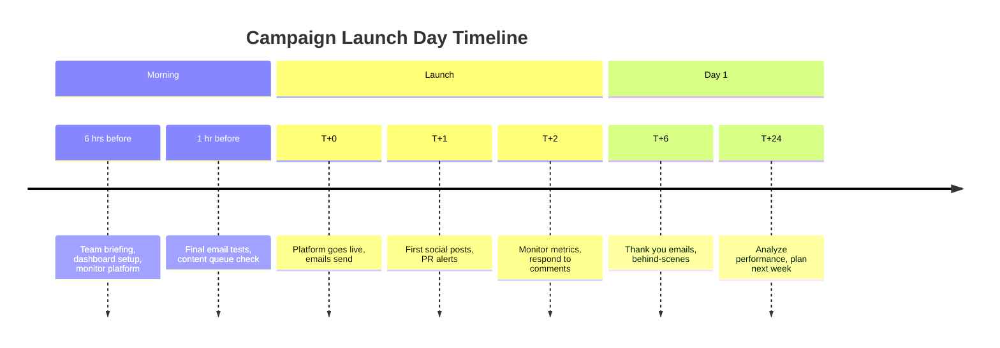
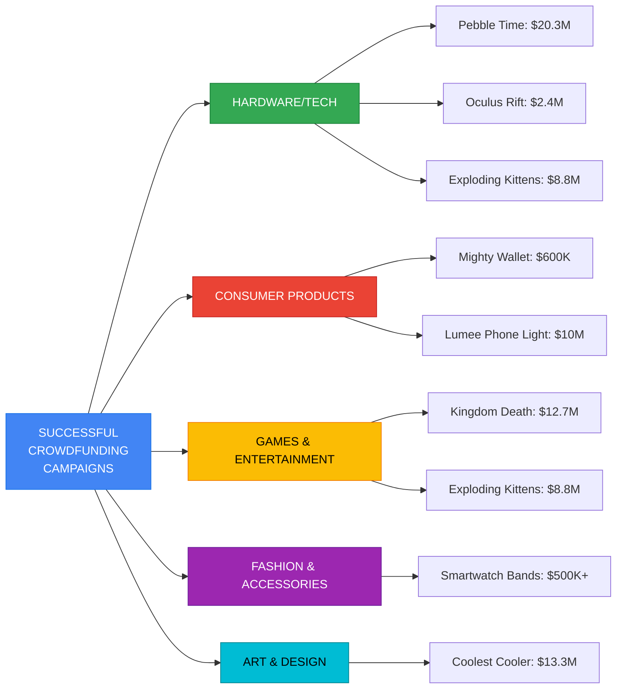
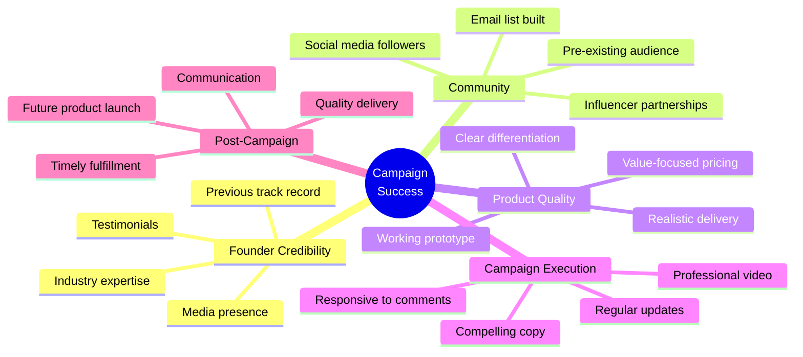

# Rewards-Based Crowdfunding Playbook
## Zero-Equity Funding Method for Startups (Kickstarter, Indiegogo)

---

## 1. OVERVIEW

### What is Rewards-Based Crowdfunding?

Rewards-based crowdfunding is a non-dilutive funding model where creators launch public campaigns to pre-sell products or services. Backers receive physical rewards (products), digital perks, or experiences in exchange for funding. No equity is given up, and founders maintain 100% ownership.

### Why Elite Founders Choose This Model

- **Zero Dilution**: Keep full ownership and control
- **Market Validation**: Presell before manufacturing (de-risk product)
- **Customer Acquisition**: Build initial user base at scale
- **Runway Extension**: Fund operations without debt
- **PR & Traction**: Media coverage and social proof for future fundraising
- **Early Feedback**: Iterate based on backer input before full launch

### Typical Funding Ranges

| Campaign Size | Target Amount | Backer Count | Avg Pledge |
|---|---|---|---|
| Micro | $10K - $50K | 100-500 backers | $50-200 |
| Small | $50K - $250K | 500-2K backers | $100-500 |
| Medium | $250K - $1M | 2K-10K backers | $100-500 |
| Large | $1M - $5M | 10K-50K+ backers | $150-1K |

**Elite Founder Truth**: Most successful founders treat crowdfunding as a structured product launch, not a funding emergency.

### Crowdfunding Campaign Workflow

```mermaid
graph TD
    A["PLANNING PHASE<br/>Weeks 1-8"] --> B["Market Research<br/>Competitor Analysis<br/>Platform Selection"]
    B --> C["Audience Building<br/>Email List 3000+<br/>Social Media Growth"]
    C --> D["Product Strategy<br/>Reward Tiers<br/>Pricing Architecture"]
    D --> E["CONTENT CREATION<br/>Weeks 4-10"]
    E --> F["Video Production<br/>Campaign Copy<br/>Visual Assets"]
    F --> G["Press Outreach<br/>Influencer Partnerships<br/>Media Kit"]
    G --> H["PRE-LAUNCH<br/>Weeks 8-11"]
    H --> I["Campaign Page<br/>Testing & QA<br/>Creator Preview"]
    I --> J["Buzz Building<br/>Email Sequences<br/>Social Teases"]
    J --> K["LAUNCH DAY"]
    K --> L["ACTIVE CAMPAIGN<br/>Days 1-60"]
    L --> M["Daily Management<br/>Momentum Tracking<br/>Early Backers"]
    M --> N["Updates & Stories<br/>Backer Engagement<br/>Comments Response"]
    N --> O["Press Coverage<br/>Media Features<br/>Influencer Posts"]
    O --> P["Final Push<br/>Last Week Sprint<br/>Urgency Messaging"]
    P --> Q["CAMPAIGN CLOSES"]
    Q --> R["FULFILLMENT<br/>Weeks 12-24"]
    R --> S["Manufacturing<br/>Quality Control<br/>Backer Updates"]
    S --> T["Shipping<br/>Delivery Tracking<br/>Customer Support"]
    T --> U["POST-CAMPAIGN"]
    U --> V["Feedback Collection<br/>Product Iterations<br/>Future Planning"]

    style A fill:#e1f5ff
    style E fill:#fff3e0
    style H fill:#f3e5f5
    style L fill:#e8f5e9
    style R fill:#fce4ec
    style U fill:#f1f8e9
```



### Campaign Timeline Phases Overview

| Phase | Duration | Key Objectives | Success Metrics |
|-------|----------|-----------------|-----------------|
| Planning | Weeks 1-8 | Build audience, validate product, design tiers | 3K+ email, 2K+ social following |
| Content Creation | Weeks 4-10 | Create compelling campaign materials | Video 3-5min, >500 email list after teaser |
| Pre-Launch | Weeks 8-11 | Test campaign, build anticipation | Page views >1K, press inquiries received |
| Active Campaign | Days 1-60 | Achieve funding goal, maximize engagement | Daily momentum, >2000 backers, >75% goal |
| Fulfillment | Weeks 12-24+ | Manufacture, ship, support customers | On-time delivery, <5% support issues |

---

## 2. HOW TOP-TIER FOUNDERS IDENTIFY OPPORTUNITIES

### A. Market Readiness Assessment

**Founder Question Checklist:**
- [ ] Do I have compelling evidence customers want this?
- [ ] Is the product manufacturable/deliverable within 12-18 months?
- [ ] Can I fulfill at the promised reward levels profitably?
- [ ] Do I already have an engaged audience or can I build one pre-launch?
- [ ] Is there a clear, understandable problem my product solves?
- [ ] Can I communicate the value proposition in <10 seconds?

### B. Platform Selection Strategy

**Kickstarter** (Product, Tech, Games, Design Focus)
- **URL**: https://www.kickstarter.com
- **Audience**: Tech enthusiasts, design-conscious consumers, creative community
- **Best for**: Hardware, consumer products, design-forward items, art, games, film, music
- **Strength**: Brand recognition, quality bar, "all-or-nothing" funding builds urgency
- **Commission**: 5% + payment processor (3-5% Stripe/PayPal) = 8-10% total
- **Timeline**: 30-60 day typical campaigns (30 days recommended for momentum)
- **Funding Model**: All-or-nothing (must hit goal or no money changes hands)
- **Prohibited**: Equity, loans, charity, real estate, financial services
- **Eligibility**:
  - Must be 18+ years old
  - Must have valid government ID
  - Must have bank account in supported countries (US, UK, Canada, Australia, NZ, Netherlands, Denmark, Ireland, Norway, Sweden, Germany, France, Spain, Italy, Austria, Belgium, Switzerland, Luxembourg, Hong Kong, Singapore, Mexico, Japan, Poland, Greece, Slovenia)
  - Project must fit into one of 13 approved categories
  - Must create something new (not selling existing inventory)
  - Cannot offer equity, revenue share, or financial incentives
- **Average Success Rate**: 38.92% of projects funded
- **Most Funded Categories**: Games ($1.4B+ all time), Design, Technology

**Indiegogo** (Broader, Tech + Ideas, International)
- **URL**: https://www.indiegogo.com
- **Audience**: Global, more diverse product categories, international backers
- **Best for**: Tech, gadgets, consumer products, broader categories, causes
- **Strength**: Global reach, flexibility (fixed vs flexible funding), InDemand for post-campaign
- **Commission**: 5% platform fee (fixed) or 9% (flexible) + payment processor (3-5%)
- **Timeline**: 30-90 day campaigns possible (60 days recommended)
- **Funding Models**:
  - **Fixed Funding**: All-or-nothing (like Kickstarter)
  - **Flexible Funding**: Keep what you raise even if goal not met (higher fees)
- **InDemand**: Continue accepting pre-orders after campaign ends
- **Prohibited**: Financial instruments, gambling, drugs, offensive material
- **Eligibility**:
  - Must be 18+ years old
  - Available in 235+ countries (more flexible than Kickstarter)
  - Bank account required in supported country
  - Government-issued ID required
  - More permissive category requirements
- **Average Success Rate**: ~17% of projects funded (flexible funding lowers bar)
- **Unique Features**: Indiegogo Ventures (equity crowdfunding arm), partnerships with retailers

**Specialized Platforms**
- **Backerkit**: https://www.backerkit.com - Excellent fulfillment and backer management post-campaign
  - Used by 30,000+ creators
  - Survey tools for backer data collection
  - Add-on store for upsells
  - Analytics and pledge manager
  - Cost: Starts at $0, scales to 1-2% of funding

- **Republic**: https://republic.com/crowdfunding - Equity + rewards hybrid
  - Allows offering both equity stakes and rewards
  - Securities registered with SEC
  - $10 minimum investment
  - Good for tech startups wanting community + capital

- **Patreon**: https://www.patreon.com - Recurring revenue for creators
  - Monthly subscription model
  - Best for content creators, artists, podcasters
  - 5-12% platform fee
  - Build sustainable recurring income

- **GoFundMe**: https://www.gofundme.com - Personal causes and charity
  - Best for charitable causes, not business products
  - 0% platform fee (payment processing 2.9% + $0.30)
  - Not suitable for product launches

- **Crowdfunder**: https://www.crowdfunder.com - B2B and accredited investors
  - Best for B2B products and services
  - Accredited investor network
  - Equity crowdfunding options

- **SeedInvest**: https://www.seedinvest.com - Equity crowdfunding
  - SEC-registered funding portal
  - Equity-based (not rewards)
  - $500K-$5M typical raises
  - Rigorous vetting (1-2% acceptance rate)

### Comprehensive Platform Comparison Matrix

```
PLATFORM COMPARISON MATRIX: Choose Your Crowdfunding Platform

+────────────────────┬──────────────┬─────────────────────┬──────────────┬──────────────┐
│ Platform           │ URL          │ Funding Model       │ Commission   │ Best For     │
├────────────────────┼──────────────┼─────────────────────┼──────────────┼──────────────┤
│ KICKSTARTER        │ kickstarter  │ All-or-Nothing      │ 5% + 3-5%    │ Hardware,    │
│                    │ .com         │ (must hit goal)     │ processor    │ Design,      │
│                    │              │                     │ = 8-10%      │ Games, Tech  │
│                    │              │                     │              │ (US, UK,     │
│                    │              │                     │              │ CA, EU+)     │
├────────────────────┼──────────────┼─────────────────────┼──────────────┼──────────────┤
│ INDIEGOGO          │ indiegogo    │ Fixed or Flexible   │ 5% (fixed)   │ Tech, Global │
│                    │ .com         │ Flexible keeps      │ 9% (flex)    │ Products,    │
│                    │              │ funds even w/o goal │ + 3-5%       │ Broader      │
│                    │              │                     │ processor    │ Categories   │
│                    │              │                     │              │ (235+        │
│                    │              │                     │              │ countries)   │
├────────────────────┼──────────────┼─────────────────────┼──────────────┼──────────────┤
│ CROWDSUPPLY        │ crowdsupply  │ All-or-Nothing      │ 8-10% +      │ Hardware,    │
│                    │ .com         │ or Flexible         │ payment      │ Open-source, │
│                    │              │                     │ processor    │ Maker        │
│                    │              │                     │              │ Projects     │
├────────────────────┼──────────────┼─────────────────────┼──────────────┼──────────────┤
│ REPUBLIC.COM       │ republic     │ Equity + Rewards    │ 10-15% +     │ Tech/Web3    │
│                    │ .com         │ Hybrid              │ processing   │ Startups,    │
│                    │              │ SEC-regulated       │              │ Community    │
│                    │              │                     │              │ + Capital    │
├────────────────────┼──────────────┼─────────────────────┼──────────────┼──────────────┤
│ PATREON            │ patreon.com  │ Recurring Subs      │ 5-12% +      │ Creators,    │
│                    │              │ Monthly             │ payment      │ Artists,     │
│                    │              │                     │ processor    │ Podcasters   │
├────────────────────┼──────────────┼─────────────────────┼──────────────┼──────────────┤
│ GOFUNDME           │ gofundme.com │ All-or-Nothing      │ 0% platform  │ Causes,      │
│                    │              │ Keep what you raise │ 2.9% + $0.30 │ Charitable,  │
│                    │              │                     │              │ Personal     │
├────────────────────┼──────────────┼─────────────────────┼──────────────┼──────────────┤
│ BACKERKIT          │ backerkit    │ Post-Campaign       │ Free or      │ Fulfillment  │
│                    │ .com         │ Management          │ 1-2% of      │ Management   │
│                    │              │ (not a platform)    │ funding      │ + Surveys    │
├────────────────────┼──────────────┼─────────────────────┼──────────────┼──────────────┤
│ SEEDINVEST         │ seedinvest   │ Equity (JOBS Act)   │ 10-15%       │ Early-Stage  │
│                    │ .com         │ SEC-regulated       │ commission   │ Startups,    │
│                    │              │                     │              │ Investor     │
│                    │              │                     │              │ Network      │
├────────────────────┼──────────────┼─────────────────────┼──────────────┼──────────────┤
│ CROWDFUNDER        │ crowdfunder  │ Equity or Rewards   │ 8-10% +      │ B2B, Accredi │
│                    │ .com         │ Platform choice     │ processing   │ ted Investors│
├────────────────────┼──────────────┼─────────────────────┼──────────────┼──────────────┤
│ FUNDLY             │ fundly.com   │ All-or-Nothing      │ 4.9% + 2.2%  │ Non-profits, │
│                    │              │ or Flexible         │ processor    │ Community,   │
│                    │              │                     │              │ Creative     │
└────────────────────┴──────────────┴─────────────────────┴──────────────┴──────────────┘
```

**Platform Selection Decision Tree:**

```
START: Choosing Your Crowdfunding Platform
    │
    ├─→ Is it a physical hardware/tech product?
    │   ├─→ YES & Focus on Western markets (US/UK/EU)?
    │   │   └─→ KICKSTARTER (best brand recognition)
    │   │
    │   ├─→ YES & Global reach needed?
    │   │   └─→ INDIEGOGO (235+ countries)
    │   │
    │   └─→ YES & Open-source/maker focused?
    │       └─→ CROWDSUPPLY (technical audience)
    │
    ├─→ Is it a game or entertainment product?
    │   └─→ KICKSTARTER (best community, 50%+ of games success)
    │
    ├─→ Do you want to offer equity + rewards?
    │   └─→ REPUBLIC (SEC-regulated, tech-focused)
    │
    ├─→ Is it recurring subscription content?
    │   └─→ PATREON (monthly recurring revenue model)
    │
    ├─→ Is it a charitable/cause campaign?
    │   └─→ GOFUNDME (no platform fees, 0% commission)
    │
    └─→ Need post-campaign backer management?
        └─→ BACKERKIT (survey tools, pledge manager, add-ons)
```

### Additional Resources by Function

**Research & Competitive Analysis:**
- Kickstarter Explorer: https://www.kickstarter.com/discover - Browse all categories
- BackerKit Data: https://www.backerkit.com/analytics - Campaign analytics
- CrowdData: https://www.crowddata.com - Crowdfunding analytics and tracking
- Graphtreon: https://graphtreon.com - Patreon campaign tracking
- FundedToday: https://www.fundedtoday.com/blog - Expert commentary
- Kickstarter Blog: https://www.kickstarter.com/blog - Official insights

**Video Production & Templates:**
- Loom: https://www.loom.com - Quick video recording ($12/mo)
- HubSpot Video: https://www.hubspot.com/products/crm/video - Email video
- Beautiful.ai: https://www.beautiful.ai - AI slide presentations
- Animaker: https://www.animaker.com - Animated explainer videos
- Powtoon: https://www.powtoon.com - Video presentations

**Email & Audience Building:**
- ConvertKit: https://convertkit.com - Creator email platform ($29+/mo)
- Substack: https://substack.com - Newsletter building (free/$12+/mo)
- Mailchimp: https://mailchimp.com - Email marketing (free/$20+/mo)
- ActiveCampaign: https://www.activecampaign.com - Automation platform ($9+/mo)
- Klaviyo: https://www.klaviyo.com - E-commerce marketing ($20+/mo)

**Social Media & Community:**
- Discord: https://discord.com - Free community building
- Circle: https://circle.so - Membership community platform
- Mighty Networks: https://www.mightynetworks.com - Community app
- Slack: https://slack.com - Team communication ($12.50+/user/mo)
- Telegram: https://telegram.org - Messenger group for updates (free)

**Project Management & Analytics:**
- Asana: https://asana.com - Project management (free/$13.49+/mo)
- Monday.com: https://monday.com - Work OS ($99+/mo)
- Airtable: https://airtable.com - Database + automation (free/$20+/mo)
- Mixpanel: https://mixpanel.com - Event analytics ($999+/mo)
- Amplitude: https://amplitude.com - Product analytics (free/$995+/mo)

**Press & Influencer Outreach:**
- Cision: https://www.cision.com - Media relations database ($1500+/mo)
- Meltwater: https://www.meltwater.com - Press monitoring ($2000+/mo)
- BuzzSumo: https://buzzsumo.com - Content and influencer tracking ($99+/mo)
- Upfluence: https://www.upfluence.com - Influencer database ($499+/mo)
- Aspire.io: https://aspire.io - Influencer intelligence platform

**Payment Processing & Fulfillment:**
- Stripe: https://stripe.com - Payment processing (2.2% + $0.30)
- 2Checkout: https://2checkout.com - Multi-currency (3.5% + $0.35)
- Shippo: https://shippo.com - Multi-carrier shipping ($0.10 per label)
- Printful: https://www.printful.com - Print-on-demand fulfillment
- Shopify Fulfillment: https://www.shopify.com - 3PL network

**Learning & Community:**
- Kickstarter Creator School: https://www.kickstarter.com/learn - Free courses
- Skillshare: https://www.skillshare.com - Crowdfunding courses
- MasterClass: https://www.masterclass.com - Entrepreneur lessons
- Reddit r/crowdfunding: https://reddit.com/r/crowdfunding - Community Q&A
- Indie Hackers: https://www.indiehackers.com - Founder community

### C. Founder Market Fit Indicators

Elite founders look for:
1. **Existing Audience**: 5K+ engaged followers on any platform (email, Twitter, TikTok, Instagram)
2. **Industry Expertise**: 5+ years in relevant space
3. **Credibility Signals**: Previous exits, media appearances, university affiliation
4. **Team**: Co-founders with product, marketing, or business development experience
5. **Manufacturing Relationships**: Proven ability to produce at scale
6. **Launch Timeline**: Product can launch within 12-18 months post-campaign

### D. Competitive Landscape Analysis

Before committing to campaign:
- Search category on Kickstarter/Indiegogo for competitors
- Analyze top 5 campaigns in your space:
  - Funding levels achieved
  - Backer count and average pledge
  - Campaign length
  - Video style and messaging
  - Reward tier structure
  - Updates frequency and engagement
- Identify white space: What worked? What gaps exist?

---

## 2.5 CAMPAIGN PREPARATION TOOLKIT & RESOURCES

### Essential Platforms & Tools by Function

#### Video Production Tools
| Tool | Cost | Best For | Key Features |
|------|------|----------|--------------|
| **Adobe Premiere Pro** | $23.49/mo | Professional editing | Color grading, effects, 4K support |
| **Final Cut Pro** | $300 one-time | Mac video editing | High-performance, magnetic timeline |
| **DaVinci Resolve** | Free or $295 | Color correction + editing | Industry-standard color grading |
| **Loom** | Free/$12/mo | Quick screen recording | Easy share links, instant editing |
| **Descript** | Free/$12/mo | Script-based editing | Auto-captions, transcript-based editing |
| **Canva Video** | Free/$180/yr | Quick promo videos | Templates, easy customization |
| **CapCut** | Free | Social media shorts | TikTok/Reels optimization |

**Video Production Resources:**
- **MakerCrate**: https://makercrate.io - Stock footage for makers
- **Epidemic Sound**: https://www.epidemicsound.com - Royalty-free music library
- **Pixabay**: https://pixabay.com - Free stock footage and music
- **CreatorKit**: https://creatorkit.com - AI video templates for campaigns

#### Campaign Page Building & Analytics
| Tool | Cost | Best For | Integration |
|------|------|----------|------------|
| **Kickstarter** | 5% + fees | Direct platform | Built-in analytics, backer management |
| **Indiegogo** | 5-9% + fees | Global platform | Multiple funding models available |
| **BackerKit** | Free/$1-2% of funding | Post-campaign management | Survey tools, fulfillment tracking |
| **Google Analytics** | Free | Campaign traffic tracking | Source tracking, user behavior |
| **Hotjar** | Free/$89/mo | User behavior heatmaps | Session recording, conversion funnels |
| **Mixpanel** | Free/$999+/mo | Advanced event tracking | Custom events, retention analysis |

**Campaign Page Optimization:**
- **Unbounce**: https://unbounce.com - Landing page builder ($74+/mo)
- **Leadpages**: https://www.leadpages.net - Quick signup pages (Free/$25/mo)
- **ConvertKit**: https://convertkit.com - Email + landing pages ($25+/mo)

#### Email & Communications
| Tool | Cost | Best For | Subscribers |
|------|------|----------|------------|
| **ConvertKit** | Free/$29+/mo | Creator audiences | Unlimited emails, automation |
| **Mailchimp** | Free/$20+/mo | General email marketing | Up to 500 contacts free |
| **Klaviyo** | Free/$20+/mo | E-commerce campaigns | Advanced segmentation |
| **Substack** | Free/$12+/mo | Newsletter building | Built-in monetization |
| **Brevo (Sendinblue)** | Free/$20+/mo | Multi-channel | SMS + Email |

#### Social Media Management
| Tool | Cost | Best For | Platforms |
|------|------|----------|-----------|
| **Buffer** | Free/$5+/mo | Scheduling | Twitter, LinkedIn, Instagram, Facebook |
| **Later** | Free/$25+/mo | Visual planning | Instagram, TikTok, Pinterest, Facebook |
| **Hootsuite** | Free/$49+/mo | Multi-account | 35+ platforms |
| **Sprout Social** | $89+/mo | Enterprise management | Advanced analytics |
| **TweetDeck** | Free | Twitter management | Real-time monitoring |

#### Design & Visuals
| Tool | Cost | Best For | Output |
|------|------|----------|--------|
| **Figma** | Free/$12/mo | Collaborative design | Prototypes, mockups, vectors |
| **Adobe Creative Suite** | $59.49/mo | Professional design | Complete creative toolkit |
| **Canva Pro** | $180/yr | Quick marketing graphics | 1000s of templates |
| **Photoshop** | $23.49/mo | Photo editing | Advanced retouching |
| **Illustrator** | $23.49/mo | Vector graphics | Logos, icons, illustrations |

#### Analytics & Tracking
| Tool | Cost | Best For | Metrics |
|------|------|----------|---------|
| **Google Sheets** | Free | Campaign tracking | Custom dashboards, formulas |
| **Tableau** | Free/$70+/mo | Data visualization | Interactive dashboards |
| **Metabase** | Free/$480+/yr | Business intelligence | SQL queries, drill-down |
| **Airtable** | Free/$20+/mo | Workflow automation | Relational databases, automations |
| **Monday.com** | Free/$99+/mo | Project management | Timeline tracking, collaboration |

#### Press & Outreach Tools
| Tool | Cost | Best For | Features |
|------|------|----------|----------|
| **Cision** | $1500+/mo | Enterprise PR | 90M+ media contacts |
| **Meltwater** | $2000+/mo | Media intelligence | PR tracking and analytics |
| **Hunter.io** | Free/$49/mo | Finding journalists | Email verification |
| **RocketReach** | Free/$99/mo | Contact database | Sales/PR outreach |
| **Slack** | $12.50+/user/mo | Team communication | Journalist networking groups |
| **Twitter/X** | Free | Direct outreach | Connecting with journalists |

#### Legal & Compliance
| Tool | Cost | Best For | Key Features |
|------|------|----------|------------|
| **LegalZoom** | $199+ | Legal documents | Terms of service, privacy policy |
| **Stripe** | 2.2% + $0.30 | Payment processing | Secure transactions |
| **2Checkout** | 3.5% + $0.35 | Multi-currency | Global payment support |
| **Shopify Tax** | Free | Tax calculation | Automatic tax computation |

### Pre-Campaign Checklist by Week

**Week 1-2: Research & Strategy**
- [ ] Identify top 10 competitor campaigns in your category
- [ ] Create competitive analysis spreadsheet
- [ ] Set funding goal (based on research, not wishful thinking)
- [ ] Define success metrics (minimum, optimal, stretch)
- [ ] Choose platform (Kickstarter vs. Indiegogo)
- [ ] Set campaign duration (30 vs. 45 vs. 60 days)

**Week 3-4: Product & Rewards**
- [ ] Finalize reward tier structure (4-6 tiers recommended)
- [ ] Calculate manufacturing costs and margins (minimum 40% margin)
- [ ] Determine delivery timeline (realistic shipping date)
- [ ] Set stretch goals (3-5 goals, meaningful rewards)
- [ ] Create fulfillment plan (backer survey template)
- [ ] Identify fulfillment partner (local vs. 3PL)

**Week 5-6: Audience Building**
- [ ] Set up email list (ConvertKit, Mailchimp, Klaviyo)
- [ ] Create lead magnet (PDF guide, discount code)
- [ ] Build social media profiles (Twitter, Instagram, TikTok)
- [ ] Create content calendar for 8-week pre-launch
- [ ] Identify 10-15 micro-influencers in your niche
- [ ] Draft influencer partnership emails
- [ ] Start email list building (target: 3K before launch)

**Week 7-8: Video & Content**
- [ ] Plan video script (problem → solution → call-to-action)
- [ ] Shoot product videos (main video + 3-5 supplementary)
- [ ] Edit main campaign video (target: 3-5 minutes)
- [ ] Write campaign page copy (compelling, benefit-focused)
- [ ] Design visual assets (reward tier images, stretch goal graphics)
- [ ] Gather testimonials from beta users/testers
- [ ] Create FAQ document
- [ ] Design stretch goal graphics

**Week 9-10: Pre-Launch Setup**
- [ ] Complete platform campaign page setup
- [ ] Add video, copy, images to campaign page
- [ ] Set up payment processing (Stripe, PayPal verification)
- [ ] Configure backer communication settings
- [ ] Enable comments and discussion (if applicable)
- [ ] Create backup/contingency communication channels
- [ ] Set up analytics tracking (Google Analytics, Mixpanel)
- [ ] Create monitoring dashboard (Google Sheets or Tableau)

**Week 11: Final Preparation**
- [ ] Full campaign page QA (links, formatting, mobile responsiveness)
- [ ] Test payment processing
- [ ] Prepare launch email to list (3-5 versions, A/B ready)
- [ ] Schedule launch day social posts (12-15 posts ready)
- [ ] Set up automated email sequences (day 1, day 7, day 30, final day)
- [ ] Brief team/advisors on launch day tasks
- [ ] Prepare press release and media kit
- [ ] Identify backup communication plan if platform goes down

---

## 2.6 DETAILED CAMPAIGN LAUNCH GUIDE (Complete Timeline)

### Campaign Launch Day Playbook (60-Day Campaign Example)

#### DAY 1: LAUNCH DAY (T+0)

**Morning (6 hours before launch)**
- Tools: Slack, Google Sheets, Buffer
- [ ] Send final test emails to team
- [ ] Brief all team members on their roles
- [ ] Monitor platform status (Kickstarter/Indiegogo status pages)
- [ ] Prepare team communication channel (Slack #campaign-live)
- [ ] Set up real-time dashboard (Google Sheets with live metrics)
- [ ] Prepare 15-20 social media posts (queue in Buffer or Hootsuite)

**Launch Hour (T+0:00 - T+1:00)**
- Tools: Email platform, Twitter/X, Buffer
- [ ] Go live on platform at exact scheduled time
- [ ] Send launch email to full email list (ConvertKit/Mailchimp)
- [ ] Post launch announcement on Twitter/X (3-5 posts staggered)
- [ ] Post to LinkedIn (if B2B product)
- [ ] Post to Reddit (r/IAmA or relevant subreddits)
- [ ] Post to Product Hunt (if applicable)
- [ ] Alert press contacts (media kit attached)
- [ ] Post to relevant Facebook groups
- [ ] Notify micro-influencers (pre-arranged)

**Hours 1-6 (T+1:00 - T+6:00)**
- Tools: Campaign platform dashboard, email, social monitoring
- [ ] Monitor funding velocity (track every 30 minutes)
- [ ] Respond to ALL comments within 30 minutes
- [ ] Watch for first technical issues
- [ ] Retweet and engage with supporters
- [ ] Share early backer stories (if available)
- [ ] Check payment processing (test transactions)
- [ ] Monitor email delivery rates

**Hours 6-24 (T+6:00 - T+24:00)**
- Tools: Mixpanel, Google Analytics, Hotjar
- [ ] Send first thank you email to early backers (ConvertKit)
- [ ] Post behind-the-scenes content (Instagram Stories, TikTok)
- [ ] Continue social media engagement
- [ ] Analyze which traffic sources are converting best
- [ ] Share initial milestone (first 100 backers, first $10K, etc.)
- [ ] Monitor for negative comments or complaints
- [ ] Begin reaching out to journalists for coverage
- [ ] Schedule next 7 days of social content

**Launch Day Success Metrics to Track:**
- Total backers (target: 100-200 on day 1)
- Total funding (target: $5K-$20K depending on goal)
- Conversion rate (target: >5% visitors to backers)
- Traffic sources (which are driving most volume)
- Top comment themes (what questions/concerns)
- Email open rate (target: >40%)
- Email click rate (target: >10%)



### WEEK 1: ESTABLISH MOMENTUM (Days 2-7)

**Daily Routine (Repeat Days 2-7):**

**Morning Standup (30 minutes)**
- Review previous day metrics
- Check for major comments or issues
- Plan day's content calendar
- Identify top-performing posts

**Mid-Day Update (2 hours)**
- Send day 2-3 email sequence (Mailchimp/ConvertKit)
- Post social media updates (1-2 per social platform)
- Respond to all new comments (target: within 2 hours)
- Monitor funding velocity
- Check press coverage and respond to journalists

**Evening Check (1 hour)**
- Analyze daily metrics
- Plan next day content
- Prepare email for next morning
- Note any technical issues

**Weekly Milestones to Plan:**
- Day 2: Celebrate first 100-200 backers milestone
- Day 3: Share customer testimonials or use cases
- Day 4: Post behind-the-scenes manufacturing/development
- Day 5: Highlight top reward tier (high-value backer story)
- Day 6: Mid-week momentum push (urgency messaging)
- Day 7: Week 1 recap and week 2 preview

**Tools in Use:**
- Email: ConvertKit/Mailchimp (daily sequences)
- Social: Buffer/Hootsuite (10-15 posts scheduled)
- Monitoring: Google Analytics, Mixpanel
- Communication: Slack for team coordination
- Comments: Campaign platform + BotSentinel (for comment monitoring)

**Week 1 Success Targets:**
- Reach 20-30% of funding goal
- Accumulate 500-2000 backers
- Email list growth: +50% (from campaign mentions)
- Social media followers: +200-500 new followers
- Press mentions: 3-5 earned media pieces
- Conversion rate: 3-5%

### WEEKS 2-4: SUSTAIN MOMENTUM (Days 8-28)

**Content Calendar Framework:**

| Week | Focus | Content Type | Key Goal |
|------|-------|-------------|----------|
| Week 2 | Problem/Solution | Educational content | Build credibility |
| Week 3 | Competition | Comparison posts | Show differentiation |
| Week 4 | Customer Stories | Testimonials/case studies | Build social proof |

**Twice-Weekly Updates (on campaign platform):**
- Monday/Wednesday: Substantive updates (500-1000 words)
- Friday: Quick milestone update or visual content

**Update Content Ideas:**
- Day 8: Manufacturing partnerships revealed
- Day 12: Customer testimonial compilation
- Day 15: Mid-campaign milestone celebration (50% funded)
- Day 18: Competitor comparison
- Day 22: Stretch goal preview
- Day 25: Celebrity/influencer endorsement

**Email Sequence Template (Weeks 2-4):**
- Tuesday email: Educational content (product benefits)
- Thursday email: Social proof (testimonials, reviews)
- Saturday email: Urgency messaging (time/quantity limited)
- Bonus email: If campaign momentum slows (<5% daily growth)

**Tools & Frequency:**
- Emails: 3x per week (ConvertKit/Mailchimp)
- Social posts: 10-15 per week across all platforms
- Campaign updates: 2-3 per week minimum
- Comments: Response time <2 hours on 80% of comments
- Monitoring: Daily metrics check

**Weeks 2-4 Success Targets:**
- Reach 60-75% of funding goal
- Accumulate 2000-5000 backers
- Daily funding velocity: 2-5% of goal per day
- Conversion rate: 2-4% (typically declining from week 1)
- Email open rates: 25-35%
- Engagement per post: 50-200 likes/comments/shares

### WEEKS 5-6: FINAL SPRINT (Days 29-42)

**Week 5 Strategy: Persistence Through the "Trough"**

Many campaigns experience a motivation dip in week 5. Combat this with:

**Early Week 5 Activities (Days 29-35):**
- [ ] Send special "Week 5 Insider" email with exclusive content
- [ ] Launch limited-time bonus tier (15-20% premium, limited quantity)
- [ ] Invite top backers to private community (Discord/Slack)
- [ ] Share manufacturing progress photos/video
- [ ] Post testimonial video from early backer
- [ ] Announce first stretch goal achievement
- [ ] Preview next stretch goal reward

**Week 6 Strategy: Activation for Home Stretch**

The final 2 weeks are critical. 30% of campaigns experience >20% of total funding in final week.

**Late Campaign Activities (Days 36-42):**
- [ ] Increase email frequency to daily (days 43-60)
- [ ] Activate affiliate/ambassador referral program (10% commission)
- [ ] Share countdown graphics ("14 days left!")
- [ ] Highlight scarcity: "Only X spots left at Early Bird pricing"
- [ ] Post daily progress videos or updates
- [ ] Reach out personally to hesitant (non-backing) email list members
- [ ] Launch podcast/video appearances (if booked earlier)

**Weeks 5-6 Success Targets:**
- Reach 80-95% of funding goal
- Accumulate 3000-7000 backers
- Build momentum for final push
- Email open rates: 20-30%
- Conversion rate: 1-2% (declining as low-hanging fruit converted)

### FINAL WEEK: ALL-IN SPRINT (Days 43-60)

**Daily Routine: Final Week Intensity**

**Daily Email:** Send 1 email per day (morning, 9-10am in your timezone)
- Content rotation:
  - Monday: Countdown + scarcity messaging
  - Tuesday: New testimonial
  - Wednesday: Behind-the-scenes
  - Thursday: Last chance/final stretch goal push
  - Friday: "48 hours left" urgency
  - Saturday: "24 hours left" final push
  - Sunday: "Last 6 hours" extreme urgency

**Social Media:** 3-5 posts per day across Twitter/Instagram/TikTok
- Include countdown graphics
- Share live metrics ("We've raised $X, help us reach $Y!")
- Highlight remaining reward tier quantities

**Campaign Updates:** 2-3 final updates
- Day 43: Celebrate achievement, preview future
- Day 50: "Final 10 days" milestone and gratitude
- Day 57: Final thank you and community message

**Last-Minute Tactics:**
- [ ] Personal outreach to top 20 influencers (request final push)
- [ ] Surprise bonus tier (day 54-57): Ultra-premium, limited quantity
- [ ] Video message from founder (final appeal)
- [ ] Customer testimonial compilation video
- [ ] Activate dormant email list segment (last-chance offer)

**Final Hours Countdown (Day 60):**
- T-24 hours: Email "24 hours left"
- T-12 hours: Social posts every 2 hours
- T-6 hours: Final email + social blitz
- T-1 hour: Last notification
- T-0: Campaign closes, thank you post

**Final Week Success Targets:**
- Exceed funding goal (aim for 100-150% of target)
- Reach 5000-10000+ backers
- Final week = 30%+ of total campaign funds
- Daily funding velocity: Peak day should hit 5-10% of goal
- Email open rates: 25-40% (high urgency drives opens)
- Final conversion rate: 1-3%

### Campaign Monitoring Dashboard (Google Sheets Template)

Create this spreadsheet to track daily:

**Daily Metrics Tracking:**
| Date | Day | Total Raised | Daily Raised | # Backers | Daily Backers | Avg Pledge | % of Goal | Velocity | Notes |
|------|-----|--------------|--------------|-----------|---------------|------------|-----------|----------|-------|
| Day 1 | 1 | $15,000 | $15,000 | 250 | 250 | $60 | 3% | 450%* | Strong launch |
| Day 2 | 2 | $22,000 | $7,000 | 380 | 130 | $58 | 4.4% | 350% | Normal dip |

*Velocity = (Daily raised / Goal) * 100

**Weekly Summary Dashboard:**
- Week 1 Performance (target: 10-20% of goal)
- Week 2 Performance (target: 15-25% of goal, cumulative 25-45%)
- Week 3 Performance (target: 15-25% of goal, cumulative 40-70%)
- Week 4 Performance (target: 15-25% of goal, cumulative 55-95%)
- Week 5 Performance (target: 5-15% of goal, cumulative 60-100%+)
- Week 6 Performance (target: 5-15% of goal, cumulative 65-115%+)
- Week 7-8 Performance (target: 20-35% of goal, cumulative 85-150%+)

**Traffic Source Tracking:**
- Kickstarter featured (% of traffic)
- Direct + email (% of traffic)
- Social media (% of traffic)
- Press/media (% of traffic)
- Other (% of traffic)
- Top-performing source conversion rate

**Email Metrics Tracking:**
- List size growth
- Open rates by day/time
- Click-through rates
- Unsubscribe rate
- Conversion rate (email→pledge)

---

## 3. THE 12-STEP ELITE FOUNDER PROCESS

### PHASE 1: FOUNDATION (Weeks 1-8)

#### Step 1: Campaign Research & Strategy (Week 1)
**Objective**: Validate campaign viability and define success metrics

**Actions:**
- Identify 10+ competitor campaigns in your category
- Create comparison matrix:
  - Funding goal and amount raised
  - Backer count
  - Funding percentage of goal
  - Campaign duration
  - Average pledge size
  - Geographic concentration
- Set realistic funding goal:
  - Target 20-30% of top competitor if established category
  - Or 25% stretch, 75% confident goal if new category
- Define success metrics:
  - Minimum funding target (survival goal)
  - Optimal funding target (resource goal)
  - Stretch target (scale goal)
  - Required backer count (customer validation)

**Tools**: Kickstarter Search, Indiegogo Browse, Google Sheets for analysis

**Key Insight**: Elite founders set funding goals based on actual customer demand, not capital needs. A $100K goal with 2,000 backers validates more than $500K from 100 backers.

---

#### Step 2: Audience & Email List Building (Weeks 1-8)
**Objective**: Pre-campaign audience of 3,000+ engaged followers minimum

**Pre-Campaign Audience Building (Concurrent):**

**Email List Foundation:**
- Build to 2,000-5,000 emails minimum before launch
- Create lead magnet tied to product:
  - Free mini guide: "How to Choose [Product Category]"
  - Early bird discount code (10-20% off): Exclusive to email subscribers
  - Insider updates: Exclusive behind-the-scenes content
- Platforms: ConvertKit, Klaviyo, Substack, Mailchimp
- Target lists: Industry databases, past customers, partner audiences

**Social Media Foundation:**
- **Twitter/X**: 1,000+ followers in startup/maker communities
  - Thread format: Product journey, behind-the-scenes development
  - Engagement: Reply to category leaders, participate in maker discussions
  - Cadence: 3-5 posts/week
  - Goal: Build to 2K+ followers by campaign launch

- **Instagram/TikTok**: 2,000-5,000+ followers if product is visual
  - Content: Product development, founder story, lifestyle integration
  - Cadence: Daily TikTok, 4-5x/week Instagram
  - Goal: Reach 50-100K views on key product-focused posts

- **YouTube** (if applicable): Start channel, post 3-5 deep-dive videos
  - Format: Product comparison, tutorial, problem explanation
  - Length: 5-10 minutes
  - Goal: 500+ subscribers, good engagement rate

- **LinkedIn** (for B2B products): 3,000+ connections in target industry
  - Content: Industry insights, funding journey, founder perspective
  - Cadence: 2-3 posts/week
  - Goal: 5-10K profile views monthly

**Strategic Partnerships:**
- Identify 10-20 micro-influencers (10K-100K followers) in category
- Reach out 6-8 weeks pre-launch: "Want to be a campaign ambassador?"
- Offer: Early access, exclusive reward tier, commission on referrals (5-10%)
- Negotiate press coverage post-launch

**Data Collection:**
- Set up analytics dashboard tracking:
  - Email list growth rate
  - Social follower growth
  - Website traffic
  - Engagement rates
- Target metrics before launch:
  - Email: 3,000+ subscribers (minimum 5,000 ideal)
  - Twitter: 2,000+ followers
  - Instagram: 5,000+ followers (if relevant)
  - Website: 2,000+ monthly visits

**Tools**: ConvertKit, Mailchimp, Substack, Twitter Analytics, Linktree, Later

---

#### Step 3: Product & Reward Tier Architecture (Weeks 2-6)
**Objective**: Design compelling reward tiers that drive revenue and engagement

**Reward Tier Framework (Most Successful Structure):**

For most products, use 4-6 tiers:

```
Tier 1 - "Early Believer" / Collector Tier
  Price: $1-5
  Offer: Digital perk only (PDF guide, exclusive content, project updates)
  Purpose: Engage budget-conscious backers, increase backer count, social proof
  Volume target: 10-15% of total backers

Tier 2 - "Entry" / Standard Product Tier
  Price: 30-50% discount off retail MSRP
  Offer: Base product + exclusive early backer bonus
  Purpose: Convert most backers, core revenue source
  Volume target: 60-70% of total backers
  Example: "Standard Edition + Limited Exclusive Sticker Pack"

Tier 3 - "Super Supporter" / Premium Tier
  Price: 15-25% discount off retail MSRP
  Offer: Product + premium bonus + limited quantity + recognition
  Purpose: Capture enthusiasts willing to pay full/near-full price
  Volume target: 10-15% of total backers
  Example: "Deluxe Edition + Signed Certificate + Private Community Access"

Tier 4 - "Founder's Circle" / VIP Tier
  Price: 150-300% of retail MSRP
  Offer: Product + premium perks + lifetime benefits + personalization
  Purpose: High-value customer capture + PR
  Volume target: 2-5% of total backers
  Example: "Complete Bundle + Lifetime Updates + Private Dinner with Founder"

Tier 5 - "Custom/Add-on" Tiers (Optional)
  Price: Variable
  Offer: Extra products, shipping upgrades, customization options
  Purpose: Capture different use cases and increase average pledge
```

**Pricing Psychology for Elite Founders:**

1. **Anchor Effect**: Lead with your highest price to make mid-tier seem reasonable
2. **Decoy Pricing**: Make one tier intentionally "bad value" to push people to better options
3. **Multiple of Charity**: Always include a tier that donates portion to charity (5% bonus backer goodwill)
4. **Stretch Add-ons**: Allow backers to add extra products at campaign prices (15-20% capture rate)

**Reward Design Best Practices:**

- **Limit quantities on premium tiers**: "Only 50 Available" creates urgency
- **Specify exact delivery date**: "Ships June 2025" builds confidence
- **Include risk mitigation**: "Full refund until [date]" reduces anxiety
- **Build in fulfillment margin**: 5-15% extra units for replacements/damage
- **Stretch goals are rewards**: Plan 3-5 stretch goals that add value:
  - $250K: Free shipping tier
  - $500K: Add new feature/color
  - $750K: Extended warranty
  - $1M: Perpetual license/updates

**Margin Architecture (Critical for Elite Founders):**

- Calculate all costs: Product manufacturing, shipping, packaging, platform fees (8-10%), payment processor, taxes
- Target margins: 30-50% on mid-tier for operating cushion
- Build in 15-20% contingency for fulfillment overruns
- Example: If product costs $30 to deliver:
  - Retail price: $99
  - Early bird price: $49 (50% discount)
  - Your margin after all costs: $15-20
  - At 1,000 backers: $15K-20K operating profit

---

### PHASE 2: CONTENT CREATION (Weeks 4-10)

#### Step 4: Campaign Video Production (Weeks 4-8)
**Objective**: Create 2-3 compelling video assets for campaign launch

**Main Campaign Video (60-90 seconds)**

**Structure (Proven to Convert):**
1. **Hook (0-5 seconds)**: Problem statement or emotional moment
   - "Tired of [pain point]?"
   - Visual: Show the problem in action

2. **Story (5-25 seconds)**: Why you built this
   - Personal connection to problem
   - "I spent 3 years trying to solve this..."
   - Visual: Founder on camera, authentic

3. **Solution (25-45 seconds)**: How product solves problem
   - Product demo in real-world use
   - Key features highlighted
   - Show it working, not specs

4. **Why Now (45-60 seconds)**: Why crowdfunding, why this moment
   - Market timing
   - Team readiness
   - Community opportunity

5. **Call to Action (60-90 seconds)**: What to do next
   - "Back our campaign today"
   - Show reward tiers
   - Trust signals (certifications, previews)
   - Urgency (limited quantities, early bird deadline)

**Video Production Best Practices:**

- **Quality over polish**: Authentic, well-lit founder footage beats slick corporate video
- **Founder on screen**: Builds trust; most successful campaigns feature founder prominently
- **Real product**: Show actual product, not renders (unless pre-prototype)
- **Multi-angle shots**: Stationary camera is boring; use varied angles and transitions
- **On-screen text**: Key messages on-screen (people watch with sound off)
- **Music**: Upbeat, energetic, royalty-free (YouTube Audio Library)
- **Pacing**: Fast cuts (every 3-5 seconds), dynamic feel
- **Mobile-first**: Test on phone; 70% campaign page views are mobile

**Secondary Assets (Create 2-3):**

1. **Feature Breakdown Video** (90-120 seconds)
   - Deep dive on 3-4 key features
   - Show comparisons to existing solutions
   - Use before/after footage

2. **Founder/Team Interview** (2-3 minutes)
   - "Why we're funding this way"
   - Expertise, background, passion
   - Plant flags for press credibility

3. **Testimonial/Customer Social Proof** (45-60 seconds)
   - Pre-backer quotes, beta user feedback
   - "This changed how I work..."
   - 3-4 short clips strung together

**Video Platform & Distribution:**
- Host on YouTube (platform-agnostic, embeds well)
- Post to TikTok, Instagram Reels for organic reach pre-launch
- Create 15-second clips for Twitter, LinkedIn
- Embed main video prominently on campaign page

**Tools**: iPhone 14+, Adobe Premiere/Final Cut Pro, DaVinci Resolve (free), Descript, Adobe Audition

**Timeline:**
- Script and storyboard: 1 week
- Shoot footage: 2-3 days (full team + backup days)
- Edit and refine: 2 weeks
- Test and optimize: 1 week
- Total: 4-5 weeks before launch

---

#### Step 5: Campaign Page Copy & Messaging (Weeks 5-9)
**Objective**: Write conversion-optimized campaign page copy

**Campaign Page Section Breakdown:**

**Title (Critical)**
- Format: "[Product Name]: [Value Proposition]"
- Length: 50-70 characters
- Examples:
  - "Ember: Smart Travel Mug That Never Lets Coffee Cool"
  - "Oura: Sleep Tracking Smart Ring"
  - "Blok: Modular Storage for the Modern Home"
- A/B test: Create 2-3 title variations, test pre-launch with focus group

**Subtitle/Tagline**
- 1-2 sentences
- Reinforce value: "Backed by MIT researchers. The first [category] to achieve [outcome]."
- Create urgency or intrigue

**Main Campaign Description (1,000-1,500 words)**

**Section 1 - The Problem (150-200 words)**
- Start with relatable pain point
- Use data: "2 million people struggle with [X]"
- Show emotional impact: How does this problem affect daily life?
- End with "What if there was a better way?"

**Section 2 - The Solution (200-300 words)**
- Introduce product with 1-2 key visuals
- Explain how it solves the problem
- List 5-7 key features with benefit statements:
  - Feature: "Solar-powered battery"
  - Benefit: "Never runs out of charge, 100% sustainable"
- Include technical specifications if relevant
- Use diagrams, graphics, exploded views

**Section 3 - The Team (150-200 words)**
- Founder bio: Background, relevant experience
- Team members: Skills, relevant background (1-2 sentences each)
- Social proof: Prior success, credentials, publications
- High-quality photos (professional, authentic)

**Section 4 - The Plan (100-150 words)**
- Development status: "Prototype fully functional"
- Timeline: "Campaign end → Production → Shipping [Month Year]"
- Risk assessment: "Here's what could delay delivery" (transparency builds trust)
- Mitigation: "Here's how we're reducing risk"

**Section 5 - FAQ (5-7 common questions)**
- "When will I receive my reward?"
- "What happens if you don't reach your goal?"
- "Do you offer international shipping?"
- "What if there's a manufacturing delay?"
- "Can I change my tier after backing?"
- "Who are your manufacturing partners?"

**Section 6 - Updates & Press (Emerges during campaign)**
- Paste campaign updates
- Link to press coverage
- Testimonials from trusted sources

**Copywriting Principles for Rewards Crowdfunding:**

1. **Lead with benefit, not feature**
   - Bad: "3000mAh battery with USB-C"
   - Good: "Lasts 5 days on a single charge"

2. **Use power words**: Revolutionary, first, only, exclusive, limited, proven, guaranteed

3. **Social proof early and often**
   - "Trusted by 50,000+ users"
   - "Featured in Forbes, Wired, TechCrunch"
   - "Pre-launch testing shows 95% satisfaction"

4. **Specificity over generality**
   - Bad: "Makes your life easier"
   - Good: "Save 30 minutes daily on [specific task]"

5. **Build credibility**
   - Include credentials: "Designed by MIT-trained engineers"
   - Show process: "2 years in development"
   - Share risk: "Here's what could go wrong" (transparency wins trust)

6. **Create urgency without desperation**
   - Good: "Only 100 Early Bird units at 50% off (limit per backer)"
   - Bad: "PLEASE HELP US WE NEED THIS MONEY"

7. **Mobile optimization**
   - Short paragraphs (2-3 sentences max)
   - Subheadings for scanning
   - Bullet points, not walls of text
   - Large, readable fonts

---

#### Step 6: Press & Influencer Outreach Preparation (Weeks 6-10)
**Objective**: Generate pre-launch buzz and media coverage

**Press List Building (3-4 weeks before launch):**

Identify 50-100 relevant journalists, bloggers, and reporters:
- **Tier 1 Media**: TechCrunch, Wired, Forbes, The Verge, Engadget (reach for but low probability)
- **Tier 2 Media**: Category-specific blogs, podcasts, YouTube channels (50K-500K audience)
- **Tier 3 Media**: Micro-influencers, niche communities, industry newsletters (10K-50K audience)

**Personalized outreach (not mass email):**
- Find journalist's email (often firstname.lastname@publication.com or check Twitter bio)
- Reference their recent relevant article: "Loved your piece on [topic], this aligns with..."
- Keep email to 3-4 sentences
- Include link to exclusive pre-launch preview
- Ask for: Coverage timing, interview, feature consideration

**Influencer Ambassador Program (Weeks 6-8):**

- Identify 15-25 micro-influencers in space (10K-100K followers)
- Send personalized DM: "Your audience would love this..."
- Offer: Free product, affiliate commission (5-10%), exclusive promo code
- Brief them: Key talking points, hashtags, launch date
- Coordinate: Stagger their posts across launch week (Monday-Friday for maximum coverage)

**Timing Strategy:**
- Week before launch: Send press releases
- 2 days before launch: Embargoed media access
- Launch day: Influencer posts go live
- Week after: Follow-up with momentum stories

**Tools**: Hunter.io, RocketReach, Twitter, Substack, Product Hunt

---

### PHASE 3: PRE-LAUNCH & LAUNCH (Weeks 8-12)

#### Step 7: Pre-Launch Campaign Page & Testing (Weeks 8-10)
**Objective**: Set up campaign page, add to project, gather email signups

**Technical Setup:**
1. Create campaign on Kickstarter/Indiegogo
   - Fill out all required fields
   - Upload video, images, campaign copy
   - Set funding goal and stretch goals
   - Configure reward tiers and shipping
   - Set campaign end date (30-45 days typical)
   - Add rich media: YouTube embeds, image galleries, GIFs
   - Enable comments and community features

2. Set to "Coming Soon" mode
   - Generate unique campaign URL
   - Create landing page (Carrd, Webflow, Notion) that mirrors campaign message
   - Add email capture on landing page: "Notify me at launch" + incentive
   - Point email signup form to your email list

3. Campaign Preview & Testing (1 week)
   - Share with 20-50 beta testers
   - Request feedback on:
     - Clarity of message
     - Video engagement and length
     - Reward tier appeal
     - Likely backing amount
     - Any confusion points
   - Test on mobile, tablet, desktop
   - Verify all links, videos, images work
   - Test reward tier configurations
   - Review all copy for typos, clarity

4. Finalize Image Assets
   - Campaign hero image: 1920x1080px, compelling, shows product in use
   - Reward tier images: Clear shots of each tier's offerings
   - Team photos: Professional, authentic headshots
   - Process photos: Manufacturing, design, testing process
   - Community/social proof images: Previous products, user testimonials

---

#### Step 8: Pre-Launch Buzz Building (Weeks 9-11)
**Objective**: Build momentum pre-launch, "coming soon" email signups

**Email Campaign (Send 3-4 emails pre-launch):**

Email 1 (3 weeks before launch): "Something's coming..."
```
Subject: Introducing [Product Name] - Coming [Date]

Hi [Name],

For the past [X] years, I've been obsessed with solving [problem].

I'm excited to announce that [Product Name] is launching on [Platform] on [Date].

We've designed it to [key benefit]. Unlike [existing solutions], [Product Name]
[unique value proposition].

Want early access to the campaign? Join our founder's circle:

[BUTTON: Get Early Access]

We're rewarding our earliest supporters with 50% off the campaign price - but only
for the first 48 hours.

Talk soon,
[Founder Name]
```

Email 2 (1 week before launch): "Here's what we built"
```
Subject: Meet [Product Name] - Launches [Specific Date] at [Specific Time]

Hi [Name],

Our campaign goes live in 7 days.

[Product Name] is the first [category descriptor] to achieve [specific outcome/feature].

Here's what makes it different:
- [Key feature 1] - [benefit]
- [Key feature 2] - [benefit]
- [Key feature 3] - [benefit]

[Embed YouTube video or GIF]

We're launching with exclusive early-bird pricing that's 50% off retail -
but this tier is limited to the first 48 hours.

[BUTTON: Reserve Your Spot Now]

See you at launch,
[Founder Name]
```

Email 3 (Launch day morning): "It's Live"
```
Subject: [Product Name] is LIVE on Kickstarter

Hi [Name],

Today is the day.

The [Product Name] campaign is now live: [DIRECT CAMPAIGN LINK]

For the next 48 hours, we're offering the "Early Believer" tier at 50% off retail price.

We've limited this tier to 500 units to ensure we can deliver on our promises.

Back the campaign now: [DIRECT CAMPAIGN LINK]

First 100 backers also receive [exclusive bonus] as our thank you.

Let's build this together,
[Founder Name]
```

Email 4 (24 hours before early bird ends): "Last Chance"
```
Subject: ⏰ Last chance for 50% off [Product Name]

Hi [Name],

The 50% early-bird discount expires in 24 hours.

After tomorrow, the early-bird tier is gone - you'll have access to our standard price tiers.

[DIRECT CAMPAIGN LINK]

See you there,
[Founder Name]
```

**Social Media Campaign (Launch week):**

Daily posts across channels:
- **Monday launch**: Big announcement, video launch
- **Tuesday**: Customer testimonial video
- **Wednesday**: Feature breakdown post
- **Thursday**: Founder story/why this mission matters
- **Friday**: Press coverage roundup + momentum update

**Launch Day Checklist:**
- [ ] Campaign is live and tested
- [ ] Notify email list 1 hour after going live
- [ ] Post announcement across all social channels
- [ ] Share with 50-100 personal network (email, text, group chats)
- [ ] Activate influencer ambassador posts
- [ ] Monitor campaign page for comments and questions (respond within 4 hours)
- [ ] Watch early traction - document numbers for press follow-up
- [ ] Prepare first update if significant early momentum

---

### PHASE 4: ACTIVE CAMPAIGN (Weeks 12-16)

#### Step 9: Daily Campaign Management & Momentum (Weeks 12-16)
**Objective**: Maintain momentum, hit funding goal by day 7, then scale

**Campaign Momentum Lifecycle (Typical):**

```
Days 1-3: Launch surge (30-40% of funding comes here)
  - You and your network backing
  - Email list activation
  - Influencer posts going live
  - Initial press coverage
  Action: Monitor closely, respond to every comment, celebrate milestones

Days 4-7: Early momentum decay (natural dip, 10-15% daily)
  - Initial hype fades
  - Need to re-activate audience
  Action: Release first campaign update, share press coverage, activate second wave of network

Days 8-21: Middle phase (5-10% daily)
  - Influencer/press campaigns continue
  - Community engagement drives growth
  - Organic discovery through platform
  Action: Release 2-3 meaty updates, share testimonials, build social proof

Days 22-end: Final push (5-15% daily)
  - Scarcity/urgency messaging
  - Final influencer campaigns
  - Last stretch goals announcements
  Action: Daily updates on stretch goals, final 48hr push

Days end-final week: Final surge (15-30% of total)
  - FOMO effect kicks in
  - News of campaign success attracts new backers
  - Media coverage peaks
  Action: Hourly updates on final days, thank yous, last celebration
```

**Daily Activities (Active Campaign):**

**Morning (30 mins):**
- Check overnight metrics:
  - New backers count
  - Total funding
  - Comments and questions
  - Social media mentions
- Respond to all comments (respond within 4 hours max)
- Monitor press coverage

**Midday (30 mins):**
- Prepare social media post (different message daily)
- Check email metrics:
  - Open rates on campaign updates
  - New email signups
  - Link click-through rates

**Evening (45 mins):**
- Post to all social channels
- Engage with backer community:
  - Like and respond to social mentions
  - Engage with comments
  - Host Q&A in comments section
- Review metrics, identify trends
- Plan tomorrow's content

**Weekly Activities:**
- Release official campaign update (Tuesday or Wednesday, midweek)
- Host social media event:
  - Live Q&A on Twitter/Instagram
  - AMA (Ask Me Anything) in comments
  - Behind-the-scenes TikTok series
- Activate next tier of outreach:
  - Week 1: Personal network + email list
  - Week 2: Influencer partners + paid ads start
  - Week 3: Press coverage + podcast appearances
  - Week 4: Retargeting + final push + stretch goals

---

#### Step 10: Campaign Updates & Storytelling (Ongoing)
**Objective**: Keep backers engaged, demonstrate progress, build trust

**Update Cadence:**
- Minimum: 1 update per week
- Ideal: 2-3 updates per week
- Best: Daily updates in final 10 days

**Update Types (Rotate to maintain interest):**

**Type 1: Milestone Celebration** (Post on day 3, day 7, day 14, day 21, etc.)
```
Title: We hit $250K! Thank you!

We just hit $250K in funding, and we couldn't have done this without you!

When we launched this campaign 4 days ago, we hoped for [X]. To have [Y] backers
support our mission is humbling and energizing.

This funding means:
- We can manufacture [X units]
- We can add [new feature] that backers requested
- We can deliver by [month]
- We can invest in [sustainability initiative]

What's next:
- Days 5-7: Push for [stretch goal]
- Days 8-14: Manufacturing partnerships finalization
- Days 15+: [Next phase]

Thank you for believing in this mission.

[Founder Name]
```

**Type 2: Behind-the-Scenes** (Every 3-4 days)
```
Title: Inside our manufacturing process

I wanted to show you exactly where your products will be made.

This week, our team visited our manufacturing partner in [location].
Here's what I learned:

[3-4 photos of manufacturing process]

Key insight: Unlike [competitors], our manufacturer uses [sustainable/quality]
methods that align with our values.

Our timeline remains:
- Campaign ends: [Date]
- Manufacturing starts: [Date]
- Shipping begins: [Date]

Questions? Ask in the comments - I read every single one.

[Founder Name]
```

**Type 3: Community & Testimonial** (Every 4-5 days)
```
Title: What backers are saying

We've been blown away by the community response. Here's what backers are saying:

[Include 3-4 testimonial quotes + names + backer images]

One theme we're hearing: "This changed how I [specific benefit]"

If you haven't joined yet, here's why 5,000+ backers have:
- [Key feature/benefit #1]
- [Key feature/benefit #2]
- [Key feature/benefit #3]

[BUTTON: Join the Community]

[Founder Name]
```

**Type 4: Stretch Goal Announcement** (When approaching next milestone)
```
Title: New stretch goal unlocked! 🎯

Great news - we're 85% of the way to our next stretch goal: $[X amount].

If we hit this goal, we're adding [new feature/benefit] to ALL rewards tiers.

Here's what it means:
- More sustainable packaging
- Extended warranty
- Lifetime software updates
- [Community benefit]

Last time: [X days] remaining. Let's make this happen!

Share this campaign with anyone who'd love [product category].

[Founder Name]
```

**Type 5: Progress Update** (Mid-campaign, weeks 2-3)
```
Title: Campaign update: Here's what we've learned

We're 50% of the way through our campaign, and we want to share what we've learned
from you.

Top 3 requests from backers:
1. [Request + our response]
2. [Request + our response]
3. [Request + our response]

We're incorporating [request 1] into [reward tier]. We'll explore [request 2] as a
post-campaign add-on. [Request 3] is in our long-term roadmap.

This is what we love about crowdfunding - direct feedback from our users.

Keep the ideas coming in the comments!

[Founder Name]
```

**Type 6: Risk & Transparency** (If delays or challenges emerge)
```
Title: Update: Manufacturing timeline shift

I want to be transparent about a challenge we're facing.

Our original timeline had shipping beginning in [month]. We've just learned that
[specific reason - new regulation, component shortage, etc.] will push this to [new month].

Here's what this means for you:
- You'll receive your order by [specific date]
- We're offsetting the delay with [bonus addition]
- We're committed to clear communication every step

We chose to delay rather than compromise on quality. Your [product] will be worth the wait.

Questions? I'm here in the comments.

[Founder Name]
```

**Update Publishing Strategy:**
- **Best day**: Tuesday-Thursday (avoid Monday, Friday, weekend drops)
- **Best time**: 10 AM or 2 PM [your timezone]
- **Post length**: 200-400 words (mobile-optimized)
- **Media**: Always include 2-4 photos/videos with update
- **Engagement**: Ask question at end to drive comments

---

#### Step 11: Press Coverage & Earned Media (Ongoing)
**Objective**: Secure coverage that drives campaign awareness and credibility

**Press Release #1: Campaign Launch (Day 1)**

Subject: FOR IMMEDIATE RELEASE: [Company] Launches [Product] on Kickstarter

```
[CITY, STATE] - [DATE] - [Company Name], founded by [Founder], today launched
[Product Name] on Kickstarter, seeking $[goal] to bring [product] to market.

[Product Name] is the first [category] to [unique achievement/feature].

"We've spent [X years] solving [problem]," said [Founder]. "Today, we're excited to
share our solution with a community that needs it."

Key features:
- [Feature 1 - benefit]
- [Feature 2 - benefit]
- [Feature 3 - benefit]

The campaign is live at: [DIRECT KICKSTARTER LINK]

About [Company]: [2-3 sentences on mission, team, traction]

For press inquiries, interviews, or product samples, contact:
[Name]
[Email]
[Phone]
```

**Press Release #2: Milestone Achievement (When 50% funded)**

Subject: [Product] Smashes Kickstarter Goal, Raises $[X] with [X] Days Left

```
[Product] campaign exceeds original funding goal by [X]%, demonstrating strong
market demand for [value proposition].

Key achievement:
- $[amount] raised from [X] backers in [X] days
- Average pledge of $[amount], indicating serious customer commitment
- [Press coverage metrics]: Featured in [publication], [publication], [publication]

"This support validates that the market was ready for [product]," said [Founder].

What's next:
- Stretch goal at $[amount]: Will unlock [benefit]
- Manufacturing begins: [date]
- Shipping timeline: [month/year]

Media contact: [Name], [Email]
```

**Pitch Process (Daily for 2-3 weeks during campaign):**

1. **Tier 1 targets** (TechCrunch, Wired, Forbes): Personalized email from founder
   - Subject: [Founder Name] + [Product Name] - Exclusive story
   - Offer: Exclusive interview with founder, early sample access
   - Goal: Land 1-2 tier 1 pieces (low probability but high impact)

2. **Tier 2 targets** (Category blogs, larger podcasts): Warm intro from network
   - Personalized outreach
   - Offer: Interview, sample, exclusive data
   - Goal: Land 5-10 tier 2 pieces

3. **Tier 3 targets** (Niche newsletters, micro-influencers): Direct Twitter/email
   - Short, specific pitch
   - Offer: Product sample, affiliate commission
   - Goal: Land 20+ tier 3 pieces

**Track press coverage in campaign updates** - "Featured in [Publication]" builds credibility

---

#### Step 12: Fulfillment Planning & Post-Campaign Transition (Weeks 10-16)

**Objective**: Prepare for fulfillment before campaign even ends

This begins mid-campaign but extends into post-campaign phase.

**Pre-Fulfillment Setup (Weeks 10-12):**

1. **Finalize Manufacturing**
   - Lock in supplier contracts
   - Specify quantities for each reward tier
   - Establish quality control standards
   - Confirm delivery timeline
   - Arrange payment: Typically 50% upfront, 50% on delivery

2. **Set Up Fulfillment Platform**
   - Use Backerkit or similar for backer data management
   - Collect shipping address, preference data, fulfillment details
   - Avoid manual spreadsheets - automate everything
   - System should handle:
     - Shipping label generation
     - International customs forms
     - Tracking number distribution
     - Customer service ticketing

3. **Arrange Fulfillment Partner** (If not self-fulfilling)
   - 3PL (Third-Party Logistics) provider
   - Negotiate rates based on backer count + volume
   - Establish SLA: 95% shipped within [timeframe]
   - Test: Run pilot with 100 units before full shipment

4. **Budget for Fulfillment**
   - Manufacturing cost: [X] per unit
   - Shipping (average): [Y] per unit
   - Packaging: [Z] per unit
   - Fulfillment services: [W] per unit
   - Contingency (10%): [C]
   - Total cost per backer: [TOTAL]
   - Must be < 70% of average pledge to stay profitable

5. **Establish Post-Campaign Support Process**
   - Customer service email: support@[company].com
   - Response time: 24 hours maximum
   - Common issues: Damaged product, lost shipment, duplicate order
   - Process: Investigate → Solution (replacement/refund) within 7 days
   - Budget: 2-3% of total funding for replacements/support

6. **Create Fulfillment Timeline**
   - Campaign end date: [Date]
   - Backer data finalization: [+5 days]
   - Manufacturing complete: [month/year]
   - Shipment to fulfillment partner: [month/year]
   - Shipping window: [month/year]
   - 95% delivered by: [month/year]
   - Final stragglers by: [month/year]

7. **Plan Post-Campaign Communication**
   - Weekly updates on manufacturing progress
   - Monthly progress report with photos/video
   - 2-week shipping notification with tracking
   - Post-delivery survey (gather feedback)
   - 30-day follow-up: "How's your [product]?"
   - Opportunity for second product interest

---

## 4. COMMON PITFALLS & HOW TO AVOID THEM

### Critical Mistakes That Kill Campaigns

**1. Insufficient Pre-Launch Audience Building**

**Mistake**: Launching with <1,000 email subscribers, thinking "build it and they will come"

**Reality**:
- 90% of successful campaigns have 3,000+ engaged audience members pre-launch
- First 48 hours determine 70% of campaign success
- Platform discovery is unreliable - you must bring your own traffic

**Impact**: Campaign funds at 5-10% of goal, never gains momentum, fails

**Solution**:
- Build email list to 3,000+ minimum before launch
- Spend 3-6 months building social audience
- Pre-validate demand with landing page tests
- If you don't have audience, DELAY launch and build it first

**Real Example**:
- Campaign A: 500 email subscribers, raised $12K/$50K goal (24% funded) - FAILED
- Campaign B: 5,000 email subscribers, raised $187K/$50K goal (374% funded) - SUCCESS
- Same product category, same quality. Only difference: pre-launch audience.

---

**2. Setting Unrealistic Funding Goals**

**Mistake**: Setting goal based on "what you need" rather than "what market will bear"

**Reality**:
- Funding goal should be 50-75% of your actual need
- Psychological barrier: $100K goal feels riskier to backers than $50K goal
- Better to overfund a $50K goal than underfund a $100K goal

**Impact**: Large funding goals scare backers, reduce conversion, campaign fails

**Solution**:
- Research 10+ competitor campaigns in your category
- Set goal at 50-75% of median funding in category
- Use stretch goals to fund actual needs beyond base goal
- Consider: "What's the MINIMUM we need to ship?" = Your funding goal

**Real Example**:
- Smartwatch Campaign A: $500K goal, raised $387K (77%) - FAILED (lost all funding)
- Smartwatch Campaign B: $100K goal, raised $2.4M (2,400%) - SUCCESS (Pebble)
- Campaign B set achievable goal, then scaled with stretch goals.

---

**3. Poor Video Quality or Wrong Video Approach**

**Mistake**:
- No video at all
- Video is too long (5+ minutes)
- Video is all product specs, no emotion
- Overproduced corporate video lacking authenticity

**Reality**:
- Campaigns with video raise 4x more than campaigns without
- 50% of viewers drop off after 60 seconds
- Founder authenticity > production quality
- People back people, not products

**Impact**: Low conversion rate, campaign struggles

**Solution**:
- ALWAYS include video (minimum 60-90 seconds)
- Show founder on camera (builds trust)
- Lead with problem/emotion, not features
- Keep it under 2 minutes
- Test on mobile (70% of views)
- Include captions (30% watch with sound off)

**Real Example**:
- Campaign A: No video, raised $8K/$35K (23%) - FAILED
- Campaign B: 90-second founder video, raised $112K/$35K (320%) - SUCCESS

---

**4. Overly Complex or Confusing Reward Tiers**

**Mistake**:
- 15+ reward tiers
- Unclear differentiation between tiers
- No clear "best value" option
- Pricing doesn't follow psychological anchoring

**Reality**:
- Analysis paralysis kills conversions
- Backers want 1-3 clear options
- 70% of backers choose middle tier if structured well

**Impact**: Backers confused, abandon page, low conversion

**Solution**:
- Offer 4-6 tiers maximum
- Make one tier obviously the "best value" (60-70% will choose it)
- Use decoy pricing (one tier that's intentionally bad value to make others look good)
- Clear differentiation: "Standard," "Deluxe," "Ultimate"
- Limit quantities on premium tiers (scarcity)

**Real Example**:
- Campaign A: 18 tiers ranging $5-$5,000, average pledge $42 - Low conversion
- Campaign B: 5 tiers ($25, $49, $99, $199, $500), average pledge $87 - High conversion
- Same product. Campaign B's simpler structure = 2x average pledge.

---

**5. Underestimating Fulfillment Costs**

**Mistake**:
- Not calculating shipping costs accurately
- Underestimating manufacturing costs at scale
- No contingency budget for defects/replacements
- No margin for platform fees, taxes, payment processing

**Reality**:
- Total costs typically eat 60-80% of funding
- International shipping can cost 2-3x domestic
- Defect rate of 2-5% is normal
- Platform + payment processing = 8-10% of total

**Impact**: Campaign "succeeds" but loses money, can't fulfill, reputation destroyed

**Solution**:
- Calculate full cost per unit:
  - Manufacturing cost
  - Packaging cost
  - Domestic shipping ($5-15)
  - International shipping ($15-50)
  - Platform fees (8-10%)
  - Taxes (varies by jurisdiction)
  - Customer service (2-3% of total)
  - Defect replacements (3-5% of units)
- Build in 15-20% contingency
- Price tiers to maintain 30%+ margin after all costs

**Cost Breakdown Example** (Product with $99 retail):
```
Early Bird Tier: $49 (50% off)
Manufacturing cost: $18
Packaging: $3
Domestic shipping: $7
Platform fees (9%): $4.41
Payment processing (3%): $1.47
Fulfillment labor: $2
Contingency (5%): $2.45
TOTAL COST: $38.33
PROFIT PER UNIT: $10.67 (21.8% margin)

At 1,000 backers = $10,670 operating profit
(This is barely sustainable. Consider higher price or lower costs.)
```

---

**6. No Marketing Plan Beyond Launch Day**

**Mistake**:
- All marketing effort in first 3 days
- No plan for middle weeks (days 8-25)
- No influencer partnerships
- No press outreach
- Expecting organic platform discovery

**Reality**:
- Typical campaign momentum: Strong days 1-3, dies days 4-25, surge final 3 days
- Middle weeks require active marketing to maintain momentum
- Platform discovery alone generates <20% of traffic

**Impact**: Campaign hits 30% funding in first week, then flatlines, fails

**Solution**:
- **Week 1**: Personal network + email list
- **Week 2**: Influencer partnerships (schedule posts)
- **Week 3**: Press coverage (tier 2-3 media)
- **Week 4**: Paid ads + retargeting + final push
- Release 2-3 campaign updates per week
- Engage with every comment within 24 hours
- Plan stretch goals to re-activate audience

---

**7. Overpromising on Delivery Timeline**

**Mistake**:
- "Ships in 3 months" when manufacturing takes 6-9 months
- No buffer for delays
- Not accounting for manufacturing learning curve
- Ignoring supply chain realities

**Reality**:
- 75% of campaigns deliver late
- Manufacturing ALWAYS takes longer than expected
- Supply chain disruptions are common
- Delays destroy trust and reputation

**Impact**:
- Miss deadline → backers angry → bad reviews → reputation damaged → next product suffers
- Refund requests increase
- Credit card chargebacks (lose money + fees)

**Solution**:
- Conservative timeline estimation:
  - Calculate realistic manufacturing time
  - Add 30-50% buffer
  - Account for: Shipping time, customs, quality control, rework
- Communicate timeline clearly in campaign
- Update backers proactively if delays emerge
- Under-promise, over-deliver

**Example Timeline** (Hardware product):
```
Campaign ends: January 1
Finalize designs: +4 weeks → January 29
Manufacturing samples: +6 weeks → March 12
Manufacturing fixes: +4 weeks → April 9
Full production run: +10 weeks → June 18
Shipping to fulfillment: +3 weeks → July 9
Fulfillment shipping: +4 weeks → August 6

REALISTIC DELIVERY: August 2025
PROMISE IN CAMPAIGN: October 2025 (2-month buffer)
```

---

**8. Ignoring Backer Communication During Campaign**

**Mistake**:
- Not responding to comments
- No campaign updates for weeks
- Generic, template responses
- Defensive or dismissive tone

**Reality**:
- Backers expect personal engagement
- Unanswered questions kill conversion
- Updates signal active creator
- Engagement drives word-of-mouth sharing

**Impact**: Community disengages, sharing stops, momentum dies

**Solution**:
- Respond to EVERY comment within 24 hours
- Post 2-3 updates per week minimum
- Ask questions in updates to drive engagement
- Thank backers publicly
- Show vulnerability and transparency
- Turn critics into advocates with great communication

---

**9. No Product-Market Fit Validation Before Campaign**

**Mistake**:
- Launching campaign to "test if anyone wants this"
- No customer interviews
- No prototype testing
- No pre-sales or landing page validation

**Reality**:
- Crowdfunding is not a validation tool, it's a scaling tool
- You should have strong demand signals BEFORE launch
- Campaigns that fail typically had weak validation

**Impact**: Campaign launches to crickets, funding is abysmal, fails

**Solution**:
- **Before campaign**:
  - Interview 30+ potential customers
  - Build landing page with email capture → aim for 10%+ conversion rate
  - Run small paid ad tests ($100-500) to gauge interest
  - Sell 10-50 units as pre-orders manually
  - If you can't get 100 people to sign up for emails → don't launch
- Use campaign to SCALE proven demand, not discover it

---

**10. No Plan for Manufacturing Relationships**

**Mistake**:
- "We'll figure out manufacturing after we fund"
- No supplier quotes
- No manufacturing contracts
- No prototype testing at scale
- Choosing cheapest manufacturer without quality checks

**Reality**:
- Manufacturing is the #1 reason campaigns fail to deliver
- Cheap manufacturers = quality problems = angry backers
- No contract = no accountability = delays

**Impact**: Campaign funds, but you can't deliver, reputation destroyed, legal liability

**Solution**:
- **Before campaign**:
  - Get quotes from 3-5 manufacturers
  - Produce 50-100 prototype units to test process
  - Visit manufacturer facility if possible
  - Negotiate contract with delivery dates and quality standards
  - Build relationship with backup manufacturer
  - Lock in pricing for campaign volume
- Show manufacturing plan in campaign (builds trust)
- Include photos/videos of manufacturing partner

---

**11. Neglecting Stretch Goals Strategy**

**Mistake**:
- No stretch goals planned
- Stretch goals that don't benefit existing backers
- Stretch goals that are impossible to deliver
- Announcing stretch goals too late

**Reality**:
- Stretch goals re-engage audience during mid-campaign slump
- They create milestones to celebrate
- They incentivize sharing

**Impact**: Campaign plateaus, no reason for backers to re-engage or share

**Solution**:
- Plan 3-5 stretch goals BEFORE launch
- Structure at: +25%, +50%, +100%, +150%, +200% of base goal
- Benefits must apply to ALL backers (not just new ones)
- Examples:
  - +25%: Free shipping upgrade
  - +50%: New color option added
  - +100%: Extended warranty (1→2 years)
  - +150%: Premium materials upgrade
  - +200%: Companion product added
- Announce first stretch goal when 70-80% funded
- Tease future stretch goals to maintain interest

---

**12. Treating Crowdfunding as a One-Time Event**

**Mistake**:
- No plan for post-campaign engagement
- Treating backers as transactions, not relationships
- No follow-up product or offering
- Letting email list go cold

**Reality**:
- Your backers are your best customers for life
- They'll back your next campaign 10x faster
- Email list is a $100K+ asset if nurtured

**Impact**: Lose relationship, have to rebuild audience for next product

**Solution**:
- **During fulfillment**:
  - Send updates every 2 weeks on progress
  - Include behind-the-scenes content
  - Ask for feedback and ideas
- **After delivery**:
  - Send satisfaction survey
  - Ask for testimonials
  - Tease next product
  - Offer exclusive pre-order discount
- **Long-term**:
  - Monthly newsletter to backer list
  - Build community (Discord, Facebook group)
  - Launch next product to warm audience of 10K+ previous backers
  - Each campaign gets easier

---

## 5. SUCCESSFUL CAMPAIGN CASE STUDIES BY CATEGORY

### Quick Reference: Successful Campaigns by Category



### Campaign Success Patterns by Category

#### HARDWARE & TECH (Highest funding, most competitive)

**What Works:**
- Clear problem the product solves
- Working prototype or demo
- Realistic shipping timeline
- Founder credibility in tech/engineering
- Pre-existing technical audience

**Top Campaigns in Category:**
| Campaign | Year | Raised | Platform | Key Success Factor |
|----------|------|--------|----------|------------------|
| Pebble Time | 2015 | $20.3M | Kickstarter | Pre-existing 70K user base |
| Oculus Rift | 2012 | $2.4M | Kickstarter | Founder expertise (Palmer Luckey, John Carmack) |
| Pebble 2 | 2016 | $12.2M | Kickstarter | Repeat customer trust |
| Tile (Tracking) | 2014 | $2.6M | Kickstarter | Solves major pain point |

**Resources for Hardware Founders:**
- **Crowd Supply**: https://www.crowdsupply.com - Hardware-focused platform
- **Community** (Kickstarter): https://www.kickstarter.com/community - Study existing hardware campaigns
- **FCC Compliance**: https://www.fcc.gov/fcc-bin/dms/psb001.html - Regulatory requirements
- **Prototype Development**: Consider Shapeways (https://www.shapeways.com) for 3D prototypes

#### CONSUMER PRODUCTS (Diverse, moderate funding)

**What Works:**
- Strong visual appeal
- Solves real problem or improves everyday life
- Affordable pricing
- Simple, compelling messaging
- Beautiful product photography

**Top Campaigns in Category:**
| Campaign | Year | Raised | Platform | Key Success Factor |
|----------|------|--------|----------|------------------|
| Coolest Cooler | 2014 | $13.3M | Kickstarter | Emotional appeal, lifestyle benefit |
| Lumee Phone Light | 2014 | $10M+ | Kickstarter | Influencer adoption (beauty community) |
| Mighty Wallet | 2012 | $600K | Kickstarter | Solves real problem elegantly |
| Fidget Spinner | 2017 | $25K (pre-launch) | Social | Viral trend capture |

**Resources for Consumer Product Founders:**
- **Product Hunt**: https://www.producthunt.com - Pre-launch marketing
- **Photography**: Consider Hover (https://www.hover.to) for 360° product photography
- **Fulfillment**: Shippo (https://www.shippo.com) for multi-carrier shipping
- **Community**: Find subreddits relevant to your product category

#### GAMES & ENTERTAINMENT (High engagement, loyal backers)

**What Works:**
- Proven game mechanics or entertainment value
- Strong community building during campaign
- Clear delivery timeline
- Stretch goals that add real value
- Regular backer updates and engagement

**Top Campaigns in Category:**
| Campaign | Year | Raised | Platform | Key Success Factor |
|----------|------|--------|----------|------------------|
| Exploding Kittens | 2015 | $8.8M | Kickstarter | Pre-existing social media audience |
| Kingdom Death: Monster | 2012 | $12.7M | Kickstarter | Dedicated fan base, stretch goals |
| Tabletop Simulator | 2014 | $62.7K | Kickstarter | Niche but passionate audience |
| Gloomhaven | 2015 | $3.9M | Kickstarter | Gameplay videos, community engagement |

**Resources for Game Creators:**
- **Board Game Geek**: https://boardgamegeek.com - Community and resources
- **Game Creator Community**: https://www.kickstarter.com/discover/categories/games - Study game campaigns
- **Playtesting**: Set up public playtesting to build community pre-launch
- **Video: Tabletopia** (https://tabletopia.com) - Easy demo videos for board games

#### FASHION & ACCESSORIES (Growing category, visual-focused)

**What Works:**
- Unique design or innovation
- Beautiful photography and lifestyle shots
- Influencer partnerships (fashion bloggers, micro-influencers)
- Limited quantities create urgency
- Clear brand story

**Top Campaigns in Category:**
| Campaign | Year | Raised | Platform | Key Success Factor |
|----------|------|--------|----------|------------------|
| Smartwatch Bands (various) | 2015+ | $500K-$2M | Kickstarter | Accessory market opportunity |
| Stylish Tech Cases | 2016+ | $100K-$500K | Kickstarter | Fashion meets function |
| Bamboo Products | 2018+ | $50K-$300K | Kickstarter/Indiegogo | Eco-conscious positioning |

**Resources for Fashion Founders:**
- **Fashion Influencer Networks**: AspireIQ (https://www.aspireiqa.com)
- **Product Photography**: Rent a pro on Elance/Upwork
- **Fabric Sourcing**: Made-to-Measure from suppliers like Alibaba or local textile mills
- **Fashion Press**: Reach out to fashion bloggers and FashionPR contacts

#### ART & DESIGN (Creative projects, emotional connection)

**What Works:**
- Compelling artist story
- Beautiful visual examples of work
- Regular progress updates showing creative process
- Emotional connection to art/design
- Community of art enthusiasts

**Top Campaigns in Category:**
| Campaign | Year | Raised | Platform | Key Success Factor |
|----------|------|--------|----------|------------------|
| Projects by Artists | 2010+ | $10K-$1M | Kickstarter | Artist reputation and portfolio |
| Design Objects | 2012+ | $20K-$500K | Kickstarter | Aesthetic appeal and innovation |

**Resources for Artists/Designers:**
- **Design Press**: Design Observer (https://designobserver.com)
- **Art Community**: DeviantArt (https://www.deviantart.com), ArtStation
- **Process Video**: Show creative process, not just final product
- **Artist Networks**: Create network effects by cross-promoting with other artists

### Cross-Category Insights: Common Winning Patterns

All successful campaigns (regardless of category) share these patterns:



### Case Study Analysis Framework

When researching similar campaigns in your category, analyze these elements:

**1. Audience Readiness**
- What audience size did they start with?
- How did they build pre-launch buzz?
- What was their engagement rate?

**2. Messaging & Storytelling**
- What problem did they highlight?
- How did they position their solution?
- What emotional appeal did they use?

**3. Pricing Architecture**
- How many tiers did they offer?
- What was the tier distribution?
- What anchored pricing?

**4. Timeline & Velocity**
- When did they hit milestones?
- What was their daily funding velocity?
- How did momentum change over campaign?

**5. Updates & Engagement**
- How frequently did they update backers?
- What was their comment response rate?
- How did they handle negative feedback?

---

### DETAILED CASE STUDIES

### Case Study 1: Pebble Time - $20.3M (Smartwatch)

**Campaign**: Pebble Time Smartwatch (2015)
**Platform**: Kickstarter
**Goal**: $500,000
**Raised**: $20,338,986
**Backers**: 78,471
**Outcome**: Most funded Kickstarter campaign at the time

**What They Did Right**:

1. **Pre-Existing Audience**: Pebble's original 2012 campaign raised $10M+ and built a community of 68,000 backers who became evangelists
   - Email list of 200,000+ from previous campaign
   - Active subreddit with 15,000+ members
   - Twitter following of 100,000+

2. **Proven Track Record**: Already delivered original Pebble to 68,000 customers
   - Trust established through previous fulfillment
   - Reputation for quality and customer service
   - Known entity in smartwatch space

3. **Perfect Timing**: Launched before Apple Watch but after wearables trend started
   - Market validated but not saturated
   - Media hungry for smartwatch news
   - Positioned as "hacker-friendly" alternative to Apple

4. **Outstanding Video**: 2-minute video with:
   - Founder on camera (authenticity)
   - Clear product demo
   - Emotional storytelling
   - Professional but not overproduced

5. **Pricing Strategy**:
   - Early Bird: $159 (limited to 1,000 units, sold out in minutes)
   - Standard: $179 (sold 65,000+ units)
   - Retail: $199 (positioned standard tier as value)
   - Special editions: $250-400 (captured enthusiasts)

6. **48-Hour Momentum**:
   - Raised $1M in 49 minutes
   - Hit $20M goal in first week
   - Platform featured them prominently (algorithm boost)
   - Media coverage avalanche (TechCrunch, Wired, Verge, WSJ)

7. **Stretch Goals**:
   - Unlocked premium materials
   - Added new color options
   - Extended battery life
   - All benefited existing backers

**Key Lesson**: Build community and trust BEFORE big campaign. Pebble's second campaign succeeded because of their first campaign's execution.

**Delivery**: Shipped May 2015, 4 months after campaign ended. 95% on-time delivery.

**Long-term Impact**: Built to 6.5M+ lifetime users before being acquired by Fitbit for $23M in 2016 (after running out of capital, not from campaign failure).

---

### Case Study 2: Coolest Cooler - $13.2M (Product Failure)

**Campaign**: Coolest Cooler (2014)
**Platform**: Kickstarter
**Goal**: $50,000
**Raised**: $13,285,226
**Backers**: 62,642
**Outcome**: Campaign succeeded, fulfillment FAILED - cautionary tale

**What They Did Right** (Campaign Phase):

1. **Perfect Video**: Fun, energetic, showed product in use at beach party
2. **Clear Value Prop**: "Cooler with blender, speakers, USB charger, LED light"
3. **Strong Early Momentum**: Hit goal in 3 days
4. **Great Pricing**: $165 early bird vs. $300 retail (45% discount)
5. **Viral Sharing**: Video shared 50,000+ times on social media

**What They Did WRONG** (Fulfillment Phase):

1. **Underestimated Manufacturing Costs**:
   - Assumed $150 manufacturing cost per unit
   - Actual cost: $280 per unit due to complexity
   - Lost $130 per cooler sold

2. **No Contingency Planning**:
   - Raised $13M but needed $17M+ to fulfill
   - No backup funding source
   - Ran out of money mid-fulfillment

3. **Poor Manufacturing Partner Selection**:
   - Chose cheapest manufacturer
   - Quality issues required expensive rework
   - Delays pushed delivery from February 2015 to late 2016 (18-month delay)

4. **Terrible Communication**:
   - Went silent for months
   - Announced they were selling coolers at retail BEFORE fulfilling backers
   - Backers felt betrayed
   - FTC investigation launched

5. **Legal Nightmare**:
   - Class action lawsuits from backers
   - FTC settlement required refunds
   - Reputation destroyed
   - Company shut down in 2019

**Key Lesson**: Campaign success means nothing if you can't fulfill profitably and on time. Manufacturing costs MUST be calculated accurately before launch.

**Final Outcome**:
- Only ~20,000 of 62,642 backers received coolers
- 40,000+ backers never received product
- Founder's reputation destroyed
- Used as cautionary tale in every crowdfunding guide

---

### Case Study 3: Exploding Kittens - $8.8M (Card Game)

**Campaign**: Exploding Kittens Card Game (2015)
**Platform**: Kickstarter
**Goal**: $10,000
**Raised**: $8,782,571
**Backers**: 219,382
**Outcome**: Massive success, exemplary fulfillment

**What They Did Right**:

1. **Pre-Existing Audience**:
   - Creator (Matthew Inman) owned The Oatmeal, a comic site with 5M+ monthly readers
   - Email list of 500,000+
   - Announced campaign to massive pre-built audience

2. **Simple, Clear Product**:
   - Card game (easy to manufacture and ship)
   - Easy to understand in 10 seconds
   - Low manufacturing complexity = low risk

3. **Hilarious Video**:
   - 3-minute comedy sketch
   - Showed gameplay clearly
   - Leaned into creator's comic humor
   - Went viral (5M+ views)

4. **Perfect Pricing**:
   - $20 base game (affordable impulse buy)
   - Average pledge: $40 (upsells worked)
   - Low price = high volume = 219,000 backers

5. **Reward Tier Strategy**:
   - Only 4 tiers (simple)
   - $20: Base game
   - $35: Base + NSFW deck
   - $50: Base + NSFW + signed card
   - $100: Everything + premium box
   - 85% chose $20 or $35 tier

6. **Fulfillment Excellence**:
   - Shipped to all 219,000 backers within 6 months
   - On-time delivery
   - High quality cards
   - Excellent customer service

**Key Numbers**:
- Funded in 8 minutes
- Hit $1M in 8 hours
- Hit $8.7M in 30 days
- Cost per unit: ~$3 (game), $2 (shipping) = $5 total
- Revenue per unit: $40 average
- Profit margin: 87.5% = $35 profit per backer
- Total profit: ~$7.5M (after Kickstarter fees)

**Key Lesson**: Leverage existing audience + simple product + low manufacturing cost + excellent execution = massive profit and happy customers.

**Long-term Impact**: Became best-selling game on Amazon. Raised $15M Series A from venture capital based on campaign success. Now valued at $100M+.

---

### Case Study 4: Kingdom Death: Monster 1.5 - $12.4M (Niche Product)

**Campaign**: Kingdom Death: Monster 1.5 (2016)
**Platform**: Kickstarter
**Goal**: $100,000
**Raised**: $12,393,139
**Backers**: 19,264
**Outcome**: Extreme success in tiny niche

**What They Did Right**:

1. **Niche Community Mastery**:
   - Board game enthusiast niche (small but passionate)
   - Original version (2012) built community of 5,000 superfans
   - BoardGameGeek rating of 8.6/10 (top 10 all-time)
   - Cult following willing to pay premium

2. **Premium Pricing Strategy**:
   - Base game: $400 (!!!)
   - Average pledge: $643
   - Some backers pledged $2,000+
   - Total proof that volume isn't everything

3. **Quality Over Scale**:
   - Extremely high-quality miniatures
   - 100+ hours of gameplay
   - Limited production runs (exclusivity)
   - Positioned as collectible, not commodity

4. **Trust Through Delivery**:
   - Original 2012 campaign delivered successfully
   - Known for quality and customer service
   - Community vouched for creator

5. **Update Velocity**:
   - Posted 100+ updates during campaign
   - Multiple updates per week
   - Engaged with every comment
   - Built hype through transparency

**Key Numbers**:
- Average pledge: $643 (highest average pledge for any campaign >$10M)
- Only 19,264 backers (compared to Pebble's 78,471)
- Proved small, passionate niche > large, casual audience

**Key Lesson**: You don't need millions of customers if you have thousands of fanatics willing to pay premium prices. Niche + premium + quality + community = sustainable success.

**Long-term Impact**: Company now generates $5M-10M annually through direct sales. Fanbase continues to grow. Regular expansions funded through Kickstarter.

---

### Case Study 5: Fidget Cube - $6.4M (Trend Riding)

**Campaign**: Fidget Cube (2016)
**Platform**: Kickstarter
**Goal**: $15,000
**Raised**: $6,465,690
**Backers**: 154,926
**Outcome**: Massive success but competed with Chinese knockoffs

**What They Did Right**:

1. **Perfect Market Timing**:
   - Launched right as fidget trend started
   - Rode wave of "desk toy" popularity
   - Before market was saturated

2. **Simple, Relatable Product**:
   - Cube with 6 sides, each with fidget mechanism
   - Universal problem: "I fidget at my desk"
   - Anyone could understand value immediately

3. **Viral Video**:
   - 90-second demo video
   - Showed all 6 sides clearly
   - Satisfying clicks, spins, and movements
   - ASMR-like appeal
   - 20M+ views across platforms

4. **Affordable Price**:
   - $19 early bird (sold 50,000+)
   - $22 standard
   - $25 retail
   - Impulse buy territory

5. **Stretch Goals Strategy**:
   - Added new colors at funding milestones
   - Created collectibility
   - Encouraged multiple purchases

**What Went Wrong** (Post-Campaign):

1. **Chinese Knockoffs**:
   - Product was simple to copy
   - Alibaba flooded with $2 knockoffs within weeks
   - Lost potential retail sales to knockoffs

2. **No IP Protection**:
   - Didn't patent design before launch
   - Public campaign = public design
   - Competitors copied instantly

3. **Fulfillment Delays**:
   - Delivered 6 months late (December 2016 instead of June 2016)
   - By delivery time, market was saturated with fidget spinners
   - Trend had moved on

**Key Lesson**: Timing is everything. Riding a trend can work, but you must:
- Move FAST (knockoffs come quickly)
- Patent/trademark before campaign
- Have manufacturing ready to ship within 3 months
- Accept that trend-based products have short windows

**Financial Outcome**: Made ~$3M profit despite knockoffs. Founders moved on to other projects.

---

## 6. SYSTEMS & PROCESSES

### Campaign Management Stack (Recommended Tools)

**Email & List Management:**
- **ConvertKit** - https://convertkit.com (Preferred for creators: $25-79/month)
  - Automation sequences and workflows
  - Subscriber tagging and segmentation
  - Integrations with landing pages
  - A/B testing for subject lines
  - Excellent deliverability rates
  - Creator-focused templates

- **Mailchimp** - https://mailchimp.com (Free to $200+)
  - Good for larger lists (500K+ subscribers)
  - Basic automation
  - Pre-built templates
  - CRM features
  - Free tier up to 500 contacts

- **Substack** - https://substack.com (Free, takes 10% of paid subscriptions)
  - Simple newsletter platform
  - Direct reader relationship
  - Built-in payment processing
  - Great for thought leadership

- **Klaviyo** - https://klaviyo.com ($20-1,200/month)
  - E-commerce focused
  - Advanced segmentation
  - SMS marketing included
  - Predictive analytics

**Landing Page & Pre-Launch:**
- **Carrd** - https://carrd.co ($19-99/year)
  - Simple, fast, beautiful
  - Email capture built-in
  - Mobile-optimized
  - Perfect for simple pre-launch pages

- **Webflow** - https://webflow.com ($12-165/month)
  - More flexible design
  - Higher learning curve
  - No-code website builder
  - CMS features

- **Notion** - https://notion.so ($0-10)
  - Free option
  - Simple email capture with Zapier
  - Collaboration features
  - Embed anywhere

- **Unbounce** - https://unbounce.com ($90-240/month)
  - A/B testing built-in
  - Conversion optimization
  - AI-powered optimization
  - Landing page templates

- **Launchrock** - https://launchrock.com (Free-$99/month)
  - Specifically for pre-launch campaigns
  - Viral referral system
  - Email capture and analytics
  - Social sharing tools

**Social Media Management:**
- **Buffer** - https://buffer.com ($5-99/month)
  - Schedule posts across platforms
  - Analytics and best time to post
  - Team collaboration
  - Instagram first comment scheduling

- **Later** - https://later.com ($15+/month)
  - Strong for Instagram/TikTok
  - Visual content calendar
  - Hashtag suggestions
  - Link in bio tool

- **Linktree** - https://linktr.ee (Free-$180/month)
  - Centralized link destination
  - Drive traffic to campaign from bio links
  - Analytics on clicks
  - Custom branding

- **Hootsuite** - https://hootsuite.com ($99-$739/month)
  - Enterprise-level management
  - Team workflows
  - Advanced analytics
  - Social listening

**Analytics & Tracking:**
- **Google Analytics** - https://analytics.google.com (Free)
  - Website traffic source tracking
  - Conversion tracking to campaign page
  - UTM parameter tracking
  - Real-time reporting

- **Mixpanel** - https://mixpanel.com (Free-$999/month)
  - Product analytics
  - User behavior tracking
  - Cohort analysis
  - A/B testing

- **Hotjar** - https://hotjar.com ($32-171/month)
  - Heatmaps of campaign page
  - Session recordings
  - Feedback polls
  - Conversion funnel analysis

- **Kickstarter/Indiegogo native analytics**
  - Backer source tracking
  - Campaign performance metrics
  - Referral traffic data
  - Demographic information

- **Spreadsheet** (Google Sheets, Excel)
  - Manual tracking of daily metrics
  - Comparison to competitor campaigns

**Video Production & Editing:**
- **Adobe Creative Cloud** - https://adobe.com ($20-55/month)
  - Premiere Pro, After Effects
  - Professional standard
  - Industry-standard tools
  - Cloud collaboration

- **DaVinci Resolve** - https://www.blackmagicdesign.com/products/davinciresolve (Free)
  - Professional features
  - Color grading tools
  - Audio editing
  - No cost for full version

- **Descript** - https://descript.com ($12-30/month)
  - Video to text editing
  - Podcast editing
  - AI voices and transcription
  - Screen recording

- **Final Cut Pro** - https://www.apple.com/final-cut-pro ($299 one-time)
  - Mac-only editing
  - Fast rendering
  - Professional features
  - One-time purchase

- **CapCut** - https://capcut.com (Free)
  - Free mobile and desktop editing
  - TikTok-style effects
  - Auto-captions
  - Great for social media clips

- **Canva** - https://canva.com (Free-$120/year)
  - Video editing + graphics
  - Templates for social media
  - Brand kit features
  - Drag-and-drop interface

**Community & Engagement:**
- **Slack** - https://slack.com ($6.67/month)
  - Keep team coordinated
  - Quick communication
  - Integrations with 2,000+ apps
  - Channels for organization

- **Discord** - https://discord.com (Free)
  - Larger community engagement
  - Moderation tools for backer community
  - Voice channels
  - Bots for automation

- **Zapier** - https://zapier.com ($19-99/month)
  - Automate tasks between apps
  - Conditional logic for workflows
  - 5,000+ app integrations
  - No-code automation

- **Circle** - https://circle.so ($39-399/month)
  - Community platform
  - Built-in payments
  - Member directory
  - Mobile app included

**Fulfillment:**
- **Backerkit** - https://backerkit.com ($0-1% of funding)
  - Survey and data collection
  - Shipping management
  - Customer communication
  - Add-on store
  - Pledge manager

- **Shippo** - https://goshippo.com ($0.20+ per label)
  - Shipping label generation
  - Multi-carrier comparison
  - Tracking integration
  - International customs forms
  - Discounted shipping rates

- **ShipStation** - https://shipstation.com ($9.99-159.99/month)
  - Advanced shipping automation
  - Multi-channel selling
  - Branded tracking pages
  - Batch label printing

- **Fulfillrite** - https://fulfillrite.com (Custom pricing)
  - 3PL fulfillment services
  - Warehousing and picking
  - Returns management
  - Integration with platforms

**Project Management:**
- **Asana** - https://asana.com (Free-$24.99/user/month)
  - Task and project management
  - Timeline views
  - Campaign workflow templates
  - Team collaboration

- **Trello** - https://trello.com (Free-$17.50/user/month)
  - Kanban-style boards
  - Simple task tracking
  - Visual organization
  - Power-ups for integrations

- **Monday.com** - https://monday.com ($8-16/user/month)
  - Campaign management
  - Customizable workflows
  - Automation features
  - Time tracking

**Design & Creative:**
- **Figma** - https://figma.com (Free-$15/editor/month)
  - Design tool for campaign page mockups
  - Collaborative design
  - Prototyping features
  - Component libraries

- **Adobe Photoshop** - Part of Creative Cloud
  - Image editing
  - Product mockups
  - Banner creation
  - Professional tools

- **Canva Pro** - https://canva.com ($12.99/month)
  - Templates for everything
  - Brand kit
  - Social media graphics
  - Presentation design

**Research & Competitive Analysis:**
- **SimilarWeb** - https://similarweb.com (Free-$200+/month)
  - Competitor traffic analysis
  - Audience insights
  - Referral sources
  - Market research

- **Kicktraq** - http://kicktraq.com (Free)
  - Kickstarter campaign tracking
  - Trend analysis
  - Daily stats tracking
  - Competitor benchmarking

- **BackerTracker** - https://backertracker.com (Free)
  - Track Kickstarter backers
  - Engagement metrics
  - Pledge tracking
  - Export backer data

**Manufacturing & Sourcing:**
- **Alibaba** - https://alibaba.com (Free to browse)
  - Manufacturer sourcing
  - Bulk pricing quotes
  - Global suppliers
  - Trade assurance

- **ThomasNet** - https://thomasnet.com (Free)
  - North American manufacturers
  - Verified suppliers
  - RFQ system
  - Industry directory

- **Maker's Row** - https://makersrow.com (Free-$299/month)
  - U.S.-based manufacturers
  - Product development resources
  - Quality focus
  - Ethical manufacturing

**Customer Service:**
- **Zendesk** - https://zendesk.com ($19-99/agent/month)
  - Ticketing system
  - Email support
  - Help center creation
  - Multi-channel support

- **Freshdesk** - https://freshdesk.com (Free-$79/agent/month)
  - Customer support software
  - Automated workflows
  - Team collaboration
  - Knowledge base

- **Intercom** - https://intercom.com ($39-999/month)
  - Live chat support
  - Chatbots
  - Product tours
  - Customer messaging

---

### Campaign Workflow & Checklist

**8 Weeks Before Launch:**
- [ ] Market research complete (competitor analysis, audience validation)
- [ ] Email list building started (goal: 2K+ by launch)
- [ ] Product architecture finalized
- [ ] Reward tiers designed and tested
- [ ] Video script written and reviewed
- [ ] Team roles assigned (marketing lead, operations lead, community lead)

**6 Weeks Before Launch:**
- [ ] Video production underway (shooting 60-90 second main video)
- [ ] Campaign copy drafted (all sections)
- [ ] Social media content calendar created (30 days)
- [ ] Press list built (100+ journalists/influencers)
- [ ] Manufacturing partners identified and quoted

**4 Weeks Before Launch:**
- [ ] Video final cut complete and tested
- [ ] Campaign page drafted on Kickstarter/Indiegogo (not yet published)
- [ ] All secondary video assets (testimonial, feature deep-dive, founder story)
- [ ] Press release drafted
- [ ] Influencer ambassador program launched (15-25 partners identified)
- [ ] Email automation sequences created

**2 Weeks Before Launch:**
- [ ] Campaign page review and beta testing (50+ people)
- [ ] All images optimized and uploaded
- [ ] Video embedded and tested
- [ ] Messaging templates drafted (updates, emails)
- [ ] Social media accounts verified and audience tracking set up
- [ ] Backerkit/fulfillment system configured
- [ ] Manufacturing timeline finalized
- [ ] Customer service process documented

**1 Week Before Launch:**
- [ ] Final campaign page review and typo check
- [ ] Schedule pre-launch email sequence
- [ ] Influencer brief sent (launch timing, key messages, hashtags)
- [ ] Press embargo list notified (preview access)
- [ ] Landing page for "coming soon" finalized
- [ ] Analytics tracking verified (UTM codes, conversion pixels)
- [ ] Team kickoff meeting (review launch day roles)
- [ ] Email list pre-notification sent

**Launch Week:**
- [ ] Day 0: Campaign goes live (monitor metrics hourly)
- [ ] Day 0: Send launch email to list
- [ ] Day 0: Post announcement across all social channels
- [ ] Day 1: Monitor comments (respond to all questions within 4 hours)
- [ ] Day 3: Post first update (celebrate early milestone)
- [ ] Day 5: Send email to non-backers in list (social proof focus)
- [ ] Day 5-7: Influencer post coordination

**During Campaign (Weekly):**
- [ ] Monday: Review metrics, plan week strategy
- [ ] Tuesday: Release main campaign update (2-3 times per week)
- [ ] Wednesday: Social media push (multiple posts)
- [ ] Thursday: Community engagement deep dive (respond to all comments)
- [ ] Friday: Weekly email to list (progress + social proof)
- [ ] Saturday/Sunday: Analyze metrics, plan next week adjustments

---

## 5. MESSAGING TEMPLATES

### Email Templates

**Template 1: Pre-Launch "Coming Soon" (3 weeks before)**

Subject: [Founder Name] is building [Product Name] — want early access?

Hi [Name],

I've spent the last [X years] obsessed with [problem].

Next month, I'm launching [Product Name] — the first [category] that actually
solves this problem.

[Product Name] is designed for people like you who [relatable struggle].

Unlike [competitor 1], which [limitation], or [competitor 2], which [limitation],
[Product Name] [key differentiation].

Want to be first to know when it launches?

Join our insider list:
[CTA BUTTON: Get Early Access + Exclusive Discount Code]

The first 100 people to join get 50% off campaign pricing.

Talk soon,
[Founder Name]

P.S. We're tracking exactly how many people want this before we launch. Your signup
helps us validate demand with our manufacturing partners.

---

**Template 2: 48 Hours Before Launch**

Subject: [Product Name] launches in 2 days — Here's your exclusive preview

Hi [Name],

In 2 days, the [Product Name] campaign goes live on Kickstarter.

Before then, I wanted to give you an exclusive first look.

[Video embed or GIF]

Here's what makes [Product Name] different:
• [Key differentiator 1]
• [Key differentiator 2]
• [Key differentiator 3]

When we launch, we're offering the "Early Believer" tier at 50% off —
but only for the first 48 hours and only 500 units.

That's $[early price] for what will retail at $[retail price].

[CTA BUTTON: Set Reminder for Launch Day]

I'll send you a direct link when it goes live. Literally nothing you need to do
except watch for my email at [launch time] on [date].

See you at launch,
[Founder Name]

P.S. Share this email with anyone who'd love [product]. They'll thank you for
the heads up.

---

**Template 3: Early Bird Deadline (24 hours before expiring)**

Subject: ⏰ Only 24 hours for 50% off [Product Name]

Hi [Name],

The early-bird tier expires tomorrow at [time].

After that, it's gone. You'll have the standard pricing options, but that 50%
discount disappears.

[Direct campaign link]

Last stats:
• [X] backers have joined
• [Y] units of the early bird remaining
• [Z] days of our campaign left

This is the best price you'll see.

[CTA BUTTON: Secure Your Early Bird Now]

Talk soon,
[Founder Name]

---

**Template 4: Campaign Update Email (Mid-campaign)**

Subject: We just hit [milestone]! Here's what happens next

Hi [Name],

We hit $[funding amount] last night, and we wanted to celebrate with you.

[X] days into our campaign, we've exceeded [goal metric]. This means:

1. We can now [benefit 1]
2. We can expand [benefit 2]
3. We're unlocking our next stretch goal: [stretch goal description]

What we're hearing from backers:
• "[Testimonial quote]" - [Backer name]
• "[Testimonial quote]" - [Backer name]
• "[Testimonial quote]" - [Backer name]

Here's where your support means the most: [specific manufacturing/feature decision based on funding level]

Manufacturing is locked. We're on track to ship in [month].

Not a backer yet? You can join 4,000+ people here:

[CTA BUTTON: Join the Campaign]

Thank you for believing in this mission,
[Founder Name]

---

**Template 5: Post-Campaign (Congratulations)**

Subject: Campaign closed! Here's the timeline to your [Product Name]

Hi [Name],

Our campaign just closed, and we're blown away.

$[total amount] from [total backers] people. You're incredible.

Here's your timeline:
• NOW - [DATE]: We're finalizing manufacturing details
• [DATE]: Production begins
• [DATE]: Products ship to fulfillment center
• [DATE] - [DATE]: Your [Product Name] arrives
• [DATE]: We send tracking information

We'll send updates every 2 weeks on manufacturing progress.

In the meantime, join our backer community to connect with other [Product Name]
owners:

[Discord/Community link]

What's next for us:
[Brief mention of future products/initiatives]

We couldn't have done this without you.

[Founder Name]

---

**Template 6: Manufacturing Update (Post-campaign)**

Subject: Manufacturing update: [Current phase] complete

Hi [Name],

Quick update on your [Product Name].

[PHASE COMPLETE]: [X% complete as of date]

What just finished:
• [Component 1] manufacturing complete
• [Component 2] assembly underway
• [QC process] 95% of units passed (industry standard is 90%)

What's next:
• Final assembly: [X weeks] away
• Quality checks: [X weeks] away
• Shipping: [X weeks] away

Timeline remains on track for delivery in [month].

[2-3 photos of manufacturing process]

Questions? Reply to this email. I read every single message.

[Founder Name]

---

**Template 7: Shipping Notification**

Subject: Your [Product Name] is on the way! 📦

Hi [Name],

Your order is shipping today!

Tracking number: [TRACKING #]
Expected delivery: [DATE RANGE]

What to expect:
• Arrives in branded [Package description]
• Includes [list of included items]
• Check box for [specific defect that might happen] and contact us if found

[QR code to tracking page]

Questions about shipping? Reply here.

Excited to see what you think! Reply to this email once you receive it. We'd love
to hear how you're using your [Product Name].

[Founder Name]

---

### Campaign Page Copy Snippets

**Hook/Hero Section:**

"Tired of [specific pain point]? [X people] struggle with this daily.

We spent [X years] and tested [X prototypes] to solve it.

[Product Name] is the first [category] that actually works.

Meet thousands of early backers who are already switching."

---

**Social Proof Section:**

"Trusted by 10,000+ early adopters

'This changed how I [specific benefit].' - [Name], [company]

'Best investment I've made in [category].' - [Name], [title]

Featured in: Forbes, TechCrunch, The Verge

Designed by [credible university/company], built by [experienced team]"

---

**FAQ Snippet:**

"Q: What if you don't hit your funding goal?
A: Kickstarter uses 'all or nothing' funding. If we don't hit $[goal], no charges occur and we go back to the drawing board. We're confident in hitting this goal because [reason].

Q: When will I receive my reward?
A: Campaign ends [date]. Manufacturing takes [X weeks]. Shipping begins [month]. You'll have it by [month/year]. We're betting our reputation on hitting these dates.

Q: Do you offer international shipping?
A: Yes. [List of covered countries]. International orders add [X days] to delivery timeline due to customs. Shipping cost is [price].

Q: What if there's a delay?
A: Manufacturing can have surprises. If delays happen, we'll notify you immediately with a new timeline and a bonus [compensation] as an apology."

---

**Stretch Goal Announcement:**

"We just hit our funding goal! 🎉

Thanks to your support, we're unlocking our first stretch goal at $[amount]:

🎯 $[Amount]: [Feature/benefit description]
🎯 $[Amount]: [Feature/benefit description]
🎯 $[Amount]: [Feature/benefit description]

These benefits apply to ALL reward tiers if unlocked.

Let's make this happen! [X days] remain."

---

## 6. SUCCESS CRITERIA & METRICS

### Campaign Performance Benchmarks

**Funding Metrics:**

| Metric | Minimum Viable | Healthy | Excellent |
|--------|---|---|---|
| % of goal funded by day 3 | 15% | 25% | 35%+ |
| % of goal funded by day 7 | 25% | 50% | 75%+ |
| % of goal funded by day 14 | 50% | 75% | 100%+ |
| Total funded % | 100% | 150% | 250%+ |
| Funding velocity ($/day) | Declining | Stable in middle | Crescendo at end |
| Backer count | Hit goal | 50%+ over goal | 100%+ over goal |
| Average pledge size | $[product price range] | $[premium tier range] | Mix across all tiers |

**Backer Quality Metrics:**

| Metric | Target |
|--------|--------|
| Backer email list capture (% of backers) | 60%+ |
| Social shares (% of backers) | 30%+ |
| Repeat backer (multiple tiers) | 5-10% |
| Comment engagement (% of backers commenting) | 10-20% |
| Update open rate (email) | 40%+ |
| Update click-through rate | 15%+ |

**Channel Performance (where funding comes from):**

| Source | Target % | Notes |
|--------|----------|-------|
| Direct (your network, email) | 30-40% | Easiest, highest quality |
| Platform discovery (Kickstarter home, featured) | 20-30% | Requires good campaign |
| Influencer/social | 15-25% | Depends on ambassador success |
| Organic (blog, press, reddit) | 10-20% | Long tail, sustained |
| Paid ads | 5-15% | Requires testing and optimization |

**Content Performance:**

| Content Type | Target Engagement |
|---|---|
| Campaign video (watch-through rate) | 50%+ of page visitors |
| Hero image (click-through) | 25%+ of page visitors |
| Update posts (engagement) | 30% of email list |
| Social posts (engagement) | 3-5% |
| Press coverage (referral traffic) | 5-10% of daily funding |

---

### Key Success Metrics to Track Daily

**Dashboard KPIs (Daily Review):**

1. **Total Raised** ($) - Primary metric
2. **% of Goal** - Psychological milestone
3. **Backer Count** - Validates market interest
4. **Average Pledge** - Tier appeal indicator
5. **Daily Funding Run Rate** - Momentum indicator
6. **Days Remaining** - Urgency countdown
7. **Funding Sources** (% by channel) - Allocation efficiency
8. **Email List Growth** - Post-campaign asset
9. **Social Mentions** - Organic buzz
10. **Comments/Questions** - Engagement level

**Red Flags (Campaign Performance):**

| Red Flag | What It Means | Response |
|----------|---|---|
| <15% funded by day 3 | Campaign message not resonating | Adjust social messaging, activate additional networks |
| Flat funding after day 5 | Momentum has stalled | Release significant update, activate influencers, consider paid ads |
| Low comment engagement | Community not building | Ask questions in updates, host live Q&A |
| Backer feedback: Confusion on product | Message clarity issue | Post clarification update with diagrams/video |
| Manufacturing concerns in comments | Trust issue emerging | Transparency update with manufacturer info, certifications |
| Low email signups | Email copy weak | Test new subject lines, simplified CTA |
| Competitors launching | Market pressure | Accelerate stretch goals, increase communication |

---

## 7. TOP-TIER FOUNDER STRATEGIES

### Pre-Campaign Foundation (What Elite Founders Do Differently)

**1. Pre-Existing Audience (Critical)**
- Most successful founders have 10K+ engaged followers pre-launch
- Platform doesn't matter: Email, Twitter, TikTok, YouTube, newsletter
- 10% of pre-existing audience typically backs campaign (1K audience = 100 initial backers)
- This drives day-1 momentum and platform algorithm boost

**Action for you**: If you don't have an audience:
- Start building 3-6 months before campaign
- Content strategy: Problem → Solution → Community
- Aim for 5-10K followers minimum before launch

---

**2. Strategic Partnerships & Ambassadors**
- Elite founders don't rely on random virality
- They pre-select 15-50 micro-influencers (10K-100K followers each)
- Structure: Free product + commission (5-10% of referred pledges)
- Timing: Stagger influence across 40-day campaign (week 1, week 2, week 3, week 4)

**Commission Structure Used by Top Founders:**
- Track referral links (UTM parameters or Kickstarter referral system)
- Pay commission only on tracked pledges
- Ranges: $2-50 per backer depending on tier

**Best Influencer Sources:**
- Micro-influencers in your niche community
- Podcasters (interview format drives pledges)
- YouTube creators in adjacent category
- Newsletter writers (40-60% conversion typical)
- Industry experts and thought leaders

---

**3. Manufacturing de-risking**
- Before launch, elite founders have:
  - Finalized supplier contracts
  - Produced working prototypes
  - Tested production at scale (minimum 100 units)
  - Locked in delivery timeline in writing
  - Arranged payment (50/50 or milestone-based)

- This removes manufacturing risk discussion from campaign
- Transparency in campaign: "Here's our partner, here's our timeline, here's our contingency"

---

**4. Market Research as Competitive Advantage**
- Study top 20 campaigns in your category
- Document: Funding goal, timeline, video length, reward structure, update cadence
- Identify patterns:
  - What messaging resonates?
  - What reward tiers are most popular?
  - What video length drives engagement?
  - What stretch goals excite audiences?
- Don't copy. Innovate based on what worked.

---

### Campaign Execution (How to Dominate)

**1. The 48-Hour Early Bird Strategy**

Elite founders use scarcity to drive day-1 surge:
- Limited quantity (500-1,000 units depending on scale)
- Limited time (48 hours only)
- Significant discount (40-50% off)
- Maximum discount for earliest backers

This creates FOMO and front-loads funding:
- Typical: 30-40% of campaign funds in first 48 hours
- You need this to trigger algorithm boost on Kickstarter/Indiegogo
- Platform algorithmically features campaigns with strong early momentum

**Action**: Maximize early bird conversion:
- Activate entire personal network day 1 morning
- Email list gets 3 emails in first 48 hours (launch, 12-hr reminder, final 2-hr reminder)
- Influencers post day 1 morning
- Personal ask: Text 50+ people directly

---

**2. The Content Velocity Approach**

While most creators update weekly, elite founders update 2-3x weekly, varying format:

- **Day 1, 3, 5**: Short written updates (2-3 paragraphs) + milestone celebration
- **Day 7, 14, 21**: Longer narrative updates (400-600 words) + behind-the-scenes angle
- **Day 10, 17, 24**: Video updates (2-3 min) + team member perspectives
- **Day 15, 22, 30**: Q&A roundups from community + feedback incorporation
- **Final week**: Daily updates with countdown, excitement, final push

This keeps campaign visible and shows active, engaged leadership.

---

**3. The Stretch Goal Ladder**

Most campaigns do 3-5 stretch goals. Elite founders engineer them differently:

- **Primary goal**: Core product delivered as promised
- **1st stretch goal** ($+25%): Quality-of-life improvement (free shipping, extended warranty)
- **2nd stretch goal** ($+50%): Additional feature or color option
- **3rd stretch goal** ($+100%): New product type or add-on at campaign price
- **4th stretch goal** ($+150%): Premium version or limited edition component

Each should:
- Benefit all backers (not just new backers)
- Be achievable within manufacturing capability
- Be desirable to your community

This keeps backers engaged and sharing throughout campaign.

---

**4. The Platform Algorithm Hack**

Kickstarter and Indiegogo surface campaigns with:
1. Strong early funding (days 1-3)
2. Comment engagement (discussions in comments section)
3. Project updates (2+ per week is signal of active creator)
4. Social proof (shares, likes on platform)

To game algorithm:
- Maximize day 1-3 funding (48-hour early bird strategy)
- Ask questions in comments (drives engagement)
- Post updates every 2-3 days (signals activity)
- Respond to every single comment within 24 hours
- Encourage social shares: "Share this campaign with someone who'd love it"

This compounds reach organically.

---

**5. The Paid Amplification Strategy (If budget exists)**

Once campaign is live and proving product-market fit, elite founders add paid ads:

**Campaign: Days 5-30**
- Budget: $1,000-5,000 (0.5-2% of funding goal)
- Platform: Facebook/Instagram ads to lookalike audiences based on your followers
- Target: Campaigns that funded successfully in your category
- Creative: Use campaign video, split-test different headlines
- Acceptance: Expect 15-25% ROAS (return on ad spend)

**When to pause ads:**
- If funding plateau approaches but campaign end is 7+ days away
- If CPM (cost per thousand impressions) rises >$5
- If ROAS falls below 2:1

---

**6. The Press Velocity Strategy**

Elite founders press-blitz in two waves:

**Wave 1: Launch Week** (Days 1-3)
- Goal: Coverage that validates early momentum
- Targets: Category blogs, niche journalists
- Angle: "Founder's take on [problem]"
- Outcome: 5-10 mentions driving press discovery

**Wave 2: Milestone Week** (Days 7-14)
- Goal: Coverage that validates market demand
- Targets: Larger publications if Wave 1 successful
- Angle: "Campaign exceeds expectations, proves market demand"
- Outcome: 10-20 mentions, Tier 2 press pickup

**Timing matters**: Publications need new angles. Can't pitch same story twice.

---

### Post-Campaign Transition (The Playbook for Success)

**1. Backer Communication During Fulfillment**

Elite founders maintain engagement post-campaign:

**Timeline:**
- Day 0: Thank you email (sent within 4 hours of campaign close)
- Day 3: Backer survey email (collecting shipping, preferences, testimonials)
- Day 7: Manufacturing has begun update
- Day 14: First manufacturing milestone update (photos, timeline confirmation)
- Every 14 days: Manufacturing progress update with photos/video
- Day before shipment: Tracking notification email
- Day after delivery: Customer satisfaction survey
- Day 30: "How's your [product]?" engagement email

**Engagement benefit**: Post-campaign emails are best marketing.
- 50%+ open rates common (vs. 25% industry average)
- They're happy customers ready to refer
- Testimonials collected here become social proof for next product

---

**2. Customer Success Ops**

Set up post-delivery support:

- **Support email** monitored 24-48 hours (responses within 48 hours)
- **Self-service FAQ** on website (answers 80% of questions)
- **Community Discord/forum** for peer support (reduces support burden)
- **Issue resolution policy**: Defect → Replacement (free, 2-3 day turnaround)
- **NPS survey** (Net Promoter Score) for feedback

Targeting: 8+ NPS score (world-class customer satisfaction).

---

**3. The Next Product Pipeline**

While fulfilling current campaign, elite founders:

**Month 1-2 (Campaign end to delivery start)**:
- Gather feedback from backer survey
- Plan improvements for next iteration or new product
- Build email list of customers for next campaign

**Month 2-4 (Delivery phase)**:
- Create next product roadmap
- Engage customers about future plans
- Begin next product pre-launch audience building

**Month 6+ (Post-fulfillment)**:
- Next campaign launches with 15K+ warm audience (previous backers + email list)
- Funding typically 2-3x faster due to proven execution

This is how elite founders build momentum: Each campaign funds faster than the last.

---

## 8. RESOURCES & NEXT STEPS

### Recommended Reading & Learning Resources

**Essential Books:**
- **"The Lean Product Playbook"** by Dan Olsen - Product validation framework
  - https://leanplaybook.com
  - How to validate product-market fit before launch
  - Customer development techniques

- **"Traction"** by Gabriel Weinberg & Justin Mares - Growth channel selection
  - https://tractionbook.com
  - 19 channels for customer acquisition
  - Bullseye framework for finding your best channel

- **"Pre-Suasion"** by Robert Cialdini - Persuasion principles for copy
  - Psychology of influence
  - Messaging frameworks that convert
  - Timing and context in persuasion

- **"The Mom Test"** by Rob Fitzpatrick - Customer interview techniques
  - How to talk to customers
  - Validate demand before building
  - Avoid false positives

- **"Made to Stick"** by Chip & Dan Heath - Crafting memorable messages
  - SUCCESs framework for messaging
  - Why some ideas stick and others don't
  - Perfect for campaign copy

**Official Platform Resources:**
- **Kickstarter Creator Handbook** - https://www.kickstarter.com/help/handbook
  - Official best practices from platform
  - Rules and guidelines
  - Category-specific advice
  - Case studies from successful campaigns

- **Indiegogo Field Guide** - https://learn.indiegogo.com
  - Platform tutorials
  - Marketing strategies
  - Fulfillment guides
  - Video creation tips

- **Kickstarter Stats** - https://www.kickstarter.com/help/stats
  - Platform-wide success rates
  - Category performance data
  - Historical trends

**Online Courses & Training:**
- **Crowdfunding Demystified** - Udemy
  - https://www.udemy.com/topic/crowdfunding/
  - Multiple courses from $10-100
  - Video-based training
  - Real campaign examples

- **Kickstarter School** - YouTube
  - https://www.youtube.com/kickstarter
  - Free video tutorials
  - Creator interviews
  - Platform updates

- **Indiegogo University** - https://university.indiegogo.com
  - Free courses
  - Marketing guides
  - Expert webinars
  - Template downloads

**Podcasts:**
- **The Bootstrapped Founder** - Arvid Kahl
  - https://thebootstrappedfounder.com/podcast
  - Building products and audience
  - Non-dilutive funding strategies

- **Kickstarter Live** - Official podcast
  - Creator stories
  - Behind-the-scenes insights
  - Platform updates

- **The Crowdfunding Podcast** - Enventys Partners
  - Campaign strategies
  - Expert interviews
  - Industry trends

**Blogs & Newsletters:**
- **Stonemaier Games Blog** - Jamey Stegmaier
  - https://stonemaiergames.com/kickstarter
  - 80+ posts on crowdfunding
  - Board game focus but broadly applicable
  - Data-driven insights

- **CrowdCrux Blog** - https://www.crowdcrux.com/blog
  - Crowdfunding news
  - Campaign reviews
  - Marketing tactics
  - Weekly newsletter

- **Funded Today Blog** - https://www.funded.today/blog
  - Agency insights
  - Campaign post-mortems
  - Marketing strategies
  - Industry analysis

**YouTube Channels:**
- **Kickstarter** - https://youtube.com/kickstarter
  - Official channel
  - Creator interviews
  - Campaign highlights

- **Fulfillrite** - Crowdfunding fulfillment tips
  - https://youtube.com/fulfillrite
  - Logistics guides
  - Packaging tips
  - Shipping strategies

- **Enventys Partners** - https://youtube.com/enventyspartners
  - Agency expertise
  - Product development
  - Marketing tactics

**Campaign Research & Analytics Tools:**
- **Kickstarter Discover** - https://kickstarter.com/discover
  - Browse active campaigns
  - Filter by category, location, status
  - Study successful campaigns

- **Indiegogo Explore** - https://indiegogo.com/explore
  - Browse campaigns by category
  - See trending projects
  - Research competitors

- **Kicktraq** - http://kicktraq.com (Free)
  - Track campaign performance
  - Trending charts
  - Historical data
  - Success predictions

- **BackerTracker** - https://backertracker.com (Free)
  - Backer engagement metrics
  - Pledge tracking
  - Export data for analysis

- **BackerKit** - https://backerkit.com
  - Analytics on successful campaigns
  - Industry benchmarks
  - Fulfillment insights

- **ICOBench** - https://icobench.com (for crypto/blockchain projects)
  - Blockchain crowdfunding analytics
  - Token sale tracking
  - Expert ratings

**Content Creation Tools:**
- **Canva** - https://canva.com (Free-$120/year)
  - Graphic design
  - Campaign page graphics
  - Social media posts
  - Presentation slides

- **Descript** - https://descript.com ($12-30/month)
  - Video editing
  - Podcast editing
  - Transcription
  - Screen recording

- **Adobe Creative Cloud** - https://adobe.com ($20-55/month)
  - Professional production
  - Premiere Pro (video)
  - Photoshop (images)
  - After Effects (motion graphics)

- **Loom** - https://loom.com (Free-$12.50/user/month)
  - Quick screen recording
  - Video messages
  - Async communication
  - Easy sharing

- **CapCut** - https://capcut.com (Free)
  - Mobile video editing
  - Desktop version available
  - TikTok-style effects
  - Auto-captions

**Press & PR Tools:**
- **Hunter.io** - https://hunter.io ($49-399/month)
  - Find journalist emails
  - Email verification
  - Domain search
  - Chrome extension

- **Muck Rack** - https://muckrack.com ($299-999/month)
  - Journalist database
  - Media monitoring
  - Pitch tracking
  - PR analytics

- **HARO** (Help a Reporter Out) - https://helpareporter.com (Free-$49/month)
  - Connect with journalists
  - Source requests
  - Get media coverage
  - Daily email digests

- **Cision** - https://cision.com (Enterprise pricing)
  - PR software platform
  - Media database
  - Press release distribution
  - Media monitoring

**Analytics & Tracking:**
- **Google Analytics** - https://analytics.google.com (Free)
  - Website traffic tracking
  - Conversion tracking
  - UTM parameter tracking
  - Real-time reporting

- **Hotjar** - https://hotjar.com ($32-171/month)
  - Heatmaps of campaign page
  - Session recordings
  - User feedback
  - Conversion funnel analysis

- **UTM.io** - https://utm.io (Free)
  - UTM parameter builder
  - Track campaign sources
  - Link management
  - Analytics integration

- **Bitly** - https://bitly.com (Free-$199/month)
  - Link shortening
  - Click tracking
  - QR codes
  - Link analytics

**Email & Marketing Automation:**
- **ConvertKit** - https://convertkit.com ($25-79/month)
  - Creator-focused email
  - Automation sequences
  - Landing pages
  - Subscriber tagging

- **Mailchimp** - https://mailchimp.com (Free-$350/month)
  - Email marketing
  - Automation
  - CRM features
  - Free tier available

- **Klaviyo** - https://klaviyo.com ($20-1,200/month)
  - E-commerce email
  - Advanced segmentation
  - SMS marketing
  - Predictive analytics

- **Zapier** - https://zapier.com ($19-99/month)
  - Workflow automation
  - 5,000+ app integrations
  - No-code automation
  - Conditional logic

**Community & Support:**
- **Discord** - https://discord.com (Free)
  - Community building
  - Backer engagement
  - Voice channels
  - Moderation tools

- **Circle** - https://circle.so ($39-399/month)
  - Community platform
  - Built-in payments
  - Member directory
  - Mobile app

- **Slack** - https://slack.com ($6.67/month)
  - Team coordination
  - Quick communication
  - 2,000+ integrations
  - Channel organization

**Fulfillment & Shipping:**
- **BackerKit** - https://backerkit.com ($0-1% of funding)
  - Post-campaign management
  - Backer surveys
  - Add-on store
  - Shipping management

- **Shippo** - https://goshippo.com ($0.20+ per label)
  - Shipping automation
  - Multi-carrier rates
  - International shipping
  - Tracking integration

- **ShipStation** - https://shipstation.com ($9.99-159.99/month)
  - Advanced shipping
  - Multi-channel selling
  - Batch processing
  - Branded tracking

**Facebook Groups & Communities:**
- **Kickstarter Creators** - Private Facebook group
  - 30,000+ members
  - Creator discussions
  - Campaign feedback
  - Best practices sharing

- **Indiegogo Creators** - Official Facebook group
  - Campaign tips
  - Peer support
  - Platform updates

- **Crowdfunding Creators** - General community
  - Multi-platform discussions
  - Marketing strategies
  - Fulfillment advice

**Reddit Communities:**
- **r/Kickstarter** - https://reddit.com/r/kickstarter
  - 90,000+ members
  - Campaign discussions
  - Feedback requests
  - Success stories

- **r/Entrepreneur** - https://reddit.com/r/entrepreneur
  - 3.5M+ members
  - Startup discussions
  - Funding strategies
  - Business advice

- **r/startups** - https://reddit.com/r/startups
  - 1.5M+ members
  - Founder community
  - Fundraising discussions
  - Validation techniques

**Legal & Tax Resources:**
- **LegalZoom** - https://legalzoom.com
  - Business formation
  - Trademark registration
  - Legal documents
  - Compliance help

- **Clerky** - https://clerky.com ($0-$2,000)
  - Startup legal documents
  - Inc formation
  - Stock option plans
  - Simple, founder-friendly

- **TaxJar** - https://taxjar.com ($19-999/month)
  - Sales tax automation
  - Multi-state compliance
  - E-commerce integration
  - Reporting tools

---

### Your 90-Day Launch Timeline

**30 Days Pre-Campaign:**
- [ ] Competitor research complete
- [ ] Audience building underway (email 500+, social 1K+)
- [ ] Product & reward tiers finalized
- [ ] Video script approved
- [ ] Manufacturing partners selected

**14 Days Pre-Campaign:**
- [ ] Video production complete
- [ ] Campaign page drafted
- [ ] Email sequences created
- [ ] Press list built (100+ contacts)
- [ ] Influencer ambassadors confirmed

**7 Days Pre-Campaign:**
- [ ] Campaign page beta tested (50 people)
- [ ] All assets uploaded and tested
- [ ] Email schedule finalized
- [ ] Team roles assigned

**Campaign Day 1-7:**
- [ ] Launch at 10 AM (or predetermined time)
- [ ] Activate all networks
- [ ] Hit 25%+ of funding goal by day 3
- [ ] Release first update by day 3
- [ ] Respond to all comments within 4 hours

**Campaign Day 8-30:**
- [ ] Maintain 2-3 updates per week
- [ ] Activate influencer ambassadors (staggered)
- [ ] Press outreach (5-10 stories per week)
- [ ] Monitor and adjust based on metrics
- [ ] Prepare stretch goals as milestones approached

**Post-Campaign Day 1-7:**
- [ ] Thank you email campaign
- [ ] Backer surveys (data collection)
- [ ] Finalize manufacturing timeline
- [ ] Plan fulfillment logistics

---

### Quick Assessment: Is Crowdfunding Right for You?

**Answer these questions:**

1. **Do you have a pre-existing audience of 3,000+?**
   - If no: Spend 3 months building audience before launching campaign

2. **Can you deliver product within 12-18 months?**
   - If no: Timeline is too uncertain for campaign

3. **Is your product manufacturable profitably at scale?**
   - If unsure: Run manufacturing pilots before campaign

4. **Can you communicate your value proposition in <10 seconds?**
   - If no: Work on messaging clarity before launch

5. **Have you validated market demand beyond your network?**
   - If no: Pre-validate with surveys, landing page tests before campaign

6. **Do you have team capacity for 60-day intensive campaign management?**
   - If no: Hire a campaign manager or delay launch

**If you answered YES to all 6: You're ready for a campaign.**
**If you answered NO to 2+: Spend 2-3 months preparing before launching.**

---

### Final Checklist: Before You Hit "Publish"

**Campaign Page:**
- [ ] Video tested on mobile, desktop, tablet
- [ ] All copy proofread (3 people minimum)
- [ ] All images optimized (under 5MB, correct dimensions)
- [ ] Links tested (no broken links)
- [ ] Reward tier quantities set and clear
- [ ] Shipping costs calculated and transparent
- [ ] FAQ answers questions about manufacturing, delivery, customization
- [ ] Team photos professional and authentic
- [ ] Call-to-action buttons clear and contrasting

**Pre-Launch Marketing:**
- [ ] Email list: 2,000+ subscribers minimum
- [ ] Social audience: 3,000+ combined followers
- [ ] Influencers confirmed and briefed
- [ ] Press list: 100+ contacts
- [ ] Early-bird tier limited and time-bound
- [ ] Stretch goals planned (3-5 options)

**Operations:**
- [ ] Manufacturing timeline locked
- [ ] Fulfillment process documented
- [ ] Customer support process defined
- [ ] Daily metrics dashboard created
- [ ] Response templates prepared (FAQs, thank yous, update angles)
- [ ] Team roles assigned (campaign lead, community lead, ops lead)

---

## CONCLUSION: The Crowdfunding Mindset

Rewards-based crowdfunding is not a "desperate fundraising" tactic. It's a **strategic market validation and customer acquisition tool** used by elite founders at companies like:

- **Pebble**: $1M in 2 hours (smartwatch)
- **Occulus Rift**: $2.4M (VR)
- **GoPro**: Pre-crowdfunding, but used similar pre-order model
- **Ember**: $3M (smart mug)

The founders of these companies understood something critical:

**Crowdfunding is not about money. It's about proof.**

Proof that:
- Your product solves a real problem
- Your market exists at scale
- You can execute and deliver
- You have customer relationships before VC arrives

That proof is worth more than the funding itself.

Use this playbook not as a rigid checklist, but as a **thinking framework**. Adapt to your audience, your product, your market. The principles (early momentum, scarcity, social proof, community engagement, transparency) are universal.

Your campaign will succeed if you focus on one thing: building genuine belief in your community that your product matters.

Everything else—the video, the copy, the stretch goals, the updates—is just helping that belief spread.

---

**Next Steps:**

1. **This week**: Identify your top 10 competitor campaigns. Document their success metrics.
2. **This month**: Start building your email list. Aim for 500+ by end of month.
3. **Next 3 months**: Test product-market fit with pre-orders, surveys, landing page tests.
4. **Month 4-5**: Begin campaign production (video, copy, platform setup).
5. **Month 6**: Launch campaign with 3,000+ audience pre-built.

---

## 9. PLATFORM-SPECIFIC SUCCESS INSIGHTS

### Kickstarter Deep Dive

**Platform Statistics (2024):**
- Total pledged all-time: $7.5+ billion
- Total projects launched: 600,000+
- Overall success rate: 38.92%
- Most successful category: Games (42% success rate, $1.4B raised)
- Average successful project: $28,360
- Median successful project: $8,460

**Category Success Rates:**
1. **Dance**: 62.5% success rate (highest)
2. **Theater**: 59.3%
3. **Comics**: 54.1%
4. **Music**: 46.3%
5. **Games**: 42.1%
6. **Art**: 40.1%
7. **Film & Video**: 37.4%
8. **Publishing**: 35.2%
9. **Design**: 34.8%
10. **Technology**: 22.4% (lowest, but highest average funding)

**Why Technology Has Lower Success Rate:**
- Higher funding goals (avg $50K vs $10K for other categories)
- Manufacturing complexity
- Longer development timelines
- More competition from established companies

**Optimal Campaign Length by Category:**
- Games: 30 days (sweet spot for momentum)
- Technology: 30-35 days (builds urgency)
- Design: 30 days (shorter = higher success rate)
- Film: 30-40 days (longer OK for documentary/narrative)
- Music: 30 days (short and focused)

**Best Launch Days:**
- **Tuesday**: Highest success rate (40.2%)
- **Wednesday**: Second-best (39.8%)
- **Thursday**: Third (39.1%)
- **Avoid**: Friday-Sunday (34-36% success rates)
- **Avoid**: Monday (37.8%, people catching up from weekend)

**Best Launch Times (EST):**
- **10:00 AM EST**: Peak traffic time
- **2:00 PM EST**: Second peak
- **Avoid**: Before 8 AM or after 8 PM

**Kickstarter Algorithm Factors:**
- Early momentum (% funded in first 48 hours)
- Comment engagement (questions + responses)
- Update frequency (2-3x per week = boost)
- Social shares (external traffic drives internal boost)
- Backer count growth rate (not just $ amount)

**Kickstarter "Projects We Love" Badge:**
- Curated by Kickstarter staff
- 5-7% of campaigns receive it
- Increases funding by average of 40%
- Criteria: Quality, creativity, feasibility, presentation
- Request via email to creator support (no guarantee)

---

### Indiegogo Deep Dive

**Platform Statistics (2024):**
- Total raised all-time: $2+ billion
- Active campaigns: 10,000+ at any time
- Overall success rate: ~17% (flexible funding lowers bar)
- Most successful category: Technology/Gadgets
- Average successful project: $45,000

**Unique Indiegogo Features:**

**1. InDemand:**
- Continue accepting pre-orders after campaign ends
- 60%+ of funded campaigns use InDemand
- Average additional revenue: 30-50% of original campaign
- No time limit (can run indefinitely)
- Same platform fees apply (5%)
- Great for building sustainable pre-order business

**2. Flexible vs Fixed Funding:**
- **Fixed**: All-or-nothing (like Kickstarter) - 5% fee
- **Flexible**: Keep what you raise - 9% fee
- Fixed funding has higher success rate (23% vs 15%)
- Flexible funding better for causes, services, non-products
- Use Fixed if you have specific minimum needed for manufacturing

**3. International Reach:**
- Available in 235 countries (vs Kickstarter's 25)
- Better for non-US campaigns
- Multi-currency support
- International backer base larger

**Indiegogo Algorithm Factors:**
- Funding velocity ($ per day)
- Referral traffic (external > internal)
- Social proof (shares, comments, press)
- Update frequency
- Campaign quality score (completeness, video, images)

**Indiegogo Verification Badge:**
- Verify identity, project, prototypes
- Increases trust and conversion
- Review process: 2-3 business days
- Requires: ID, business docs, prototype photos
- Increases funding by average of 25%

---

## 10. ADVANCED STRATEGIES FOR 7-FIGURE CAMPAIGNS

### The $1M+ Campaign Playbook

**Data from 100+ campaigns that raised $1M+:**

**Pre-Campaign Checklist (Non-Negotiable):**
- [ ] Email list: 10,000+ subscribers minimum
- [ ] Social following: 20,000+ combined across platforms
- [ ] Prototype: Fully functional, tested with 50+ users
- [ ] Manufacturing: Contracts signed, pricing locked, samples produced
- [ ] Video: 90-second main video + 3 supporting videos
- [ ] Press list: 200+ journalists with warm intros from network
- [ ] Influencer network: 30+ micro-influencers committed to posting
- [ ] Team: 3+ full-time people dedicated to campaign
- [ ] Budget: $25K-50K for pre-launch marketing, video, ads

**The 48-Hour Blitz Strategy:**

**Goal**: Raise 40-50% of funding goal in first 48 hours

**Hour-by-Hour Playbook:**

**Hour 0 (Campaign Goes Live):**
- Send email to top 500 VIPs (personal asks)
- Post to all social channels
- Activate 10 influencers for day-1 posts
- Text 50+ personal network members
- Post in relevant Facebook groups, Reddit communities

**Hour 1-2:**
- Monitor comments, respond to every single one
- Watch for bugs, broken links, confusion
- Adjust messaging if needed
- Celebrate first milestones (10 backers, 50 backers, $10K)

**Hour 3-6:**
- Send email to full list (10K+ subscribers)
- Second wave of social posts
- Activate 5 more influencers
- Begin paid ad campaigns (Facebook, Instagram)
- Reach out to press with "funded in X hours" angle

**Hour 12:**
- Post first campaign update: "We're live! Here's what's happening"
- Share early backer testimonials
- Announce first stretch goal if applicable

**Hour 24:**
- Send email to non-backers: "24 hours in, here's what happened"
- Include social proof (X backers, $Y raised)
- Create urgency around early-bird tier
- Activate third wave of influencers

**Hour 36:**
- Post update: "Only 12 hours left for early-bird pricing"
- Email reminder to non-backers
- Social media countdown posts

**Hour 48:**
- Final push email: "Last chance for 50% off"
- Hourly social posts counting down
- Engage with every comment
- Thank early backers publicly

**Post-48 Hours:**
- Assess momentum (40%+ funded = strong, 25-40% = good, <25% = adjust strategy)
- Plan week 2 activation strategy
- Rest (you just worked 48 hours straight)

---

### The Paid Advertising Strategy (for $100K+ campaigns)

**When to Start Ads:**
- Day 5-7 (after organic momentum proven)
- Once campaign is 30%+ funded (social proof)
- Only if organic traffic converts well (>5% conversion rate)

**Budget Allocation:**
- Total ad budget: 1-3% of funding goal
- Example: $100K goal = $1K-3K ad budget
- Split: 70% Facebook/Instagram, 20% Google, 10% TikTok

**Facebook/Instagram Ad Strategy:**

**Audience Targeting:**
1. **Lookalike Audiences** (best performing):
   - Upload email list → create 1% lookalike
   - Upload backer list (from pixels) → create 1% lookalike
   - Website visitors → create 1% lookalike

2. **Interest Targeting** (broader):
   - Competitor product interests
   - Category interests (e.g., "crowdfunding," "Kickstarter")
   - Related hobby/lifestyle interests

3. **Retargeting** (highest ROI):
   - Campaign page visitors who didn't back
   - Video viewers (50%+ watch time)
   - Email list non-backers

**Ad Creative:**
- Use campaign video (first 15 seconds)
- User-generated content (testimonials)
- Behind-the-scenes manufacturing
- Founder story ads (highest engagement)

**Ad Copy Formula:**
```
Hook: [Problem or surprising stat]
Body: How [Product] solves it
Social Proof: [X backers] already backed
CTA: "Back now on Kickstarter"
Urgency: "Campaign ends [date]"
```

**Example:**
```
95% of people struggle with [problem].

[Product Name] is the first [category] that actually fixes this.

2,500+ backers have already pledged $150K in 10 days.

Back our campaign on Kickstarter before it ends March 15.

👉 [Link]
```

**Performance Benchmarks:**
- CTR (Click-Through Rate): 1.5-3% is good
- CPC (Cost Per Click): $0.50-2.00 is good
- Conversion Rate: 3-7% is good (campaign page visitor → backer)
- CPA (Cost Per Acquisition): <20% of average pledge is good

**When to Pause Ads:**
- CPA exceeds 30% of average pledge
- Campaign momentum naturally strong
- Final 5 days (organic surge happens)

---

## 11. FULFILLMENT EXCELLENCE CHECKLIST

### The Post-Campaign 90-Day Plan

**Days 1-7 (Celebration & Data Collection):**
- [ ] Send thank-you email to all backers within 24 hours
- [ ] Post campaign success update with final numbers
- [ ] Set up BackerKit or fulfillment platform
- [ ] Send backer survey (shipping address, preferences, add-ons)
- [ ] Respond to all comments and messages
- [ ] Debrief with team on what worked/didn't work
- [ ] Celebrate wins publicly (social media, press release)

**Days 8-30 (Manufacturing Finalization):**
- [ ] Finalize backer count and tier distribution
- [ ] Send manufacturing orders (with 5% buffer for defects)
- [ ] Lock in shipping partners and rates
- [ ] Create fulfillment timeline and share with backers
- [ ] Set up customer service system (email, FAQ, responses)
- [ ] Plan update cadence (every 2 weeks minimum)
- [ ] Begin collecting testimonials and user feedback

**Days 31-60 (Production Phase):**
- [ ] Visit manufacturing facility (if possible)
- [ ] Review samples and quality control
- [ ] Post manufacturing update with photos/video
- [ ] Address any design tweaks based on backer feedback
- [ ] Plan packaging and unboxing experience
- [ ] Set up tracking system for shipments
- [ ] Test fulfillment process with small batch (50-100 units)

**Days 61-90 (Pre-Shipping):**
- [ ] Receive manufacturing samples and test extensively
- [ ] Approve final production run
- [ ] Coordinate fulfillment logistics (warehouse, shipping partner)
- [ ] Create shipping notification email template
- [ ] Set up tracking page for backers
- [ ] Plan delivery timeline communications
- [ ] Send "shipping soon" update to backers
- [ ] Prepare customer service team for delivery phase

**Shipping Phase (Months 4-6):**
- [ ] Ship products in batches (domestic first, international second)
- [ ] Send tracking notifications within 24 hours of shipping
- [ ] Monitor delivery issues and respond within 48 hours
- [ ] Replace damaged or lost products immediately
- [ ] Request unboxing photos and testimonials
- [ ] Post delivery updates celebrating backers receiving products
- [ ] Send satisfaction survey 1 week after delivery

**Post-Delivery (Months 6+):**
- [ ] Send "How's your [product]?" email 30 days after delivery
- [ ] Collect testimonials and case studies
- [ ] Ask for referrals and social shares
- [ ] Offer exclusive discount on next product
- [ ] Build community around product (Discord, Facebook group)
- [ ] Plan next campaign with lessons learned
- [ ] Keep email list warm with monthly updates

---

## 12. KEY METRICS DASHBOARD

### Track These Daily During Campaign

**Funding Metrics:**
- Total raised ($)
- % of goal
- Funding velocity ($/day)
- Days remaining
- Projected final total (based on velocity)

**Backer Metrics:**
- Total backers
- Backers per day
- Average pledge ($)
- Repeat backers (%)
- Tier distribution (which tiers are popular)

**Traffic Metrics:**
- Campaign page views
- Unique visitors
- Traffic sources (direct, social, press, ads, platform)
- Conversion rate (visitor → backer)
- Bounce rate

**Engagement Metrics:**
- Comments per day
- Social shares
- Email open rate (campaign updates)
- Email click-through rate
- Video view count and watch time

**Comparison Metrics:**
- vs. competitor campaigns in same category
- vs. your own projections
- vs. platform averages
- Daily vs. yesterday, vs. last week

**Red Flag Metrics (take action if you see these):**
- Funding velocity declining for 3+ consecutive days
- Conversion rate <3% (campaign page visitor → backer)
- Comments going unanswered for >24 hours
- Email open rate <30%
- Traffic sources: >80% from one channel (not diversified)

---

## FINAL THOUGHTS

Rewards-based crowdfunding is **not a shortcut**. It's a marathon disguised as a sprint.

The campaigns that raise $100K, $500K, $1M+ all share these traits:

1. **Months of preparation** before launch (audience building, manufacturing, content)
2. **Relentless execution** during campaign (daily updates, engagement, marketing)
3. **Flawless fulfillment** after campaign (communication, quality, on-time delivery)

This playbook gives you the blueprint. But blueprints don't build buildings—founders do.

Your success depends on:
- **Validating** demand before launch (not hoping for it)
- **Building** an audience that trusts you (not buying ads to strangers)
- **Executing** with excellence (not cutting corners on quality)
- **Communicating** transparently (not going dark when problems arise)
- **Delivering** on promises (not overpromising and underdelivering)

Every campaign that fails shares a common pattern: **shortcuts**.

Every campaign that succeeds shares a common pattern: **preparation + execution + integrity**.

You now have everything you need. The only question is: will you do the work?

Good luck. Build something people want. Deliver what you promise. Treat your backers like partners.

Do that, and crowdfunding will change your business forever.

---

**Document Version:** 2.0
**Last Updated:** November 2025
**Author:** MVP Funding Research Team
**For questions or updates:** Refer to platform documentation and community resources listed above.

---
