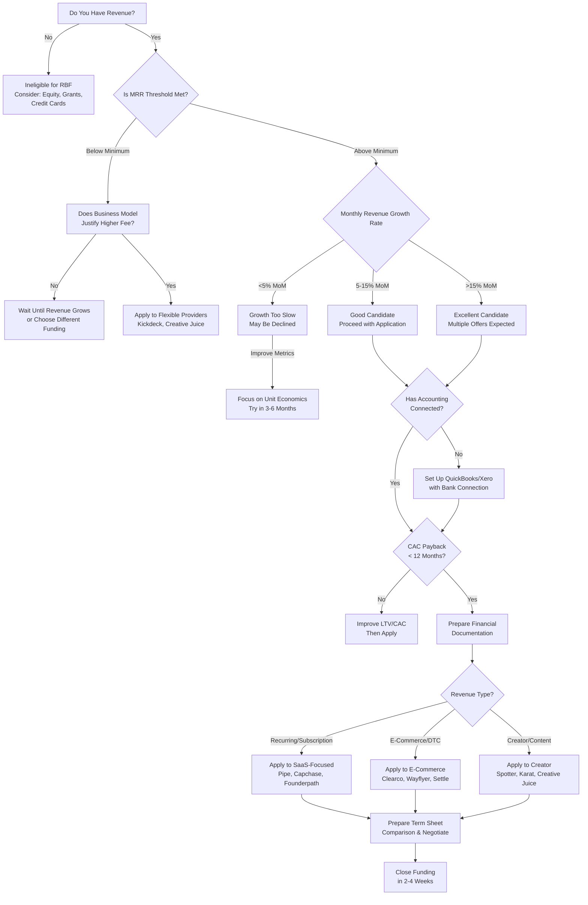
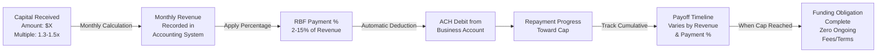
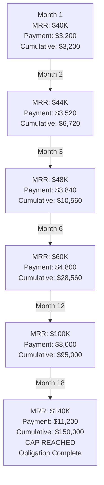

# Revenue-Based Financing (RBF): Zero-Equity Funding Playbook

## Table of Contents
1. [Overview](#overview)
2. [How Top-Tier Founders Identify RBF Providers](#how-top-tier-founders-identify-rbf-providers)
3. [12-Step RBF Process](#12-step-rbf-process)
4. [Systems and Processes](#systems-and-processes)
5. [Messaging Templates](#messaging-templates)
6. [Success Criteria](#success-criteria)
7. [Top-Tier Strategies](#top-tier-strategies)
8. [Resources and Next Steps](#resources-and-next-steps)

---

## Overview

### What is Revenue-Based Financing?

Revenue-Based Financing (RBF) is a non-dilutive funding method where founders receive capital in exchange for a percentage of future monthly revenues until a repayment cap is reached. Unlike equity financing, founders maintain full control and ownership.

**Key Characteristics:**
- **Non-Dilutive**: Zero equity given up
- **Flexible Repayment**: Monthly payments tied to revenue
- **Faster Approval**: Typically 2-4 weeks
- **Founder-Friendly**: No board seats, no investor control
- **Predictable Terms**: Clear repayment caps and timelines

### Typical RBF Funding Amounts

| Funding Stage | Amount Range | Use Case | Time to Close |
|---|---|---|---|
| **Early-Stage** | $25K - $250K | MVP development, initial scaling | 2-3 weeks |
| **Growth-Stage** | $250K - $1M | Rapid expansion, market penetration | 3-4 weeks |
| **Scaling-Stage** | $1M - $5M | National/international scaling | 4-6 weeks |

### Typical RBF Terms

| Metric | Typical Range |
|---|---|
| **Repayment Multiple** | 1.3x - 1.5x (you repay 30-50% more than borrowed) |
| **Monthly Payback %** | 2% - 15% of monthly revenue |
| **Funding Speed** | 14-30 days from application to funding |
| **Maximum Cap** | $5M - $20M (varies by provider) |

---

## RBF Evaluation Process & Repayment Flowcharts

### RBF Evaluation Decision Flowchart



### RBF Repayment Structure & Cash Flow Impact



### Cash Flow Scenario: $200K RBF at 8% Monthly



---

## How Top-Tier Founders Identify RBF Providers

### Tier-1 RBF Providers (Highest Approval Odds)

#### **Clearco (formerly Clearline Capital)**
- **Funding Range**: $10K - $2M
- **Ideal For**: SaaS, e-commerce, digital products with proven revenue
- **Key Advantage**: Fastest approval (sometimes 48-72 hours)
- **Revenue Requirement**: $2K+/month
- **Application**: Direct via clearco.com or API integration
- **Website**: https://www.clearco.com

#### **Pipe**
- **Funding Range**: $10K - $5M
- **Ideal For**: SaaS, recurring revenue business models
- **Key Advantage**: Marketplace connecting founders to multiple capital providers
- **Revenue Requirement**: $1K+/month
- **Application**: Via marketplace at pipe.com
- **Website**: https://www.pipe.com

#### **Lighter Capital**
- **Funding Range**: $25K - $1.5M
- **Ideal For**: E-commerce and SaaS with strong fundamentals
- **Key Advantage**: Human-centric approach, personalized support
- **Revenue Requirement**: $3K+/month
- **Application**: Direct application at lightercapital.com
- **Website**: https://www.lightercapital.com

#### **Rapid Finance**
- **Funding Range**: $50K - $2M
- **Ideal For**: E-commerce, marketplaces, subscription businesses
- **Key Advantage**: Fast underwriting, flexible terms
- **Revenue Requirement**: $5K+/month
- **Application**: Direct at rapidfinance.com
- **Website**: https://www.rapidfinance.com

#### **Brex**
- **Funding Range**: $100K - $5M
- **Ideal For**: High-growth SaaS and e-commerce
- **Key Advantage**: Integration with existing Brex accounts, top-tier credibility
- **Revenue Requirement**: Highly variable by business type
- **Application**: Available to Brex customers
- **Website**: https://www.brex.com

#### **Kickdeck**
- **Funding Range**: $25K - $750K
- **Ideal For**: Early-stage with lower revenue thresholds
- **Key Advantage**: Most flexible with newer businesses
- **Revenue Requirement**: $500+/month
- **Application**: Direct at kickdeck.com
- **Website**: https://www.kickdeck.com

#### **Credible**
- **Funding Range**: $10K - $3M
- **Ideal For**: Digital businesses, creators, coaches
- **Key Advantage**: Fast funding (24-48 hours in some cases)
- **Revenue Requirement**: $1K+/month
- **Application**: Direct at crediblefunding.com
- **Website**: https://credible.com

### Secondary Tier Providers (Specialized Niches)

#### **E-Commerce Focused:**

**Flexport Capital**
- **Funding Range**: $10K - $3M
- **Ideal For**: E-commerce with international trade/logistics
- **Key Advantage**: Integrated with Flexport logistics platform
- **Revenue Requirement**: $10K+/month
- **Website**: https://www.flexport.com/capital

**Uncapped**
- **Funding Range**: $10K - $10M
- **Ideal For**: E-commerce, DTC brands, marketplaces
- **Key Advantage**: European-focused (UK, Spain, Germany, Netherlands)
- **Revenue Requirement**: €10K+/month
- **Website**: https://www.getuncapped.com

**Wayflyer**
- **Funding Range**: $10K - $20M
- **Ideal For**: E-commerce businesses with proven sales
- **Key Advantage**: Global reach, marketing-focused funding
- **Revenue Requirement**: $5K+/month
- **Website**: https://www.wayflyer.com

**Settle**
- **Funding Range**: $50K - $10M
- **Ideal For**: Shopify merchants, Amazon sellers
- **Key Advantage**: Integrated with e-commerce platforms
- **Revenue Requirement**: $20K+/month
- **Website**: https://www.settle.co

#### **Tech/SaaS Focused:**

**Capchase**
- **Funding Range**: $10K - $10M
- **Ideal For**: B2B SaaS with annual contracts
- **Key Advantage**: Converts annual contracts to immediate cash
- **Revenue Requirement**: $10K+ ARR
- **Website**: https://www.capchase.com

**Founderpath**
- **Funding Range**: $50K - $5M
- **Ideal For**: SaaS startups with MRR
- **Key Advantage**: Founder-first approach, no personal guarantees
- **Revenue Requirement**: $10K+/month MRR
- **Website**: https://founderpath.com

**Bigfoot Capital**
- **Funding Range**: $100K - $5M
- **Ideal For**: B2B SaaS with enterprise customers
- **Key Advantage**: Strategic partnerships with VC firms
- **Revenue Requirement**: $50K+/month
- **Website**: https://www.bigfootcap.com

#### **Creator Economy & Digital Products:**

**Spotter**
- **Funding Range**: $50K - $10M
- **Ideal For**: YouTube creators with established channels
- **Key Advantage**: Buys future ad revenue, maintains creator IP
- **Revenue Requirement**: 100K+ subscribers typically
- **Website**: https://www.spotter.la

**Karat Financial**
- **Funding Range**: $10K - $500K
- **Ideal For**: Content creators, influencers
- **Key Advantage**: Credit cards and financing for creators
- **Revenue Requirement**: Varies by platform following
- **Website**: https://www.karatfinancial.com

**Creative Juice**
- **Funding Range**: $5K - $100K
- **Ideal For**: TikTok, Instagram, YouTube creators
- **Key Advantage**: Fast approval (48 hours), creator-focused
- **Revenue Requirement**: $2K+/month from content
- **Website**: https://www.creativejuice.co

#### **International Providers:**

**Ritmo (Latin America)**
- **Funding Range**: $50K - $5M
- **Ideal For**: Latin American SaaS and e-commerce
- **Key Advantage**: Understands regional business dynamics
- **Revenue Requirement**: Varies by country
- **Website**: https://www.ritmo.capital

**Velocity Black (Australia/APAC)**
- **Funding Range**: $50K - $2M
- **Ideal For**: Australian and APAC region businesses
- **Key Advantage**: Local market expertise
- **Revenue Requirement**: AUD $10K+/month
- **Website**: https://velocityblack.com

**Re:cap (Europe)**
- **Funding Range**: €10K - €5M
- **Ideal For**: European SaaS and digital businesses
- **Key Advantage**: Multi-country operations
- **Revenue Requirement**: €5K+/month
- **Website**: https://www.re-cap.com

#### **Industry-Specific Providers:**

**HealthCare/MedTech:**
- **CareCredit**: Medical practice financing
- **Bread Financial**: Healthcare equipment financing
- **Website**: Various by provider

**B2B Services:**
- **Outfund**: B2B service businesses with recurring revenue
- **Funding Range**: $10K - $1M
- **Website**: https://www.out.fund

**Mobile Apps:**
- **Applovin**: Mobile app monetization advances
- **Vungle**: Mobile game financing
- **Website**: Check individual platforms

### How Top-Tier Founders Shortlist Providers

1. **Match Business Model**: Filter by your revenue type (recurring vs transactional)
2. **Revenue Threshold Check**: Only apply to providers where you exceed minimum
3. **Terms Comparison**: Use Pipe's marketplace to compare all offers simultaneously
4. **Speed Priority**: If you need capital urgently, prioritize 1-2 week turnaround providers
5. **Integration Needs**: Check if provider integrates with your accounting software
6. **Founder Reviews**: Check ProductHunt, G2, Trustpilot for user feedback
7. **Parallel Applications**: Apply to 3-5 providers simultaneously (no hard credit pulls)

---

## Comprehensive Provider Comparison Table

| Provider | Min MRR | Max Funding | Typical Multiple | Monthly % | Speed (Days) | Best For | Personal Guarantee? | International? |
|----------|---------|-------------|------------------|-----------|--------------|----------|---------------------|----------------|
| **Clearco** | $2K | $2M | 1.35x | 5-10% | 2-7 | SaaS, E-commerce | Sometimes | US, Canada, UK |
| **Pipe** | $1K | $5M | 1.3-1.5x | Varies | 7-14 | SaaS (ARR model) | Rarely | US, Europe |
| **Lighter Capital** | $3K | $1.5M | 1.32-1.4x | 2-8% | 14-21 | Tech/SaaS | Sometimes | US only |
| **Capchase** | $10K ARR | $10M | 1.2-1.35x | N/A (ARR buyout) | 7-14 | B2B SaaS (annual contracts) | Rarely | Global |
| **Wayflyer** | $5K | $20M | 1.35-1.5x | 6-12% | 7-21 | E-commerce, DTC | Sometimes | Global |
| **Founderpath** | $10K | $5M | 1.3-1.4x | 4-10% | 10-14 | SaaS with MRR | No (major benefit) | US, Europe |
| **Clearbanc/Clearco** | $2K | $2M | 1.35x | 8-12% | 1-3 | Fast-growing digital | Sometimes | US, Canada, UK |
| **Kickdeck** | $500 | $750K | 1.4-1.5x | 10-15% | 5-10 | Early-stage, lower revenue | Often | US only |
| **Brex** | Varies | $5M | 1.3-1.4x | 5-10% | 14-30 | Existing Brex customers | Rarely | US (+ limited intl) |
| **Uncapped** | €10K | €10M | 1.35-1.5x | 6-12% | 7-14 | E-commerce (Europe) | Sometimes | Europe only |
| **Spotter** | Varies | $10M+ | N/A (ad buyout) | N/A | 30-45 | YouTube creators (100K+ subs) | No | Global |
| **Settle** | $20K | $10M | 1.3-1.45x | 7-10% | 7-14 | Shopify/Amazon sellers | Sometimes | US, Canada |
| **Bigfoot Capital** | $50K | $5M | 1.3-1.4x | 5-8% | 21-30 | Enterprise SaaS | Rarely | US, Europe |

### Key Insights from Comparison:

**Fastest Approval:**
1. Clearco (1-3 days if clean financials)
2. Kickdeck (5-10 days)
3. Pipe (7-14 days)

**Best Terms (Lowest Cost):**
1. Capchase (1.2-1.35x for ARR buyouts)
2. Lighter Capital (1.32x starting, 2-8% monthly)
3. Founderpath (1.3-1.4x, no personal guarantee)

**Highest Funding Amounts:**
1. Wayflyer (up to $20M)
2. Spotter (up to $10M+ for creators)
3. Capchase, Pipe, Uncapped, Settle (all up to $10M)

**Best for Early Stage (<$5K MRR):**
1. Kickdeck (starts at $500/month revenue)
2. Clearco ($2K minimum)
3. Creative Juice ($2K/month for creators)

**No Personal Guarantee:**
1. Founderpath (major differentiator)
2. Spotter (creators)
3. Capchase (typically)

**International-Friendly:**
1. Capchase (truly global)
2. Wayflyer (global reach)
3. Uncapped (Europe-focused)
4. Re:cap (Europe)

---

## Enhanced RBF Provider Resource Directory

### Top-Tier Tier Providers - Detailed Resource Guide

#### **1. CLEARCO**
- **Website**: https://www.clearco.com
- **Dashboard**: https://dashboard.clearco.com
- **Support**: support@clearco.com | 1-855-400-2673
- **Application Time**: 2-7 days (fastest)
- **Min Revenue**: $2K/month
- **Max Funding**: $2M
- **Repayment Multiple**: 1.35x
- **Best For**: Fast approval, SaaS, e-commerce
- **Key Features**:
  - Fastest approval times in industry
  - API integration available
  - No personal guarantee required
  - Mobile app for tracking
- **Documentation Needed**: Bank statements (6 months), Tax returns (2 years), ID verification
- **Alternative Links**: Product Hunt (reviews), G2 (ratings)

#### **2. PIPE**
- **Website**: https://www.pipe.com
- **Dashboard**: https://app.pipe.com
- **Support**: support@pipe.com | Schedule demo
- **Application Time**: 7-14 days
- **Min Revenue**: $1K/month
- **Max Funding**: $5M
- **Repayment Multiple**: 1.3-1.5x
- **Best For**: SaaS, recurring revenue, multi-provider comparison
- **Key Features**:
  - Marketplace of 50+ capital providers
  - Compare multiple offers simultaneously
  - Automated underwriting
  - API for integrations
- **Unique Advantage**: See all available offers in one place before deciding
- **Documentation Needed**: Bank statements, Revenue analytics, Tax returns
- **Resources**: https://blog.pipe.com (educational content)

#### **3. LIGHTER CAPITAL**
- **Website**: https://www.lightercapital.com
- **Dashboard**: https://dashboard.lightercapital.com
- **Support**: hello@lightercapital.com | 1-844-503-0444
- **Application Time**: 14-21 days
- **Min Revenue**: $3K/month
- **Max Funding**: $1.5M
- **Repayment Multiple**: 1.32-1.4x
- **Best For**: Human-centric approach, personalized support
- **Key Features**:
  - Personal relationship manager assigned
  - Flexible terms negotiable
  - Transparent pricing calculator
  - Customer success team
- **Documentation Needed**: Bank statements (6-12 months), P&L, Tax returns, Use of funds
- **Alternative Products**: Lighter Capital Plus (extended terms)

#### **4. CAPCHASE**
- **Website**: https://www.capchase.com
- **Dashboard**: https://app.capchase.com
- **Support**: support@capchase.com | Intercom chat on dashboard
- **Application Time**: 7-14 days
- **Min Revenue**: $10K ARR
- **Max Funding**: $10M
- **Repayment Multiple**: 1.2-1.35x (best rates)
- **Best For**: B2B SaaS with annual contracts
- **Key Features**:
  - Best rates for ARR-based businesses
  - Convert future revenue to immediate cash
  - Global operations (US, EU, APAC)
  - White-glove service for $1M+ deals
- **Ideal Metrics**: MRR >$20K, ARR >$240K, <5% churn
- **Documentation Needed**: Contracts signed, Customer list with amounts, Financial statements

#### **5. WAYFLYER**
- **Website**: https://www.wayflyer.com
- **Dashboard**: https://www.wayflyer.com/apply
- **Support**: support@wayflyer.com
- **Application Time**: 7-21 days
- **Min Revenue**: $5K/month
- **Max Funding**: $20M (highest cap)
- **Repayment Multiple**: 1.35-1.5x
- **Best For**: E-commerce, DTC, global reach
- **Key Features**:
  - Highest funding amounts available
  - Revenue-based and merchant cash advance options
  - Marketing spend optimization included
  - Global expansion support
- **Integrations**: Shopify, Amazon, WooCommerce, BigCommerce
- **Resources**: https://blog.wayflyer.com (e-commerce insights)

#### **6. FOUNDERPATH**
- **Website**: https://founderpath.com
- **Application**: https://app.founderpath.com
- **Support**: support@founderpath.com
- **Application Time**: 10-14 days
- **Min Revenue**: $10K/month
- **Max Funding**: $5M
- **Repayment Multiple**: 1.3-1.4x
- **Best For**: SaaS, no personal guarantee
- **Key Features**:
  - NO personal guarantee required (major differentiator)
  - Founder-first approach
  - Simple contract terms
  - US and Europe coverage
- **Eligibility**: SaaS only, <5% monthly churn, positive unit economics
- **Documentation Needed**: Bank statements, P&L, Customer metrics

#### **7. SETTLE**
- **Website**: https://www.settle.co
- **Application**: https://app.settle.co
- **Support**: support@settle.co
- **Application Time**: 7-14 days
- **Min Revenue**: $20K/month
- **Max Funding**: $10M
- **Repayment Multiple**: 1.3-1.45x
- **Best For**: Shopify and Amazon sellers
- **Key Features**:
  - Platform integration (Shopify, Amazon native)
  - Real-time revenue visibility
  - Automated repayment from sales
  - Merchant support team
- **Integrations**: Direct Shopify app, Amazon Seller Central, Klaviyo
- **Unique**: Auto-connects to revenue streams for automatic calculations

#### **8. SPOTTER**
- **Website**: https://www.spotter.la
- **Application**: https://creators.spotter.la
- **Support**: creators@spotter.la
- **Application Time**: 30-45 days (due diligence)
- **Ideal Audience**: 100K+ YouTube subscribers
- **Funding Range**: $50K-$10M+
- **Best For**: YouTube creators, content monetization
- **Key Features**:
  - Buys future ad revenue
  - Creator retains IP and channel ownership
  - No personal guarantee
  - Long-term partnership approach
- **Metrics Tracked**: Subscriber growth, avg views, engagement rates
- **Documentation**: YouTube analytics, brand deals history, audience demographics

### Comparison & Selection Tools

#### **RBF Marketplace Comparison**
- **Pipe.com Marketplace**: Compare 50+ providers in one application
- **Link**: https://www.pipe.com/marketplace
- **Benefit**: See all offers simultaneously before choosing

#### **Online RBF Calculators**
- **Clearco ROI Calculator**: https://www.clearco.com/calculator
- **Lighter Capital Cost Estimator**: https://www.lightercapital.com/calculator
- **Capchase ARR Calculator**: https://www.capchase.com/calculator
- **Pipe Amount Calculator**: https://www.pipe.com/calculator

#### **Provider Comparison Tools**
- **G2.com RBF Reviews**: https://www.g2.com/products/clearco/reviews
- **Trustpilot Provider Ratings**: https://www.trustpilot.com/ (search provider names)
- **Product Hunt Discussions**: https://www.producthunt.com/ (search "RBF" or provider names)

---

## Advanced RBF Strategies

### Strategy 1: Stacked RBF (Multiple Providers)

Some sophisticated founders raise from 2-3 RBF providers simultaneously to maximize capital without dilution.

**How It Works:**
- Provider A: $250K at 7% monthly
- Provider B: $200K at 8% monthly
- Total Capital: $450K
- Combined Monthly Payment: 15% of revenue

**When This Makes Sense:**
- You have $50K+ MRR with strong growth (15%+ MoM)
- Large capital need ($500K+) but want to preserve equity
- Multiple use cases (inventory + marketing + team)
- Each provider funds <50% of total need

**Risks:**
- Higher total monthly payment (can strain cash flow)
- Multiple reporting relationships
- Default with one provider may trigger cross-default clauses
- More complex accounting

**Pro Tip:** Only pursue stacked RBF if your revenue can comfortably service 15-20% monthly payments.

---

### Strategy 2: Bridge RBF to Equity

Use RBF to extend runway and improve metrics before raising equity at higher valuation.

**Timeline Example:**
- **Month 0**: Current MRR $30K, could raise equity at $5M valuation (20% = $1M)
- **Month 1**: Raise $200K RBF instead
- **Month 1-9**: Deploy capital, grow from $30K → $80K MRR
- **Month 10**: Raise equity at $15M valuation (15% = $2.25M)
- **Result**: 2.25x more capital, gave up 5% less equity

**Math That Makes This Work:**
- RBF cost: $200K × 1.35 = $270K total repaid
- Equity saved: 5% of $15M valuation = $750K
- Net benefit: $750K - $270K = $480K in founder value created

**When to Use:**
- Your metrics are "almost there" for institutional equity
- 6-12 months of proven growth would significantly increase valuation
- Current valuation feels low for amount of equity you'd give up

---

### Strategy 3: Seasonal Business RBF Structuring

Negotiate payment terms that account for revenue seasonality.

**Example: E-commerce with Holiday Peak**

Standard RBF terms:
- $300K at 10% monthly revenue
- Holiday months (Nov-Dec): $150K revenue → $15K payment
- Off-season months (Jan-Mar): $30K revenue → $3K payment

**Negotiated Seasonal Terms:**
- 5% monthly during peak season (Nov-Dec)
- 12% monthly during off-season
- Same total repayment, better cash flow management

**How to Negotiate:**
- Provide 2+ years of revenue history showing seasonality
- Show peak season cash needs (inventory, ads)
- Demonstrate off-season can handle higher percentage
- Request quarterly payment adjustments

**Providers Open to This:** Lighter Capital, Wayflyer, Pipe (on case-by-case basis)

---

### Strategy 4: Hybrid Funding Stack

Combine RBF with other non-dilutive sources for maximum leverage.

**Optimal Stack for SaaS:**
- **RBF**: $250K (customer acquisition)
- **R&D Tax Credits**: $50K (product development)
- **Government Grants**: $50K (SBIR/STTR if applicable)
- **Credit Card/LOC**: $50K (working capital buffer)
- **Total**: $400K non-dilutive capital

**Optimal Stack for E-commerce:**
- **RBF**: $300K (inventory + marketing)
- **Inventory Financing**: $200K (additional inventory line)
- **Amazon Lending**: $100K (if selling on Amazon)
- **Credit Card**: $50K (working capital)
- **Total**: $650K non-dilutive capital

**Key Principle:** Layer complementary funding sources that don't compete (RBF for growth, credit for working capital, grants for R&D)

---

### Strategy 5: RBF for Acquisition Financing

Use RBF to acquire smaller competitors or complementary businesses.

**Example Scenario:**
- Your Business: $100K MRR SaaS
- Acquisition Target: $25K MRR competing SaaS (asking $300K)
- Post-Acquisition Revenue: $125K MRR (assuming 100% retention)

**RBF Structure:**
- Raise: $300K RBF at 1.35x multiple, 8% monthly
- Monthly Payment: $10K (8% of $125K)
- Combined Business Valuation: Significantly higher due to scale
- Repayment Timeline: ~18 months

**Why RBF Works for Acquisitions:**
- Banks rarely lend for small software acquisitions
- Don't want to dilute equity for acquisition
- Acquisition immediately adds revenue to service payments
- Can sell combined business for higher multiple

**Caution:** Only pursue if customer retention post-acquisition is proven (>80%)

---

## Red Flags Checklist (Provider Perspective)

Understanding what RBF providers consider red flags helps you avoid them.

### Automatic Rejection Red Flags:

1. **Revenue Fraud/Misrepresentation**
   - Inflated revenue figures
   - Mismatched bank statements vs accounting software
   - Unable to explain revenue sources

2. **Legal Issues**
   - Pending litigation
   - Trademark/IP disputes
   - Regulatory violations
   - Unpaid tax liens

3. **Founder Issues**
   - Previous business bankruptcies (within 5 years)
   - Fraud history
   - Multiple failed startups with debt defaults

4. **Declining Revenue (Severe)**
   - 3+ months of >20% MoM decline
   - No clear explanation or recovery plan
   - Declining revenue + requesting large amounts

### High-Risk (Possible Rejection or Higher Cost) Red Flags:

1. **Customer Concentration Risk**
   - Top 3 customers = >50% of revenue
   - Recent loss of major customer
   - No diversification strategy

2. **Negative Unit Economics**
   - CAC > LTV
   - Negative gross margins
   - No path to profitability visible

3. **Cash Flow Problems**
   - Bank balance <30 days of operating expenses
   - Recent overdrafts or NSF fees
   - Consistently negative cash flow

4. **Revenue Volatility**
   - Wild swings month-to-month (>30%)
   - No explanation for seasonality
   - One-time revenue spikes inflating metrics

5. **Poor Financial Hygiene**
   - No accounting software (only spreadsheets)
   - Missing tax returns
   - Can't reconcile bank statements
   - No bookkeeper/CFO oversight

### Moderate Risk (Negotiable) Red Flags:

1. **Short Operating History**
   - Less than 12 months of revenue
   - Solution: Start with smaller amount ($25K-$50K)

2. **Moderate Revenue Decline**
   - 1-2 months of 10-15% decline
   - Solution: Provide detailed explanation + recovery plan

3. **Multiple Founders Departed**
   - Solution: Explain circumstances, show business continuity

4. **Previous RBF Default (Different Company)**
   - Solution: Full transparency, explain lessons learned

---

## Tax and Legal Considerations

### How RBF is Taxed (US)

**For Tax Purposes:**
- RBF is treated as **debt**, not equity
- The "cost" (1.35x repayment on $100K = $35K cost) is **interest expense**
- Interest expense is **tax-deductible** for your business

**Example Tax Math:**
- RBF Advance: $200,000
- Total Repayment: $270,000 (1.35x)
- Interest Expense: $70,000
- Tax Deduction (at 25% corporate rate): $70,000 × 25% = $17,500 tax savings
- **Effective Cost of RBF: $52,500 (not $70,000)**

**Accounting Treatment:**
```
Month 0 (Funding):
Debit: Cash                 $200,000
  Credit: RBF Liability               $200,000

Month 1-X (Monthly Payment):
Debit: RBF Liability        $2,000
Debit: Interest Expense     $500
  Credit: Cash                        $2,500

(Split between principal and interest based on amortization schedule)
```

### Legal Structure Considerations

**Best Entity Types for RBF:**
1. **C-Corporation**: Most providers prefer, easier to underwrite
2. **LLC**: Accepted by most, may require operating agreement review
3. **S-Corporation**: Generally accepted
4. **Sole Proprietorship**: Some providers accept, others don't (higher risk)

**Documents You'll Sign:**
1. **Revenue-Based Financing Agreement**: Main contract, 15-30 pages
2. **Promissory Note**: Legal IOU for the repayment amount
3. **Security Agreement**: Provider may take security interest in assets
4. **Personal Guarantee** (sometimes): Founders personally liable if business defaults
5. **UCC Filing** (sometimes): Public record of lender's security interest

**Key Contract Clauses to Understand:**

**Repayment Clause:**
- "Borrower shall pay X% of Gross Monthly Revenue until repayment cap reached"
- **Watch for:** How "Gross Monthly Revenue" is defined - some exclude refunds/returns

**Default Triggers:**
- Typical: 60+ days delinquent, bankruptcy filing, material breach
- **Negotiate:** Grace periods, cure rights before default declared

**Covenant Restrictions:**
- Common: Can't take on additional debt, must maintain minimum cash balance, can't change business model materially
- **Negotiate:** Flexibility for reasonable business decisions

**Early Repayment:**
- Most providers allow early payoff without penalty
- **Confirm:** No prepayment penalties in your contract

### When to Hire a Lawyer

**You DON'T Need a Lawyer If:**
- Amount is <$100K
- Using a Tier-1 provider (Clearco, Pipe, Lighter Capital) with standardized contracts
- Terms are straightforward (no unusual clauses)
- You understand business contracts

**You SHOULD Hire a Lawyer If:**
- Amount is >$250K
- Personal guarantee is required (lawyer can negotiate this)
- Contract has unusual clauses you don't understand
- Provider is less established (non-standard terms)
- You're raising from multiple RBF providers simultaneously (coordination needed)

**Cost:** Expect $1,500-$5,000 for contract review by experienced startup lawyer

---

## International RBF Guide

### RBF Availability by Region

**North America:**
- **United States**: Largest RBF market, 20+ active providers
- **Canada**: Clearco, Pipe, some US providers accept Canadian businesses
- **Mexico**: Limited options, some US providers expanding

**Europe:**
- **UK**: Uncapped, Wayflyer, Clearco UK, Pipe
- **Germany**: Re:cap, Uncapped, several local providers
- **France**: Re:cap, limited local options
- **Spain**: Uncapped, Re:cap
- **Netherlands**: Re:cap, Uncapped
- **Nordics**: Limited but growing

**Asia-Pacific:**
- **Australia**: Velocity Black, Wayflyer, some US providers
- **Singapore**: Limited, some providers on case-by-case
- **India**: Very limited, mostly traditional debt
- **Japan**: Emerging market, few providers

**Latin America:**
- **Brazil**: Ritmo Capital, limited local options
- **Mexico**: Ritmo Capital, some US providers
- **Argentina/Chile/Colombia**: Very limited

**Africa/Middle East:**
- Very limited RBF availability
- UAE has some emerging options
- Most of Africa lacks RBF infrastructure

### Cross-Border Considerations

**Currency Risk:**
- Most providers fund in their home currency (USD, EUR, GBP)
- If your revenue is in different currency, you have FX risk
- **Solution**: Some providers offer multi-currency options

**Tax Treaties:**
- Interest payments may have withholding tax implications
- **Consult:** International tax advisor if raising cross-border

**Banking:**
- You'll need bank account in provider's country or international banking
- **Providers like Wise, Airwallex** can help with multi-currency accounts

---

## 12-Step RBF Process

### STEP 1: Eligibility Self-Check (Days 1-2)

**Your Goal**: Confirm you meet basic requirements before applying

**Checklist:**
- [ ] Minimum 6-12 months of revenue history
- [ ] Current monthly revenue: $1K - $500K+
- [ ] Revenue growing month-over-month (or stable with upside)
- [ ] Business legally registered and operational
- [ ] US-based business (most providers) or relevant jurisdiction
- [ ] Access to business tax returns, bank statements, accounting records
- [ ] Founder(s) with good personal credit (600+ FICO helpful but not required)

**Red Flags (May Disqualify):**
- Declining revenue for 3+ consecutive months
- Chargebacks or payment fraud history
- No clear revenue model or business plan
- Legal disputes or pending litigation
- No founders involved in day-to-day operations

**Decision Point:**
- **PASS**: Move to Step 2
- **FAIL**: Address deficiencies, revisit in 30-60 days

---

### STEP 2: Gather Required Documentation (Days 2-4)

**Your Goal**: Prepare all materials for simultaneous application to multiple providers

**Core Documents Needed:**
1. **Business Bank Statements** (last 3-6 months)
   - Shows revenue deposits and cash flow
   - Format: PDF from bank or exported CSV
   - Highlight customer transactions (some highlight net revenue only)

2. **Business Tax Returns** (last 2 years)
   - 1040 Schedule C (sole prop), K-1 (partnership), 1120 (corp)
   - Shows official revenue and business structure

3. **Profit & Loss Statement** (last 6-12 months, monthly breakdown)
   - Excel template: Month | Revenue | COGS | Operating Expenses | Net Income
   - Format: Can be from QuickBooks, Xero, Wave, or spreadsheet

4. **Accounting Software Login**
   - Many providers want API access to QuickBooks, Xero, Stripe, Shopify, Wave
   - Prepare credentials (or use OAuth connection)
   - Verify you can grant read-only access

5. **Pitch Deck/Business Summary** (1-2 pages)
   - Company name, founding date, founder bios
   - Revenue model and customer acquisition strategy
   - Current metrics: MRR/ARR, customer count, growth rate
   - Use of proceeds (what you'll do with capital)
   - Funding amount requested and timeline

6. **Personal Information**
   - Full legal name, SSN, DOB for each founder
   - Driver's license copy
   - Personal credit report (optional but helpful)

7. **Business Formation Documents**
   - Articles of incorporation/organization
   - EIN confirmation letter from IRS
   - Business license (if applicable)

**Organization Tip:**
Create a folder: `/RBF_Application_Materials/`
```
├── Bank_Statements/
│   ├── Statement_Jan_2025.pdf
│   ├── Statement_Feb_2025.pdf
│   └── Statement_Mar_2025.pdf
├── Tax_Returns/
│   ├── 2024_1040_Schedule_C.pdf
│   └── 2023_1040_Schedule_C.pdf
├── Financial_Statements/
│   ├── Revenue_Summary_12Mo.xlsx
│   └── P&L_Monthly_Breakdown.xlsx
├── Pitch_Materials/
│   ├── Company_Overview.pdf
│   ├── Pitch_Deck.pdf
│   └── Use_of_Funds.txt
└── Personal_Docs/
    ├── ID_Founder1.pdf
    ├── ID_Founder2.pdf
    └── Credit_Report.pdf
```

---

### STEP 3: Provider Pre-Qualification Call (Days 4-6)

**Your Goal**: Confirm fit with 3-5 providers before formal application

**Provider Research**
- Visit provider website and read FAQ
- Note minimum revenue requirements
- Check if your business model matches their sweet spot
- Review approval timeline and term examples

**Template Email (Cold Outreach to Providers)**

Subject: RBF Inquiry - [Company Name] - [Monthly Revenue] MRR

Hi [Provider Name],

I'm reaching out to explore Revenue-Based Financing for [Company Name]. Here's a quick snapshot:

- **Business Model**: [Recurring SaaS / E-commerce / Digital Products]
- **Monthly Revenue**: $[X] MRR, growing [Y]% MoM
- **Time in Business**: [X months/years]
- **Funding Need**: $[Amount] for [Purpose]
- **Use of Proceeds**: [Brief description of what capital will enable]

We're interested in partnering because [mention how their terms align with your goals].

Do you think [Company Name] would be a fit for your programs? If yes, I'd love to discuss next steps.

Best,
[Your Name]
[Your Title]
[Company Name]
[Phone]
[Email]

**Pre-Call Research:**
- Answer: "What problem does the capital solve?"
- Answer: "Why RBF vs VC/Debt/Bootstrapping?"
- Answer: "What's our 18-month revenue projection?"
- Answer: "Who are the competitors and how do we differentiate?"

**Call Script:**
```
"Thanks for taking the time. Quick context: [30-second elevator pitch]

Our key metrics are [revenue, growth rate, customer count]. We're looking for
$[X] in capital to [specific purpose].

Are we a good fit for your program? What's your typical approval timeline?
What documentation do you need to get started?"
```

---

### STEP 4: Multi-Provider Application Submission (Days 6-8)

**Your Goal**: Submit applications to 3-5 providers simultaneously

**Why Apply to Multiple?**
- Increases approval odds (not all providers approve all businesses)
- Creates competitive pressure for better terms
- Hedges against unexpected rejection
- Gives you choice of terms/timelines

**Application Process by Provider:**

**Clearco:**
1. Go to clearco.com/apply
2. Enter basic business info (2 min)
3. Connect accounting software (QuickBooks, Stripe, Shopify, etc.)
4. Review approval within 5 mins to 24 hours
5. Upload additional docs if requested

**Pipe:**
1. Visit pipe.com and create account
2. Complete company profile (5-10 min)
3. Add revenue sources (connect Stripe, Shopify, QuickBooks)
4. Browse offers from multiple capital providers
5. Compare terms side-by-side
6. Submit to selected provider(s)

**Lighter Capital:**
1. Complete online application at lightercapital.com/apply
2. Upload key documents (bank statements, tax returns, P&L)
3. Schedule 15-min call with underwriter
4. Receive term sheet within 3-5 days

**Generic Application Template (Most Providers):**

```
Company Information:
- Legal Business Name: [Name]
- EIN: [Number]
- Industry: [Category]
- Years in Business: [X]
- Business Structure: [LLC/C-Corp/S-Corp/Sole Prop]

Founder Information:
- Name: [Full Legal Name]
- Title: [Founder/CEO/Owner]
- Personal Credit Score: [If available]
- Email: [Email]
- Phone: [Phone]

Revenue Information:
- Current Monthly Revenue (MRR): $[Amount]
- Last Month Revenue: $[Amount]
- 3-Month Average: $[Amount]
- Revenue Growth Rate (MoM %): [X]%
- Revenue Model: [Recurring/Transactional/Hybrid]
- Customer Acquisition Cost (CAC): $[Amount]
- Customer Lifetime Value (LTV): $[Amount]

Funding Request:
- Amount Requested: $[Amount]
- Desired Repayment Period: [12-24-36 months]
- Use of Funds: [Detailed breakdown]
- Payback Timeline: [When revenue will increase]

Attachments to Upload:
- [ ] Business Bank Statements (3-6 months)
- [ ] Business Tax Returns (2 years)
- [ ] P&L Statement (12 months)
- [ ] Accounting Software Login (read-only)
- [ ] Pitch Deck/Business Overview
- [ ] Signed Authorization Form
```

**Submission Checklist:**
- [ ] Applications submitted to 3-5 providers
- [ ] All documentation uploaded
- [ ] Accounting software connected successfully
- [ ] Confirmation emails received from each provider
- [ ] Follow-up dates noted in calendar

---

### STEP 5: Underwriting Review & Information Requests (Days 8-14)

**Your Goal**: Respond quickly to underwriter questions to maintain approval momentum

**What Happens During Underwriting:**
1. Underwriter reviews documents and business metrics
2. Software runs automated analysis on revenue trends, seasonality, churn
3. Underwriter may request clarifications or additional information
4. Risk scoring determines offer terms (repayment %, cap, timeline)

**Common Underwriter Questions (Be Prepared):**

Q: "Why is there a $10K revenue dip in February?"
A: [Prepared answer] "It was a planned promotional campaign wind-down while we shifted marketing channels. March rebounded to $X and we've maintained growth since."

Q: "Who are your top customers and what % of revenue do they represent?"
A: [Prepared answer] "Our top 3 customers represent 15% of MRR. We intentionally diversified to avoid concentration risk."

Q: "What's your customer churn rate?"
A: [Prepared answer] "Our monthly churn is X%, our annual retention is Y%. [Include benchmark comparison]"

Q: "What's your plan if a major customer leaves?"
A: [Prepared answer] "Our sales pipeline has [X] qualified prospects in various stages. Our conversion rate is Y%."

**Response Template:**

Subject: RE: [Provider Name] - [Your Company] Underwriting Questions

Hi [Underwriter Name],

Thanks for reviewing our application. Here are responses to your questions:

1. **[Question]**: [Clear, concise answer with data/proof]

2. **[Question]**: [Clear, concise answer with data/proof]

**Additional Context**: [Anything else that strengthens your case]

Please let me know what else you need. I'm available for a call if helpful.

Best,
[Your Name]

**Response Time Target:**
- Simple clarifications: Same day
- Requests for new documents: Next business day
- Schedule calls: Within 24 hours

---

### STEP 6: Term Sheet Review & Comparison (Days 14-18)

**Your Goal**: Compare offers from multiple providers and select the best terms

**What's in a Term Sheet:**

**Key Terms to Evaluate:**

| Term | What It Means | What's Favorable |
|---|---|---|
| **Funding Amount** | Capital you receive | Higher is better (if you need it) |
| **Repayment Multiple** | Total you'll repay | 1.3x better than 1.5x (30% vs 50% return) |
| **Monthly Payback %** | % of revenue paid monthly | Lower is better (more cash flow flexibility) |
| **Repayment Cap** | Total repayment amount | Once reached, monthly payments stop |
| **Drawdown Period** | Weeks before funds hit account | Faster is better |
| **Business Covenants** | Restrictions on what you can do | Fewer restrictions is better |
| **Default Clause** | When you "owe" full amount immediately | Should be rare/hard to trigger |

**Term Sheet Example:**

```
REVENUE-BASED FINANCING AGREEMENT

Provider: Clearco
Company: Acme SaaS Inc.
Date Issued: March 1, 2025

TERMS:
- Advance Amount: $250,000
- Repayment Multiple: 1.35x
- Total Repayment: $337,500
- Monthly Payback: 8% of Monthly Revenue (minimum $2,000/month)
- Estimated Repayment Period: 18-24 months
- Funding Timeline: 5 business days from execution
- First Payment Due: April 1, 2025

PERFORMANCE METRICS:
- If monthly revenue < $2K: $2K due anyway
- If monthly revenue > $40K: 8% cap (doesn't scale)
- Seasonal adjustments: Available if documented

RESTRICTIONS:
- Must maintain minimum bank balance of $50K
- Cannot increase debt without written approval
- Must notify within 5 days of revenue decline > 50%
- Cannot change business model without consent

DEFAULT TRIGGERS:
- Delinquency: 60+ days without payment
- Material breach: Major covenant violation
- Force default: Can demand full $337.5K immediately
```

**Comparison Template:**

| Metric | Provider A | Provider B | Provider C | Your Priority |
|---|---|---|---|---|
| Funding Amount | $250K | $300K | $200K | 🔴 |
| Repayment Multiple | 1.35x | 1.4x | 1.5x | 🔴 |
| Monthly Payback | 8% | 10% | 6% | 🔴 |
| Funding Speed | 5 days | 10 days | 3 days | 🟡 |
| Restrictions | Moderate | Strict | Light | 🟡 |
| Support Quality | Good | Excellent | Basic | 🟢 |
| **TOTAL SCORE** | **9/10** | **8/10** | **7/10** | |

**Selection Decision Framework:**

```
IF funding_speed == Critical:
    SELECT fastest provider (typically Clearco, Credible)

IF monthly_cash_flow == Tight:
    SELECT lowest monthly payback %
    ACCEPT lower repayment multiple if needed

IF multiple_offers == Available:
    NEGOTIATE with top 2 providers for better terms
    Use competing offers as leverage

IF uncertain == True:
    REQUEST clarification call with underwriter
    Ask about real customer case studies
    Verify support availability
```

---

### STEP 7: Negotiation & Term Optimization (Days 16-20)

**Your Goal**: Leverage multiple offers to improve terms

**What's Negotiable:**

**Frequently Negotiable:**
- Monthly payback percentage (6% vs 8%)
- Minimum monthly payment amount
- Repayment multiple (1.35x vs 1.4x)
- Drawdown timing (faster funding)
- Seasonal adjustment clauses

**Rarely Negotiable:**
- Repayment cap (fixed by provider)
- Default triggers (legal standard)
- Business restrictions (already minimal)

**Negotiation Email Template:**

Subject: [Your Company] - Term Sheet Discussion

Hi [Underwriter Name],

Thanks for the term sheet. We're excited about partnering with Clearco.

We received competing offers and want to ensure we're working with the best partner. Here's our request:

**Current Terms**: 8% monthly payback on $250K advance
**Requested Terms**: 6.5% monthly payback (in line with Pipe's offer)
**Rationale**: This better aligns with our cash flow forecast and allows faster reinvestment in growth.

Alternatively, we'd accept:
- Your current 8% terms IF you can accelerate funding to 2 business days (vs 5)
- OR reduce repayment multiple from 1.35x to 1.32x

Can we discuss flexibility on one of these options?

Best,
[Your Name]

**Negotiation Success Rates:**
- Monthly payback reduction: 40% success rate
- Repayment multiple reduction: 30% success rate
- Faster funding: 60% success rate
- Minimum payment flexibility: 70% success rate

---

### STEP 8: Due Diligence & Final Documentation (Days 18-22)

**Your Goal**: Complete all provider requirements for funding

**Standard Final Documentation:**

1. **Signed Term Sheet**
   - Both founder(s) and provider execute

2. **Promissory Note**
   - Legal document binding repayment terms
   - Usually 5-10 pages, provider-generated

3. **Personal Guarantee** (sometimes)
   - Founders personally liable if business defaults
   - Ask if waivable for strong financial performance

4. **ACH Authorization**
   - Allows provider to debit your business account for repayment
   - Monthly repayment pull starts on agreed date

5. **Banking Access** (if applicable)
   - Read-only access to accounting software
   - Or direct bank feed from your institution

6. **Representations & Warranties**
   - Your certification that all information is accurate
   - Standard legal template

**Due Diligence Checklist:**

Before Signing:
- [ ] Reviewed full contract with lawyer (optional but recommended)
- [ ] Understand all default triggers
- [ ] Verified all financial figures are accurate
- [ ] Confirmed bank account for funding disbursement
- [ ] Ensured email you'll receive payment notifications is correct
- [ ] Asked about payment dispute/adjustment process

---

### STEP 9: Funding Disbursement (Days 20-25)

**Your Goal**: Receive capital and establish clear accounting/payment processes

**Disbursement Process:**

1. **Wire Instructions**
   - Provider sends bank instructions
   - You provide business checking account details
   - Funds typically arrive within 2-5 business days

2. **Funding Confirmation**
   - Funds appear in your account
   - Verification email from provider
   - Check account to confirm amount

3. **First Payment Date**
   - Typically 30-45 days after funding
   - Set calendar reminder
   - Verify amount in provider dashboard

**Accounting Setup:**

Create GL accounts in QuickBooks/Xero:
- **2801 - RBF Liability** (Balance sheet - liability)
- **4200 - RBF Repayment** (P&L - expense)

Journal Entry at funding:
```
Debit: Cash/Checking Account      $250,000
  Credit: RBF Liability                     $250,000
(To record RBF advance from Clearco)
```

Monthly journal entry (on payment date):
```
Debit: RBF Repayment             $[Amount]
  Credit: Cash/Checking Account            $[Amount]
(To record monthly RBF payment to Clearco)
```

---

### STEP 10: Revenue Growth & Repayment Management (Months 1-18)

**Your Goal**: Execute growth plan and manage repayments without cash flow stress

**Revenue Management:**

**Monthly Checklist (First of Month):**
- [ ] Calculate total revenue for previous month
- [ ] Confirm repayment amount due (should auto-calculate in provider dashboard)
- [ ] Verify amount in operating budget
- [ ] Ensure funds available in checking before ACH pull date
- [ ] Monitor revenue trend vs forecast
- [ ] Check bank balance after payment clears

**Cash Flow Forecasting:**

```
Acme SaaS - 12 Month Cash Flow Forecast

Month | Revenue | RBF Payment (8%) | Operating Burn | Net Cash Flow
Jan   | $25,000 | $2,000          | ($15,000)      | +$8,000
Feb   | $28,000 | $2,240          | ($14,000)      | +$11,760
Mar   | $32,000 | $2,560          | ($14,000)      | +$15,440
Apr   | $38,000 | $3,040          | ($13,500)      | +$21,460
May   | $42,000 | $3,360          | ($12,000)      | +$26,640
Jun   | $48,000 | $3,840          | ($10,000)      | +$34,160
```

**Growth Acceleration:**
Since you have capital, focus on:
1. Increase CAC/Marketing spend (you have capital to afford wait)
2. Launch new customer acquisition channels
3. Improve product (faster iteration with non-dilutive capital)
4. Hire key revenue-generating roles
5. Document ROI on capital deployment

**Revenue Decline Protocol (If Revenue Falls):**

```
IF monthly_revenue_declines > 10% month-over-month:

1. NOTIFY provider within 7 days (shows good faith)
   Subject: [Company] - February Revenue Notification
   "Our February revenue was $X (vs. $Y in January), decline due to [reason].
   We've implemented [mitigation actions]. Updated forecast attached."

2. ACTIVATE contingency plan:
   - Reduce operating expenses
   - Accelerate customer acquisition for new revenue
   - Extend payment terms with vendors
   - DO NOT miss RBF payment (severe default risk)

3. COMMUNICATE monthly with provider
   - Monthly revenue updates
   - Updated growth forecast
   - Actions being taken to restore growth
```

**Payment Automation:**
- Set up calendar reminder 5 days before ACH pull
- Verify bank balance has cleared reserves
- Monitor ACH in banking system to confirm debit

---

### STEP 11: Milestone Tracking & Early Payoff Assessment (Months 6-12)

**Your Goal**: Monitor progress toward full repayment and evaluate early payoff strategy

**Repayment Progress Tracking:**

```
Clearco RBF Agreement - Repayment Progress

Total Advance: $250,000
Repayment Multiple: 1.35x
Total Repayment Required: $337,500
Monthly Payback: 8% of revenue (min $2K)

Month | Payment Made | Cumulative Paid | Remaining | % Paid | Est. Months Left
1     | $2,000       | $2,000         | $335,500  | 0.6%   | 24
2     | $2,240       | $4,240         | $333,260  | 1.3%   | 23
3     | $2,560       | $6,800         | $330,700  | 2.0%   | 22
...
12    | $4,000       | $38,000        | $299,500  | 11%    | 18
```

**Early Payoff Strategy:**

**When Early Payoff Makes Sense:**
- Revenue accelerating beyond forecast (can afford faster payments)
- Raised outside capital (investors, grants)
- Want to get RBF off books before major financing round
- Cash flow robust and repayment not straining business

**Early Payoff Process:**
1. Email provider: "We'd like to discuss early payoff of RBF"
2. Request payoff quote (total remaining due, including any fees)
3. Confirm whether paying early triggers early payoff penalties (usually not)
4. Wire final payment
5. Request Release of Lien (if applicable)
6. Update accounting records

---

### STEP 12: Final Repayment & Relationship Continuation (Months 18-24)

**Your Goal**: Complete repayment successfully and maintain relationship for future funding

**Final Payment Preparation:**

**2-3 Months Before Repayment Completion:**
1. Calculate final payment amount
2. Email provider: "We're on track to complete repayment by [Date]. What's the final payment process?"
3. Request final payment instructions
4. Confirm zero-balance confirmation documentation

**Final Payment:**
- Wire final amount or authorize final ACH debit
- Confirm payment receipt from provider
- Request signed "Release of Agreement" or "Payoff Letter"
- Update accounting records: "RBF Liability Satisfied"

**Post-Repayment Actions:**

1. **Document the Success**
   ```
   Case Study: Acme SaaS RBF Journey

   Funding: $250,000 (April 2024)
   Use of Funds:
   - Customer acquisition: $120K (+40% new customers)
   - Product development: $80K (2 new features)
   - Team expansion: $50K (hired SDR)

   Results:
   - Pre-RBF MRR: $25,000
   - Post-RBF MRR (6 months): $48,000 (+92% growth)
   - Total repayment: $337,500 (completed by Dec 2025)
   - Revenue at payoff completion: $60,000/mo

   Key Learning: RBF enabled growth that would have taken 18+ months
   through bootstrapping alone.
   ```

2. **Request Case Study Feature**
   - Most providers feature successful companies
   - Good PR for your company
   - Possible fee waiver if featured

3. **Maintain Provider Relationship**
   - Annual check-in email
   - Thank provider's team
   - Reference for future RBF rounds (if needed)
   - Potential advisor/strategic relationship

4. **Prepare for Next Round (If Needed)**
   - Document this RBF success
   - Use as case study for new providers
   - Build track record for larger RBF or equity round

---

## Systems and Processes

### Accounting Integration

**Recommended Setup:**

```
Software Stack:
├── Accounting: QuickBooks Online or Xero
├── Banking: Connected to accounting software
├── Revenue Tracking: Stripe/PayPal/Shopify feed
├── RBF Tracking: Custom spreadsheet or provider dashboard
└── Forecasting: Excel or Tableau

Integration Checklist:
- [ ] RBF provider has read-only access to accounting software
- [ ] Revenue sources automatically feed into accounting system
- [ ] Monthly reconciliation process established
- [ ] CFO/Finance person assigned as point person
- [ ] Notifications set up for low bank balance warnings
```

**Monthly Reconciliation Process:**

```
RBF Monthly Reconciliation Checklist

Date: [Month/Year]
Provider: [Clearco/Pipe/Lighter]

1. REVENUE VERIFICATION
   [ ] Pull total revenue from accounting software
   [ ] Reconcile with provider's recorded amount
   [ ] Variance tolerance: ±5%
   [ ] Document any discrepancies in notes

2. PAYMENT VERIFICATION
   [ ] Confirm payment amount matches calculated percentage
   [ ] Verify ACH debit in bank statement
   [ ] Confirm date aligns with terms
   [ ] Update RBF tracking sheet

3. BALANCE VERIFICATION
   [ ] Calculate cumulative repayment to date
   [ ] Compare to provider dashboard
   [ ] Confirm remaining balance
   [ ] Update forecast for remaining repayment term

4. DOCUMENTATION
   [ ] File month-end bank statement
   [ ] File accounting screenshot (revenue + RBF payment)
   [ ] File provider dashboard screenshot
   [ ] Update monthly tracking spreadsheet

Notes: [Any discrepancies, questions, or observations]
Sign-off: [Finance person] Date: [Date]
```

### Dashboard Creation

Create a simple weekly dashboard:

```
RBF FUNDING DASHBOARD (Updated Weekly)

As of: [Date]
Provider: [Clearco]

Current Status:
- Advance Received: $250,000
- Total Repayment Obligation: $337,500
- Cumulative Repaid: $45,000 (13.3%)
- Remaining Obligation: $292,500
- Estimated Payoff Date: Dec 2025

Revenue & Cash Flow:
- Last Month Revenue: $48,000
- MRR Target: $55,000
- RBF Payment Last Month: $3,840 (8%)
- Cash Flow After RBF: +$44,160

Health Indicators:
- Revenue Trend: ↑ +12% MoM ✓
- Payment Status: On-time ✓
- Default Risk: Low ✓
- Days Cash on Hand: 35 days ✓
```

### Communication Framework

**Internal Stakeholders:**

```
RBF Stakeholder Communication Plan

CEO/Founder:
- Weekly: Revenue dashboard update
- Monthly: Detailed cash flow analysis
- Quarterly: Narrative update on progress, adjusted forecast

CFO/Finance:
- Daily: Bank balance check, payment scheduling
- Weekly: Revenue tracking vs forecast
- Monthly: Full reconciliation and documentation

Board/Advisors:
- Monthly: High-level update (revenue, RBF progress)
- Quarterly: Detailed write-up on use of capital and results

Investors (if raising later):
- When fundraising: Case study on RBF success
- Ongoing: Mention RBF as capital source in financials
```

**External Stakeholders:**

```
Provider Communication Cadence:

Proactive:
- Monthly revenue notifications (if any anomalies)
- Quarterly business updates (if slow on communications)
- Request early payoff discussions (at 50% repaid)

Reactive:
- Payment issues: Immediate call + email
- Revenue decline >20%: Email within 7 days
- Business changes: Notify if pivoting, merging, or major changes
```

---

## Step-by-Step RBF Application Guide

### Phase 1: Pre-Application Preparation (2-3 Days)

#### Step 1: Verify Eligibility
Before applying to any provider, confirm you meet their requirements:

```
ELIGIBILITY VERIFICATION CHECKLIST

Provider Name: ___________________
Minimum MRR Required: $___________
Your Current MRR: $_____________
[ ] Your MRR exceeds minimum? YES / NO

Check all that apply:
[ ] 6+ months of revenue history
[ ] Business bank account with documented transactions
[ ] Can access accounting software (QuickBooks, Xero, Stripe, etc.)
[ ] Have 6 months bank statements ready
[ ] Have 2 years of tax returns
[ ] No major financial red flags

Score: If checked 6+, you're ready. If <6, improve areas first.
```

#### Step 2: Gather Financial Documents
Organize all documents in a single folder:

```
RBF APPLICATION DOCUMENTS FOLDER STRUCTURE

📁 RBF_Application/
├── 📁 Bank_Statements/
│   ├── Jan_2024.pdf
│   ├── Feb_2024.pdf
│   ├── Mar_2024.pdf
│   ├── Apr_2024.pdf
│   ├── May_2024.pdf
│   └── Jun_2024.pdf
├── 📁 Tax_Returns/
│   ├── Business_2023_1120.pdf
│   ├── Business_2022_1120.pdf
│   ├── Personal_2023_1040.pdf
│   └── Personal_2022_1040.pdf
├── 📁 Financial_Statements/
│   ├── P&L_YTD_2024.pdf
│   ├── P&L_2023_Full.pdf
│   ├── Balance_Sheet_Current.pdf
│   └── Cash_Flow_Projection_12mo.pdf
├── 📁 Business_Documents/
│   ├── Articles_of_Incorporation.pdf
│   ├── Operating_Agreement.pdf
│   ├── Government_ID.pdf (personal)
│   └── Business_License.pdf
├── 📁 Revenue_Proof/
│   ├── Stripe_Dashboard_Screenshot.pdf
│   ├── PayPal_Activity_Report.pdf
│   ├── Shopify_Revenue_Report.pdf
│   └── Accounting_System_Export.csv
└── 📄 Use_of_Funds.pdf
```

#### Step 3: Calculate Key Metrics
Prepare metrics to discuss with underwriters:

```
KEY METRICS TO KNOW BEFORE APPLYING

REVENUE METRICS:
- Current MRR: $_____________
- MRR 3 months ago: $_____________ (calculate growth %)
- Growth rate: ___% month-over-month
- Monthly recurring % of total: ___%
- Total annual revenue run rate (MRR × 12): $______________

CUSTOMER METRICS:
- Total number of customers: _______
- Average customer lifetime value (LTV): $______________
- Customer acquisition cost (CAC): $______________
- Months to payback CAC: _______ (LTV ÷ CAC ÷ monthly margin)
- Monthly churn rate: __% (customer count change)

UNIT ECONOMICS:
- Gross margin %: ___%
- Operating margin %: ___%
- Runway at current burn rate: _____ months
- Expected monthly burn if deploying capital: $_____________

USE OF FUNDS:
What you'll spend capital on (be specific):
1. _________________________________ $______________
2. _________________________________ $______________
3. _________________________________ $______________
Total: $______________

Expected outcome:
- Target revenue after deployment: $_____________
- Timeline to achieve: _____ months
- Expected ROI: ____%
```

### Phase 2: Application Submission (1 Day)

#### Step 4: Select Target Providers
Choose 3-5 providers based on your metrics:

```
PROVIDER SELECTION WORKSHEET

Business Type: [ ] SaaS  [ ] E-Commerce  [ ] Creator  [ ] Services  [ ] Other
Current MRR: $_____________
Growth Rate: ___% MoM

Priority 1 (Best fit):
Provider Name: ___________________
Reason: _________________________
Application URL: __________________
Deadline: _____________

Priority 2 (Good fit):
Provider Name: ___________________
Reason: _________________________
Application URL: __________________
Deadline: _____________

Priority 3 (Backup):
Provider Name: ___________________
Reason: _________________________
Application URL: __________________
Deadline: _____________
```

#### Step 5: Complete Each Application

For each provider, follow these steps:

```
APPLICATION COMPLETION CHECKLIST

Provider: ___________________
Application Start Date: _____________
Expected Completion Time: 15-30 minutes

SECTION 1: BASIC INFORMATION
[ ] Company legal name
[ ] Business formation type (LLC, C-Corp, etc.)
[ ] Years in business
[ ] Your full legal name
[ ] Your email address
[ ] Your phone number
[ ] Business phone
[ ] Physical business address

SECTION 2: REVENUE INFORMATION
[ ] Monthly recurring revenue (MRR)
[ ] Revenue type (Recurring, Transactional, Hybrid)
[ ] Revenue sources (Stripe, PayPal, Shopify, etc.)
[ ] Growth rate %
[ ] Churn rate %
[ ] Time revenue has been consistent

SECTION 3: BANKING & ACCOUNTING
[ ] Business bank account type (Checking/Savings)
[ ] Bank name
[ ] Willing to connect accounting software? YES / NO
[ ] Current accounting system (QB, Xero, Wave, etc.)
[ ] Permission for provider to review bank statements? YES / NO

SECTION 4: DOCUMENTS UPLOAD
[ ] 6 months bank statements (.pdf or .csv)
[ ] 2 years tax returns (.pdf)
[ ] Photo ID verification
[ ] Government-issued proof of ID
[ ] Any additional supporting docs

SECTION 5: FUNDING REQUEST
[ ] Amount requested: $______________
[ ] Purpose of funds (brief description)
[ ] Deployment timeline
[ ] Expected outcome/ROI

SECTION 6: TERMS ACCEPTANCE
[ ] Read terms and conditions
[ ] Acknowledge non-dilutive nature
[ ] Consent to ACH debit from bank account
[ ] Agree to provider's underwriting process
```

#### Step 6: Connect Accounting Software
When prompted, authorize provider access:

```
ACCOUNTING CONNECTION PROCESS

Provider dashboard will redirect to your accounting software.

Typical flow:
1. Click "Connect QuickBooks/Xero/Stripe"
2. You're taken to accounting platform login
3. Log in with your credentials
4. Review permissions (providers typically get READ-ONLY access)
5. Grant access
6. Return to provider dashboard
7. Confirm successful connection

WHAT THEY CAN SEE:
- ✓ Revenue transactions
- ✓ Customer names and amounts
- ✓ Monthly revenue trends
- ✓ Account balance
- ✓ Transaction history

WHAT THEY CANNOT SEE:
- ✗ Sensitive employee salary information
- ✗ Detailed supplier/vendor contracts
- ✗ Personal financial information
- ✗ Tax planning details

READ-ONLY ACCESS MEANS:
- They cannot modify your records
- They cannot access sensitive data
- They cannot make changes
- You remain in full control
```

#### Step 7: Confirm Submission
After submitting each application:

```
POST-SUBMISSION VERIFICATION

For each provider, confirm:
[ ] Received confirmation email
[ ] Confirmation email has underwriter contact info
[ ] Have noted underwriter name and email
[ ] Have added deadline to calendar (follow-up in 48 hours if no contact)
[ ] Have saved application reference number
[ ] Document any special instructions

Record here:
Provider: _________________________
Confirmation Email From: ___________
Underwriter Name: __________________
Underwriter Email: __________________
Underwriter Phone: __________________
Next Contact Date: __________________
Reference Number: __________________
```

### Phase 3: Underwriting & Due Diligence (5-10 Days)

#### Step 8: Respond to Underwriter Requests
Underwriters will ask questions or request additional documents.

```
UNDERWRITING RESPONSE PROTOCOL

When underwriter contacts you:

TIMING:
[ ] Respond within 24 hours (ideally same business day)
[ ] Provide COMPLETE information (not partial)
[ ] Ask for clarification if request is unclear

TYPICAL QUESTIONS:
1. "Can you explain this revenue dip in [month]?"
   → Explain briefly: seasonal variance, campaign timing, customer change, etc.

2. "What is your customer concentration?"
   → "Our top 3 customers represent __% of revenue"
   → "Largest customer is __% of MRR"

3. "How will you deploy this capital?"
   → Give specific breakdown:
      - Sales & Marketing: $_______
      - Product Development: $_______
      - Operations/Team: $_______
      - Working Capital: $_______

4. "What's your growth projection?"
   → Show monthly or quarterly projections for next 12 months

5. "Why do you need this capital now?"
   → Explain opportunity: "Hiring sales team to accelerate CAC payback"

6. "Have you raised capital before?"
   → Explain previous funding (angel, equity, SBA loans, etc.)

DOCUMENT REQUESTS YOU MAY RECEIVE:
[ ] Recent (last 30 days) bank statement
[ ] Updated P&L or revenue verification
[ ] Customer contracts or agreements
[ ] Channel/acquisition breakdown
[ ] Detailed use-of-funds breakdown
[ ] Cash flow projections
[ ] Any unusual transaction explanations

RESPONSE TEMPLATE:
"Hi [Underwriter Name],

Thanks for the request. [Answer question directly with supporting data].

[If providing documents, list what's attached]

Please let me know if you need any clarification.

Best regards,
[Your Name]"
```

#### Step 9: Financial Verification Call (Optional)
Some providers may schedule a brief call to discuss:

```
UNDERWRITER CALL PREPARATION

Before the call:
[ ] Have recent financial statements ready to reference
[ ] Know your exact current MRR and growth rate
[ ] Know where you'll deploy capital (specific use cases)
[ ] Know your cash runway with and without this capital
[ ] Have 2-3 customer success stories ready to share

What they'll likely ask:
1. "Walk me through your revenue model"
   → Explain how you make money (subscriptions, one-time sales, etc.)

2. "Why the growth rate trajectory?"
   → Explain your efforts: marketing spend, product launches, team growth

3. "What happens if revenue dips?"
   → Explain resilience: recurring revenue, contracted customers, etc.

4. "How will this capital specifically impact revenue?"
   → Give concrete example: "Hire sales team → increase CAC payback"

Call tips:
- Be honest and transparent
- If you don't know an answer, say so and offer to follow up
- Don't oversell or make promises you can't keep
- Show enthusiasm but also realism
- Have supporting documents nearby to reference
```

### Phase 4: Term Sheet Review (1-3 Days)

#### Step 10: Receive & Evaluate Term Sheets
When approved, you'll receive offer(s):

```
TERM SHEET EVALUATION CHECKLIST

Provider Name: _________________________
Date Received: _____________

BASIC TERMS:
[ ] Principal Amount: $_____________
[ ] Repayment Multiple: ______x (total you'll repay)
[ ] Total Repayment Amount: $_____________ (Principal × Multiple)
[ ] Monthly Percentage: ___% of revenue
[ ] Estimated Repayment Timeline: _____ months (at current revenue)

COST ANALYSIS:
[ ] True cost = Total Repayment - Principal = $_____________
[ ] Monthly cost at current revenue = $_____________
[ ] Annualized percentage cost = ___%

TERMS & CONDITIONS:
[ ] Maximum monthly payment cap (if any): $______________
[ ] Minimum monthly payment: $_____________
[ ] Personal guarantee required? YES / NO
[ ] Any restrictive covenants (limits on other fundraising)? YES / NO
[ ] Any prepayment penalties if paid early? YES / NO
[ ] Funding timeline if accepted: _____ days

COMPARE TO OTHER OFFERS:
Offer A (Provider 1): 1.___ x multiple, ___% monthly, $___ true cost
Offer B (Provider 2): 1.___ x multiple, ___% monthly, $___ true cost
Offer C (Provider 3): 1.___ x multiple, ___% monthly, $___ true cost

DECISION CRITERIA:
1. Which has best terms (lowest cost)? _________________
2. Which provider has best customer reviews? ___________
3. Which aligns best with your runway/growth needs? _____
4. Which have you had best communication with? ________

RECOMMENDED CHOICE: _________________________
Reason: ___________________________________
```

#### Step 11: Negotiate If Needed
You have room to negotiate:

```
NEGOTIATION TALKING POINTS

DON'T ask for: (unlikely to change)
- A lower repayment multiple (this is their pricing)
- A lower percentage (driven by your metrics)

DO ask for: (more negotiable)
- Extended timeline if seasonal business
- Maximum payment caps
- Grace period before first payment
- Prepayment discounts
- Fast-track funding if you sign quickly

NEGOTIATION TEMPLATE:

"Hi [Provider Name],

Thank you for the offer. We're excited about working together.

We'd like to discuss [specific term]:

CURRENT TERM: [What they offered]
REQUEST: [What you'd like]
RATIONALE: [Why this makes sense for both parties]

Would this be possible to adjust?

Best regards,
[Your Name]"

Common modifications granted:
- Seasonal payment adjustment (higher %, shorter timeline, or vice versa)
- 30-day payment grace period
- Maximum monthly payment cap
- Prepayment bonus/discount (0.5-1% off if paid early)
```

### Phase 5: Closing & Funding (3-5 Days)

#### Step 12: Accept Term Sheet & Sign Documents

```
CLOSING CHECKLIST

[ ] Signed term sheet received
[ ] Reviewed all documents
[ ] Understand repayment obligations
[ ] Have lawyer review (optional but recommended for >$250K)
[ ] Ready to proceed

DOCUMENTS TO SIGN:
[ ] Term Sheet / Offer Letter
[ ] Promissory Note (repayment obligation)
[ ] Business Account ACH Authorization
[ ] Data Privacy & Consent forms
[ ] Any ancillary documents

SIGNING PROCESS:
Typically via DocuSign or similar e-signature platform
1. Provider sends document link via email
2. Click link and review each page
3. Sign where indicated
4. Date signature
5. Complete entire document
6. Submit electronically
```

#### Step 13: Bank Account Setup & Verification

```
ACH AUTHORIZATION SETUP

The provider will need to set up automatic ACH debits from your business bank account.

REQUIRED INFORMATION:
[ ] Business bank account number
[ ] Bank routing number
[ ] Bank name
[ ] Account type (Checking preferred for easy ACH)
[ ] Bank contact information

VERIFICATION PROCESS:
1. You authorize ACH debit on signed forms
2. Provider deposits 2 test micro-deposits (usually $0.XX amounts)
3. You verify amounts on your bank statement (1-2 business days)
4. You confirm amounts to provider (online form or email)
5. Provider confirms verification complete
6. Automatic monthly payments can now begin

SAFETY NOTES:
- Funds are deducted only on agreed dates (usually month-end)
- ACH can be stopped by your bank if you revoke authorization
- Typical ACH debit takes 1-2 business days to process
- Have sufficient funds on payment dates (ensure positive cash flow)
```

#### Step 14: Receive Funding
After all documents signed and verified:

```
FUNDING RECEIPT PROCESS

Timeline: Typically 2-5 business days after documents signed

HOW YOU RECEIVE FUNDS:
Option A: ACH deposit to your business bank account
- Most common method
- Funds appear in 1-2 business days
- Check your business bank account balance

Option B: Wire transfer (less common)
- May have wire fees
- Typically faster (same business day)

WHAT TO DO WHEN FUNDS ARRIVE:
[ ] Verify correct amount in bank account
[ ] Confirm with provider that funds were sent successfully
[ ] Document receipt in accounting system
[ ] Create P&L entry for capital received
[ ] Do NOT commingle with personal funds
[ ] Do NOT use for personal expenses

INITIAL TASKS:
[ ] Set up RBF tracking in accounting system
[ ] Record monthly payment schedule
[ ] Set up calendar reminders for first payment due date
[ ] Create dashboard to track deployment of capital
[ ] Schedule first check-in call with provider relationship manager
```

#### Step 15: First Month & Ongoing Management

```
FIRST MONTH POST-FUNDING

Week 1 - Documentation:
[ ] File all RBF agreements and documents securely
[ ] Create backup copy in cloud storage
[ ] Add repayment timeline to financial forecast
[ ] Set up monthly tracking spreadsheet

Week 2 - Deployment Planning:
[ ] Create detailed deployment plan
[ ] Assign owner to each use of funds category
[ ] Set KPIs for measuring ROI
[ ] Create monthly tracking dashboard

Week 3 - First Payment Preparation:
[ ] Verify first payment date
[ ] Ensure sufficient funds for first payment
[ ] Review payment calculation with accounting
[ ] Confirm provider has correct bank details

Week 4 - First Payment & Check-In:
[ ] Monitor first ACH debit (confirm it posts correctly)
[ ] Reconcile with provider (verify math)
[ ] Schedule first monthly check-in with provider
[ ] Begin tracking capital deployment progress

ONGOING MONTHLY TASKS:
[ ] Monitor revenue vs. projection
[ ] Verify RBF payment ACH debit
[ ] Update cash flow forecast
[ ] Document capital deployment milestones
[ ] Prepare monthly metrics for provider check-in
[ ] Track ROI of deployed capital
```

---

## Messaging Templates

### Outreach to RBF Providers

#### Template 1: Cold Email (No Warm Intro)

```
Subject: RBF Inquiry - [Company Name] - $[X] MRR, [Growth] Growth

Hi [Underwriter Name/Team],

I'm [Your Name], CEO of [Company Name]. We're a [brief descriptor]
helping [target customer] with [key problem].

Quick metrics:
- Current MRR: $[X] (growing [Y]% MoM)
- Time in business: [X years/months]
- Revenue model: [Recurring SaaS / E-commerce / Digital products]
- Customer lifetime value: $[X] (churn: [Y]%)
- Monthly burn: $[X] (runway: [X months])

We're looking to raise $[Amount] to [specific use: hiring, product,
marketing]. We believe RBF is ideal because [1-2 reasons why equity
isn't right for us].

Is [Company Name] a fit for [Provider]'s program? If yes, I can have
all documentation ready within 48 hours.

Thanks,
[Your Name]
[Title]
[Company Name]
[Phone] | [Email]

P.S. [Optional personal connection: "Saw your recent podcast episode
on [topic]..." or "Referred by [mutual connection]..."]
```

#### Template 2: Warm Introduction Request

```
Subject: Intro Request - [Your Company] + [RBF Provider]

Hi [Mutual Connection],

Would you be open to introducing me to [Underwriter Name] at [Clearco/Pipe/Lighter]?

I run [Company Name], a [industry] [revenue] business growing [rate]% monthly.
We're exploring Revenue-Based Financing to fund our next phase of growth.

I know [Provider Person] works in this space and thought they might be a good
fit to explore partnership options.

No pressure if you don't have a strong connection—would just save us some time
in getting to the right person.

Thanks,
[Your Name]
```

### Application Materials

#### Template 3: Pitch Deck Text (For RBF Application)

```
---SLIDE 1: COMPANY OVERVIEW---

[Company Name]

[Tagline/Value Prop]: [In one sentence, what problem do you solve?]

Founded: [Year]
Location: [City, State]
Team Size: [X] people
Status: [Revenue-generating, Pre-revenue, Post-Series A, etc.]

---SLIDE 2: THE PROBLEM---

Market Opportunity:
- [Target customer] struggle with [specific problem]
- Current solutions are [limitation 1], [limitation 2], [limitation 3]
- Total addressable market: $[X]B

Customer Pain Points:
1. [Specific pain #1 with financial impact]
2. [Specific pain #2 with financial impact]
3. [Specific pain #3 with financial impact]

---SLIDE 3: OUR SOLUTION---

[Company Name] provides [description] that [benefits].

Key Features:
- [Feature 1 and competitive advantage]
- [Feature 2 and competitive advantage]
- [Feature 3 and competitive advantage]

Why We Win:
[1-2 sentences on sustainable advantage vs competitors]

---SLIDE 4: BUSINESS MODEL---

Revenue Model: [Recurring subscription / Usage-based / One-time / Hybrid]

Typical Customer:
- Profile: [Job title, company size, geography]
- Annual contract value: $[X]
- Onboarding time: [X weeks]
- Payback period: [X months]

Retention & Growth:
- Net revenue retention: [X]%
- Monthly churn: [X]%
- CAC: $[X]
- LTV: $[X]
- LTV:CAC ratio: [X]:1

---SLIDE 5: TRACTION & METRICS---

Current Performance:
- Monthly Revenue (MRR): $[X]
- Annual Revenue Run Rate (ARR): $[X]
- Total Customers: [X] (growth from [X] 6 months ago)
- Growth Rate: [X]% MoM
- Revenue CAGR (since inception): [X]%

Key Milestones:
- [Month/Year]: [Achievement]
- [Month/Year]: [Achievement]
- [Month/Year]: [Achievement]

---SLIDE 6: CAPITAL & USE OF FUNDS---

Funding Request: $[Amount]

Use of Capital:
- [Category 1]: $[X] ([X]%)
  - Specific allocation: [Details on hires, tools, features, etc.]

- [Category 2]: $[X] ([X]%)
  - Specific allocation: [Details]

- [Category 3]: $[X] ([X]%)
  - Specific allocation: [Details]

Expected Impact:
- [Metric 1]: From $[X] to $[X] in 12 months
- [Metric 2]: From $[X] to $[X] in 12 months
- [Metric 3]: From $[X] to $[X] in 12 months

---SLIDE 7: 18-MONTH FINANCIAL PROJECTION---

Conservative Growth Scenario:
Month 1 (Apr): $45K MRR
Month 6 (Sep): $60K MRR
Month 12 (Mar): $75K MRR
Month 18 (Sep): $95K MRR

Assumes:
- New customer acquisition: [X] customers/month
- Churn: [X]%
- ARPU: $[X]
- CAC: $[X]
- Payback: [X] months

This scenario reflects [conservative/moderate/ambitious] growth assumptions
given [market conditions, competitive landscape, team capacity].
```

#### Template 4: Use of Funds Document (Detailed)

```
USE OF CAPITAL - [COMPANY NAME]
Funding Amount: $[250,000]
Funding Date: [April 2025]
Target Deployment: [April - June 2025]

CATEGORY 1: CUSTOMER ACQUISITION - $[120,000] (48%)
├─ Paid Marketing Budget: $80,000
│  ├─ Google Ads/SEM: $30,000 (target CAC: $XX, payback: 4 months)
│  ├─ LinkedIn Ads: $25,000 (target CAC: $XX, payback: 5 months)
│  ├─ Affiliate/Partnerships: $15,000 (target CAC: $XX, payback: 3 months)
│  └─ Content/SEO: $10,000 (build organic foundation)
│
├─ Sales/Marketing Team: $40,000
│  ├─ SDR Hire (3-month contract): $25,000
│  │  └─ Expected: 50 qualified meetings/month → 5-7 customers/month
│  └─ Marketing Manager (3-month contract): $15,000
│     └─ Expected: Campaign optimization, 15% uplift in conversion

Acquisition Targets:
- Current monthly new customers: 10-12
- Target with capital: 25-30 by month 6
- Incremental revenue from CAC spend: $25K by month 6

CATEGORY 2: PRODUCT DEVELOPMENT - $[80,000] (32%)
├─ Engineering (contract): $50,000
│  ├─ Feature A: [Description + business impact]
│  ├─ Feature B: [Description + business impact]
│  └─ Technical debt: $15,000
│
├─ Product/Design: $20,000
│  └─ UX improvements targeting [X]% conversion increase
│
└─ QA/Testing: $10,000

Product Impact:
- Timeline: Launch month 2-3
- Expected retention improvement: [X]%
- Expected upsell rate increase: [X]%
- Expected ARPU increase: [X]% ($XX → $XX)

CATEGORY 3: TEAM & OPERATIONS - $[50,000] (20%)
├─ Hiring: $35,000
│  ├─ Customer Success Manager: $25,000 (3-month)
│  │  └─ Impact: Reduce churn from X% to Y%, enable upsell
│  └─ Operations/Finance: $10,000 (contractor)
│
└─ Tools & Infrastructure: $15,000
   ├─ CRM system upgrade: $5,000
   ├─ Analytics/BI tool: $5,000
   ├─ Project management: $3,000
   └─ Additional cloud infrastructure: $2,000

Operations Impact:
- Enable 24/7 customer support (new hire)
- Improve decision-making with better analytics
- Scale infrastructure for 2x growth

EXPECTED FINANCIAL IMPACT:

Month 1-2 (Setup & Onboarding):
- Burn capital: -$60K
- MRR growth: Minimal (ramping new team)
- Net impact: Slight revenue dip as team onboards

Month 3-4 (Payback Kicks In):
- New customer revenue: +$18K MRR
- Product feature revenue: +$5K MRR (churn reduction)
- Total MRR increase: +$23K
- Capital recovered: ~$0 (offset by burn)

Month 5-6 (Acceleration):
- Cumulative new customer revenue: +$35K MRR
- Product upsells: +$8K MRR
- Team efficiency gains: +$4K MRR
- Total MRR: $45K → $92K

Month 7-12 (Full Runway):
- Continue scaling at 15% MoM
- Month 12 MRR: $140K+
- Cumulative repayment: $80K-$100K
- Remaining obligation: Easily serviceable

RISK MITIGATION:

Risk: Customer acquisition doesn't scale
Mitigation:
- 3-month marketing contracts (can pivot or exit)
- Target 3 different channels (don't over-rely on 1)
- Measure CAC weekly, adjust spend in real-time
- Fallback: Reduce spend to $50K/month if ineffective

Risk: Product features don't drive retention improvement
Mitigation:
- Contract dev (not full-time hire)
- Get customer feedback before full build (month 1)
- A/B test features with subset of users (month 2)
- Pivot scope if initial feedback negative

Risk: Market conditions change
Mitigation:
- Conservative forecast (assumes current conversion rates)
- Cost structure is variable (contracts not commitments)
- Can reduce burn if needed to extend runway
- Even conservative scenario shows strong RBF payback

MONTHLY TRACKING (Provided to Lender Monthly):

Metric | Target | Month 1 | Month 3 | Month 6 | Status
MRR | $92K | $45K | $58K | $92K | 🟢
New Customers | 25+/mo | 12 | 18 | 28 | 🟡
CAC | <$XX | $200 | $180 | $165 | 🟢
Churn | <5% | 6% | 5.5% | 5% | 🟢
ARR (run rate) | $1.1M | $540K | $696K | $1.1M | 🟢
```

#### Template 5: Underwriting Q&A

```
COMMON UNDERWRITER QUESTIONS & PREPARED ANSWERS

Q1: "Your revenue is $45K/month now. How confident are you that you can
service an 8% monthly RBF payment ($3,600) while growing?"

A1: "Our revenue is growing 12% MoM. Even with conservative 5% MoM growth
(half our current rate), we'll be at $57K MRR in 12 months. The $3,600
payment is only 6.3% of projected revenue. Here's our month-by-month
cash flow showing we maintain 4+ months of runway even in downside
scenarios." [Show detailed cashflow model]

Q2: "Who are your top 3 customers and what if they leave?"

A2: "Our largest customer represents 8% of MRR. Our top 3 together are 20%
of revenue. Our annual churn is 4%, meaning we lose roughly $1,800 MRR
per month from overall churn. We have [X] customers in the pipeline at
$3K+ contract value, which would replace churned revenue in 1-2 months."

Q3: "What's your customer acquisition strategy and is it repeatable?"

A3: "We acquire customers through [3 channels]. Our most efficient is
[Channel 1] with $[X] CAC and 18-month payback. We've validated this
across [Y number] customers and are scaling. The other 2 channels have
$[X] and $[X] CAC respectively. All three channels are documented and
repeatable. With additional marketing capital, we can deploy across all
three simultaneously."

Q4: "What's your contingency if growth slows?"

A4: "While we're confident in 12%+ growth, we've modeled scenarios:
- Base case (5% MoM): We can service 8% payment at $57K MRR
- Downside (2% MoM): We hit $50K MRR, still 7% payment-to-revenue ratio
- Stress (flat revenue): We have 6+ months of cash reserves from this RBF

Our controls:
- Monthly revenue dashboards (catch declines immediately)
- Weekly pipeline/sales tracking
- Flexible marketing spend (contracts, not commitments)
- Cost controls (all hires are contract-based initially)"

Q5: "Tell us about your team. Who has prior experience with scaling?"

A5: "[Founder 1] has [X years] scaling SaaS at [Company], grew from $2M →
$50M ARR. [Founder 2] has [X years] doing enterprise sales. [Employee 1]
was Customer Success Lead at [Company], scaled org from 2 → 15 people.
This combination gives us strong operational playbook and execution
experience."
```

### Outreach to Referral Partners

#### Template 6: Partner Introduction Request

```
Subject: Partnership Opportunity - Help Portfolio Companies Access Capital

Hi [Partner Name],

I'm [Your Name] from [Company Name]. We've raised $[X]M in RBF capital
and are now helping other [industry/stage] founders access this non-dilutive
funding source.

I thought of you because you work with [target company type]. Many founders
you advise have asked about capital options that don't require giving up
equity. RBF is perfect for them.

We'd love to explore a referral partnership where:
- We handle all sourcing and due diligence
- You get visibility into capital solutions available to your portfolio
- You potentially generate referral fees ($X-$X per successful close)
- Zero friction for your companies (we do the heavy lifting)

Would you be open to a 20-minute call to explore?

Best,
[Your Name]
[Phone] | [Email]
```

---

## Success Criteria

### Tier 1: Pre-Funding Success Metrics

| Metric | Target | Status | Notes |
|---|---|---|---|
| **Eligibility Confidence** | 90%+ | [ ] | Honest self-assessment of fit |
| **Documentation Complete** | 100% | [ ] | All 7 doc categories ready |
| **Provider Shortlist** | 3-5 providers | [ ] | Matched to your business |
| **Application Quality** | 95%+ | [ ] | All info accurate, professional |

### Tier 2: Funding Success Metrics

| Metric | Target | Status | Notes |
|---|---|---|---|
| **Time to Approval** | <21 days | [ ] | From app to offer |
| **Offer Received** | 1+ offer | [ ] | Multiple offers ideal |
| **Terms Negotiated** | 5-10% improvement | [ ] | vs initial offer |
| **Rate of Return on Capital** | >25% annually | [ ] | Will the capital beat cost? |

### Tier 3: Growth Success Metrics

| Metric | Target | Status | Notes |
|---|---|---|---|
| **Revenue Growth** | 15%+ MoM | [ ] | Using capital for acceleration |
| **Payment Consistency** | 100% on-time | [ ] | Zero missed/late payments |
| **Cash Flow Health** | +$[X] monthly | [ ] | After RBF payment |
| **Runway Extension** | 12+ months | [ ] | Capital should extend runway |

### Tier 4: Repayment Success Metrics

| Metric | Target | Status | Notes |
|---|---|---|---|
| **Repayment Multiple Hit** | 1.35x (or agreed term) | [ ] | Total repayment on schedule |
| **Repayment Period** | 18-24 months | [ ] | Per projection |
| **Early Payoff (Optional)** | If revenue 2x+ forecast | [ ] | Can pay off early |
| **Provider Relationship** | Strong/Positive | [ ] | Open to future funding |

### Tier 5: Strategic Success Metrics

| Metric | Target | Status | Notes |
|---|---|---|---|
| **Use of Proceeds ROI** | 3x+ return on capital | [ ] | Each $1 deployed = $3+ revenue |
| **Equity Preservation** | 0% dilution | [ ] | Core value prop of RBF |
| **Next Funding Round Ready** | If pursued | [ ] | RBF success strengthens case |
| **Founder Control** | Maintained | [ ] | No board seats given up |

---

## Top-Tier Strategies

### When RBF Makes Sense vs Other Funding

```
DECISION MATRIX: Should We Raise RBF?

┌─ Revenue Growth Trajectory ─┐
│                              │
│  STRONG (15%+ MoM growth)    │ -> RBF is IDEAL
│  - Capital pays for itself   │ -> Can afford repayment %
│  - Founder control critical  │ -> Build for acquisition/strategic
│  - Runway not critical       │    sale, not VC exit
│                              │
│  MODERATE (5-15% MoM growth) │ -> RBF is GOOD but risky
│  - Consider if capital       │ -> Only if very confident
│    accelerates past 15%      │ -> Default loan better?
│  - Runway is OK              │
│                              │
│  SLOW (0-5% MoM growth)      │ -> AVOID RBF
│  - Revenue won't cover %     │ -> Try grants, bootstrapping
│  - Cash flow too tight       │ -> Maybe small loan instead
│  - Growth capital won't help │
│                              │
└──────────────────────────────┘

EQUITY vs RBF COMPARISON:

                    EQUITY          |    RBF
─────────────────────────────────────────────────
% Given Up          20-30%          |    0%
Decision Control    Lost 20-30%     |    Maintained 100%
Timeline to Raise   4-6 months      |    2-4 weeks
Founder Pressure    High (new board)|    Lower (lender)
Exit Requirements   Yes (IPO/M&A)   |    None (keep company)
Ideal Revenue       Not required    |    $2K-$500K/month
Repayment Terms     N/A             |    1.3-1.5x multiple
─────────────────────────────────────────────────

→ RBF wins if: Revenue $10K-$250K/mo + Want to keep control +
              Growing 15%+ or confident you will
→ Equity wins if: Want strategic help + No clear path to profitability +
                 Building acquisition-target company
→ Both: First RBF to extend runway, then equity at higher valuation
```

### Strategic Sequencing

**Sequence 1: Bootstrap → RBF → Equity (Most Founder-Friendly)**
```
Year 1-2: BOOTSTRAP
- Build MVP with founders' capital
- Achieve initial traction ($2K-$5K MRR)
- Validate product-market fit

Year 2-3: RBF ($100K-$250K)
- Use RBF to accelerate customer acquisition
- Scale from $5K → $50K+ MRR
- Maintain full founder control
- Prove unit economics work

Year 3-4: EQUITY ($500K-$5M Series A)
- Come to equity market at much higher valuation
- Already profitable/cash flow positive
- Can negotiate better terms
- Partner with investors aligned with vision
```

**Sequence 2: RBF → Grant/Partner Capital → Equity (Optimal for Non-Tech)**
```
Year 1: RBF ($50K-$150K)
- Fastest capital source
- Non-dilutive
- Proves revenue model

Year 1-2: GRANTS/PARTNERSHIPS ($50K-$200K)
- Government R&D grants
- Corporate partnerships
- Zero-equity capital
- Build credibility

Year 2-3: EQUITY (If needed)
- Already have $200K+ capital deployed
- Multiple revenue sources beyond VC
- Much stronger negotiating position
```

### Founder Mindset Shifts for RBF Success

**From "I need equity capital" to "I need capital that fits my business"**
- RBF is not "lesser than" equity
- RBF is not a "backup plan"
- RBF is the right tool for the right business at the right time

**From "Faster fundraising" to "Smarter capital deployment"**
- Getting capital quickly is meaningless if ROI is poor
- Spend 2 weeks getting right terms vs 6 months getting wrong terms
- Calculate: Will this capital generate 3x return in 18 months?

**From "Optimizing valuation" to "Optimizing founder economics"**
- Forget valuation gaming
- Focus on: Cash in hand - Repayment obligations = Real wealth
- Example: $250K RBF with $3,600/mo payment beats $500K equity at 25% dilution

### Due Diligence Gotchas

**Gotcha 1: Revenue Fluctuation**
- Provider will model monthly revenue volatility
- Seasonal businesses get lower multiples
- Mitigation: Provide 12+ months of history showing you understand seasonality

**Gotcha 2: Customer Concentration**
- If top customer is >30% of revenue, expect questions
- Mitigation: Document your strategy to diversify, show pipeline

**Gotcha 3: Founder Involvement**
- Providers worry if founders not actively working
- Mitigation: Show your day-to-day involvement, email communications with customers

**Gotcha 4: Accounting Software Access**
- Many providers want live feed from your accounting system
- If you're using spreadsheets only, be prepared for friction
- Mitigation: Get on Wave/QuickBooks before applying

**Gotcha 5: Personal Credit**
- Although business credit matters more, personal credit helps
- Mitigation: If your credit is poor, disclose proactively with context

### Negotiation Leverage Points

**Leverage 1: Multiple Offers**
- Get 3+ offers, use competitors to negotiate
- "Pipe offered me 6% monthly. Can you match?"
- Success rate: 40-60% for rate reduction

**Leverage 2: Proof of Revenue**
- Show 12+ months of consistent, growing revenue
- Show bank statements + accounting software data + tax returns
- Reduces provider risk perception significantly

**Leverage 3: Use of Capital ROI**
- Document specific ROI metrics for capital deployment
- "This marketing spend has 18-month payback at our CAC:LTV ratio"
- Providers prefer capital going to ROI-positive activities

**Leverage 4: Speed/Certainty**
- Fast decision-makers get better terms
- "I'm closing this round in 48 hours. Can you match these terms?"
- Providers value quick closings

**Leverage 5: Future Relationship**
- "We're planning Series B in 18 months. Looking for long-term partner"
- "Building playbook other founders will use. Want featured case study?"
- Strategic relationship value can move terms

---

## Real-World Case Studies

### Case Study 1: SaaS Company - Clearco Success

**Company**: TaskFlow (B2B project management SaaS)
**Location**: Austin, TX
**Industry**: SaaS/Productivity

**Pre-RBF Situation:**
- Monthly Revenue: $35,000 MRR
- Time in Business: 18 months
- Team Size: 3 founders
- Growth Rate: 8% MoM
- Challenge: Needed capital to hire sales team and accelerate customer acquisition

**RBF Details:**
- **Provider**: Clearco
- **Amount**: $200,000
- **Terms**: 1.35x multiple, 7% monthly revenue share
- **Time to Close**: 14 days from application to funds
- **Repayment Timeline**: 20 months (completed in 18)

**Use of Funds:**
- Sales Team: $90,000 (hired 2 SDRs, 1 Account Executive)
- Marketing: $70,000 (Google Ads, LinkedIn campaigns, content marketing)
- Product Development: $30,000 (customer-requested features)
- Tools/Infrastructure: $10,000 (CRM, sales enablement tools)

**Results After 12 Months:**
- MRR Growth: $35K → $98K (180% increase)
- Customer Count: 42 → 156 customers
- Team Growth: 3 → 9 people
- CAC Reduction: $850 → $520 (improved efficiency)
- Monthly RBF Payment: Started at $2,450, peaked at $6,860

**Key Learnings:**
- "RBF allowed us to hire aggressively without dilution. We would have taken 2+ years to reach $98K MRR bootstrapping."
- "The 7% revenue share was painful some months, but it forced discipline in our spending."
- "We paid off early (month 18 vs 20) because revenue exceeded projections."

**Founder Quote:**
"We raised $1.2M Series A six months after completing RBF repayment at a $12M valuation. Without RBF proving our unit economics, we would have raised at $4-5M valuation maximum." - Sarah Chen, CEO

---

### Case Study 2: E-Commerce DTC Brand - Pipe Success

**Company**: GreenLeaf Supplements (Direct-to-consumer health products)
**Location**: Los Angeles, CA
**Industry**: E-commerce/Health & Wellness

**Pre-RBF Situation:**
- Monthly Revenue: $125,000
- Time in Business: 2 years
- Team Size: 5 people
- Growth Rate: 15% MoM
- Challenge: Needed inventory capital to scale, banks wouldn't lend

**RBF Details:**
- **Provider**: Pipe
- **Amount**: $500,000
- **Terms**: 1.4x multiple, 9% monthly revenue share
- **Time to Close**: 21 days
- **Repayment Timeline**: 16 months

**Use of Funds:**
- Inventory Purchase: $350,000 (6-month supply, bulk discounts)
- Paid Advertising: $100,000 (Facebook, Instagram, TikTok)
- Warehouse/Fulfillment: $30,000 (upgraded 3PL)
- Product Photography: $20,000 (improved conversion rates)

**Results After 6 Months:**
- Monthly Revenue: $125K → $285K (128% increase)
- Product SKUs: 8 → 15 products
- Average Order Value: $78 → $112
- Customer Retention: 22% → 38% repeat purchase rate
- Monthly RBF Payment: Started at $11,250, grew to $25,650

**Challenges Faced:**
- Month 4: Facebook ad costs increased 40% (iOS privacy changes)
- Solution: Pivoted to influencer marketing and organic TikTok
- Month 5: Supply chain delays threatened stockouts
- Solution: Used remaining RBF capital to air freight emergency inventory

**Key Learnings:**
- "The 9% felt high at first, but inventory financing from banks wanted 18%+ APR plus personal guarantees."
- "Having capital to buy inventory in bulk reduced COGS by 23%, which more than paid for the RBF cost."
- "We specifically chose RBF over equity because we knew we could scale profitably without giving up ownership."

**Founder Quote:**
"We're now doing $400K/month, fully repaid the RBF, and raised zero equity. We own 100% of a profitable 7-figure business. That wouldn't have happened without RBF bridging the inventory gap." - Marcus Williams, Founder

---

### Case Study 3: Mobile App - Lighter Capital Success

**Company**: FitConnect (Fitness coaching marketplace app)
**Location**: Denver, CO
**Industry**: Mobile App/Health Tech

**Pre-RBF Situation:**
- Monthly Revenue: $18,000 MRR (in-app purchases + subscriptions)
- Time in Business: 14 months
- Team Size: 4 people (2 founders, 2 contractors)
- Growth Rate: 12% MoM
- Challenge: Needed to build iOS version (only had Android), couldn't afford dev team

**RBF Details:**
- **Provider**: Lighter Capital
- **Amount**: $75,000
- **Terms**: 1.32x multiple, 6% monthly revenue share
- **Time to Close**: 19 days
- **Repayment Timeline**: 22 months

**Use of Funds:**
- iOS Development: $50,000 (contractor team, 4 months)
- App Store Optimization: $10,000 (ASO agency)
- User Acquisition: $10,000 (Apple Search Ads)
- Customer Support: $5,000 (tools + part-time support rep)

**Results After 9 Months:**
- MRR Growth: $18K → $52K (189% increase)
- User Base: 4,200 → 15,800 active users
- Platform Split: Android only → 60% iOS, 40% Android
- iOS ARPU: 2.3x higher than Android
- Monthly RBF Payment: $1,080 → $3,120

**Unexpected Wins:**
- iOS users had 67% higher LTV than Android users
- Apple featured the app in "New Apps We Love" (20K downloads in 1 week)
- iOS launch attracted investor attention (3 VC inbounds)

**Key Learnings:**
- "We chose Lighter Capital because they had the lowest monthly payment percentage (6%). Cash flow was tight."
- "The iOS launch validated that our Android success wasn't a fluke - product-market fit was real."
- "We're now in talks for a $2M Series A, but we might not take it. The RBF taught us we can grow profitably."

**Founder Quote:**
"RBF was perfect because we needed a one-time capital injection to build the iOS version, not ongoing capital. We wouldn't have given up 20% equity for that." - Alex Rodriguez, Co-Founder

---

### Case Study 4: Content Creator - Spotter Success

**Company**: TechReview Channel (YouTube tech reviews)
**Location**: Remote
**Industry**: Creator Economy

**Pre-RBF Situation:**
- Monthly Revenue: $45,000 (YouTube ads + sponsorships)
- Channel Age: 3 years
- Subscribers: 580,000
- Challenge: Needed capital to hire production team and upgrade equipment to compete with larger channels

**RBF Details:**
- **Provider**: Spotter
- **Amount**: $300,000 (bought 2 years of future ad revenue)
- **Terms**: Unique structure - Spotter owns ad revenue for 24 months, creator keeps sponsorship revenue
- **Time to Close**: 30 days (due diligence on channel analytics)
- **Repayment**: No traditional repayment - Spotter recoups through ad revenue

**Use of Funds:**
- Video Production Team: $120,000 (editor, animator, researcher - 1 year salaries)
- Equipment Upgrade: $80,000 (cameras, lighting, studio setup)
- Office/Studio Rental: $60,000 (12 months rent)
- Marketing/Collaborations: $40,000 (paid collaborations with larger channels)

**Results After 12 Months:**
- Subscriber Growth: 580K → 1.2M subscribers
- Monthly Views: 8M → 22M views
- Sponsorship Revenue: $15K/month → $65K/month (kept 100% of this)
- Video Upload Frequency: 2/week → 4/week
- Production Quality: Significantly improved, competitive with top-tier channels

**Financial Impact:**
- Gave up $45K/month ad revenue for 24 months = $1.08M total opportunity cost
- But sponsorship revenue increase of $50K/month × 24 months = $1.2M gained
- Net benefit: $120K, plus long-term subscriber growth

**Key Learnings:**
- "Traditional RBF wouldn't work for creators because YouTube ad revenue fluctuates wildly. Spotter's model was perfect."
- "We kept 100% of sponsorship revenue, which grew 4x after production quality improved."
- "The capital let us compete with channels that had VC backing or corporate parent companies."

**Creator Quote:**
"After the 24-month term ended, we got our ad revenue back (now $90K/month due to growth) plus we were making $65K/month in sponsorships. Best decision ever. We own 100% of a 7-figure creator business." - David Park, Creator

---

### Case Study 5: FAILED RBF - Learning from Mistakes

**Company**: SnapStyle (Fashion recommendation app)
**Location**: New York, NY
**Industry**: Fashion Tech

**Pre-RBF Situation:**
- Monthly Revenue: $12,000 MRR
- Time in Business: 10 months
- Team Size: 3 founders
- Growth Rate: 5% MoM (declining from 15% MoM)
- Challenge: Revenue growth slowing, thought capital would fix it

**RBF Details:**
- **Provider**: Kickdeck
- **Amount**: $80,000
- **Terms**: 1.45x multiple, 10% monthly revenue share
- **Time to Close**: 12 days
- **Repayment Timeline**: Target 18 months

**Use of Funds:**
- Marketing Experiments: $50,000 (various channels)
- Feature Development: $20,000 (recommendation algorithm)
- Operations: $10,000 (contractors)

**What Went Wrong:**
- **Month 1-3**: Spent $40K on Facebook/Instagram ads, CAC was $85, LTV only $45 (LOSING MONEY)
- **Month 4**: Realized marketing wasn't the problem - product-market fit was weak
- **Month 5**: Revenue dropped to $9,000 MRR (users weren't retaining)
- **Month 6**: Monthly RBF payment of $1,200 (10% of $12K) was now 13% of $9K revenue
- **Month 8**: Ran out of remaining RBF capital, revenue at $7,500 MRR
- **Month 10**: Had to shut down, couldn't service RBF payments

**Final Outcome:**
- Total Repaid: $16,000 of $116,000 owed
- Default: Yes - founders negotiated settlement for $30,000 (personal funds)
- Company: Shut down
- Lesson: RBF amplified a broken business model

**What They Should Have Done:**
- Should NOT have taken RBF with declining growth (5% MoM down from 15%)
- Should have fixed product-market fit BEFORE raising capital
- Should have validated CAC/LTV ratios were positive
- Should have taken $20-30K max to test, not $80K

**Founder Quote:**
"RBF was the right tool, but we used it at the wrong time. We thought capital would solve our retention problem, but the problem was the product. We should have bootstrapped until we had proven PMF, then raised RBF. Expensive lesson." - Jessica Liu, Ex-Founder

**Key Takeaway for All Founders:**
RBF accelerates what's already working. It doesn't fix a broken business model. If your growth is declining or your unit economics are negative, DO NOT raise RBF. Fix the fundamentals first.

---

## Common Failure Patterns (Avoid These)

### Failure Pattern 1: Raising RBF Too Early

**Scenario**: Pre-revenue or <$2K MRR company takes RBF

**Why It Fails:**
- Revenue too small to service monthly payments
- Causes immediate cash flow stress
- Forces premature scaling before product-market fit

**Warning Signs:**
- Less than 6 months of revenue history
- Revenue inconsistent month-to-month
- No clear customer acquisition strategy
- Declining revenue trend

**Solution**: Wait until $5K+ MRR with consistent 3-month growth trajectory

---

### Failure Pattern 2: Misunderstanding Use of Funds

**Scenario**: Founder uses RBF for operational expenses instead of growth

**Why It Fails:**
- RBF doesn't increase revenue, just covers existing burn
- Monthly payments make cash flow worse
- No ROI on capital deployment
- Spiral into default

**Warning Signs:**
- Use of funds = "cover payroll" or "pay bills"
- No clear growth strategy
- No measurable ROI metrics
- Operating expenses exceed revenue

**Solution**: Only use RBF for revenue-generating activities with clear 3-6 month ROI

---

### Failure Pattern 3: Over-Borrowing

**Scenario**: Company takes maximum offered amount ($500K) when only needed $100K

**Why It Fails:**
- Higher monthly payments strain cash flow
- Pressure to deploy capital quickly (often wastefully)
- Increased repayment burden
- Longer payback period

**Warning Signs:**
- Taking full amount "just in case"
- No detailed use of funds plan
- Vague deployment timeline
- "We'll figure out how to use it"

**Solution**: Only borrow what you can deploy profitably in 90 days with clear ROI

---

### Failure Pattern 4: Ignoring Unit Economics

**Scenario**: Company with negative CAC/LTV ratio uses RBF for customer acquisition

**Why It Fails:**
- Each new customer LOSES money
- RBF accelerates losses
- Can't generate revenue to repay
- Business death spiral

**Warning Signs:**
- CAC > LTV
- Negative gross margins
- No path to profitability
- "We'll make it up in volume" mentality

**Solution**: Fix unit economics FIRST, then use RBF to scale what works

---

### Failure Pattern 5: Poor Communication with Provider

**Scenario**: Revenue declines but founder doesn't notify provider

**Why It Fails:**
- Provider feels deceived
- Triggers default clauses
- Loses goodwill for working out solutions
- Provider may demand full repayment

**Warning Signs:**
- Avoiding provider emails/calls
- Not responding to monthly check-ins
- Hiding revenue decline
- Missing payments without notice

**Solution**: Proactive communication at first sign of problems. Most providers will work with you if you're transparent.

---

### Essential Tools & Platforms

**Funding Aggregators:**
- Pipe.com - Compare RBF offers from multiple providers
- Clearco.com - Direct application, fastest approval
- Lighter Capital - Founder-focused underwriting

**Financial Management:**
- QuickBooks Online ($30-$200/mo) - Accounting integration essential
- Stripe/Shopify - Revenue tracking automation
- Forecast.app - Cash flow forecasting tool

**Document Management:**
- Google Drive/Notion - Centralized application materials folder
- Loom - Video walk-through of business metrics
- Pitch.com - Professional slide decks

### Templates to Download/Copy

Located in `/RBF_Application_Materials/Templates/`:
```
├── RBF_Application_Checklist.xlsx
├── Financial_Projections_Template.xlsx
├── Cash_Flow_Forecast_18Mo.xlsx
├── Use_of_Funds_Breakdown.docx
├── Pitch_Deck_Template.pptx
├── Email_Templates.docx
├── Monthly_Reconciliation_Template.xlsx
└── RBF_Tracking_Dashboard.xlsx
```

### Reading & Research

**Books:**
- "Traction" by Gabriel Weinberg - Revenue metrics & growth
- "The Lean Startup" by Eric Ries - Product-market fit validation
- "Inspired" by Marty Cagan - Product leadership mindset

**Articles:**
- "Why Revenue-Based Financing is the Future" - Andreessen Horowitz
- "RBF vs Venture Capital" - Both magazine
- "How to Model CAC:LTV" - Andreessen Horowitz

**Podcasts:**
- "Startup Founder Podcast" - Search for RBF episodes
- "20VC" - David Gergen interviews RBF pioneers
- "Lenny's Podcast" - Growth strategy fundamentals

**Providers' Content:**
- Clearco Academy - RBF education
- Pipe Blog - Industry trends
- Lighter Capital Resources - Founder interviews

### Community & Peer Learning

**Where to Connect:**
- Indie Hackers (indie-hackers.com) - Founder community
- ProductHunt - See what's funded, learn from case studies
- Y Combinator Forums - Peer support from other founders
- Founder Collective Slack - Exclusive founder network

**Mentorship:**
- Seek RBF mentor (founder who's done it) for 30-min call
- Ask your provider for intro to other funded founders
- Share learning back when you close (pay forward)

### Post-Funding Next Steps

**Immediate (Week 1):**
- [ ] Set up accounting for RBF tracking
- [ ] Schedule monthly check-in with provider
- [ ] Deploy capital according to use of funds plan
- [ ] Document baseline metrics (before capital deployment)

**Month 1:**
- [ ] Execute use of funds 1st tranche
- [ ] Measure early indicators of ROI
- [ ] Monthly check-in with provider (proactive)
- [ ] Update financial forecast if needed

**Month 3:**
- [ ] Full assessment of capital ROI
- [ ] Measure impact on MRR growth
- [ ] Adjust strategy based on learnings
- [ ] Plan next phase of growth

**Month 6:**
- [ ] Assess if on track to repay cap
- [ ] Evaluate early payoff possibility
- [ ] Consider next growth stage
- [ ] Document case study for peer learning

**Month 12:**
- [ ] Plan for next funding round (if needed)
- [ ] Leverage RBF success in next fundraising
- [ ] Share case study with provider
- [ ] Mentor another founder raising RBF

---

## Quick Reference Checklist

### Pre-Application (Week 1)
- [ ] Verified you meet minimum revenue threshold
- [ ] Collected 6 months business bank statements
- [ ] Gathered 2 years business tax returns
- [ ] Created 12-month P&L statement
- [ ] Prepared pitch deck/business overview
- [ ] Identified 3-5 target RBF providers
- [ ] Researched provider terms & approval rates

### Application (Week 2)
- [ ] Applied to 3-5 providers simultaneously
- [ ] Connected accounting software to providers
- [ ] Uploaded all documentation
- [ ] Confirmed receipt from each provider
- [ ] Noted follow-up deadlines in calendar
- [ ] Prepared answers to likely underwriter questions

### Underwriting (Weeks 2-3)
- [ ] Responded to information requests same-day
- [ ] Provided cash flow projections
- [ ] Explained any revenue anomalies
- [ ] Confirmed accuracy of all financial figures
- [ ] Provided use-of-funds breakdown
- [ ] Discussed growth assumptions with underwriter

### Term Review (Week 3)
- [ ] Received 1+ term sheets
- [ ] Compared terms across offers
- [ ] Negotiated with top 1-2 providers
- [ ] Selected best overall terms
- [ ] Reviewed contract with lawyer (optional)
- [ ] Verified all numbers match your records

### Closing (Week 4-5)
- [ ] Signed term sheet & promissory note
- [ ] Authorized ACH access
- [ ] Connected bank account for disbursement
- [ ] Received funds
- [ ] Set up accounting for RBF tracking
- [ ] Scheduled first provider check-in

### Ongoing (Monthly)
- [ ] Tracked monthly revenue vs forecast
- [ ] Confirmed RBF payment ACH debit
- [ ] Updated cash flow forecast
- [ ] Reconciled RBF balance sheet
- [ ] Documented deployment ROI
- [ ] Maintained communication with provider

---

## RBF Eligibility Requirements & Pre-Application Checklist

### Baseline Revenue Requirements by Provider

| Provider | Minimum MRR | Minimum ARR | Best If | Check Mark |
|----------|------------|-----------|--------|-----------|
| **Kickdeck** | $500 | $6K | Earliest stage | ☐ |
| **Creative Juice** | $2K | $24K | Creators | ☐ |
| **Clearco** | $2K | $24K | Fast approval needed | ☐ |
| **Credible** | $1K | $12K | Digital products | ☐ |
| **Pipe** | $1K | $12K | SaaS/Recurring | ☐ |
| **Lighter Capital** | $3K | $36K | Personalized support | ☐ |
| **Rapid Finance** | $5K | $60K | E-commerce | ☐ |
| **Wayflyer** | $5K | $60K | E-commerce global | ☐ |
| **Founderpath** | $10K | $120K | SaaS (no PG) | ☐ |
| **Settle** | $20K | $240K | Shopify/Amazon | ☐ |
| **Capchase** | $10K ARR | $120K | Annual contracts | ☐ |
| **Brex** | Varies | Varies | Existing Brex customer | ☐ |

### Essential Eligibility Criteria (ALL Must Be Met)

#### 1. Revenue Threshold
- [ ] Current monthly recurring revenue (MRR) meets minimum for chosen provider(s)
- [ ] Revenue source documented in business bank account (not personal)
- [ ] Revenue has been consistent for last 3 months minimum
- [ ] Demonstrated month-over-month growth or stability (no declining trend)

#### 2. Business Structure & Documentation
- [ ] Business is registered and legally formed (LLC, C-Corp, S-Corp, etc.)
- [ ] Have valid government-issued ID (for founder/owner verification)
- [ ] Business has active business bank account (separate from personal)
- [ ] Tax returns filed for business (1040-C for solo, 1120 for Corp, 1065 for Partnership)
- [ ] Have access to business accounting system (QuickBooks, Xero, Freshbooks, Wave, etc.)

#### 3. Financial Records
- [ ] 6 months of business bank statements available
- [ ] 2 years of complete tax returns (personal + business)
- [ ] Clear business P&L statement for last 12 months
- [ ] Can access online banking to connect to provider's accounting integration
- [ ] Revenue sources are clearly identifiable (Stripe, PayPal, Square, Shopify, etc.)

#### 4. Business Metrics Quality
- [ ] Customer acquisition cost (CAC) is documented
- [ ] Customer lifetime value (LTV) is > 3x CAC
- [ ] Monthly churn rate is < 10% (for recurring revenue)
- [ ] Can demonstrate where capital will be deployed for ROI
- [ ] Have financial projections for next 12 months

#### 5. No Disqualifying Factors
- [ ] No personal bankruptcy in last 7 years
- [ ] No business bankruptcies or receiverships
- [ ] No current litigation affecting business
- [ ] No judgments or liens against business
- [ ] No defaulted loans or unpaid tax obligations
- [ ] No high-risk regulatory issues in industry

### Revenue Growth & Stability Assessment

Check your eligibility by revenue trajectory:

#### Growth Pattern Assessment
```
Your Monthly Growth Rate:

[ ] Growing 5-10% MoM
    ✓ Good candidate. Proceed with applications.

[ ] Growing 10-20% MoM
    ✓ Excellent candidate. Multiple offers likely.

[ ] Growing 20%+ MoM
    ✓ Top-tier candidate. Highest approval odds.

[ ] Stable (0-5% MoM)
    ✓ Acceptable if MRR is 2-3x minimum. May get fewer offers.

[ ] Declining (negative MoM)
    ✗ Wait until growth resumes. Improve metrics 3-6 months before applying.
```

### Industry-Specific Eligibility Checklist

#### SaaS/Subscription Software
- [ ] Have signed customer contracts (or proof of recurring billing)
- [ ] Monthly recurring revenue (MRR) is documented
- [ ] Customer churn rate is < 7% monthly
- [ ] Have clear financial model with unit economics
- [ ] CAC payback period is < 12 months
- [ ] Net revenue retention > 90% (ideal: >100%)
- [ ] **Best Providers**: Pipe, Capchase, Founderpath, Lighter Capital

#### E-Commerce/DTC
- [ ] Monthly sales recorded in accounting system
- [ ] Can demonstrate product-market fit (consistent repeat customers)
- [ ] Customer acquisition channels are documented (Facebook Ads, Google Ads, etc.)
- [ ] Inventory planning and cash flow forecasting in place
- [ ] Understand unit economics (cost per acquisition, average order value)
- [ ] **Best Providers**: Clearco, Wayflyer, Settle, Uncapped

#### Creator Economy/Content
- [ ] YouTube channel or content platform with minimum followers:
  - YouTube: 100K+ subscribers
  - TikTok: 500K+ followers
  - Instagram: 250K+ followers
  - Podcast: 10K+ monthly listeners
- [ ] Have proven monetization (ad revenue, sponsorships, brand deals)
- [ ] Analytics dashboard showing audience growth trends
- [ ] **Best Providers**: Spotter, Karat Financial, Creative Juice

#### B2B Services/Agencies
- [ ] Have recurring revenue contracts or retainer clients
- [ ] Clear documentation of services and pricing
- [ ] Client contracts showing recurring fees
- [ ] Demonstrated ability to deliver consistently
- [ ] **Best Providers**: Lighter Capital, Founderpath, Pipe

### Financial Health Red Flags (Avoid These)

If any of these apply, you likely won't be approved:

- [ ] Business less than 6 months old (most providers require 6+ months history)
- [ ] Unsteady or declining revenue trend (3+ months)
- [ ] Multiple hard credit pulls in last 90 days (signals desperation)
- [ ] Overdue tax payments or IRS liens
- [ ] Current personal or business bankruptcy
- [ ] Revenue mostly from one customer (>60% concentration risk)
- [ ] High-risk industry (illegal products, gambling, adult content)
- [ ] Pending lawsuits or regulatory investigations
- [ ] No clear business records or accounting system
- [ ] Unable to explain how capital will generate ROI

### Pre-Application Document Checklist

Gather these documents BEFORE applying (saves time during underwriting):

#### Critical Documents (Required by All Providers)
- [ ] Personal government-issued ID (driver's license, passport)
- [ ] Business Formation Documents (Articles of Incorporation/Operating Agreement)
- [ ] Last 6 months of business bank statements (PDF or CSV)
- [ ] Last 2 years of complete business tax returns (1120/1040-C/1065)
- [ ] Personal tax returns for last 2 years (if business is young)
- [ ] Current business P&L statement (YTD and last 12 months)
- [ ] Current business balance sheet

#### Supporting Documents (Requested During Underwriting)
- [ ] 3 months of accounting system reports (Stripe, PayPal, Shopify, etc.)
- [ ] Customer list or evidence of recurring customers
- [ ] Marketing channel breakdown (% of revenue by source)
- [ ] Contracts or agreements showing commitment (customer contracts, supplier contracts)
- [ ] Cash flow projection for next 12 months
- [ ] Detailed use-of-funds breakdown (how capital will be deployed)

#### Optional Documents (Strengthen Application)
- [ ] Company pitch deck
- [ ] Letter of recommendation from advisor, investor, or mentor
- [ ] Press coverage or awards
- [ ] Third-party validation (Product Hunt, G2, Trust badges)
- [ ] Screenshots of business metrics dashboard (revenue, growth, CAC, LTV)

### Readiness Scoring System

Rate yourself on each dimension (1-5 scale):

```
Your RBF Readiness Score

1. Revenue Stability (Are your numbers predictable?)
   Score: [ ] 1=Highly variable  5=Highly stable

2. Documentation Quality (Are your records organized?)
   Score: [ ] 1=Messy/scattered  5=Perfect/connected

3. Growth Trajectory (Is your business growing?)
   Score: [ ] 1=Declining  5=Hyper-growing (20%+ MoM)

4. Financial Health (Strong cash flow and margins?)
   Score: [ ] 1=Negative cash flow  5=Strongly positive

5. Unit Economics (Healthy CAC/LTV and payback?)
   Score: [ ] 1=Unclear/bad  5=Excellent, documented

6. Business Metrics (Clear KPIs and dashboards?)
   Score: [ ] 1=No clear metrics  5=Real-time visibility

TOTAL SCORE: [ ] out of 30

18-30: Excellent candidate, apply immediately
15-18: Good candidate, improve 1-2 areas first
12-15: Fair candidate, strengthen metrics before applying
<12: Not ready, focus on metrics for 3-6 months
```

---

## RBF ROI Calculator & Decision Framework

### Should You Take This RBF Offer? (Decision Tree)

Use this framework to evaluate any RBF offer:

**Step 1: Calculate True Cost**

```
RBF Amount: $________
Repayment Multiple: ___x
Total Repayment: $________ (Amount × Multiple)
True Cost: $________ (Total Repayment - Amount)

Estimated Repayment Period: ___ months
Monthly Cost: $________ (True Cost ÷ Months)
Annualized Cost %: ___% (True Cost ÷ Amount ÷ Years × 100)

Tax Benefit (if applicable): $________ (True Cost × Tax Rate)
Net Cost After Tax: $________
```

**Example:**
```
RBF Amount: $200,000
Repayment Multiple: 1.35x
Total Repayment: $270,000
True Cost: $70,000

Estimated Repayment Period: 18 months
Monthly Cost: $3,889
Annualized Cost %: 23.3% ((70K ÷ 200K) ÷ 1.5 years × 100)

Tax Benefit: $17,500 (at 25% tax rate)
Net Cost After Tax: $52,500
Net Annualized Cost: 17.5%
```

**Step 2: Project Revenue Impact**

```
Current MRR: $________
Target MRR (after using capital): $________
Expected MRR Increase: $________

Monthly RBF Payment (% × Current MRR): $________
Monthly RBF Payment (% × Target MRR): $________

Months to Deploy Capital: ___
Months Until Revenue Impact: ___
Expected Payback Period: ___ months
```

**Step 3: Calculate Break-Even**

```
Capital Needed to Deploy: $________
Expected Revenue Increase/Month: $________
RBF Payment Increase/Month: $________ (Revenue Increase × %)

Net Revenue Gain/Month: $________ (Revenue Increase - RBF Payment Increase)

Break-Even Point: ___ months (Capital ÷ Net Revenue Gain)
```

**Decision Matrix:**

```
IF Break-Even < 12 months:
  → STRONG YES - Capital pays for itself quickly

IF Break-Even 12-18 months:
  → YES - Reasonable timeline, proceed if confident in projections

IF Break-Even 18-24 months:
  → MAYBE - Risky, only proceed if very confident + no better options

IF Break-Even > 24 months:
  → NO - Too risky, capital won't generate sufficient return
```

### Real Example Analysis

**Scenario: SaaS Company Evaluating $150K RBF**

**Current State:**
- Current MRR: $40,000
- Monthly Growth: 10% organic
- CAC: $600
- LTV: $3,000
- Payback Period: 8 months

**RBF Offer:**
- Amount: $150,000
- Terms: 1.35x, 7% monthly revenue
- Current Monthly Payment: $2,800 (7% of $40K)

**Planned Use:**
- Hire 1 SDR: $60K (annual salary)
- Marketing Budget: $70K (Google Ads + LinkedIn)
- Tools/Training: $20K

**Projected Impact:**
- SDR Expected Production: 10 new customers/month (after 2-month ramp)
- Marketing Expected Production: 15 new customers/month
- Total New Customers/Month: 25 (starting month 3)
- New MRR/Month: 25 × $200 ARPU = $5,000

**Financial Model:**

| Month | Organic MRR | New MRR (Capital) | Total MRR | RBF Payment (7%) | Net Gain |
|-------|-------------|-------------------|-----------|------------------|----------|
| 0     | $40,000     | $0                | $40,000   | $2,800           | -        |
| 1     | $44,000     | $0 (deploying)    | $44,000   | $3,080           | -        |
| 2     | $48,400     | $0 (ramping)      | $48,400   | $3,388           | -        |
| 3     | $53,240     | $5,000            | $58,240   | $4,077           | +$4,410  |
| 6     | $70,718     | $20,000           | $90,718   | $6,350           | +$19,650 |
| 12    | $125,686    | $50,000           | $175,686  | $12,298          | +$122,588|

**Break-Even Analysis:**
- Capital Deployed: $150,000
- Month 3 Net Gain: $4,410
- Cumulative by Month 6: ~$60K
- Cumulative by Month 12: ~$150K+ (BREAK-EVEN ACHIEVED)

**Decision: YES - Strong ROI**
- Capital pays for itself in ~12 months
- MRR increases from $40K → $175K (338% growth)
- Even after RBF repayment, significantly higher revenue base
- Risk: Mitigated by proven CAC/LTV ratio

---

### Alternative Comparison Tool

Compare RBF to other funding options:

| Factor | RBF | Equity (20%) | Bank Loan | Bootstrapping |
|--------|-----|--------------|-----------|---------------|
| **Capital Amount** | $200K | $1M | $200K | $0 |
| **Time to Close** | 3 weeks | 4-6 months | 6-8 weeks | N/A |
| **Monthly Cost** | $14K (7% of $200K MRR) | $0 | $4K (fixed) | $0 |
| **Dilution** | 0% | 20% | 0% | 0% |
| **Total Cost (2 years)** | $70K interest | $1.5M+ (20% of future valuation) | $48K interest | $0 |
| **Control Lost** | 0% | Some (board seat?) | 0% | 0% |
| **Personal Guarantee** | Sometimes | No | Usually | N/A |
| **Revenue Required** | Yes ($2K+) | No | No | N/A |
| **Credit Required** | Minimal | No | Strong | N/A |
| **Flexibility** | High | Low | Medium | Highest |

**When Each Makes Sense:**

**Choose RBF When:**
- You have proven revenue ($5K+ MRR)
- Growing 10%+ monthly
- Need capital fast (3-4 weeks)
- Want to maintain 100% equity
- Have clear ROI plan for capital

**Choose Equity When:**
- Pre-revenue or <$5K MRR
- Need large amount ($1M+)
- Want strategic investor help
- Building for acquisition/IPO exit
- Comfortable with dilution

**Choose Bank Loan When:**
- Strong personal credit (700+)
- Stable revenue (not necessarily growing)
- Want lowest monthly payment
- Can provide collateral
- Prefer fixed payments vs % of revenue

**Choose Bootstrapping When:**
- Already profitable
- Don't need capital injection
- Can achieve growth organically
- Want zero external obligations
- Have time (slower growth acceptable)

---

## Industry-Specific RBF Insights

### SaaS/Software

**Best Providers:** Pipe, Lighter Capital, Capchase, Founderpath

**Typical Terms:**
- Amount: $50K - $2M
- Multiple: 1.3-1.4x
- Monthly %: 4-8%

**Success Factors:**
- MRR >$10K with 3+ months history
- Churn <5% monthly
- CAC payback <12 months
- Net retention >90%

**Common Use Cases:**
1. Hire sales team to accelerate ARR growth
2. Invest in product development for enterprise features
3. Marketing spend to reduce CAC
4. Bridge to Series A at higher valuation

**Pro Tip:** If you have annual contracts, use Capchase to convert ARR to immediate cash at best rates (1.2-1.35x)

---

### E-Commerce/DTC

**Best Providers:** Clearco, Wayflyer, Settle, Uncapped

**Typical Terms:**
- Amount: $25K - $5M
- Multiple: 1.35-1.5x
- Monthly %: 6-12%

**Success Factors:**
- Monthly revenue >$20K
- Gross margins >40%
- Proven Facebook/Google ROAS (3:1+)
- Low return rate (<10%)

**Common Use Cases:**
1. Inventory purchase (bulk ordering for better margins)
2. Paid advertising (scale what's working)
3. Product photography/creative
4. Influencer partnerships

**Pro Tip:** Time RBF raise 3-4 months before peak season (e.g., June for holiday shopping) to maximize inventory position

---

### Mobile Apps

**Best Providers:** Lighter Capital, Pipe, Founderpath

**Typical Terms:**
- Amount: $25K - $500K
- Multiple: 1.32-1.45x
- Monthly %: 5-10%

**Success Factors:**
- Monthly revenue >$5K (in-app purchases + subscriptions)
- D30 retention >30%
- Organic growth demonstrated
- Clear monetization model

**Common Use Cases:**
1. User acquisition (Apple Search Ads, Facebook)
2. Platform expansion (iOS → Android or vice versa)
3. Feature development (reduce churn, increase ARPU)
4. App Store Optimization

**Pro Tip:** Apple/Google take 30% cut, so providers calculate revenue after platform fees. Be transparent about this.

---

### Creator Economy

**Best Providers:** Spotter, Creative Juice, Karat Financial

**Typical Terms:**
- Amount: $10K - $10M (wide range)
- Structure: Often revenue buyouts, not traditional RBF
- Multiple: N/A or 1.3-1.5x

**Success Factors:**
- Consistent viewership/engagement (3+ months)
- Diversified revenue (ads + sponsorships + merchandise)
- Clean channel (no copyright strikes)
- Growth trajectory

**Common Use Cases:**
1. Production equipment upgrades
2. Hire editors/animators
3. Studio rental
4. Collaborations with larger creators

**Pro Tip:** Spotter buys out ad revenue for 2-3 years but you keep sponsorships, which typically have higher margins. Structure deals to maximize sponsorship growth.

---

### B2B Services

**Best Providers:** Lighter Capital, Founderpath, Outfund

**Typical Terms:**
- Amount: $25K - $750K
- Multiple: 1.35-1.5x
- Monthly %: 5-10%

**Success Factors:**
- Recurring revenue model (retainers)
- Client retention >85%
- Predictable project pipeline
- Proven client acquisition process

**Common Use Cases:**
1. Hire delivery team to scale capacity
2. Sales/BD hires
3. Marketing automation
4. Process improvement tools

**Pro Tip:** Emphasize recurring revenue vs one-time projects. Providers prefer predictable retainer-based models.

---

## FAQ: Most Common Questions

### Q1: Will RBF affect my ability to raise VC later?

**A:** No, actually the opposite. Many founders use RBF to:
- Extend runway and improve metrics before equity raise
- Prove unit economics work
- Reach higher valuation milestones
- Have more negotiating leverage

VCs view successfully deployed RBF as positive signal - shows you can execute with capital.

**However:** Disclose RBF to VCs during due diligence. Some may want it repaid before/at Series A closing.

---

### Q2: What if my revenue declines during repayment?

**A:** Most RBF agreements have revenue-based flexibility built in:
- If revenue drops, your payment drops proportionally
- Example: 7% of $50K = $3,500, but 7% of $30K = $2,100

**Best Practice:**
- Notify provider immediately when revenue declines
- Explain cause and recovery plan
- Most providers will work with you if you're transparent
- Some offer payment holidays in extreme cases

---

### Q3: Can I pay off RBF early?

**A:** Yes, most providers allow early payoff with no penalty. This is advantageous if:
- Revenue grows faster than expected
- You raise VC and want clean cap table
- You sell company and need to clear liabilities

**Process:** Email provider, request payoff quote, wire remaining balance, receive release letter.

---

### Q4: How does RBF affect my credit score?

**A:** Minimal impact if you pay on time:
- Business RBF usually reported to business credit bureaus (D&B, Experian Business)
- Personal credit only affected if you signed personal guarantee AND default
- On-time payments can actually improve business credit score

---

### Q5: What happens if I default?

**A:** Default triggers vary by provider, typically:
1. 60+ days delinquent → formal default notice
2. Provider may demand full repayment immediately
3. If personal guarantee → founders personally liable
4. Provider may take legal action to recover
5. Reported to credit bureaus (damages credit)

**Best Approach:** Never let it get to default. If struggling:
- Communicate early (before missing payments)
- Propose payment plan
- Show recovery efforts
- Many providers prefer restructuring over legal action

---

### Q6: Can I raise RBF if I have existing debt?

**A:** Usually yes, but:
- Disclose all existing debt in application
- Some providers require subordination agreements
- Total debt service can't exceed sustainable % of revenue
- Provider may require payoff of expensive debt first

**Example:** If you have high-interest credit card debt (25% APR), provider may require you use part of RBF to pay that off.

---

### Q7: How is RBF different from a merchant cash advance (MCA)?

**A:** Very different, don't confuse them:

| Factor | RBF | MCA |
|--------|-----|-----|
| **Cost** | 30-50% total (1.3-1.5x) | 40-200%+ total |
| **Repayment** | % of monthly revenue | Daily ACH debit |
| **Underwriting** | Business metrics | Transaction volume |
| **Typical Use** | Growth capital | Emergency cash flow |
| **Regulation** | Varies | Often unregulated |
| **Reputation** | Legitimate funding | Often predatory |

**Warning:** MCAs are often predatory. Stick with reputable RBF providers listed in this guide.

---

### Q8: Do I need a lawyer to review the RBF contract?

**A:** Depends on amount and complexity:
- <$100K from Tier-1 provider: Optional (contracts are standardized)
- $100K-$250K: Recommended
- >$250K or multiple providers: Strongly recommended
- Personal guarantee required: Definitely recommended

**Cost:** $1,500-$5,000 for contract review by startup lawyer

---

### Q9: How long does the whole process take?

**A:** Typical timeline:

| Stage | Duration | Your Action Required |
|-------|----------|---------------------|
| Documentation Prep | 2-3 days | Gather bank statements, tax returns, P&L |
| Application | 1 day | Submit to 3-5 providers |
| Underwriting | 5-10 days | Answer questions, provide clarifications |
| Term Sheet | 1-2 days | Review offers, negotiate |
| Closing | 3-5 days | Sign documents, banking setup |
| **Total** | **14-21 days** | **Varies by provider** |

**Fastest:** Clearco (can be 2-7 days total)
**Slowest:** Lighter Capital, Brex (21-30 days)

---

### Q10: What's the minimum/maximum I should raise?

**Minimum:**
- Don't raise <$25K via RBF (administrative overhead not worth it)
- For <$25K, use credit cards, small business loan, or bootstrap

**Maximum:**
- Only raise what you can deploy profitably in 3-6 months
- Maximum sustainable: Amount where monthly payment is <15% of revenue
- Example: $50K MRR → max ~$700K RBF (assuming 10% payment = $5K/month)

**Sweet Spot:** Most successful RBF raises are $100K-$500K for growth-stage businesses.

---

## Final Thoughts

**RBF is not a consolation prize for founders who can't raise VC.**

RBF is the sophisticated choice for founders who:
- Want to maintain control and ownership
- Have proven revenue and growth
- Don't need investor expertise (you have it)
- Want capital that aligns with their business economics
- Plan to build sustainable, founder-friendly companies

The best founders are increasingly choosing RBF first, then equity if needed. Not the other way around.

**Your edge:** Founders who master RBF get capital 3-4x faster than equity, at 0% dilution, and prove unit economics before raising at inflated valuations.

---

**Document Version:** 1.0
**Last Updated:** November 2025
**Created by:** MVP Funding Research Team

For questions or updates, refer to the provider websites and latest case studies from funded companies in your space.
