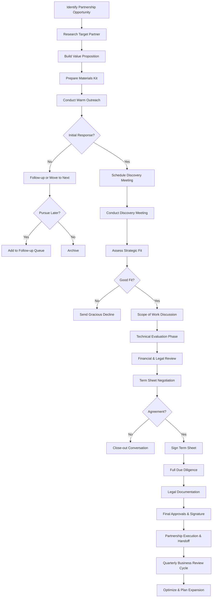
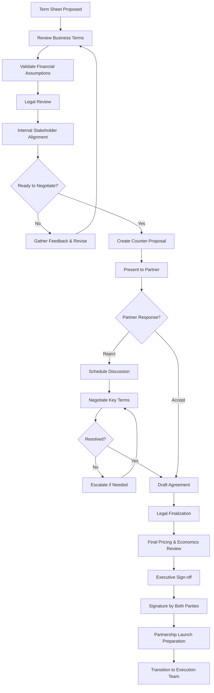

# Strategic Partnerships as a Funding Method: The Playbook

## Table of Contents
1. [Overview](#overview)
2. [Target Capital Ranges](#target-capital-ranges)
3. [How Top-Tier Founders Identify Opportunities](#how-top-tier-founders-identify-opportunities)
4. [The 12-Step Strategic Partnership Process](#the-12-step-strategic-partnership-process)
5. [Systems and Processes](#systems-and-processes)
6. [Messaging Templates](#messaging-templates)
7. [Success Criteria & Metrics](#success-criteria--metrics)
8. [Top-Tier Strategies](#top-tier-strategies)
9. [Common Deal Structures](#common-deal-structures)
10. [Pitfalls to Avoid](#pitfalls-to-avoid)
11. [Resources and Next Steps](#resources-and-next-steps)

---

## Overview

Strategic partnerships are non-equity funding mechanisms where corporations, distribution partners, or joint venture stakeholders provide capital, prepayments, or other valuable resources in exchange for access to your technology, customer base, or distribution channels.

### Why Strategic Partnerships Matter

Strategic partnerships are **underutilized** by founders but represent a significant funding opportunity because:

- **No dilution**: You retain equity and control
- **Revenue acceleration**: Prepayments and licensing fees boost cash flow immediately
- **Market validation**: Partnership with established players validates your business model
- **Go-to-market advantage**: Immediate distribution to enterprise customers
- **Strategic capital**: More than just money—access to resources, expertise, and networks
- **De-risking**: Reduces execution risk by sharing it with an established partner

### Key Characteristics

- **Structure**: Non-equity (prepayments, licensing, royalties, service agreements)
- **Duration**: Typically 2-5 year initial agreements
- **Partner types**: Fortune 500 companies, industry leaders, complementary businesses, distribution partners
- **Decision cycle**: 3-12 months (longer than venture capital but shorter than M&A)
- **Relationship quality**: Long-term partnership over transactional deal

---

## Partnership Readiness & Eligibility Criteria

### Are You Ready for Strategic Partnerships?

Before pursuing strategic partnerships, assess your readiness across these dimensions:

#### **Minimum Viability Criteria**

**Product/Service Readiness** (Score yourself 1-5):
- [ ] You have a functional product/service (MVP or better)
- [ ] At least 5-10 paying customers OR 50+ active users
- [ ] Product solves a validated problem with measurable results
- [ ] You can demonstrate ROI or clear value proposition
- [ ] Product is stable enough for partner integration (not breaking daily)

**Business Readiness** (Score yourself 1-5):
- [ ] Company legally established (incorporated, proper entity structure)
- [ ] Basic compliance in place (privacy policy, terms of service, data security)
- [ ] Financial systems set up (can invoice, track revenue, report financials)
- [ ] Team capacity to support partnership (minimum 2 people who can dedicate time)
- [ ] Clear business model (how you make money is defined)

**Partnership Capacity** (Score yourself 1-5):
- [ ] Executive sponsor available (CEO, COO, or founder with authority)
- [ ] Can commit 20+ hours/week to partnership development
- [ ] Have resources for integration/customization (technical team)
- [ ] Can provide customer references or case studies
- [ ] Legal/finance capacity to negotiate and execute agreements

**Scoring**:
- **13-15**: You're ready for strategic partnerships
- **10-12**: Get 2-3 more things in order, then pursue
- **Below 10**: Focus on product-market fit first, partnerships later

---

### Eligibility by Partnership Type

Different partnership types have different requirements. Here's what partners typically look for:

#### **Technology Platform Partnerships** (AWS, Microsoft, Google, Salesforce, etc.)

**Minimum Requirements**:
- Product built on or integrating with their platform
- Seed funding OR $50K+ ARR OR strong product-market fit
- Technical documentation (API docs, integration guides)
- Security/compliance basics (SOC2 Type 1 or in progress preferred)
- 10+ customers using your integration

**Ideal Profile**:
- Series A funded OR $500K+ ARR
- 100+ customers
- SOC2 Type 2, GDPR compliance
- Dedicated customer success team
- Proven customer retention (90%+ annual)

**What disqualifies you**:
- Building competitive product to platform
- Poor security practices (data breaches, no encryption)
- No customers using the integration
- Inability to support enterprise customers
- Pending litigation or IP disputes

---

#### **Corporate Strategic Partnerships** (Fortune 500 companies)

**Minimum Requirements**:
- $1M+ ARR OR Series A funding
- 50+ customers with measurable results
- Proven product-market fit
- Professional materials (pitch deck, case studies, financials)
- Executive team with relevant experience
- Clear financial model and unit economics

**Ideal Profile**:
- $5M+ ARR OR Series B+ funding
- 200+ customers, including some brand-name logos
- Established in your category (top 3 in your space)
- Track record of successful partnerships
- Strong customer retention and NPS
- Scalable operations (can handle 10x growth)

**What disqualifies you**:
- Pre-revenue or very early stage (unless exceptional circumstances)
- High customer churn (>30% annually)
- Unstable product or frequent outages
- Inability to support enterprise SLAs
- Financial distress or runway <6 months
- Regulatory/compliance issues

---

#### **Distribution/Channel Partnerships** (Resellers, VARs, System Integrators)

**Minimum Requirements**:
- Product is ready for resale (packaged, priced, documented)
- Partner margin structure defined (typically 20-30% discount)
- Sales enablement materials ready (one-pagers, demo, pricing)
- Clear target customer profile
- Support infrastructure (can handle partner-driven customers)

**Ideal Profile**:
- $500K+ ARR with proven sales process
- Strong gross margins (70%+ so you can afford partner margin)
- Low touch sales model (partners can sell without you on every call)
- Certification/training program for partners
- Partner portal and resources
- Co-marketing budget available

**What disqualifies you**:
- Product requires heavy customization per customer
- Margins too thin to support partner discounts (<50% gross margin)
- Complex sale requiring founder involvement every time
- Inadequate support infrastructure
- Competing with potential partners

---

#### **Prepayment Deals** (Large customer commitments)

**Minimum Requirements**:
- Existing customer relationship (not new customer)
- Customer satisfaction (NPS 50+)
- Customer spending $50K+/year currently
- Multi-year value proposition (not one-time project)
- Financial stability to deliver on commitment

**Ideal Profile**:
- Customer spending $200K+/year
- 2+ years relationship
- Customer is strategic reference
- Strong executive relationship
- Product roadmap aligns with customer needs

**What disqualifies you**:
- New customer (no track record)
- Customer dissatisfaction or issues
- Inability to deliver on commitments
- Financial instability (risk of not fulfilling prepaid services)
- Lack of legal/finance capacity to structure properly

---

#### **Joint Ventures / Co-Development** (Highest bar)

**Minimum Requirements**:
- $5M+ ARR OR Series B+ funding
- Proven technology/product that complements partner
- Executive team with JV/partnership experience
- Clear market opportunity ($100M+ TAM for JV)
- Resources to commit (team, capital, IP)
- Strong IP position (patents, proprietary technology)

**Ideal Profile**:
- Market leader in your category
- $20M+ ARR OR Series C+ funding
- Track record of successful partnerships
- Complementary strengths (your tech + their distribution)
- Aligned strategic vision
- Both parties have skin in the game

**What disqualifies you**:
- Early-stage without exceptional technology
- Weak IP or easily replicable product
- Inability to commit significant resources
- Misaligned incentives or vision
- Poor cultural fit or communication

---

### Industry-Specific Eligibility Requirements

#### **Healthcare Partnerships**

**Additional Requirements**:
- HIPAA compliance (mandatory)
- Clinical validation or peer-reviewed studies (preferred)
- FDA clearance if medical device
- Professional liability insurance
- Healthcare expertise on team

**Red Flags**:
- No HIPAA compliance
- Unvalidated clinical claims
- No healthcare expertise
- Regulatory violations

---

#### **Financial Services Partnerships**

**Additional Requirements**:
- Financial services regulations compliance (SOC2, PCI-DSS for payments)
- Banking licenses if applicable
- Professional liability insurance (E&O)
- Strong security posture (penetration testing, audits)
- FinTech expertise on team

**Red Flags**:
- Security incidents or breaches
- Non-compliance with financial regulations
- Weak KYC/AML processes
- No financial services experience on team

---

#### **Enterprise Software Partnerships**

**Additional Requirements**:
- SOC2 Type 2 compliance (mandatory for Fortune 500)
- Enterprise SLAs (99.9%+ uptime)
- SSO/SAML support
- Role-based access controls
- Dedicated customer success team
- Professional services capability

**Red Flags**:
- No SOC2
- Frequent outages or poor reliability
- No enterprise features
- Inadequate support infrastructure

---

### Geographic Considerations

**US-Based Partnerships**:
- US legal entity (C-Corp preferred for venture-backed)
- US bank account
- US-based team members (at least some)
- Understanding of US business practices

**European Partnerships**:
- GDPR compliance (mandatory)
- European legal entity or ability to contract
- EU data residency options
- Understanding of EU business culture (longer sales cycles, different procurement)

**Asia-Pacific Partnerships**:
- Local entity or partner (often required)
- Understanding of local business culture
- Willingness to adapt product for local market
- Patient approach (relationship-building takes longer)

---

### Self-Assessment Checklist

Before reaching out to potential partners, complete this checklist:

**Product & Traction** (70% complete minimum):
- [ ] Product is live and functional
- [ ] 10+ paying customers OR 100+ active users
- [ ] Customer case study with quantified results
- [ ] Product roadmap for next 12 months
- [ ] Technical documentation complete
- [ ] Demo environment available
- [ ] Known bugs/issues documented and managed

**Business Fundamentals** (80% complete minimum):
- [ ] Company incorporated
- [ ] Cap table clean and organized
- [ ] Financial statements available (P&L, balance sheet, cash flow)
- [ ] Revenue model clearly defined
- [ ] Pricing structure established
- [ ] Customer acquisition cost (CAC) and lifetime value (LTV) known
- [ ] 12+ months runway OR profitability OR active fundraising

**Partnership Materials** (60% complete minimum):
- [ ] Partnership pitch deck (15-20 slides)
- [ ] One-pager describing partnership opportunity
- [ ] Customer case studies (2-3)
- [ ] Financial projections showing partnership impact
- [ ] Partnership proposal template
- [ ] Executive bios

**Legal & Compliance** (90% complete minimum):
- [ ] Privacy policy and terms of service
- [ ] Data security measures documented
- [ ] Insurance (E&O, general liability, cyber)
- [ ] IP ownership clear (no disputes)
- [ ] Material contracts organized and accessible
- [ ] NDA template ready
- [ ] Standard agreement template (MSA)

**Team & Operations** (70% complete minimum):
- [ ] Executive sponsor identified (CEO/COO)
- [ ] Partnership lead assigned (20+ hrs/week capacity)
- [ ] Technical lead available for integration discussions
- [ ] Customer success capacity for partner-driven customers
- [ ] Finance/legal capacity for negotiations
- [ ] Support infrastructure can scale

**Scoring**:
- Count total items checked
- **45+ items (75%)**: Ready to pursue strategic partnerships
- **35-44 items (60-74%)**: Address gaps in lowest-scoring categories, then proceed
- **Below 35 items (<60%)**: Focus on fundamentals first

---

## Target Capital Ranges

### By Partnership Type

| Partnership Type | Capital Range | Duration | Use Case |
|---|---|---|---|
| **Prepayment Agreements** | $500K - $5M | 12-24 months | Product development funded by customer |
| **Licensing Deals** | $100K - $2M annually | 3-5 years | Technology licensing with upfront fees |
| **Distribution Partnerships** | $1M - $10M+ | 3-5 years | Exclusive distribution with guaranteed minimums |
| **Joint Ventures** | $5M - $50M+ | 5-10 years | 50/50 or structured equity stakes |
| **Technology Partnerships** | $250K - $5M | 2-4 years | API/platform integration with revenue share |
| **Channel Partnerships** | $500K - $3M | Ongoing | Revenue sharing with resellers/distributors |
| **Supply Chain Partnerships** | $2M - $20M | Long-term | Supplier relationships with prepayments |
| **Research Partnerships** | $100K - $1M | 1-3 years | Academic or industry collaboration |

### Cumulative Impact

Most successful founders don't rely on a single partnership deal. The optimal strategy is a **portfolio approach**:
- 2-3 distribution partnerships = $3M-$10M
- 2-3 licensing deals = $500K-$3M
- 1-2 prepayment agreements = $1M-$5M
- **Total potential: $4.5M-$18M** in non-dilutive capital

---

## How Top-Tier Founders Identify Opportunities

### 1. The Strategic Adjacency Map

Create a visual map of companies that would benefit from your solution:

```
Your Product/Service
        ↓
Who uses it? (Direct customers)
        ↓
Who sells to them? (Distribution partners)
        ↓
Who provides complementary solutions? (Technology partners)
        ↓
Who supplies them? (Supplier partnerships)
        ↓
Who competes with them? (Alternative solutions they need)
```

### 2. The Three Circles Methodology

Identify partners where all three circles overlap:

1. **Strategic fit**: They have a problem your solution solves OR they have customers who do
2. **Financial incentive**: You directly impact their revenue, reduce costs, or open new markets
3. **Execution capability**: They have the infrastructure, team, and willingness to execute

### 3. Top Partner Identification Sources

#### Primary Sources
- **Industry analyst reports** (Gartner, Forrester, IDC): Identify ecosystem leaders
- **Company earnings calls**: Listen for strategic priorities, pain points, expansion plans
- **Customer advisory boards**: Ask existing customers who their strategic partners are
- **Trade shows and conferences**: Meet ecosystem players, observe partnership announcements
- **Customer review sites** (G2, Capterra, TrustRadius): See who appears alongside winners

#### Secondary Sources
- **LinkedIn ecosystem mapping**: Follow companies, identify partnership announcements
- **Crunchbase/PitchBook**: Track corporate VC and acquisition patterns
- **Company websites**: Review their "partners" or "ecosystem" pages
- **Press releases**: Monitor for partnership announcements and new initiatives
- **Industry Slack communities**: Real discussions about partnership needs

#### Tertiary Sources
- **Personal networks**: Ask advisors, mentors, and board members
- **University connections**: Faculty, alumni networks
- **Investor networks**: Tap into VC firm partner ecosystems
- **Service provider networks**: Law firms, consultants who work with target partners

### 4. The Partnership Readiness Signal Checklist

Score potential partners on these signals (1-5 scale):

| Signal | What to Look For | How to Research |
|---|---|---|
| **Market momentum** | Growing revenue, expanding TAM in your space | Earnings calls, market reports, press |
| **Strategic priority** | Public statements about innovation/expansion in your space | CEO interviews, investor meetings, strategic plans |
| **Budget availability** | Discretionary spending authority, recent funding rounds | Analyst reports, budget leaks, industry intel |
| **Pain point relevance** | Documented problems your solution solves | Customer interviews, industry reports, case studies |
| **Complementary asset** | They have distribution, customers, or technology you need | Website, partner pages, product roadmap |
| **Decision-making speed** | History of moving quickly on partnerships | Track record research, investor conversations |
| **Cultural alignment** | Values, communication style, partnership philosophy | Founder/exec interviews, employee reviews |

**Scoring system**: 25+ = Excellent prospect | 20-24 = Good prospect | 15-19 = Warm prospect | <15 = Not ready yet

---

## The 12-Step Strategic Partnership Process

### Phase 1: Discovery & Targeting (Weeks 1-4)

#### Step 1: Create Your Partnership Opportunity Map
**Objective**: Identify 20-30 viable partnership opportunities

**Actions**:
- Use the Strategic Adjacency Map from above
- List companies by size: Fortune 500 (large deals), mid-market (faster decisions), private (flexible terms)
- Create a spreadsheet with: Company name, industry, partnership type, contact person, readiness score
- Tier partners as Tier 1 (must-haves), Tier 2 (strong fits), Tier 3 (nice-to-haves)

**Deliverable**: Partnership opportunity spreadsheet with 20-30 targets, scored and tiered

**Tools**: Google Sheets, Airtable, Salesforce

**Time allocation**: 20 hours

---

#### Step 2: Deep Research on Top 10 Targets
**Objective**: Understand each partner's business model, strategic priorities, and decision-making structure

**Actions for each target**:
- Read latest earnings call transcript or investor presentation
- Identify top 3 strategic priorities from CEO/investor communications
- Find 2-3 recent partnership announcements; understand structure
- Identify likely decision makers (Chief Strategy Officer, VP Business Development, VP Partnerships)
- Document their pain points and how your solution helps
- Research funding/budget cycles (fiscal year, typical approval timeline)
- Find 2-3 employees on LinkedIn and note their background

**Deliverable**: One-page partnership brief for each of top 10 targets with strategic context

**Tools**: LinkedIn, company websites, CapitalIQ, AlphaSights, Gartner Halo

**Time allocation**: 15 hours

**Sample Research Template**:
```
PARTNERSHIP RESEARCH BRIEF

Company: [Name]
Industry: [Vertical]
Revenue: [Size]
Strategic Priority #1: [From latest earnings call]
Strategic Priority #2:
Strategic Priority #3:

Pain Points Our Solution Addresses:
1. [Specific problem statement]
   - Financial impact: $X annually
   - Business unit affected: [Team]
   - Decision maker: [Name/Title]

Recent Partnerships:
- [Partnership 1] - Structure: [Type], Timeline: [Length]
- [Partnership 2] - Structure: [Type], Timeline: [Length]

Key Decision Makers:
1. [Name] - [Title] - [Email if possible]
2. [Name] - [Title] - [Email if possible]

Funding/Budget Cycle:
- Fiscal year ends: [Month]
- Typical approval timeline: [3-6 months]
- Budget authority: [Who approves $500K, $1M, $5M deals]
```

---

### Phase 2: Preparation (Weeks 5-8)

#### Step 3: Develop Your Partnership Value Proposition
**Objective**: Create a compelling narrative of why this partnership works for them

**For each top target, develop**:
1. **The Business Case**
   - Specific revenue opportunity (e.g., "Access to 500K developers generates $2M annually")
   - Cost savings opportunity (e.g., "Eliminates need for $500K/year in internal development")
   - Strategic opportunity (e.g., "Enables $50M market expansion into Asia")
   - Timeline (e.g., "Revenue realized within 12 months")

2. **Customer Proof Points**
   - Case study from customer in same industry
   - Metrics: revenue increase, cost savings, customer satisfaction
   - Testimonial from respected customer

3. **Competitive Advantage**
   - Why your solution is better than building/buying alternative
   - Market timing (why now, not later)
   - Defensibility (patents, exclusive agreements, switching costs)

4. **Implementation Plan**
   - Team and resources required
   - Timeline (MVP to full deployment)
   - Dependencies on partner
   - Risk mitigation strategies

**Deliverable**: Customized value proposition (1 page) for each top 10 target

**Tools**: Keynote, Google Slides, Word

**Time allocation**: 15 hours

**Sample Value Prop Template**:
```
PARTNERSHIP VALUE PROPOSITION

For: [Company Name]
Prepared by: [Your Name]
Date: [Date]

EXECUTIVE SUMMARY
[1 paragraph] Why this partnership is strategically important and financially compelling

THE OPPORTUNITY
What specific business problem do we solve?
- Problem: [Specific business pain point]
- Impact: $X annually to their business
- Current solution: [How they solve it today]
- Limitations: [Why current approach is inadequate]

THE SOLUTION
How our technology/service solves it:
- Key features/capabilities
- Why we're uniquely positioned
- Competitive advantages

THE BUSINESS CASE
Revenue opportunity:
- [Specific revenue model]
- Year 1: $X
- Year 2: $X
- Year 3: $X
- Total 5-year value: $X

OR Cost savings opportunity:
- [Specific cost reduction]
- Year 1: $X saved
- Year 2: $X saved
- Total 5-year value: $X

PROOF OF CONCEPT
- Customer example: [Company] achieved $X results
- Metrics: [Specific KPIs]
- Timeline: [Implementation duration]
- Investment required: $X

PROPOSED STRUCTURE
- Type of partnership: [Licensing/prepayment/distribution/etc.]
- Financial terms: [What we're asking for]
- Term: [Duration]
- Exclusivity: [Yes/no, geographic scope]

NEXT STEPS
- Proposed timeline
- Required approvals
- Decision deadline

APPENDICES
- Customer case study
- Product demo access
- Technical specifications
```

---

#### Step 4: Build Your Partnership Materials
**Objective**: Create a toolkit of professional materials for outreach and meetings

**Essential materials**:

1. **Partnership Deck** (15-20 slides)
   - Company overview (1 slide)
   - Problem statement with market context (2 slides)
   - Your solution and differentiation (3 slides)
   - Financial opportunity (2 slides)
   - Customer proof points (2 slides)
   - Proposed partnership structure (2 slides)
   - Team and experience (1 slide)
   - Implementation roadmap (1 slide)
   - Investment/support required (1 slide)

2. **One-Pager** (PDF, highly visual)
   - Problem, solution, opportunity, ask
   - Partner logo placement ready
   - Professional design

3. **Partner Packet** (email attachment)
   - Cover letter
   - Partnership brochure
   - Customer case studies (2-3)
   - Team bios (if relationships are new)

4. **Demo Access**
   - Sandboxed environment
   - Pre-built templates showing partnership value
   - 30-minute walkthrough guide

5. **Legal Template** (prepared with counsel)
   - Non-disclosure agreement (NDA)
   - Master service agreement template
   - Term sheet template

**Deliverable**: Complete partnership materials kit

**Tools**: Pitch deck software (Deck, Canva, Keynote), legal document templates

**Time allocation**: 20 hours

---

#### Step 5: Map Internal Stakeholders and Build Support
**Objective**: Ensure your organization can execute on partnerships

**Actions**:
- Identify executive sponsor for each partnership (usually CEO or Chief Business Officer)
- Brief key stakeholders: product, engineering, sales, customer success
- Assign partnership lead internally
- Document resource commitments (people, product customization, support)
- Establish partnership review process and approval authority
- Create partnership KPI dashboard

**Key questions to answer internally**:
- Can our product/service be customized for partners? (How much engineering effort?)
- Who owns the partnership relationship? (Dedicated person or part-time?)
- What's our support capacity for a new partner?
- How much revenue is breakeven on partnership development?
- What exclusivity would we give? (By geography, industry, use case?)

**Deliverable**: Partnership operating plan document

**Time allocation**: 10 hours

---

### Phase 3: Outreach & Engagement (Weeks 9-16)

#### Step 6: Multi-Channel Outreach Strategy
**Objective**: Get meetings with the right decision makers at target partners

**Channel 1: Warm Introductions (Primary)**
- Ask your investors to introduce you
- Ask board members and advisors to make connections
- Ask existing customers to recommend you to their partners
- Ask industry contacts and alumni networks

**Channel 2: Direct Outreach to Decision Makers**
- Research VP of Business Development / Chief Strategy Officer on LinkedIn
- Personalized email + LinkedIn message + phone call
- Timing: Tuesday-Thursday, 9-11am or 2-4pm

**Channel 3: Strategic Entry Points**
- Conference attendance (hand-deliver partnership proposal)
- Customer user group meetings (demonstrate, ask for referral)
- Industry analyst briefings
- Press mentions (get quoted, then follow up with partnership offer)

**Channel 4: Institutional Relationships**
- Work through sales team relationships
- Partner with implementation consultants or systems integrators
- Create ambassador program with power users

**Outreach sequence for each target**:

```
Week 1: Research and identify 2-3 warm introduction sources
Week 2: Make warm introduction request
Week 3: If intro made - follow up with personalized email and partnership brief
Week 3-4: If no warm intro - execute direct outreach
  - Day 1: Send personalized email to VP Partnerships/Business Development
  - Day 3: LinkedIn message
  - Day 5: Follow-up email
  - Day 7: Phone call (if phone number found)
Week 4: Meeting scheduled or moved to lower priority
Week 5-6: Follow-up sequences based on response
```

**Email template for cold outreach** (see Messaging Templates section)

**Deliverable**: Outreach tracking spreadsheet with dates, contacts, response rates

**Success metrics**:
- 30% response rate to outreach (meeting request)
- 50% of meetings convert to deeper engagement

**Time allocation**: 20 hours

---

#### Step 7: Secure Initial Discovery Meetings
**Objective**: Get to coffee/video call with decision maker to validate partnership fit

**Meeting preparation**:
- Research attendees thoroughly (LinkedIn, recent news, speaking history)
- Prepare customized opening (reference their specific strategic priority)
- Have 3-5 provocative questions about their business ready
- Bring partnership brief and leave-behind materials
- Know your ask: "If this is interesting, we'd propose you evaluate a [type of partnership]"

**Meeting agenda** (30 minutes):
1. **Opening** (2 min): Brief intro, explain why you think there's alignment
2. **Context** (5 min): Their strategic priority, business direction
3. **Problem** (5 min): Specific problem your solution solves for them
4. **Solution** (8 min): Demo or description, showing results
5. **Opportunity** (5 min): Specific opportunity you see for partnership
6. **Next steps** (5 min): Propose next meeting (deeper dive, technical review, etc.)

**Key principles**:
- Listen 60%, talk 40%
- Ask about their timeline and decision process
- Don't pitch—educate and explore
- Identify second person to involve (likely technical buyer)
- Schedule follow-up before leaving

**Follow-up after meeting**:
- Send thank you email within 24 hours
- Include relevant case study or data point they asked about
- Propose specific next meeting with agenda
- CC internal stakeholders

**Deliverable**: Notes from 5-10 discovery meetings with next steps documented

**Success metrics**:
- 70%+ of meetings result in second meeting scheduled
- 50%+ agree to involve technical team in evaluation

**Time allocation**: 15 hours (for top 10 targets)

---

### Phase 4: Evaluation & Negotiation (Weeks 17-32)

#### Step 8: Support Partner Evaluation Process
**Objective**: Help partner evaluate you as a potential strategic partner

**Typical partner evaluation includes**:
1. **Technical evaluation** (4-8 weeks)
   - API documentation review
   - Integration testing with their systems
   - Security/compliance assessment
   - Scalability assessment

2. **Financial evaluation** (2-4 weeks)
   - Business case modeling
   - ROI calculation for proposed partnership
   - Cost-benefit analysis vs. alternatives

3. **Organizational evaluation** (4-6 weeks)
   - Vendor/partner assessment questionnaire
   - Reference calls
   - Leadership/team assessment
   - Financial health check

4. **Legal evaluation** (3-4 weeks)
   - Data privacy and security review
   - IP ownership questions
   - Insurance and indemnification terms
   - Standard agreement review

**Your role during evaluation**:
- Assign technical point person to support their technical team
- Provide comprehensive data room (security, compliance, financials)
- Facilitate reference calls with current customers
- Be responsive to questions and evaluation requests
- Escalate to executive sponsor if evaluation stalls

**Red flags during evaluation**:
- Multiple re-evaluations or scope creep
- Requests for significant product customization at no cost
- Delay in scheduling evaluation meetings
- Personnel changes on their side
- Introduction of new stakeholders without explanation

**Deliverable**: Partner evaluation tracker, documentation of all evaluation materials provided

**Time allocation**: 30 hours (supporting evaluation across multiple partners)

---

#### Step 9: Term Sheet Development and Negotiation
**Objective**: Move from interest to binding term sheet with clear financial and operational terms

**Term sheet essentials**:

```
PARTNERSHIP TERM SHEET

1. PARTIES
   [Your Company] and [Partner Company]

2. PARTNERSHIP TYPE
   [Licensing / Prepayment / Distribution / Joint Venture / Other]

3. TERM
   - Commencement: [Date]
   - Initial term: [X years]
   - Renewal: [Auto-renew, require mutual agreement, or not available]
   - Termination: [Notice period, conditions]

4. FINANCIAL TERMS
   - Upfront payment/prepayment: $X
   - Annual licensing fee: $X
   - Revenue share: X% of sales generated
   - Minimum guaranteed purchase/investment: $X
   - Payment schedule: [When payment is due]
   - Price adjustments: [% annually, CPI, etc.]

5. EXCLUSIVITY
   - Territory: [Worldwide, regions, countries]
   - Industry vertical: [Specific to their industry or broader]
   - Product scope: [What products/services included]
   - Exceptions: [Specific competitors or categories excluded]
   - Duration: [Full term or limited period]

6. GOVERNANCE
   - Executive steering committee: [Quarterly]
   - Operations meeting: [Monthly]
   - Escalation process: [For disputes, issues]

7. PERFORMANCE OBLIGATIONS
   Your company will:
   - Provide product/service as specified
   - Maintain X uptime/availability
   - Dedicate [X FTE] to relationship
   - Deliver quarterly business reviews

   Partner will:
   - Commit to minimum investment/purchase
   - Provide go-to-market support
   - Dedicate [X FTE] to relationship
   - Hit adoption/revenue targets

8. INTELLECTUAL PROPERTY
   - Ownership of jointly developed IP
   - License grants to each party
   - Confidential information handling

9. TERMINATION FOR CAUSE
   Either party may terminate if:
   - Material breach not cured within [X days]
   - [Specific performance targets missed]
   - [Specific conditions]

10. MATERIAL TERMS STILL TO BE NEGOTIATED
    - [List any open items]
```

**Negotiation strategy**:
- Know your BATNA (best alternative): Can you live with walking away?
- Prioritize terms: Which terms are must-haves vs. nice-to-haves?
- Look for creative solutions: If they won't pay more, can they commit to larger volumes?
- Use silence: Let them sit with your proposal for a few days
- Get to the decision maker: Escalate if you're stuck in middle negotiations
- Involve counsel: Have attorney review before signature

**Common negotiation sticking points and solutions**:

| Issue | Their Position | Your Counter |
|---|---|---|
| **Price too low** | "We can't approve X" | Tie payment to performance milestones, volume-based pricing, smaller initial term |
| **Demanding exclusivity** | "We need exclusive" | Grant exclusivity only for their specific use case, region, or industry; limited time period |
| **IP ownership** | "We need to own all IP" | Allow them to own customer-specific customizations but you retain core IP |
| **Support requirements** | "We need 24/7 support" | Tiered SLAs; higher tier at premium cost |
| **Custom development** | "We need feature X built" | Create separate development addendum with fees; or phase into partnership after initial term |

**Deliverable**: Signed term sheet

**Time allocation**: 20 hours (across all active partnerships)

---

#### Step 10: Legal Documentation and Due Diligence
**Objective**: Finalize binding agreements and complete mutual due diligence

**Required documents**:

1. **Master Service Agreement (MSA)**
   - Standard terms and conditions
   - Service levels
   - Liability and indemnification
   - Termination provisions
   - Renewal and amendment process

2. **Data Processing Addendum (DPA)** (if handling data)
   - GDPR/CCPA compliance
   - Data subject rights
   - Security requirements
   - Data breach notification

3. **IP Assignment Agreement** (if creating jointly)
   - Ownership of jointly developed technology
   - License rights to each party
   - Background IP usage

4. **Non-Disclosure Agreement** (if not already signed)
   - Confidential information definition
   - Use restrictions
   - Term of confidentiality

5. **Statement of Work (SOW)** for each phase
   - Specific deliverables
   - Timeline
   - Resource allocation
   - Acceptance criteria

**Due diligence checklist**:

For you to provide to them:
- [ ] Certificate of Good Standing
- [ ] Business License/Registration
- [ ] Insurance certificates (E&O, General Liability, etc.)
- [ ] Compliance certifications (SOC2, ISO27001, etc.)
- [ ] Security assessment report
- [ ] Financial statements (last 2 years)
- [ ] Cap table and shareholder agreements
- [ ] Material customer contracts
- [ ] IP assignment documentation
- [ ] Litigation history

For them to provide to you:
- [ ] Good faith intent to invest/commit to partnership
- [ ] Financial authority confirmation
- [ ] Executive sponsorship confirmation
- [ ] Internal approval documentation

**Timeline expectations**:
- Legal review: 2-4 weeks
- Due diligence: 2-4 weeks
- Multiple signature cycles: 1-2 weeks

**Cost**: Budget $5K-$25K for legal review (either you or both parties splitting)

**Deliverable**: Fully executed partnership agreement

**Time allocation**: 15 hours (your side; partner handles their side)

---

### Phase 5: Execution & Optimization (Weeks 33+)

#### Step 11: Launch Partnership Execution
**Objective**: Operationalize the partnership and start driving mutual value

**Immediate actions (Week 1)**:
- Kick-off meeting with full teams
- Confirm resource commitments
- Establish communication cadence
- Define escalation process
- Create shared project management view (Jira, Asana, etc.)
- Schedule monthly business reviews

**30-Day milestones**:
- [ ] Product integration complete (if technical partnership)
- [ ] Co-marketing materials created
- [ ] Internal training completed
- [ ] First customer/transaction executed
- [ ] First business review completed

**90-Day milestones**:
- [ ] X revenue/transactions from partnership
- [ ] X customer feedback collected
- [ ] Go-to-market strategy refined based on learnings
- [ ] Year 1 forecast validated

**6-Month evaluation**:
- [ ] Hit minimum targets? (Revenue, transactions, adoption)
- [ ] Partner satisfaction: NPS score
- [ ] Identify expansion opportunities
- [ ] Adjust strategy if off track

**Execution playbook**:

1. **Product Integration**
   - Define API requirements
   - Provide API documentation
   - Support integration testing
   - Co-test with real data
   - Deploy to production environment

2. **Go-to-Market**
   - Co-create marketing materials
   - Launch joint press release
   - Schedule webinar/event
   - Create co-branded one-pagers
   - Train partner's sales team

3. **Metrics & Tracking**
   - Dashboard showing progress vs. partnership goals
   - Weekly operational metrics
   - Monthly financial metrics
   - Quarterly business reviews

4. **Customer Success**
   - Assign dedicated partner success manager
   - Implement onboarding process
   - Track customer adoption and satisfaction
   - Proactive issue resolution

**Deliverable**: Partnership project plan and execution dashboard

**Time allocation**: 40 hours in first 90 days, then 10 hours/week ongoing

---

#### Step 12: Optimize and Expand Partnership
**Objective**: Maximize value and plan expansion phases

**Quarterly optimization activities**:

1. **Performance Review**
   - Review actual results vs. targets
   - Analyze win/loss reasons
   - Identify product or process improvements
   - Document lessons learned

2. **Customer Feedback**
   - Collect feedback from partner's customers
   - Conduct joint customer advisory board calls
   - Identify use case expansion opportunities

3. **Commercial Optimization**
   - Analyze unit economics
   - Identify high-performing geographies, segments
   - Discuss pricing or volume adjustments

4. **Strategic Planning**
   - Plan Year 2 expansion
   - Identify new product/feature needs
   - Discuss geographic expansion
   - Evaluate exclusivity modifications

**Expansion opportunities**:
- Increase volumes/revenue share
- Expand to new geographies
- Add new products/services to partnership
- Increase equity stake (if JV)
- Formalize on-premise deployment
- Create reseller sub-partnerships

**Renewal planning** (6 months before expiration):
- Early discussion of extension vs. renegotiation
- Document success metrics achieved
- Identify improvements for Year 2 terms
- If expanding scope, prepare updated business case
- Prepare renewal term sheet

**Deliverable**: Quarterly business review decks, renewal documentation

**Time allocation**: 8 hours/month for active partnerships

---

## Systems and Processes

### Partnership Pipeline Management

**Tool**: Salesforce, Pipedrive, or custom Airtable dashboard

**Key fields to track**:
```
Partnership Pipeline

| Company | Contact | Partnership Type | Stage | Est. Value | Timeline | Probability | Exec Sponsor |
|---------|---------|------------------|-------|-----------|----------|-------------|-------------|
| Acme Inc | John Smith | Licensing | Discovery | $2M | 6 mo | 40% | CEO |
| XYZ Corp | Sarah Jones | Prepayment | Term Sheet | $5M | 4 mo | 60% | COO |
| Beta Ltd | Mike Chen | Distribution | Execution | $3M | Ongoing | 80% | VP Sales |
```

**Stage definitions**:
1. **Identified**: Target identified, research started
2. **Engaged**: Met with decision maker, interested
3. **Evaluating**: Partner conducting technical/financial evaluation
4. **Term Sheet**: Term sheet shared and under negotiation
5. **Legal**: Agreements in final review/execution
6. **Execution**: Agreement signed, implementation ongoing
7. **Optimizing**: Partnership running, working on expansion

**Review cadence**:
- Weekly: Update stage progress, mark any blockers
- Monthly: Team review of entire pipeline, discuss strategy for stuck deals
- Quarterly: Executive partnership review, plan expansion for successful deals

---

### Partnership Operations Framework

**Core team roles**:

1. **Executive Sponsor** (CEO or COO)
   - Relationship with C-level decision maker
   - Quarterly business reviews
   - Escalation for issues
   - Renewal/expansion approval

2. **Partnership Lead** (VP Business Development)
   - Day-to-day partnership management
   - Monthly operations meetings
   - Execution against milestones
   - Partner escalations

3. **Technical Lead** (VP Engineering or Product)
   - Integration development and support
   - Technical issue resolution
   - Roadmap collaboration

4. **Success Manager** (Customer Success or Implementation)
   - Customer onboarding and adoption
   - Issues and escalations
   - Feedback collection

5. **Marketing Lead** (VP Marketing)
   - Co-marketing execution
   - Messaging and positioning
   - Event and webinar participation

**Monthly partnership operations meeting**:
- Run through dashboard metrics
- Discuss any issues/blockers
- Review next month priorities
- Escalate problems to executive sponsor if needed

---

### Metrics and KPIs

**For each partnership, track**:

| Metric | Target | Frequency | Owner |
|--------|--------|-----------|-------|
| **Financial** | | | |
| Revenue/prepayment recognized | [Target] | Monthly | Finance |
| Gross margin on partnership | [Target %] | Quarterly | Finance |
| CAC through partnership | Compare to direct | Quarterly | Finance |
| LTV from partner customers | Compare to direct | Quarterly | Finance |
| **Operational** | | | |
| Customer onboarding time | [X weeks] | Monthly | Success |
| % of customers adopted product | [X%] | Monthly | Success |
| Support ticket volume per customer | [Threshold] | Weekly | Support |
| Product bugs/issues reported | [Target] | Weekly | Engineering |
| Integration uptime | [X%] | Daily | Engineering |
| **Strategic** | | | |
| Customer satisfaction (NPS) | [Target score] | Quarterly | Success |
| Partner satisfaction (NPS) | [Target score] | Quarterly | Partnership |
| Expansion opportunities identified | [X per quarter] | Quarterly | Partnership |
| Market share/penetration | [Target %] | Quarterly | Sales/Mktg |

---

## Messaging Templates

### Template 1: Initial Partnership Inquiry Email

**Subject**: Strategic Partnership Opportunity - [Your Company] + [Their Company]

Hi [First Name],

[PERSONALIZATION: Reference something specific about their company, initiative, or recent announcement]

I've been following [specific strategic initiative/business priority], and I think there's a compelling opportunity for [Your Company] and [Their Company] to partner.

Specifically:
- [Their company] is focused on [strategic priority they stated]
- We've built [your solution] that helps companies like [specific customer/type] achieve [specific outcome]
- [Customer name] saw a [specific result] in just [X months]

I suspect there could be a strong fit for a [type of partnership] between our companies because [specific business reason why].

Would you be open to a 20-minute call next week to explore whether this makes sense? No obligation—just exploring potential alignment.

Best times for me: [2-3 specific time slots]

[Your Name]
[Your Title]
[Company]
[Phone]

---

### Template 2: Partnership Value Proposition Email (Post-Discovery)

**Subject**: RE: Strategic Opportunity - Next Steps

Hi [First Name],

Thanks for taking the time to discuss our potential partnership last week. Based on our conversation, I've outlined below how I see this working and the value it could create for [Their Company].

**THE OPPORTUNITY**
[Their company] is looking to [specific strategic objective]. Our platform enables [specific capability] that would let you [specific business outcome].

**FINANCIAL IMPACT**
Based on your [X] customer base and our experience with similar deployments:
- Year 1 revenue potential: $[X]
- Year 2-3 potential: $[X+]
- Implementation timeline: [X months to revenue]

**CUSTOMER PROOF**
[Similar customer] achieved [specific result] using our solution:
- [Metric 1]: [Result]
- [Metric 2]: [Result]
- [Metric 3]: [Result]
See attached case study for full details.

**PROPOSED NEXT STEPS**
To move forward, I'd suggest:
1. Technical evaluation with your [team] (2-3 weeks) - We'll provide a sandbox and API docs
2. Financial modeling (1 week) - We'll help validate ROI assumptions
3. Internal approval process (2-4 weeks)
4. Term sheet development (1-2 weeks)

I'm proposing we get your technical team access to a demo environment by [date], and schedule a kickoff call on [date/time].

Does this timeline work for you?

[Your Name]

---

### Template 3: Partnership Term Sheet Email

**Subject**: PARTNERSHIP TERM SHEET - [Your Company] + [Their Company]

Hi [First Name],

Following up on our discussions, I've attached a partnership term sheet outlining the proposed structure and financial terms.

**KEY TERMS SUMMARY**
- Partnership type: [Type]
- Initial term: [X years]
- Upfront investment/prepayment: $[X]
- Ongoing annual fee: $[X] / [X% revenue share]
- Exclusivity: [Specific exclusivity terms]
- Target signing: [Date]

**WHAT HAPPENS NEXT**
I'd like to propose a call with you and your legal team within the next week to discuss and answer any questions on the attached term sheet.

Can you do [date/time]? If not, please suggest 2-3 times that work for you.

Once we're aligned on commercial terms, our legal teams can finalize the agreements.

I'm excited about this partnership and confident we can create significant value together.

[Your Name]

---

### Template 4: Partnership Proposal Deck Outline

**Slide 1: Title**
- Your company logo, their company logo
- "Strategic Partnership Proposal"
- Date

**Slide 2: Executive Summary**
- One compelling statement about the opportunity
- Key financial metric (revenue, cost savings)
- Timeline

**Slide 3: Company Overview**
- Brief company description
- Key facts (founded, size, customers, funding)
- Key expertise/assets relevant to partnership

**Slide 4: The Problem**
- Specific business problem your solution solves
- Market context (size, growth)
- Consequences of problem (revenue loss, cost, risk)

**Slide 5-6: The Solution**
- How your solution works (high-level)
- Key features/capabilities
- Why you're uniquely positioned

**Slide 7: Customer Proof**
- Case study: Customer name, industry, size
- Challenge they faced
- Results achieved (metrics)

**Slide 8: The Opportunity**
- Specific opportunity for their company
- How your solution applies to them
- Why now vs. later

**Slide 9: Financial Impact**
- Revenue opportunity ($X)
- OR Cost savings ($X)
- Implementation timeline
- ROI/payback period

**Slide 10: Proposed Partnership Structure**
- Type: [Licensing/Prepayment/Distribution]
- Financial terms: [Upfront + ongoing]
- Term: [Duration]
- Exclusivity: [Y/N]

**Slide 11: Go-to-Market**
- How you'll execute together
- Customer acquisition strategy
- Marketing and sales support

**Slide 12: Implementation Timeline**
- Phase 1: [Technical setup, timeline]
- Phase 2: [Go-to-market, timeline]
- Phase 3: [Scale, timeline]
- First revenue: [Timeline]

**Slide 13: Team**
- Key team members
- Relevant background/expertise
- Track record with partnerships

**Slide 14: Why Now**
- Market timing
- Competitive landscape
- Strategic momentum

**Slide 15: Partnership Benefits**
- For them: [specific benefits]
- For us: [specific benefits]
- Together: [what's possible]

**Slide 16: Investment Required**
- What we're asking: $X upfront
- What they get in return: [specific deliverables]
- Timeline to value: [X months]

**Slide 17: Next Steps**
- Proposed timeline
- Key decisions needed
- Decision deadline

**Slide 18: Contact**
- Your name, email, phone
- Executive sponsor name, email, phone

---

### Template 5: Partnership Kick-Off Meeting Agenda

**[PARTNERSHIP NAME] KICK-OFF MEETING**
Date: [Date]
Duration: 90 minutes
Attendees: [List of attendees from both sides]

**1. Welcome & Introductions** (10 min)
- Brief intro of each attendee and role
- Goals for partnership

**2. Partnership Overview** (10 min)
- Review of term sheet
- Confirm key commercial terms
- Timeline expectations

**3. Technical Integration** (20 min)
- Technical requirements overview
- Integration approach
- API/data flow discussion
- Timeline and dependencies
- Q&A

**4. Go-to-Market Plan** (15 min)
- Customer acquisition strategy
- Marketing support
- Sales training and collateral
- Launch timeline

**5. Governance & Reporting** (10 min)
- Monthly operations review cadence
- Quarterly business review format
- Escalation process
- Key metrics/dashboard

**6. Team Introductions & Roles** (10 min)
- Each side identifies key contacts and roles
- Resource commitments confirmed
- Communication protocol

**7. 90-Day Plan** (10 min)
- Review milestones for first 90 days
- Confirm priorities
- Identify any potential blockers

**8. Q&A & Close** (5 min)
- Open discussion
- Confirm next meeting date
- Action items summary

---

### Template 6: Monthly Partnership Status Report

**PARTNERSHIP STATUS REPORT - [PARTNERSHIP NAME]**
Report Date: [Month/Year]
Reporting Period: [Month 1 - Month End]

**EXECUTIVE SUMMARY**
[1 paragraph status: on track, at risk, or off track; key highlights]

**FINANCIAL METRICS**
- Revenue/prepayment recognized: $[X] (YTD: $[X])
- Target for period: $[X]
- % of target: [X%]
- Forecast for year: $[X]

**OPERATIONAL METRICS**
- Transactions/customers: [X] (Target: [X])
- Customer adoption rate: [X]% (Target: [X]%)
- Product issues open: [X] (Target: [X])
- Support ticket volume: [X] (Baseline: [X])
- System uptime: [X]% (Target: 99.5%+)

**KEY MILESTONES - COMPLETED THIS MONTH**
- [ ] Milestone 1: [Description] - Completed [Date]
- [ ] Milestone 2: [Description] - Completed [Date]
- [ ] Milestone 3: [Description] - Completed [Date]

**KEY MILESTONES - NEXT MONTH**
- [ ] Milestone 1: [Description] - Target [Date]
- [ ] Milestone 2: [Description] - Target [Date]
- [ ] Milestone 3: [Description] - Target [Date]

**HIGHLIGHTS & WINS**
- [Specific achievement]
- [Specific achievement]
- [Customer win or feedback]

**CHALLENGES & RISKS**
| Risk | Impact | Likelihood | Mitigation |
|---|---|---|---|
| [Risk description] | [Impact] | [High/Med/Low] | [Action] |

**EXPANSION OPPORTUNITIES**
- [Potential expansion 1]: $[X] opportunity
- [Potential expansion 2]: $[X] opportunity

**PARTNER FEEDBACK**
- What's working well: [Summary]
- Areas for improvement: [Summary]
- Partner NPS: [Score]

---

## Success Criteria & Metrics

### Phase-Level Success Criteria

| Phase | Success Criteria | Measurement |
|---|---|---|
| **Discovery** | Met with 5+ qualified potential partners | Pipeline > $10M in identified opportunities |
| **Engagement** | 3+ partners in serious evaluation | 50% conversion from intro to evaluation |
| **Evaluation** | 2 partners complete evaluation | Evaluation cycle < 12 weeks |
| **Negotiation** | 1-2 term sheets signed | Achieved 70%+ of ask in terms |
| **Execution** | 1 partnership generating revenue | Partnership revenue > $500K in year 1 |
| **Optimization** | Partnership achieving targets | 90%+ of revenue milestones hit |
| **Expansion** | Identified expansion opportunities | 2-3 expansion opportunities per partnership |

### Business Impact Metrics

**Revenue metrics**:
- Total strategic partnership revenue: $[Target]
- % of company revenue from partnerships: [Target %]
- CAC from partnerships vs. direct sales
- LTV of customers acquired through partnerships
- Gross margin on partnership revenue

**Operational metrics**:
- Average partnership deal size: $[Target]
- Time from identification to revenue: [Target weeks]
- Number of active partnerships: [Target]
- Partnership retention rate: [Target %]
- Partnership expansion rate: [Target %]

**Strategic metrics**:
- New customer segments accessed through partnerships
- New geographies entered via partnerships
- Features/products developed for partnerships
- Market share gains via partnership channels
- Strategic credibility gained (brand lift)

---

## Top-Tier Strategies

### Strategy 1: The Anchor Partner Approach

**What it is**: Identify one "anchor" strategic partner that is large enough to move the needle and has proven market validation.

**Why it works**:
- Creates proof of concept at scale
- Generates significant revenue immediately
- Attracts other partners (social proof)
- Improves fundraising conversations

**How to execute**:
1. Identify Fortune 500 or large private company with $10M+ partnership potential
2. Get warm introduction through investor or advisor
3. Make it worth their while: Offer exclusive partnership, co-invest, dedicated team
4. Use anchor partnership to attract 3-5 secondary partners

**Example**:
- [SaaS Company] partnered with Salesforce (anchor)
- This generated $5M revenue and 100+ enterprise customers
- Secondary partnerships with 10+ complementary software companies followed
- Drove 50% of ARR growth over 3 years

---

### Strategy 2: The Channel Partner Playbook

**What it is**: Build a network of value-added resellers (VARs), system integrators (SIs), or distributors who sell your solution to their customers.

**Why it works**:
- Exponential sales force without hiring cost
- Access to established customer relationships
- Revenue without direct sales effort
- Faster market penetration

**How to execute**:
1. Identify 10-20 channel partners (systems integrators, consultants, resellers in your space)
2. Create attractive partner economics: 20-30% discount, co-marketing support, training
3. Provide everything partners need: Sales training, demo environment, marketing materials, pre-sales support
4. Track partner performance monthly; reward top performers
5. Expand into vertical or geographic markets via partners

**Financial model**:
- Partner discount: 30% of retail price
- Your margin: 70%
- Partner acquisition cost: ~$10K per partner (support, training, materials)
- Payback period: 3-6 months per partner
- Target: 50+ channel partners generating $20M+ revenue

---

### Strategy 3: The Prepayment Deal

**What it is**: Negotiate a large upfront prepayment from a customer/partner in exchange for discounted rates or exclusive benefits over 2-3 years.

**Why it works**:
- Massive cash injection immediately
- De-risks customer/partner relationship
- Improves cash flow and balance sheet
- Enables faster hiring/development

**How to execute**:
1. Identify large customer/partner spending 50K+/year with high satisfaction
2. Propose: "If you commit to 2 years now and prepay, we'll give you 20% discount"
3. Structure: Year 1 payment upfront, Year 2 payment on anniversary
4. Use cash for product development that benefits partnership

**Financial impact**:
- $2M prepayment = $1.67M net revenue (accounting for discount)
- Improves cash position by $2M
- Reduces monthly revenue volatility
- Higher cash margins vs. subscription model

**Example**:
- Customer spends $500K/year on your solution
- Negotiate 2-year prepayment with 15% discount
- Get $850K upfront instead of spreading $1M over 24 months
- Use $350K to build features customer requested

---

### Strategy 4: The Co-Investment/Joint Venture

**What it is**: Partner with complementary company to build joint company or product line, with shared investment and equity ownership.

**Why it works**:
- Combines complementary strengths (tech + distribution, product + go-to-market)
- Larger addressable market than either party alone
- Creates defensible competitive position
- Attracts venture capital more easily

**How to execute**:
1. Identify partner with complementary product/capability and strong distribution
2. Define new market opportunity that requires both parties' strengths
3. Create financial model showing potential ($100M+ TAM)
4. Negotiate equity stake (typically 50/50 or 60/40)
5. Secure joint funding (venture capital)
6. Build new company/product with separate P&L

**Example**:
- [SaaS Platform A] + [Distribution Partner B]
- Create joint venture focused on [new vertical]
- Each invest $2M + dedicated teams
- Raise $5M Series A for JV
- Grow to $10M ARR in 3 years
- Exit or continue as profitable subsidiary

---

### Strategy 5: The Technology Licensing Model

**What it is**: License your core technology/IP to partners who integrate it into their products, with royalty or license fee structure.

**Why it works**:
- Passive revenue stream after initial development
- Rapid market penetration via partners' existing customer bases
- Minimal customer support effort on your side
- Scalable without hiring

**How to execute**:
1. Identify partners with large installed base who want to add your capability
2. Create detailed technical specification and API documentation
3. Offer licensing terms:
   - Upfront license fee: $250K-$1M
   - Ongoing royalty: 5-10% of their product revenue including your feature
   - OR annual licensing fee: $100K-$500K/year
4. Provide SDK/libraries and support for integration
5. License to 5-10 partners with limited/no exclusivity

**Financial model** (conservative):
- 5 partners at $500K upfront fee each = $2.5M
- Average $200K/year royalty per partner = $1M/year recurring
- Year 1: $2.5M + $1M = $3.5M
- Year 2+: $1M/year with minimal support cost

---

### Strategy 6: The Hybrid Go-to-Market

**What it is**: Combine multiple partnership types to create multiple revenue streams and market penetration strategies.

**Why it works**:
- Diversified revenue reduces dependency on any single channel
- Each partnership model reaches different customer segment
- Creates defensible market position
- De-risks business model

**How to execute**:

Example hybrid model for SaaS platform:
1. **Direct sales**: Enterprise customers (40% of revenue)
2. **Channel partners**: Mid-market via VARs (25% of revenue)
3. **Technology licensing**: OEM/embedded in partner products (20% of revenue)
4. **Prepayment deals**: Large customer prepayments (10% of revenue)
5. **White-label partnerships**: Integrated into partner platform (5% of revenue)

**Example revenue breakdown**:
- $10M total annual recurring revenue (ARR)
- Direct sales: $4M
- Channel partners: $2.5M
- Licensing: $2M
- Prepayments: $1M
- White-label: $500K

---

### Strategy 7: The Partner Ecosystem Play

**What it is**: Position your company as the central hub that connects multiple complementary solutions in an ecosystem.

**Why it works**:
- Network effects: More partners = more value to customers
- Lock-in: Customers depend on ecosystem integration
- Attractiveness to partners: Everyone wants to be in winning ecosystem
- Expansion revenue: Marketplace fees, premium listings, data

**How to execute**:
1. Identify 10-15 complementary tools/services that your customers use
2. Build lightweight integrations (pre-built connectors, APIs)
3. Create partner marketplace or directory
4. Provide marketing support and co-selling for best partners
5. Monetize: Partner ecosystem fees, premium placement, data analytics

**Example**:
- Your platform is HR system
- Create ecosystem of complementary solutions:
  - Payroll processor
  - Background check service
  - Recruiting tool
  - Expense management
  - Benefits administration
- Integrate all via APIs
- Customers stay because switching requires moving entire ecosystem
- Generate $2M/year from partner fees

---

## Common Deal Structures

### Structure 1: Licensing Deal

**Use case**: You have technology; partner wants to integrate it into their product

**Financial terms**:
- Upfront license fee: $500K-$2M
- Annual renewal fee: $250K-$1M OR
- Revenue share: 5-10% of partner's product revenue including your feature

**Duration**: 3-5 years, renewable

**Key terms**:
- Scope of license (specific product, geography, industry vertical)
- Exclusivity (exclusive to them, non-exclusive, or exclusive within their vertical)
- Support/SLAs (how you support integration)
- Trademark/branding rights
- Sublicense rights (can they license to others?)

**Typical success metrics**:
- Partner integrates within 6 months
- Reaches 100+ customers using your feature within 18 months
- Year 2 revenue grows 50%+ as partner increases customer base

---

### Structure 2: Prepayment/Advance Payment Deal

**Use case**: Large customer wants to lock in pricing; you need cash

**Financial terms**:
- 2-year contract prepaid: Normally $1M spread over 24 months, instead pay $950K upfront (5% discount for cash)
- 3-year contract prepaid: Normally $1.5M spread over 36 months, instead pay $1.35M upfront (10% discount)

**Duration**: 2-3 years

**Key terms**:
- Payment schedule (lump sum upfront or 2 payments)
- Usage/volume commitments
- Refund provisions if you can't deliver
- Price locked vs. annual escalation

**Typical success metrics**:
- Close 2-3 prepayment deals per year at $500K-$2M each
- Improves cash runway by 6-12 months

---

### Structure 3: Distribution Partnership

**Use case**: Partner has sales channel/customer base; you provide product

**Financial terms**:
- Minimum guarantee: Partner commits to buy $X annually
- Revenue share: Partner gets 20-30% of deal, you get 70-80%
- OR Co-go-to-market: Partner sells on your behalf, takes X% commission on sales

**Duration**: 2-3 year initial term, renewable

**Key terms**:
- Territory (geography or vertical)
- Exclusivity (exclusive in their territory)
- Minimum sales targets
- Partner marketing support (you co-invest in marketing)
- Right of first refusal (on future products)

**Typical success metrics**:
- Year 1: Hit minimum guarantee ($1-5M)
- Year 2: Exceed guarantee by 25%
- Partnership generates 30-50% of your revenue by year 3

---

### Structure 4: Strategic Investment with Partnership

**Use case**: Corporate investor wants equity stake + partnership benefits

**Financial terms**:
- Investment: $5-20M for equity stake (typically 5-10%)
- Partnership value: Preferred pricing, co-go-to-market, channel access
- Product roadmap alignment

**Duration**: 5-10 year partnership + equity stake

**Key terms**:
- Board seat or board observer rights
- Information rights
- Approval rights on major decisions
- Non-dilution provisions
- Exit rights if strategic situation changes

**Typical success metrics**:
- Close $10M investment
- Generate $2-5M in partnership revenue annually
- Drive 30%+ of sales through partner channel

---

### Structure 5: Technology Co-Development / Joint Product

**Use case**: Build new product together combining both companies' strengths

**Financial terms**:
- Joint investment: Each party invests $2-5M
- Shared ownership of resulting IP (50/50 typical)
- Shared revenue from product sales
- Each party gets exclusive license for own use case

**Duration**: 2-3 year development + 5+ years partnership

**Key terms**:
- Governance structure (joint steering committee)
- Resource commitments
- IP ownership (of joint product, of background IP)
- Exit rights if relationship sours
- Non-compete restrictions

**Typical success metrics**:
- Launch product within 18 months
- Reach $5-10M combined ARR by year 3
- Both partners drive material revenue

---

### Structure 6: Reseller Channel Program

**Use case**: Build network of resellers who sell your solution (often with markup)

**Financial terms**:
- Partner margin: 20-35% discount on your list price
- You receive 65-80% of revenue
- Volume discounts: Greater margin for higher volumes
- Co-marketing support: You fund 10-25% of partner's marketing

**Duration**: Ongoing (annual agreements)

**Key terms**:
- Geographic territory or vertical
- Minimum annual purchase commitment ($50K-$250K typical)
- Exclusivity (limited or non-exclusive)
- Training and certification requirements
- Partner tier/levels based on commitment

**Typical success metrics**:
- 25-50 active resellers
- Each reseller generates $500K-$2M annually
- Channel accounts for 40-60% of revenue
- Partner NPS > 50

---

## Pitfalls to Avoid

### Pitfall 1: Misaligned Strategic Priorities

**What happens**: You pursue partnership with company whose strategic priority doesn't align with your solution. 6 months in, they deprioritize partnership because it's not core to their strategy.

**How to avoid**:
- Validate in initial conversations that partnership aligns with their stated strategy
- Get buy-in from multiple stakeholders, not just one champion
- Include strategic rationale in term sheet (if circumstances change, partnership can be paused)
- Re-validate alignment quarterly

---

### Pitfall 2: Underestimating Execution Effort

**What happens**: You commit to building custom features or integrations as part of partnership but underestimate effort. Partnership becomes money-losing because you spend 2x estimated engineering hours.

**How to avoid**:
- Do technical assessment early (Step 6)
- Create detailed statement of work with specific deliverables
- Build 25% time buffer into estimates
- Get executive sign-off on resource commitment before signing
- If partner wants custom development beyond scope, create separate addendum with fees

---

### Pitfall 3: Large Upfront Payment, Back-End Performance Risk

**What happens**: You negotiate $5M prepayment over 3 years ($1.67M/year), but partner never actually adopts or scales solution. You have $5M liability on balance sheet but no revenue realization.

**How to avoid**:
- Tie prepayment to milestones when possible (only pay when certain adoption thresholds hit)
- Require minimum purchase commitments or performance targets
- Get executive commitment and sign-off from budget owner, not just business development
- Build in true-up provisions (if they don't hit minimums, refund difference)
- Structure as 50/50 milestone-based (50% upfront, 50% after X months if hitting targets)

---

### Pitfall 4: Exclusivity Mistakes

**What happens**: Partner demands exclusive rights; you grant exclusivity globally, then partner doesn't execute. You can't pursue similar partners. Worse—partner sells to your competitor.

**How to avoid**:
- Exclusivity should be earned, not given freely
- Limit exclusivity scope: By geography, industry vertical, or use case (not global)
- Include performance triggers: "Exclusive only if hitting $X revenue targets"
- Exclude specific competitors or specify "non-exclusive for your use case"
- Time-limit exclusivity: "Exclusive for first 2 years, then non-exclusive"
- Get carve-outs for existing customers and products in development

---

### Pitfall 5: Partner from Hell

**What happens**: Partner demands constant customizations, won't approve marketing materials, moves goalposts, has internal politics that slow decisions, or becomes a customer success nightmare.

**How to avoid**:
- Interview customers of potential partner (ask about their partnership experience)
- Talk to other strategic partners to understand their operating model
- In early conversations, discuss how decisions are made and establish cadence
- Specify in term sheet what happens if partner becomes non-responsive (auto-termination clause)
- Don't overcommit resources in year 1 in case it doesn't work out

---

### Pitfall 6: Revenue Recognition Issues

**What happens**: You prepay $5M and incorrectly recognize it all as revenue upfront. Auditor flags it. Revenue gets restated. Investors lose confidence.

**How to avoid**:
- Work with finance team and external auditors on revenue recognition up front
- Prepayments often have to be recognized ratably over contract period
- Document service performance obligations clearly in contract
- Get accounting guidance before signing partnership agreements
- If auditor requires different revenue recognition than expected, adjust pricing accordingly

---

### Pitfall 7: IP Ownership Conflicts

**What happens**: Partner demands ownership of jointly developed IP; you agree; later realizes patent is worth $50M and partner owns it all. Or partner uses IP with competitors.

**How to avoid**:
- Clarify IP ownership in term sheet before execution (don't leave to legal phase)
- Joint developments = you retain ownership of general technology, partner gets license
- Background IP = each party retains ownership of their own IP pre-partnership
- Customer-specific customizations = could go to partner or you depending on circumstances
- Get specific approval on which IP gets licensed to them vs. owned by you

---

### Pitfall 8: Under-resourced Partnership

**What happens**: You sign partnership, then realize your team is overwhelmed with demands. Customer success suffers, bugs pile up, partner gets frustrated, partnership fails.

**How to avoid**:
- Assess internal resource capacity before signing term sheet
- Get internal commitment (CEO/COO approval) on resources
- Budget 2 FTE minimum per major partnership in year 1 (technical, success, PM support)
- Build in ramp-down clause: First 6 months are heavy, months 7-12 are lighter
- Hire dedicated partnership resource if running multiple partnerships

---

### Pitfall 9: Wrong Partner Type

**What happens**: You spend 6 months negotiating with a partner that doesn't have decision-making authority or budget. Finally escalate to real decision maker who says "no."

**How to avoid**:
- Validate authority early: "Who would need to approve a $X partnership like this?"
- Get in room with budget owner early, not late
- Confirm in writing that decision makers are engaged
- Check approval matrix: For $2M deal, who approves? Ensure you're working with right level
- If working with BD person, get explicit confirmation they can commit resources/budget

---

## Partnership Success Tips by Stage

### **Early Stage Startups (Pre-Seed to Seed)**

**Best Partnership Types**:
1. **Technology platform partnerships** (AWS Activate, Microsoft for Startups, Google Cloud)
   - Get infrastructure credits ($50K-$150K value)
   - Technical support and training
   - Marketplace listing for distribution

2. **Accelerator partnerships** (Y Combinator, Techstars, industry-specific accelerators)
   - $25K-$150K investment
   - Mentorship and connections
   - Corporate partner introductions

3. **Open source / ecosystem partnerships**
   - Build on popular platforms (WordPress, Shopify, Salesforce)
   - Freemium model to gain users
   - Community-driven distribution

**Success Tips**:
- Focus on partnerships that provide resources (credits, training) not just capital
- Build relationships before you need them (attend events, contribute to communities)
- Start with no-cost or low-cost partnerships (ecosystem integrations)
- Use partnerships to extend runway and prove product-market fit
- Leverage partner brands for credibility in fundraising

**What to Avoid**:
- Complex enterprise partnerships (you don't have bandwidth)
- Exclusive partnerships (you need flexibility to pivot)
- Partnerships requiring significant customization (focus on core product)
- Long negotiation cycles (opportunity cost too high)

**Success Metrics**:
- Secure $50K-$150K in cloud credits within first 6 months
- Get listed in 2-3 partner marketplaces
- Gain first 100 customers through partner channels
- Use partner credibility to raise Seed round

---

### **Series A Startups ($1M-$5M ARR)**

**Best Partnership Types**:
1. **Distribution partnerships** with complementary products
   - Target partners with 10K-100K customers
   - Revenue sharing or referral fees
   - Co-marketing agreements

2. **Systems integrator partnerships** (consulting firms, implementation partners)
   - They implement your solution for enterprises
   - Expand your reach without hiring large sales team
   - Typical deal size: $100K-$500K

3. **Technology partnerships** with larger platforms
   - Deep product integrations
   - Preferred/certified partner status
   - Joint go-to-market programs

4. **Prepayment deals** with top customers
   - 2-3 year commitments, prepaid
   - $500K-$2M per deal
   - Use for runway extension

**Success Tips**:
- Focus on 3-5 strategic partnerships (don't spread thin)
- Assign dedicated partnership manager (0.5-1 FTE minimum)
- Invest in integration engineering (2-3 FTE)
- Build partner enablement materials (training, certification, portal)
- Track partnership metrics rigorously (revenue attribution, CAC, LTV)
- Create partnership playbook and repeatable processes

**What to Avoid**:
- Too many partnerships simultaneously (spread too thin)
- Partnerships without clear revenue attribution
- Ignoring partner requests (damages relationship)
- Under-investing in partner success
- Partnerships that compete with your core business model

**Success Metrics**:
- 20-30% of new customers from partnerships within 12 months
- 2-3 active distribution partnerships generating $500K+ annually each
- $1M-$3M in prepayment deals secured
- CAC from partnerships 50%+ lower than direct sales
- Partner-sourced customers have 20%+ higher retention

---

### **Series B+ Startups ($5M+ ARR)**

**Best Partnership Types**:
1. **Strategic corporate partnerships** with Fortune 500
   - Co-development agreements
   - Strategic investment ($5M-$50M)
   - Exclusive or preferred partnerships
   - Multi-year commercial agreements

2. **Channel partner programs** at scale
   - 50-200 active resellers/distributors
   - Tiered partner program (bronze, silver, gold, platinum)
   - Partner revenue: $10M-$50M+ annually

3. **Joint ventures** for new markets
   - 50/50 or structured ownership
   - Joint investment: $5M-$20M each
   - Target new geographies or verticals

4. **OEM/white-label partnerships**
   - Your technology embedded in partner's product
   - Large volume licensing deals
   - Multi-million dollar contracts

**Success Tips**:
- Dedicate full partnership team (VP Partnerships + 3-5 FTE)
- Establish executive sponsorship for each major partnership (CEO/COO involvement)
- Create sophisticated partner tracking and attribution systems
- Invest heavily in partner enablement (portal, training, certification, events)
- Build partner marketing engine (joint case studies, events, webinars, content)
- Formalize partnership governance (quarterly business reviews, steering committees)
- Consider strategic investments in key partners
- Protect your core business while enabling partnerships

**What to Avoid**:
- Partnerships that cannibalize direct sales without clear strategic value
- Over-reliance on single partner (>40% revenue from one partner = risk)
- Partnerships that distract from core product roadmap
- Ignoring partner profitability (some partners may be unprofitable)
- Granting exclusivity without performance guarantees
- Partnerships that create channel conflict

**Success Metrics**:
- 40-60% of revenue from partnerships
- 50-200 active channel partners
- $10M-$50M+ annual partnership revenue
- 3-5 strategic corporate partnerships with Fortune 500
- Partner program NPS >40
- Partner-sourced customers: CAC 60%+ lower, LTV 1.5x higher
- 2-3x pipeline coverage from partnership channels

---

### **Growth/Late Stage Startups (Pre-IPO, $50M+ ARR)**

**Best Partnership Types**:
1. **Global strategic alliances**
   - Worldwide distribution agreements
   - Multi-hundred million dollar partnerships
   - Joint innovation and R&D

2. **Ecosystem leadership**
   - Position as platform (others build on you)
   - Marketplace or app store
   - Developer/partner ecosystem

3. **M&A-driven partnerships**
   - Acquire complementary companies
   - Consolidate market position
   - Defensive partnerships against competitors

4. **Industry consortiums and standards bodies**
   - Influence industry direction
   - Create moats through standards
   - Associate with industry leaders

**Success Tips**:
- Build dedicated partnerships organization (20-50 FTE)
- Establish C-level partnership leadership (Chief Partnership Officer)
- Create partner advisory councils
- Host annual partner conferences
- Develop sophisticated partner programs (training, certification, marketing, support)
- Use partnerships as competitive moat
- Consider acquiring strategic partners
- Build two-sided marketplace/ecosystem if applicable

**What to Avoid**:
- Partnerships that expose you to antitrust scrutiny
- Over-dependence on partners (maintain direct sales capability)
- Partnerships that limit your strategic flexibility pre-IPO
- Complex JVs that create accounting/disclosure issues for S-1
- Partnerships with potential acquirers (may complicate acquisition discussions)

**Success Metrics**:
- 50-70% of revenue from partnerships and channels
- 500+ active partners globally
- $100M+ annual partnership revenue
- Presence in all major cloud marketplaces (AWS, Azure, GCP)
- Partner ecosystem = competitive moat
- 90%+ of Fortune 500 customers acquired through partnerships
- Partner-led revenue growing faster than direct sales

---

## Red Flags: When to Walk Away from a Partnership

### **Deal Structure Red Flags**

**Immediate Walk-Away Signals**:
1. **Partner demands majority IP ownership** of jointly developed technology
   - Acceptable: Joint ownership with cross-licenses
   - Acceptable: You own core IP, partner owns customizations
   - Red flag: They own everything, you get limited license

2. **Unreasonable exclusivity demands** without compensation
   - Acceptable: Exclusive in their vertical/geography with $5M+ guarantee
   - Red flag: Global exclusivity with <$1M commitment
   - Red flag: Exclusivity with no performance requirements

3. **All risk on you, no skin in game for them**
   - Acceptable: Shared investment and risk
   - Red flag: You build everything custom at your cost, they "might" promote it
   - Red flag: Minimum guarantees with easy-out clauses for them

4. **Mismatched timelines** (they need it built in 2 months, you need 8 months)
   - Red flag: Unrealistic delivery expectations
   - Red flag: Penalties for delays beyond your control
   - Acceptable: Phased approach with realistic milestones

5. **Payment terms** heavily weighted to back-end performance you can't control
   - Acceptable: 50% upfront, 50% on milestones you control
   - Red flag: 10% upfront, 90% on their sales performance

### **Partner Behavior Red Flags**

**Warning Signs During Negotiation**:
1. **Constantly moving goalposts**
   - Multiple rounds of "one more thing" requests
   - Renegotiating agreed terms
   - Adding scope without adding compensation

2. **Slow or non-responsive decision making**
   - Takes weeks to respond to emails
   - Cancels/reschedules meetings repeatedly
   - No clear timeline or decision process
   - *Exception*: If due to legitimate budget cycles, holiday seasons, or reorganizations

3. **Working with wrong level / no executive sponsorship**
   - Junior BD person with no authority
   - Can't get meeting with decision maker
   - No executive sponsor on their side
   - "I need to ask my boss" on every decision

4. **Demanding work before contract signed**
   - "Build this feature and then we'll consider partnership"
   - "Give us free access for 6-month trial, then we'll discuss terms"
   - Acceptable: Limited POC with clear scope and SOW

5. **Bad-mouthing competitors or previous partners**
   - Sign of difficult partner
   - Likely to do same to you
   - Cultural misalignment

6. **Unwillingness to provide references**
   - Ask to speak with 2-3 current partners
   - If they refuse or make excuses, red flag

### **Financial Red Flags**

**Concerning Financial Situations**:
1. **Partner in financial distress**
   - Layoffs, restructuring, declining revenue
   - May not be able to fulfill commitments
   - Partnership may be terminated when new management comes in

2. **Payment terms** that put you at risk
   - Net-90 or Net-120 payment terms (vs. industry standard Net-30 to Net-60)
   - You finance their business by fronting services/product

3. **Requests for discounts >40%** without volume justification
   - Acceptable: 20-30% for channel partners with volume
   - Red flag: 50%+ discount for uncertain/unproven volume

4. **Complex financial structures** designed to minimize your payment
   - Revenue recognition games
   - Hidden fees or deductions
   - Unclear accounting methods

### **Technical/Product Red Flags**

1. **Demanding features** that conflict with your roadmap or positioning
   - Creates "Frankenstein product"
   - Distracts from core value proposition
   - May make product worse for other customers

2. **Security or compliance requests** you fundamentally can't meet
   - Don't overpromise compliance (HIPAA, SOC2, etc.)
   - If you can't meet their requirements, walk away vs. fake it

3. **Integration requirements** beyond your capability
   - Legacy systems you can't integrate with
   - Unrealistic performance requirements (1ms latency when you're at 100ms)
   - Data requirements you can't legally comply with

### **Strategic Misalignment Red Flags**

1. **Partnership isn't strategic priority for them**
   - Not mentioned in earnings calls or strategic plans
   - No executive sponsorship
   - Budget unclear or unfunded

2. **They're exploring acquisition** of competitor or building competitive product
   - You become "plan B" or leverage for negotiations
   - Risk of partnership ending abruptly

3. **Cultural misalignment** that can't be bridged
   - Different values on customer success, quality, ethics
   - Communication breakdown
   - Mismatched pace (startup speed vs. corporate bureaucracy)

4. **Conflicts of interest**
   - Partner also working with your direct competitors
   - Partner investing in competitive company
   - Unclear who "owns" customer relationship

### **How to Exit a Bad Partnership Negotiation Gracefully**

If you encounter red flags, exit professionally:

**Polite Decline Template**:
```
Hi [Partner Contact],

Thank you for the time invested in exploring a partnership between [Your Company] and [Their Company].

After careful consideration, we've decided not to move forward at this time. While we see potential alignment, [specific reason: timeline, resource requirements, strategic fit, etc.] doesn't work for us at this stage of our business.

We appreciate the discussions and would be open to revisiting in the future if circumstances change.

Best regards,
[Your Name]
```

**When to Stay Firm**:
- You've identified multiple red flags
- Gut instinct says "no" (trust your instincts)
- Opportunity cost is too high (time spent on bad partnership vs. good opportunities)
- Team morale is suffering from difficult negotiations
- Partnership would put your business at risk (financial, legal, reputational)

**When to Keep Negotiating**:
- Single red flag that can be addressed
- Strategic value is extremely high
- You can mitigate risks through contract terms
- Executive alignment exists despite operational friction
- They're willing to address your concerns

---

## Major Corporate Partnership Programs (With URLs)

### Technology Platform Partnerships

#### **Microsoft for Startups**
- **URL**: https://www.microsoft.com/en-us/startups
- **Partnership Type**: Technology partnership, co-selling, Azure credits
- **Funding Equivalent**: Up to $150K in Azure credits over 2 years
- **Eligibility**:
  - B2B startups
  - Less than $10M in funding
  - Building on Azure or integrating with Microsoft products
- **Benefits**:
  - Access to Microsoft's sales team for co-selling
  - Go-to-market support
  - Technical architecture support
  - Potential investment from M12 (Microsoft's VC arm)
- **Timeline**: 3-4 weeks from application to acceptance
- **Success Example**: DocuSign partnered with Microsoft early, integrated with Office 365, gained enterprise customers, eventually IPO'd at $4.4B valuation

#### **AWS Activate & AWS Partner Network (APN)**
- **URL**: https://aws.amazon.com/activate/ and https://aws.amazon.com/partners/
- **Partnership Type**: Technology partnership, infrastructure credits, reseller program
- **Funding Equivalent**:
  - Portfolio: $100K in credits
  - Self-starter: $5K-$25K in credits
- **Eligibility**:
  - Building on AWS
  - Backed by participating accelerators/VCs OR
  - Bootstrapped with product-market fit
- **Benefits**:
  - AWS credits for infrastructure
  - Technical support
  - Training and certifications
  - Access to AWS sales team for qualified partners
  - AWS Marketplace listing (generates revenue)
- **Advanced APN Benefits**:
  - Co-marketing funding ($25K-$100K)
  - Joint solution development
  - AWS customer introductions
- **Success Example**: Slack became an AWS Premier Consulting Partner, used AWS infrastructure, leveraged AWS's enterprise relationships, grew to $27B market cap at IPO

#### **Google Cloud for Startups**
- **URL**: https://cloud.google.com/startup
- **Partnership Type**: Technology partnership, cloud credits, go-to-market support
- **Funding Equivalent**: Up to $200K in Google Cloud credits over 2 years
- **Eligibility**:
  - VC-backed startups OR
  - Accepted into partner accelerators
  - Building on Google Cloud Platform
- **Benefits**:
  - Google Cloud credits
  - Technical training
  - Google Workspace credits
  - Access to Google experts
  - Potential investment from Google Ventures
- **Timeline**: 2-3 weeks from application to activation
- **Success Example**: Spotify partnered with Google Cloud for infrastructure migration, received technical support and credits, scaled to 450M+ users globally

#### **Salesforce Ventures & AppExchange**
- **URL**: https://www.salesforce.com/ventures/ and https://appexchange.salesforce.com/
- **Partnership Type**: Strategic investment + distribution partnership
- **Funding Equivalent**: $5M-$50M equity investment + revenue sharing
- **Eligibility**:
  - Building on Salesforce platform OR
  - Complementary to Salesforce products
  - $1M+ ARR preferred for investment
- **Benefits**:
  - Equity investment from Salesforce Ventures
  - AppExchange distribution (2.5M+ listings browsed annually)
  - Co-selling with Salesforce reps
  - Marketing and event exposure
  - Integration certification
- **AppExchange Revenue Model**:
  - You keep 100% of revenue (Salesforce takes no commission on non-Lightning apps)
  - Access to 150,000+ Salesforce customers
- **Success Example**: Conga (formerly Apttus) built on Salesforce, listed on AppExchange, grew through Salesforce partnerships, reached $500M+ valuation, acquired by private equity for undisclosed amount

#### **SAP.iO Foundry & Partnership Program**
- **URL**: https://sap.io/
- **Partnership Type**: Accelerator + strategic partnership + potential investment
- **Funding Equivalent**: $50K-$150K non-dilutive + $2M-$10M investment potential
- **Eligibility**:
  - B2B enterprise startups
  - Focus areas: Supply Chain, Finance, HR, Sustainability, Industry Cloud
  - Series A-B stage preferred
- **Benefits**:
  - 3-month intensive program
  - Access to SAP's 440,000+ customers
  - Technical integration support
  - Pilot opportunities with SAP customers
  - Investment from SAP.iO Fund
- **Timeline**: 8-12 weeks from application to program start
- **Success Example**: Tradeshift partnered with SAP, integrated with SAP Ariba, gained Fortune 500 customers, raised $240M+ in total funding

#### **IBM Partnership Programs**
- **URL**: https://www.ibm.com/partnerplus
- **Partnership Type**: Technology partnership, reseller, consulting partnership
- **Funding Equivalent**: Co-marketing funds $50K-$500K depending on tier
- **Eligibility**:
  - Building on IBM Cloud, Watson AI, or complementary to IBM solutions
  - Proven customer base
  - Technical certification required
- **Benefits**:
  - IBM Cloud credits
  - Co-selling opportunities with IBM's 2,500+ sellers
  - Access to IBM client base
  - Technical and sales training
  - Joint marketing campaigns
- **Partnership Tiers**:
  - Registered (entry level)
  - Silver ($100K annual revenue)
  - Gold ($1M annual revenue)
  - Platinum ($5M+ annual revenue)
- **Success Example**: Red Hat partnered with IBM for decades, co-developed enterprise Linux solutions, eventually acquired by IBM for $34B

### Industry-Specific Strategic Partnerships

#### **Healthcare & Life Sciences**

**1. Philips HealthWorks**
- **URL**: https://www.philips.com/a-w/about/innovation/healthworks
- **Partnership Type**: Co-development, distribution, investment
- **Funding Equivalent**: $500K-$5M investment + product partnership
- **Focus Areas**: Digital health, remote patient monitoring, AI diagnostics
- **Eligibility**: Health tech startups with clinical validation
- **Success Example**: BioIntelliSense partnered with Philips for remote patient monitoring, received investment and distribution support, scaled to hospitals nationwide

**2. Johnson & Johnson Innovation - JLABS**
- **URL**: https://jlabs.jnjinnovation.com/
- **Partnership Type**: Incubation + strategic partnership + investment potential
- **Funding Equivalent**: $100K value in lab space + $2M-$25M investment potential
- **Eligibility**:
  - Life sciences, pharmaceutical, medical device, consumer health startups
  - Addressing unmet medical needs
- **Benefits**:
  - No equity required for lab space
  - Access to J&J's business development team
  - Potential commercial partnerships
  - Investment from Johnson & Johnson Innovation
- **Success Example**: Verb Surgical (joint venture with J&J and Google/Verily) developed robotic surgery platform with significant J&J support

**3. CVS Health Innovation Lab**
- **URL**: https://www.cvshealth.com/about-cvs-health/innovation
- **Partnership Type**: Pilot programs, distribution partnership
- **Funding Equivalent**: Pilot contracts $250K-$2M
- **Focus Areas**: Digital health, pharmacy tech, chronic disease management
- **Eligibility**: Health tech with proven efficacy and regulatory compliance
- **Success Example**: Omada Health partnered with CVS/Aetna for diabetes prevention, expanded to 1M+ covered lives

#### **Financial Services (FinTech)**

**1. Visa Fintech Fast Track Program**
- **URL**: https://usa.visa.com/partner-with-us/visa-fintech-fast-track.html
- **Partnership Type**: Technology partnership, distribution, co-innovation
- **Funding Equivalent**: $100K-$500K in partnership value (API access, support, marketing)
- **Eligibility**:
  - FinTech companies building payment solutions
  - Seed to Series B stage
- **Benefits**:
  - Direct access to Visa APIs
  - Compliance and regulatory support
  - Co-marketing opportunities
  - Introductions to Visa's bank partners
  - Fast-tracked partnership process (90 days vs. 12+ months)
- **Success Example**: Stripe joined Visa partnership programs early, leveraged Visa infrastructure, grew to $95B valuation

**2. Mastercard Start Path**
- **URL**: https://www.mastercard.us/en-us/vision/innovation/start-path.html
- **Partnership Type**: Accelerator + strategic partnership
- **Funding Equivalent**: Partnership value $250K-$1M (no equity taken)
- **Eligibility**:
  - Later-stage startups (Series A+)
  - Focus on payments, commerce, data/services, financial inclusion, crypto/blockchain
- **Benefits**:
  - 6-month program
  - Access to Mastercard technology and APIs
  - Customer introductions
  - Pilot opportunities
  - No equity taken by Mastercard
- **Success Example**: Deserve (digital-first credit cards) went through Start Path, partnered with Mastercard, raised $50M+ and grew rapidly

**3. Plaid Exchange**
- **URL**: https://plaid.com/exchange/
- **Partnership Type**: Technology partnership, data sharing
- **Funding Equivalent**: Revenue sharing opportunities (varies)
- **Eligibility**: FinTech apps that need bank connectivity
- **Benefits**:
  - Access to 12,000+ financial institutions
  - Financial data infrastructure
  - Compliance support
  - Customer acquisition through Plaid network
- **Success Example**: Venmo, Robinhood, and others built on Plaid, Plaid acquired by Visa for $5.3B (deal later terminated but valuation validated)

#### **Retail & E-Commerce**

**1. Shopify Plus Partner Program**
- **URL**: https://www.shopify.com/plus/partners
- **Partnership Type**: Technology partnership, revenue sharing, distribution
- **Funding Equivalent**: Revenue potential $500K-$5M+ annually
- **Eligibility**:
  - Apps/services for e-commerce businesses
  - Technical certification required
  - Proven customer success
- **Benefits**:
  - Listing in Shopify App Store (2M+ merchants)
  - Revenue share: Developers keep 80% of app revenue (20% to Shopify)
  - Co-marketing opportunities
  - Access to Shopify Plus enterprise customers
- **Success Example**: Klaviyo built on Shopify, became preferred email marketing partner, reached $9.2B valuation at IPO

**2. Amazon Web Services Marketplace & Partner Network**
- **URL**: https://aws.amazon.com/marketplace
- **Partnership Type**: Distribution partnership, reseller program
- **Funding Equivalent**: Revenue potential unlimited
- **Eligibility**: SaaS, ML, data, security, or infrastructure products
- **Benefits**:
  - Distribution to AWS's customer base
  - Consolidated billing (customers pay through AWS)
  - AWS sales team referrals
  - Private offers for custom pricing
- **Revenue Model**: AWS takes 3-15% commission depending on listing type
- **Success Example**: Databricks listed on AWS Marketplace, enabled easy procurement for enterprises, grew to $43B valuation

**3. Target + Techstars Retail Accelerator**
- **URL**: https://www.techstars.com/accelerators/target
- **Partnership Type**: Accelerator + pilot opportunities
- **Funding Equivalent**: $120K investment + up to $1M in pilot contracts
- **Eligibility**: Startups in retail innovation, supply chain, customer experience
- **Benefits**:
  - 13-week program
  - Pilot opportunities with Target
  - Mentorship from Target executives
  - Access to Target's supply chain and stores
- **Success Example**: Techstars retail portfolio companies have raised $100M+ collectively after program

#### **Telecommunications**

**1. Verizon 5G Labs**
- **URL**: https://www.verizon.com/about/our-company/5g/labs
- **Partnership Type**: Co-innovation, technology partnership
- **Funding Equivalent**: Varies, access to 5G infrastructure + co-development
- **Eligibility**: Startups building on 5G technology
- **Focus Areas**: Smart cities, AR/VR, autonomous vehicles, IoT
- **Benefits**:
  - Access to Verizon's 5G network for testing
  - Technical support
  - Potential commercial partnerships
- **Success Example**: Startups in Verizon 5G Labs have co-developed smart city solutions deployed across multiple cities

**2. T-Mobile Accelerator**
- **URL**: https://www.t-mobileaccelerator.com/
- **Partnership Type**: Accelerator + strategic partnership
- **Funding Equivalent**: $50K investment + partnership opportunities
- **Eligibility**: Startups in connectivity, 5G, IoT
- **Benefits**:
  - 13-week mentorship program
  - Access to T-Mobile executives
  - Pilot opportunities
  - Investment from T-Mobile

#### **Automotive & Transportation**

**1. BMW Startup Garage**
- **URL**: https://www.bmwstartupgarage.com/
- **Partnership Type**: Pilot programs, co-development, potential long-term partnership
- **Funding Equivalent**: Pilot contracts $100K-$500K + potential production contracts $1M+
- **Eligibility**: Deep tech startups in automotive, mobility, manufacturing
- **Benefits**:
  - 6-month pilot program
  - Access to BMW resources and facilities
  - Integration into BMW production if successful
  - Potential global rollout
- **Success Example**: DeepMap (HD mapping) partnered with BMW, developed autonomous vehicle mapping, acquired by Nvidia for undisclosed amount

**2. Ford Autonomy & Smart Mobility Partnerships**
- **URL**: https://corporate.ford.com/operations/autonomous-vehicles.html
- **Partnership Type**: Strategic investment, co-development
- **Funding Equivalent**: $5M-$100M+ investments
- **Examples**:
  - Argo AI: $1B+ investment from Ford (autonomous vehicles)
  - Rivian: $500M investment from Ford (electric vehicles)
  - Spin: Acquired by Ford (scooter sharing)

**3. GM Ventures**
- **URL**: https://www.gm.com/company/ventures
- **Partnership Type**: Strategic investment
- **Funding Equivalent**: $5M-$500M+ investments
- **Focus Areas**: EVs, autonomous vehicles, connectivity, software
- **Notable Investments**:
  - Cruise: $1B+ investment, majority acquisition (autonomous vehicles)
  - Lyft: $500M investment (ride-sharing partnership)
  - Bright Drop: Internal venture for EV delivery

### Distribution & Channel Partnership Opportunities

#### **Enterprise Software Distribution**

**1. Ingram Micro Cloud Marketplace**
- **URL**: https://usa.ingrammicro.com/cloud
- **Partnership Type**: Distribution, reseller network
- **Funding Equivalent**: Access to 200,000+ resellers globally
- **Eligibility**: SaaS, cloud infrastructure, security software
- **Benefits**:
  - Distribution through Ingram's massive reseller network
  - Managed marketplace platform
  - Billing and procurement support
  - Training for resellers
- **Revenue Model**: Margin sharing with resellers (typically 20-30%)

**2. Tech Data (TD SYNNEX) StreamOne**
- **URL**: https://www.tdsynnex.com/streamone/
- **Partnership Type**: Cloud marketplace, distribution
- **Funding Equivalent**: Access to 150,000+ resellers
- **Eligibility**: Cloud and SaaS providers
- **Benefits**: Similar to Ingram Micro, massive reseller network access

#### **Systems Integrator Partnerships**

**1. Deloitte Alliance Ecosystem**
- **URL**: https://www2.deloitte.com/us/en/pages/about-deloitte/articles/alliance-relationships.html
- **Partnership Type**: Joint go-to-market, implementation partnerships
- **Funding Equivalent**: $1M-$10M+ in joint opportunities
- **Eligibility**: Enterprise software with proven ROI
- **Benefits**:
  - Deloitte implements your solution for Fortune 500 clients
  - Joint pursuit of large deals
  - Credibility from Deloitte association
- **Example**: ServiceNow partnered with Deloitte early, Deloitte became primary implementer, drove massive enterprise adoption

**2. Accenture Ventures**
- **URL**: https://www.accenture.com/us-en/about/accenture-ventures-index
- **Partnership Type**: Strategic investment + implementation partnership
- **Funding Equivalent**: $2M-$20M investment + services revenue
- **Focus Areas**: Enterprise software, AI, cloud, security
- **Benefits**:
  - Investment from Accenture Ventures
  - Implementation services for Fortune 500 clients
  - Joint solution development
- **Success Example**: UiPath partnered with Accenture for RPA implementation, Accenture invested, helped UiPath reach $35B valuation at IPO

**3. PwC's Scale Program**
- **URL**: https://www.pwc.com/us/en/about-us/pwc-scale-program.html
- **Partnership Type**: Implementation partnership, go-to-market
- **Funding Equivalent**: Joint revenue opportunities $500K-$5M+
- **Eligibility**: Enterprise technology startups
- **Benefits**:
  - PwC implements your solution
  - Access to PwC's Fortune 500 clients
  - Validation from Big 4 association

### Industry Consortium & Standards Body Partnerships

**1. Linux Foundation & Cloud Native Computing Foundation (CNCF)**
- **URL**: https://www.linuxfoundation.org/ and https://www.cncf.io/
- **Partnership Type**: Open source collaboration, ecosystem partnership
- **Membership Cost**: $5K-$500K annually depending on tier
- **Benefits**:
  - Contribute to and influence open source standards
  - Access to enterprise members
  - Marketing and event exposure
  - Technical collaboration
- **Success Example**: Docker, Kubernetes, and other CNCF projects gained massive enterprise adoption through foundation support

**2. FIDO Alliance (Authentication Standards)**
- **URL**: https://fidoalliance.org/
- **Partnership Type**: Standards collaboration
- **Eligibility**: Companies building authentication solutions
- **Benefits**:
  - Influence authentication standards
  - Interoperability with major platforms
  - Association with Google, Microsoft, Apple, etc.

## Real-World Partnership Case Studies

### Case Study 1: Twilio + AWS (Infrastructure Partnership)

**Background**: Twilio needed scalable cloud infrastructure as it grew its communications platform

**Partnership Structure**:
- Technology partnership with AWS
- Deep integration with AWS services
- Committed spend over multiple years
- AWS Activate credits in early days

**Financial Terms**:
- Started with $100K AWS Activate credits
- Grew to $10M+ annual AWS spend
- Volume discounts negotiated at scale
- Co-marketing funding from AWS

**Results**:
- Scaled to billions of API calls monthly on AWS
- AWS relationship enabled rapid global expansion
- Listed on AWS Marketplace, driving enterprise sales
- IPO in 2016 at $1.2B valuation, now $10B+ market cap
- AWS partnership was key credibility signal in S-1 filing

**Key Lessons**:
- Start with credits/small partnership, prove value
- Commit to partner's platform for volume discounts
- Leverage partner's enterprise relationships
- Use partnership as credibility signal for fundraising

---

### Case Study 2: Slack + Atlassian (Distribution Partnership)

**Background**: Slack needed distribution to software development teams; Atlassian had 100,000+ customers

**Partnership Structure**:
- Technology integration (Slack + Jira, Confluence, Bitbucket)
- Co-marketing agreement
- Atlassian promoted Slack to its customer base
- Deep product integrations

**Financial Terms**:
- No direct payment; value exchange through integrations
- Revenue sharing on joint customers
- Co-marketing budget: estimated $500K-$1M annually
- Mutual customer referrals

**Results**:
- Slack gained access to millions of developers through Atlassian
- Atlassian customers adopted Slack at high rates
- Helped Slack reach 10M+ daily active users
- Partnership drove 20%+ of Slack's growth in early years
- Slack IPO in 2019 at $20B valuation
- Eventually acquired by Salesforce for $27.7B

**Key Lessons**:
- Identify partners with complementary customer bases
- Deep product integration creates stickiness
- Co-marketing without upfront payment can work
- Both parties must win for partnership to last

---

### Case Study 3: Stripe + Shopify (Technology Partnership)

**Background**: Shopify merchants needed payment processing; Stripe needed distribution

**Partnership Structure**:
- Stripe became default payment processor for Shopify
- Deep technical integration
- Revenue sharing model
- Exclusive partnership initially, then expanded

**Financial Terms**:
- Stripe processes all payments (2.9% + $0.30 per transaction)
- Shopify receives revenue share (estimated 0.3-0.5% of volume)
- Shopify drove $100B+ in payment volume to Stripe
- Multi-year partnership agreement

**Results**:
- Stripe processed billions in GMV through Shopify
- Shopify drove estimated $1B+ annual revenue to Stripe
- Both companies grew together (Stripe to $95B valuation, Shopify to $100B+ at peak)
- Partnership expanded to other products (Stripe Capital for Shopify merchants)
- Shopify eventually built own payment processor (Shop Pay) but kept Stripe as option

**Key Lessons**:
- Win-win economics critical (both grew significantly)
- Default/preferred positioning drives massive volume
- Start exclusive, expand over time
- Prepare for partner eventually competing (Shopify building Shop Pay)

---

### Case Study 4: Zoom + Salesforce (Enterprise Distribution)

**Background**: Zoom needed enterprise distribution; Salesforce had 150,000+ enterprise customers

**Partnership Structure**:
- Salesforce invested $100M in Zoom (pre-IPO)
- Product integration (Zoom embedded in Salesforce)
- Co-selling agreement
- Preferred video conferencing vendor for Salesforce

**Financial Terms**:
- $100M strategic investment at $4B pre-money valuation
- Revenue share on joint customers
- Multi-year commercial agreement
- Co-marketing fund: estimated $5M+ annually

**Results**:
- Zoom gained credibility with enterprise customers
- Salesforce customers adopted Zoom at high rates
- Helped Zoom reach Fortune 500 companies
- Partnership contributed to Zoom's 100%+ YoY growth
- Zoom IPO'd in 2019 at $16B valuation
- COVID-19 accelerated growth; Zoom reached $140B peak valuation
- Salesforce's $100M investment worth billions at peak

**Key Lessons**:
- Strategic investment + partnership is powerful combination
- Enterprise distribution partnerships require executive sponsorship
- Product integration creates moat
- Both parties won financially (Salesforce investment 10x+, Zoom grew revenue)

---

### Case Study 5: HubSpot + WordPress (Channel Partnership)

**Background**: HubSpot needed SMB distribution; WordPress powers 40%+ of websites

**Partnership Structure**:
- WordPress plugin for HubSpot marketing tools
- Free tier to attract users, upgrade to paid
- HubSpot optimized for WordPress sites
- Community-driven growth

**Financial Terms**:
- Free plugin (no payment to WordPress)
- HubSpot acquired customers through WordPress
- CAC through WordPress ~50% lower than direct sales
- 1M+ WordPress sites use HubSpot tools

**Results**:
- WordPress became top distribution channel for HubSpot SMB customers
- 30%+ of HubSpot's SMB customers discovered through WordPress
- HubSpot grew from $15M to $1.7B+ annual revenue (2013-2023)
- IPO in 2014, now $30B+ market cap
- WordPress partnership contributed estimated $200M+ annual revenue

**Key Lessons**:
- Open ecosystem partnerships scale massively
- Freemium model in partnership drives adoption
- Community matters (WordPress community advocated for HubSpot)
- Lower CAC through partnerships improves unit economics

---

### Case Study 6: Snowflake + AWS/Azure/GCP (Multi-Cloud Strategy)

**Background**: Snowflake built data warehouse; needed cloud infrastructure

**Partnership Structure**:
- Built on top of AWS, Azure, and Google Cloud
- Listed in all three cloud marketplaces
- Co-selling agreements with all three
- Customers' cloud credits can be used for Snowflake

**Financial Terms**:
- Snowflake pays significant amounts to cloud providers (~30% of revenue)
- Cloud marketplaces take 3-5% commission on sales
- Co-marketing funds from each cloud provider: $1M-$5M annually
- Joint go-to-market agreements

**Results**:
- Multi-cloud strategy differentiated Snowflake from single-cloud competitors
- 40%+ of Snowflake customers discovered through cloud marketplaces
- Reduced sales friction (customers use existing cloud budgets)
- IPO in 2020 at $70B valuation (largest software IPO ever)
- Now $50B+ market cap, $2B+ annual revenue
- Cloud partnerships drove 50%+ of revenue

**Key Lessons**:
- Multi-partner strategy can work if positioned correctly
- Cloud marketplaces reduce procurement friction
- Pay partner fees gladly if they drive revenue
- Position as neutral/agnostic when partnering with competitors

---

### Case Study 7: Plaid + Venmo (Prepayment Deal)

**Background**: Venmo needed bank connectivity infrastructure; Plaid provided it

**Partnership Structure**:
- Multi-year prepayment agreement
- Plaid provides bank data connectivity for Venmo users
- Volume-based pricing with committed minimums
- Exclusive partnership for certain use cases

**Financial Terms**:
- 3-year agreement with $15M minimum commitment
- $5M prepaid in Year 1, $5M in Year 2, $5M in Year 3
- Pricing: $0.50 per connected bank account
- Overages billed quarterly

**Results**:
- Plaid received $5M upfront (improved cash position significantly)
- Venmo got predictable pricing and priority support
- Plaid's infrastructure scaled to 60M+ users through Venmo
- Partnership helped Plaid reach $13B valuation (Visa acquisition attempt)
- Venmo grew to 80M+ users, partially powered by Plaid infrastructure

**Key Lessons**:
- Prepayment deals provide cash while locking in large customer
- Price aggressively for commitment (Venmo got discount for prepayment)
- Use cash to scale infrastructure for partner's needs
- One large prepayment customer validates business model

---

### Case Study 8: Okta + ServiceNow (Technology Co-Development)

**Background**: Both companies serve enterprises; complementary products (identity + IT service management)

**Partnership Structure**:
- Deep product integration (SSO for ServiceNow users)
- Joint go-to-market agreement
- Co-development of enterprise features
- Preferred partner status for each

**Financial Terms**:
- No upfront payment; value through co-selling
- Each company invests ~2 FTE in partnership
- Co-marketing budget: $500K annually (split 50/50)
- Revenue share on jointly sold deals (~10% referral fee)

**Results**:
- 60%+ of Okta's enterprise customers also use ServiceNow
- Partnership drove estimated $50M+ annual revenue for each company
- Joint customers have 2x higher retention rate
- Both companies IPO'd successfully (Okta $6B in 2017, ServiceNow $150B+ market cap)
- Partnership helped both reach Fortune 500 customers faster

**Key Lessons**:
- Complementary products create strong partnerships
- Invest in integration engineering (2 FTE = $500K annually, returned 100x)
- Joint customers are more sticky
- Co-marketing at events/conferences drives awareness

---

## Partnership Development Workflows & Processes

### Partnership Development Workflow Diagram



### Partnership Negotiation Process Diagram



---

## Partnership Platforms & Networks

### Ecosystem Platforms & Marketplaces

**Technology Ecosystem Partnerships**:
1. **AWS Partner Network (APN)**
   - URL: aws.amazon.com/partners
   - Benefits: Co-marketing, co-selling, technical resources, revenue share
   - Levels: Member, Select, Premiere Tier
   - Best for: Cloud infrastructure companies, SaaS, DevTools

2. **Microsoft Partner Network (MPN)**
   - URL: partner.microsoft.com
   - Benefits: Azure credits, training, co-sell opportunities, certification
   - Specializations: Cloud Platform, Small Business, Enterprise
   - Best for: Microsoft stack integrations, enterprise solutions

3. **Google Cloud Partner Program**
   - URL: cloud.google.com/partners
   - Benefits: Training, resources, revenue share, co-marketing
   - Levels: Partner, Select Partner, Premier Partner
   - Best for: Data analytics, machine learning, cloud-native apps

4. **Salesforce AppExchange**
   - URL: appexchange.salesforce.com
   - Benefits: Customer access, commission structure, marketing support
   - Categories: Apps, components, consulting
   - Best for: Salesforce ecosystem integrations

5. **HubSpot App Marketplace**
   - URL: app.hubspot.com/ecosystem
   - Benefits: Customer access, API support, co-marketing
   - Commission: 70/30 revenue split initially
   - Best for: CRM and marketing automation integrations

6. **Zapier Partner Program**
   - URL: zapier.com/partners
   - Benefits: Direct customer access, revenue share, integration support
   - Tiers: Verified, Recommended, Premium
   - Best for: Workflow automation integrations

7. **Twilio Partner Marketplace**
   - URL: twilio.com/partners
   - Benefits: Co-marketing, training, revenue opportunities
   - Categories: Communications, tools, services
   - Best for: Communications platform integrations

**Industry-Specific Partnership Networks**:
1. **NASSCOM (India Tech Association)**
   - URL: nasscom.in
   - Focus: Technology service partnerships, global expansion
   - Benefits: Industry events, networking, market intelligence

2. **Tech UK**
   - URL: techuk.org
   - Focus: UK tech partnerships and collaborations
   - Benefits: Networking events, policy advocacy, startup support

3. **Silicon Valley Leadership Group**
   - URL: svlg.org
   - Focus: Bay Area corporate partnerships
   - Benefits: Networking, market intelligence, strategic introductions

4. **European Tech Alliance**
   - URL: techalliance.eu
   - Focus: European tech partnerships
   - Benefits: Market access, networking, regulatory guidance

**Channel & Reseller Networks**:
1. **Channel Partner Programs** (Cisco, Nutanix, Splunk)
   - Revenue: Typically 20-40% margin for resellers
   - Support: Training, marketing development funds (MDF), deal registration
   - Requirements: Sales certification, customer references, minimum sales targets

2. **VARs (Value-Added Resellers)**
   - Focus: Custom implementation and services
   - Revenue: 30-50% margins typical
   - Support: Technical support, professional services support

3. **System Integrators (SIs)**
   - Focus: Large enterprise deployments
   - Revenue: Project-based fees + ongoing support
   - Categories: Accenture, Deloitte, Capgemini tier partners

**Professional Networks & Organizations**:
1. **Partnership Professionals Network (PPN)**
   - URL: ppnetwork.org
   - Benefits: Best practice forums, annual conference, peer learning

2. **Channel Partners Convention**
   - Annual event for channel partner networking
   - Benefits: Industry insights, best practices, networking

3. **National Association of Channel Partners (NACP)**
   - URL: nacpartners.com
   - Benefits: Advocacy, education, networking

4. **Global Business Executives Association (GBEA)**
   - URL: gbea.org
   - Benefits: Strategic partnerships, international expansion support

---

## Frameworks for Identifying Potential Partners

### Framework 1: Strategic Fit Matrix

Create a 2x2 matrix to evaluate potential partners:

| Dimension | High Strategic Value | Low Strategic Value |
|-----------|----------------------|-------------------|
| **High Revenue Potential** | **PURSUE AGGRESSIVELY** - These are prime targets. High synergy + high revenue = best partnerships | **SELECTIVE** - Evaluate if brand fit or distribution reach justify lower revenue. May be good brand anchor |
| **Low Revenue Potential** | **NURTURE RELATIONSHIP** - Strategic alignment without immediate revenue. Good long-term relationship building | **PASS** - Unless significant strategic advantage, move resources elsewhere |

**How to use**:
1. Map 30+ potential partners on this matrix
2. Create distinct strategies for each quadrant
3. Focus 70% of effort on "Pursue Aggressively"
4. Allocate 20% to "Selective", 10% to "Nurture"

### Framework 2: Partnership Type Identifier

**Step 1: Identify your company's core assets**
- Technology/IP
- Customer base/distribution
- Brand/credibility
- Data/content
- Service capabilities
- Capital/financial resources

**Step 2: Match assets to potential partner needs**
- What does this partner need that you have?
- What do you need that they have?
- Is it a 1:1 or multi-party exchange?

**Step 3: Identify partnership type**

| Partnership Type | Best For | Revenue Potential | Timeline |
|-----------------|----------|------------------|----------|
| **Co-Development** | Technology enhancement, new features | $1M-10M annually | 12-24 months |
| **Distribution/Reseller** | Market expansion, channel access | $5M-50M+ annually | 6-12 months |
| **Technology Integration** | API/Platform partnerships | $500K-5M annually | 3-6 months |
| **Licensing** | IP monetization, geographic expansion | $500K-10M+ annually | 2-6 months |
| **Prepayment/Commitment** | Cash injection, customer lock-in | $1M-20M upfront | 2-4 months |
| **Joint Venture** | New market entry, shared investment | $10M-100M+ potential | 6-18 months |
| **Strategic Investment** | Capital + expertise, strategic alignment | $5M-100M+ potential | 3-12 months |

### Framework 3: Partner Discovery Scorecard

**Scoring System** (1-5, where 5 is excellent):

| Criteria | Score | Evidence |
|----------|-------|----------|
| **Strategic Alignment** | ☐ | Does partnership align with their 3-5 year strategy? |
| **Market Opportunity** | ☐ | Can this partnership access $X annual market opportunity? |
| **Product Complementarity** | ☐ | How complementary are products? (1=competing, 5=perfect fit) |
| **Customer Overlap** | ☐ | Percentage of customers that overlap or would benefit |
| **Geographic Expansion** | ☐ | Does partner give access to new geographic markets? |
| **Budget Authority** | ☐ | Does identified contact have authority to approve $1M+? |
| **Execution Capability** | ☐ | Can partner execute integration/deal in reasonable timeframe? |
| **Financial Health** | ☐ | Is partner financially stable for multi-year commitment? |
| **Cultural Fit** | ☐ | Will teams work well together? Similar values/pace? |
| **Competitive Status** | ☐ | Are they in competitive conflict with anyone you need? |

**Scoring Guidelines**:
- **40-50 points**: TIER 1 - Pursue aggressively, allocate executive time
- **30-39 points**: TIER 2 - Worth pursuing, assign to business development manager
- **20-29 points**: TIER 3 - Long-term relationship, maintain contact
- **Below 20**: PASS - Move resources elsewhere

### Framework 4: Partner Qualification Questions

Use these questions during discovery calls to qualify partnership potential:

**Business Strategy Questions**:
1. "What are your top 3 business priorities for the next 18 months?"
2. "Where do you see the biggest gaps in your current solution/offering?"
3. "What would success look like for a partnership like this in Year 1, 2, 3?"
4. "Are there strategic partnerships you've done successfully? Tell me about one."

**Customer/Market Questions**:
5. "How many customers would benefit from [your solution]?"
6. "What's the typical buying process? Who decides? How long?"
7. "Are there competitive solutions in the market? How are we better?"
8. "What's preventing customers from buying today?"

**Organizational Questions**:
9. "Who are the key stakeholders in this decision?"
10. "What would the approval process look like for a deal of this size?"
11. "What's your typical deal structure for similar partnerships?"
12. "How quickly can your technical team evaluate integration?"

**Deal Structure Questions**:
13. "What type of financial arrangement are you open to?" (prepayment, revenue share, etc.)
14. "What term length would make sense?" (1, 3, 5 years?)
15. "Would you want exclusivity? In what geographies/verticals?"

---

## Partnership Agreement Templates & Resources

### Essential Partnership Agreement Components Checklist

**1. Parties & Effective Date**
- ☐ Legal entity names for both parties
- ☐ Effective date
- ☐ Term length (initial period + renewal options)
- ☐ Termination conditions and notice periods

**2. Partnership Scope & Objectives**
- ☐ Clear description of partnership scope
- ☐ Specific deliverables or services
- ☐ Geographic scope (worldwide, specific regions?)
- ☐ Vertical or customer segment focus (if applicable)

**3. Financial Terms**
- ☐ Revenue model (prepayment, revenue share, licensing fee, etc.)
- ☐ Payment terms (annual, quarterly, monthly?)
- ☐ Minimum guarantees or commitments
- ☐ Escalation clauses (if volume-based)
- ☐ Invoice and payment procedures
- ☐ Currency and payment method

**4. Obligations & Responsibilities**
- ☐ Your company's specific deliverables
- ☐ Partner's specific deliverables
- ☐ Timeline for deliverables
- ☐ Service level agreements (SLAs) if applicable
- ☐ Support responsibilities (who supports end customers?)
- ☐ Update/maintenance responsibilities

**5. Intellectual Property**
- ☐ Ownership of pre-existing IP
- ☐ Ownership of jointly created IP
- ☐ License grants (what each party can use/resell?)
- ☐ Trademark usage rights
- ☐ Confidential information handling

**6. Performance Metrics & Governance**
- ☐ Key performance indicators (KPIs) for partnership success
- ☐ Reporting requirements (monthly/quarterly)
- ☐ Governance structure (monthly calls, steering committees, etc.)
- ☐ Review meetings (quarterly business reviews)
- ☐ Escalation procedures for issues

**7. Exclusivity & Non-Compete Clauses**
- ☐ Whether partnership is exclusive (full or partial?)
- ☐ If exclusive, what geographies/verticals covered?
- ☐ Duration of exclusivity
- ☐ Restrictions on working with competitors

**8. Confidentiality & Data Protection**
- ☐ NDA obligations
- ☐ Data protection/GDPR compliance requirements
- ☐ Data processing addendum (DPA) if handling customer data
- ☐ Security requirements (SOC2, encryption, etc.)

**9. Termination & Wind-down**
- ☐ Conditions for termination
- ☐ Notice period required (30, 60, 90 days?)
- ☐ Wind-down obligations post-termination
- ☐ Survival clauses (which clauses survive termination?)
- ☐ Return/destruction of materials

**10. Representations & Warranties**
- ☐ Authority to enter agreement
- ☐ No conflicting obligations to third parties
- ☐ Compliance with laws
- ☐ IP ownership representations
- ☐ Warranty disclaimers

**11. Liability & Indemnification**
- ☐ Limitation of liability (cap amount)
- ☐ Exclusion of indirect damages
- ☐ Indemnification for IP infringement
- ☐ Indemnification for breach of agreement
- ☐ Insurance requirements (if any)

**12. Legal Provisions**
- ☐ Governing law and jurisdiction
- ☐ Dispute resolution process (negotiation, mediation, arbitration)
- ☐ Amendment procedures
- ☐ Entire agreement clause
- ☐ Severability clause
- ☐ Force majeure provisions

### Template Resource Locations

**Free/Low-Cost Templates**:
1. **TechStars Legal Templates** - Legal templates designed for startups
2. **Gust** - Platform includes partnership agreement templates
3. **LawDepot** - Customizable partnership agreement templates
4. **Rocket Lawyer** - Online legal services with partnership templates
5. **Docracy** - Free legal document templates (community-sourced)
6. **GitHub** - Various companies share their actual agreements

**Professional Services**:
1. **V Lawyers** - Partnership law specialists
2. **Cooley LLP** - Technology partnership specialists
3. **Wilson Sonsini Goodrich & Rosati (WSGR)** - VC and partnership specialists
4. **Fenwick & West** - Tech startup partnership expertise
5. **NVCA (National Venture Capital Association)** - Access to vetted deal templates

**Industry-Specific Templates**:
- **SaaS**: Includes SLA commitments, API uptime guarantees
- **Distribution**: Includes minimum purchase volumes, territory restrictions
- **Technology Integration**: Includes integration timelines, support levels
- **Data Partnerships**: Includes DPA, data security requirements
- **Joint Ventures**: Includes governance, profit sharing, exit scenarios

---

## Step-by-Step Guide: Approaching & Structuring Partnerships

### Phase 1: The Approach (Weeks 1-2)

**Step 1.1: Research the Partner Thoroughly**
1. Visit their investor relations website (annual reports, strategy decks)
2. Read recent press releases - what are they announcing?
3. Review their latest earnings call transcript (if public company)
4. Check their partnerships page - who are they partnering with?
5. Review their product roadmap (if public) or recent product announcements
6. Look at their customer stories - what types of customers do they win?
7. Find the right person (director level minimum for initial meeting)
8. Check LinkedIn for mutual connections who can introduce you

**Step 1.2: Craft the Initial Message**
```
Subject: Partnership opportunity in [specific area] for [Partner Name]

Hi [Name],

I've been following [Company]'s recent announcements on [specific initiative].
We work with companies like [relevant customer] who are solving similar challenges
in [industry vertical].

I think there might be a valuable partnership opportunity between [Your Company]
and [Partner Company] around [specific area].

Would you be open to a 15-minute call next week to explore if there's a fit?

[Your name]
[Your title]
[Your company]
```

**Critical elements**:
- ☐ Reference something specific they've announced (shows you did research)
- ☐ Mention credible customer/use case (shows you're not random)
- ☐ Keep it SHORT (7-10 sentences max)
- ☐ Specific ask (15-minute call next week)
- ☐ Easy to say yes to (low commitment)

**Step 1.3: Multi-Channel Approach**
1. **Warm Introduction** (Best - 70% response rate)
   - Get mutual LinkedIn connection to introduce you
   - Send introduction email with context

2. **Direct LinkedIn Message** (Medium - 15-20% response rate)
   - After 1-2 weeks with no response to email
   - Keep message short, reference previous email

3. **Email Follow-up** (Good - 20-30% response rate)
   - Initial email
   - Follow-up 1 week later if no response
   - Follow-up 2 weeks later (last attempt)

4. **Phone Outreach** (If mutual connection exists)
   - Call the mutual contact first
   - Ask them to warm introduce you
   - Then call the partner contact after introduction

### Phase 2: The Discovery Meeting (Weeks 3-4)

**Step 2.1: Pre-Meeting Research & Preparation**
```
Meeting Prep Checklist:
☐ Research attendees (LinkedIn profiles)
☐ Draft 3-4 potential partnership structures
☐ Prepare 2-3 customer case studies relevant to them
☐ Anticipate their top 3 concerns/questions
☐ Prepare executive summary (1 pager)
☐ Have reference customers ready for follow-up
☐ Know your walk-away deal structure
☐ Confirm how long you have (30 min, 1 hour?)
```

**Step 2.2: Discovery Meeting Agenda**

**Minutes 0-5: Build Rapport**
- Exchange pleasantries
- Confirm meeting duration
- Explain meeting objective

**Minutes 5-15: Their Business Priorities**
- Ask about their top 3 priorities
- Ask about biggest customer challenges
- Ask about strategic initiatives for next 18 months
- Listen for pain points and opportunities

**Minutes 15-25: Your Solution**
- Briefly explain what you do
- Share 1-2 relevant customer examples
- Show demo (if applicable) - keep to 5-10 minutes
- Explain how you're different from alternatives

**Minutes 25-30: Partnership Opportunity**
- Describe potential partnership structure
- Explain financial model
- Propose next steps
- Confirm mutual interest

**Critical Meeting Rules**:
- ☐ Talk 40%, listen 60%
- ☐ Ask follow-up questions ("Tell me more about that...")
- ☐ Take notes (shows you care)
- ☐ Don't over-pitch (let them ask questions)
- ☐ Confirm next steps before ending

**Step 2.3: Post-Meeting Follow-up (Within 24 hours)**
```
Subject: Thank you for the meeting - partnership opportunity for [Company]

Hi [Name],

Thank you for taking the time to meet yesterday. I really appreciated your insights
on [specific topic they mentioned].

Based on our discussion, here's what I'm hearing as the opportunity:
1. [Your understanding of their need]
2. [How your solution helps]
3. [Financial/strategic benefit to them]

I've attached:
1. Our Executive Summary (2 pages) - gives more context
2. Case study from [similar customer] - shows what's possible
3. Proposed partnership structure (high-level) - for your feedback

Next steps I'd suggest:
1. You review materials and share feedback
2. We connect your [technical/product] team with ours for evaluation
3. Schedule follow-up call in 1 week to discuss findings

Does this timeline work? Happy to adjust.

Looking forward to exploring this further.

[Your name]
```

### Phase 3: Building the Business Case (Weeks 5-8)

**Step 3.1: Quantify the Opportunity for Them**

Create a simple financial model showing their benefit:

```
PARTNERSHIP VALUE FOR [PARTNER NAME]

Revenue Opportunity:
- Market size in their book: 10,000 customers
- % addressable by partnership: 20% = 2,000 customers
- Avg transaction value: $10,000
- Year 1 revenue potential: 500 customers × $10,000 = $5M
- Year 2: 1,000 customers × $10,000 = $10M
- Year 3: 1,500 customers × $10,000 = $15M

Financial Model:
- They keep 70%, you keep 30% = $1.5M to us in Year 1
- Prepayment option: $2M in Year 1 (they prepay 40% of Year 1 forecast)
- Alternatively: Licensing fee of $250K annually + revenue share above minimum

Risk Mitigation:
- Minimum purchase commitment: 100 customers Year 1
- Clear SLAs so both parties are motivated
- Quarterly reviews to optimize
```

**Step 3.2: Address Their Key Concerns**

Anticipate and pre-answer:
1. **"Can you actually integrate?"** → Technical proof point
2. **"Will customers actually buy?"** → Customer reference call
3. **"Is this deal worth your time?"** → Show margin analysis
4. **"What if this doesn't work?"** → Exit/termination clause
5. **"Can you support this?"** → Resource plan + SLAs

### Phase 4: Negotiating Terms (Weeks 9-12)

**Step 4.1: Create Your Term Sheet**

Essential elements:
```
PARTNERSHIP TERM SHEET - CONFIDENTIAL

Parties: [Your Company] and [Partner Company]
Proposed Structure: [Type of partnership]
Term: [Duration] with [renewal option if any]

FINANCIAL TERMS:
Option A - Prepayment Model:
- $X million over [duration]
- $Y payable in [schedule]
- If partnership doesn't meet minimum, adjustment clause...

Option B - Revenue Share Model:
- [X]% of revenue goes to us
- Minimum guarantee: $Y per year
- Quarterly true-ups

Option C - Fixed License Fee:
- $X annually
- +[Y]% of revenue above [threshold]

SCOPE:
- Markets: [Geographic scope]
- Verticals: [If any restrictions]
- Exclusivity: [Yes/no - if yes, what terms?]

DELIVERABLES & TIMELINE:
- Your company: [What you will do] by [date]
- Partner: [What they will do] by [date]

GOVERNANCE:
- Monthly operational calls
- Quarterly business reviews
- Escalation process for issues

TERM & TERMINATION:
- Initial term: [X years]
- Renewal: [Automatic or requires agreement?]
- Termination: [Either party can terminate with X months notice]
- Wind-down: [What happens at termination?]

NEXT STEPS:
- Partner provides feedback by [date]
- We schedule negotiation call by [date]
- Target execution date: [date]
```

**Step 4.2: Negotiation Tactics**

**Before negotiating**:
- Determine your walk-away price
- Know what's truly negotiable vs. non-negotiable
- Understand their constraints (budget cycle, approvals)

**During negotiation**:
1. **Start with understanding**: "Help me understand why that term is important to you..."
2. **Find creative solutions**: "What if we structured it like [alternative]?"
3. **Make trades**: "If we agree to [your ask], can you move on [their ask]?"
4. **Use anchoring**: Make first offer that's slightly ambitious (leaves room to negotiate)
5. **Build in flexibility**: Multiple deal structures they can choose from

**Common negotiation scenarios**:

| Scenario | Their Position | Your Approach |
|----------|---|---|
| Price too low | "We can only offer $X" | Propose performance escalations or prepayment |
| Wants exclusivity | "We need exclusive rights" | Require higher payment or geographic limitations |
| Long approval timeline | "This will take 6 months" | Propose 3-month pilot to accelerate decision |
| Uncertain ROI | "We don't know if this works" | Offer risk-sharing structure or performance guarantees |
| Budget constraints | "We don't have budget approved" | Suggest 3-month pilot ($X, then larger commitment) |

---

## Resources and Next Steps

### Key Frameworks & Tools

1. **Partnership Planning Templates**
   - Partnership opportunity map template
   - Partnership research brief template
   - Value proposition template
   - Term sheet template
   - Partner evaluation scorecard

2. **Process & Operational Documents**
   - 12-step process playbook (this document)
   - Partnership pipeline management guide
   - Monthly/quarterly business review templates
   - Customer success playbook for partnerships
   - Go-to-market playbook

3. **Legal Resources**
   - NDA template
   - Master service agreement template
   - Statement of work template
   - Data processing addendum
   - Term sheet template

### Key Contacts & Organizations

**Partnership Resources**:
- **Partnership Professionals Network** (www.ppnetwork.org) - Best practice forums
- **Corporate Ventures** - Research corporate strategy
- **Ecosystem Roundtable** - Community of ecosystem leaders
- **Channel Partners Convention** - Channel partner best practices

**Industry Analyst & Research**:
- Gartner: Strategic partnership market research
- Forrester: Ecosystem and partnership research
- IDC: Market sizing and partner landscape
- Capterra: Customer review and partnership signals

**Professional Services**:
- **Law firms specializing in partnerships**: Many offer partnership agreement templates and negotiation guidance
- **Business consultants**: Partnership strategy and deal structuring
- **Accountants/auditors**: Revenue recognition for partnership deals

### Recommended Reading

1. **Partnership-Specific Books**:
   - "Traction: How Any Startup Can Achieve Explosive Customer Growth" by Gabriel Weinberg - Has excellent chapter on partnerships
   - "The Lean Product Playbook" by Dan Olsen - Product/partner fit validation
   - "Never Split the Difference" by Chris Voss - Negotiation tactics

2. **Business Development**:
   - "From Zero to One" by Peter Thiel - Strategic partnerships as competitive advantage
   - "Crossing the Chasm" by Geoffrey Moore - Using partnerships in go-to-market

3. **Revenue & Pricing**:
   - "Pricing on Purpose" by Ronald Baker - Negotiation and deal structuring
   - "The Power of Pricing" by Colin Campbell - Financial optimization

### Action Plan for Next 30 Days

**Week 1: Preparation**
- [ ] Create partnership opportunity map (identify 20-30 targets)
- [ ] Assess internal partnership capacity
- [ ] Assign executive sponsor and partnership lead

**Week 2-3: Research & Outreach**
- [ ] Complete deep research on top 10 targets
- [ ] Develop partnership value proposition for top 5
- [ ] Launch outreach campaign (warm intros + direct outreach)

**Week 4: Engagement**
- [ ] Secure 3-5 discovery meetings
- [ ] Update partnership pipeline with meetings scheduled
- [ ] Prepare for first round of meetings (discovery conversations)

**Beyond Week 4: Execution**
- [ ] Execute discovery meetings
- [ ] Move qualified prospects to evaluation phase
- [ ] Support technical/financial evaluation
- [ ] Negotiate term sheets with 2-3 most qualified partners

---

## Quick Reference: The 12-Step Checklist

```
PHASE 1: DISCOVERY & TARGETING
[ ] Step 1: Created partnership opportunity map (20-30 targets, scored/tiered)
[ ] Step 2: Completed deep research on top 10 targets (one-page brief each)

PHASE 2: PREPARATION
[ ] Step 3: Developed partnership value proposition for each top target
[ ] Step 4: Built partnership materials kit (deck, one-pager, packet, demo, legal templates)
[ ] Step 5: Mapped internal stakeholders and built operating plan

PHASE 3: OUTREACH & ENGAGEMENT
[ ] Step 6: Executed multi-channel outreach strategy to top targets
[ ] Step 7: Secured 5-10 discovery meetings with decision makers

PHASE 4: EVALUATION & NEGOTIATION
[ ] Step 8: Supported partner evaluation process (technical, financial, legal)
[ ] Step 9: Negotiated and signed term sheet (with top 1-2 partners)
[ ] Step 10: Completed legal documentation and due diligence

PHASE 5: EXECUTION & OPTIMIZATION
[ ] Step 11: Launched partnership execution (kick-off, milestones, reporting)
[ ] Step 12: Optimized and planned expansion (quarterly reviews, renewal planning)
```

---

## Final Thoughts

Strategic partnerships are one of the most underutilized funding mechanisms available to founders. A founder who can successfully execute even 2-3 partnerships can:

- Raise $2-10M in non-dilutive capital
- Access distribution to thousands of enterprise customers
- De-risk product development through customer prepayments
- Attract venture capital with proof of product/market fit
- Build defensible market position through exclusive partnerships

The 12-step process in this playbook is proven across hundreds of successful partnerships. It's detailed, but follow it sequentially and you significantly increase your probability of success.

**Your next action**: Create your partnership opportunity map this week. Identify 20-30 companies that would benefit from your solution. That's your pipeline. Everything else flows from there.

Good luck.

---

**Document Version**: 1.0
**Last Updated**: November 2024
**Contact for Updates**: [Your title/email]
